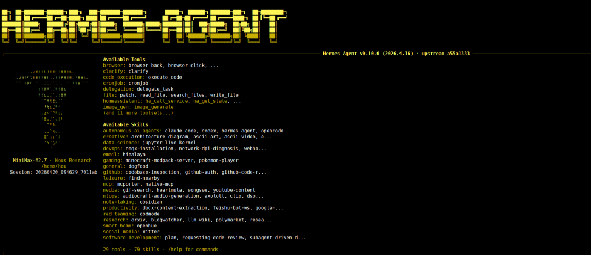

> 📎 来源: [看书的猴子](https://mp.weixin.qq.com/s?__biz=MzkwODc5MDYzMg==&mid=2247486436&idx=1&sn=379c14a1ca60b29907819124cd9fd402&chksm=c1638755d8c88d575422fd2045b8d3b2e41b957e529b5accc75256dbb0a5cd95f7416ba907f1&mpshare=1&scene=1&srcid=0420VPWtehr1o3K0E9sxQNcP&sharer_shareinfo=78cbdf3270be073db8279076e80b8088&sharer_shareinfo_first=78cbdf3270be073db8279076e80b8088) | 时间: 2026-04-20 19:12

---



最近在AI Agent圈，**「Hermes」**绝对是顶流存在。不少朋友装完Hermes后，都会陷入同款焦虑：明明会基础命令，可它总**「间歇性失忆」**、技能越攒越乱，多Agent、定时任务一上手就越配越复杂，始终停留在“能用但不顺手”的阶段。

其实Hermes的进阶核心，从来不是多记几个命令，而是把**「记忆、技能、协作、部署、排障、扩展」**这6层能力系统补齐。今天就把这份超实用进阶指南拆解清楚，帮你把Hermes打造成长期稳定的智能协作伙伴！

## 一、先纠偏：Hermes记忆不是“全自动录音机”

这是90%用户的认知误区！很多人觉得自己说过的事，Hermes就该牢牢记住，一旦遗忘就觉得是工具问题，实则是理解错了它的记忆逻辑。

Hermes的记忆是**「Agent自主筛选的长期记忆」**，而非实时全文存档，由三层结构协同工作：

- 内置核心记忆
- 可选外部记忆提供器
- 当前会话运行时上下文

临时试错、碎碎念这类无效信息，不会被存入长期记忆，避免前缀混乱、成本过高。想让它真正“记得住”，关键是分清4个核心文件的分工，千万别混用：

| 文件 | 核心用途 | 避坑提醒 |
| --- | --- | --- |
| MEMORY.md | 环境事实、项目经验、可更新方法 | 别放固定规则，会被自动整理替换 |
| USER.md | 个人偏好、沟通习惯、常用选择 | 专属你的“使用说明书” |
| SOUL.md | 不可随意改写的固定规则 | 放长期稳定、不希望变动的内容 |
| AGENTS.md | 项目技术栈、流程边界、执行规范 | 项目专属协作准则 |

**「实操小技巧」**： 配置

```
nudge_interval
```

控制记忆整理频率，新手建议设为5，隔5轮对话自动整理记忆；主动明确指令，比如“以后Python脚本统一放/tmp/scripts，记入长期记忆”，测试记忆是否跨会话生效。

## 二、拉开差距：把重复动作沉淀成Skill

记忆解决“记得住”，**「Skill解决“稳定复用”」**，这两层必须分开！很多人效率低，就是因为总让Hermes重复思考同一件事。

Skill相当于你的**「标准化作业流程（SOP）」**，部署流程、排障步骤、数据检查顺序等高频重复工作，沉淀为Skill后，无需重新组织逻辑，直接“现成调用”。

一个合格的Skill必须包含4部分：

1. 触发条件（什么时候用）
2. 具体步骤（怎么做）
3. 注意事项（避坑点）
4. 验证方法（结果对不对）

**「实操指令」**： 跑完稳定流程后，直接说“把刚才这套流程保存成Skill，补充触发条件、步骤、注意事项和验证方法”，越早沉淀，后续越省心。

## 三、多Agent协作：不是开得多，而是上下文够清楚

多Agent听起来高大上，实则很多人用错了——子Agent不会读心术，不会自动继承主会话全部历史，任务分派模糊必然导致效率低下。

高效协作的核心是**「清晰交代上下文」**，分派任务时务必说清：

- 文件路径、报错信息、项目依赖
- 预期输出结果、验收标准

同时别盲目追求高并发，普通场景从**「2-3个子任务」**起步即可，避免限流、上下文混乱；先拆分清晰角色，让协作更有序：

- Planner：任务拆解+进度把控
- Executor：具体执行
- Reviewer：结果校验

每个角色搭配独立Profile，拥有专属配置、记忆、技能和日志，相当于给每个Agent配备“独立大脑”，协作更精准。

## 四、生产部署：先搞定稳定运行，再谈复杂功能

想让Hermes从“玩具”变“生产工具”，不能只关注命令执行，要重点考虑**「后台运行、定时任务、安全边界、排障路径」**，这4点是稳定运行的基础。

生产部署最小检查清单：

1. 先跑

   ```
   hermes doctor
   ```

   完成环境自检
2. API Key存入.env文件，不硬编码进配置
3. 确认时区、端口、白名单、心跳机制
4. 明确日志路径和查看方式
5. 配置审批策略（approvals.mode）

审批模式直接影响安全与效率：

- manual：高风险操作需人工确认，最安全
- smart：风险分级，兼顾安全与流畅
- off：仅适合完全可信的本地环境

## 五、排障神器：这几个命令快速定位问题

遇到报错别慌，记住这组**「排障命令」**，1分钟定位问题环节，不用盲目排查：

- ```
  hermes doctor
  ```

  ：整体环境诊断
- ```
  hermes memory status
  ```

  ：记忆状态检查
- ```
  hermes skills list
  ```

  ：技能库查看
- ```
  hermes mcp status
  ```

  ：外部工具连接状态
- ```
  hermes debug share
  ```

  ：调试信息分享

## 六、最后放大器：MCP别着急上手

MCP能让Agent结构化接入本地文件、数据库、自定义API，大幅提升能力上限，但它**「是放大器，不是起手式」**。

只有当记忆、Skill、协作、部署全部稳定后，再接入MCP，才能避免系统越配越乱，真正发挥其价值。

## 终极升级路径：按这个顺序，少走90%弯路

如果重新从零进阶，推荐这套**「稳扎稳打流程」**，看似慢实则最快：

1. 先写好SOUL.md和AGENTS.md，定好规则边界
2. 测试长期记忆，确保偏好跨会话保留
3. 沉淀第一个高频重复Skill
4. 单Agent稳定后，尝试2-3个多任务并发
5. 配置网关、定时任务、白名单
6. 最后接入MCP、外部记忆等高级能力

## 最后总结

Hermes Agent的真正进阶，从来不是把所有功能打开，而是搭建好**「长期记忆+可复用技能+清晰协作」**的底层底座。底座跑顺了，多Agent、生产化、MCP才会成为效率放大器，而非混乱源头。
