> 📎 来源: [邹明的网络日志](https://mp.weixin.qq.com/s?__biz=MzY5NjE5ODc5Ng==&mid=2247484071&idx=1&sn=9a467f188f0e65250d4d963fa68b837c&chksm=f512a02b7ae3db3588e45ed14c348388757df8e297108822e81557d08cd12787668365111d96&mpshare=1&scene=1&srcid=0423FRCRUM8r1KLVFT34F9R3&sharer_shareinfo=abd9ed08602ae5a56b70dea501634d43&sharer_shareinfo_first=abd9ed08602ae5a56b70dea501634d43) | 时间: 2026-04-23 03:55

---

厌倦了每次都要“重新认识你”的AI对话？今天，带你装上目前AI圈最火的“爱马仕”智能体—Hermes Agent。

本文基于Android系统，为你提供一步一图的完整保姆级教程。每一步都配有对应截图位置和直接可复制的验证命令，从零到一，让你亲手拥有一个“越用越聪明”的私人AI智能体。

---

# 一、先搞懂：官方版 Hermes Agent 到底是什么？

根据Nous Research 官方文档明确定义，Hermes Agent 是目前唯一带有内置闭环学习系统的开源 AI 智能体，官方核心标语是 "The agent that grows with you"（与你共同成长的智能体）。

## （一）何谓“共同成长”？

官方的闭环学习循环是其核心护城河，真正区别于普通聊天机器人的地方在于：

自主创建技能：从每次任务中自主创建可复用技能。

自我优化技能：在使用过程中自我优化已有技能，越来越高效。

持久化你的偏好：主动持久化你的偏好和知识，跨会话永久不会 "失忆"。

建立深度认知：通过 Honcho 辩证式用户建模，建立对你的深度认知。

简单说，它不是一个简单的聊天框，而是一个真正能帮你干活、并且会越来越能干的数字分身。

---

# 二、准备条件（最低要求）

安卓手机：Android 10 及以上系统。 运行内存：≥6GB（推荐 8GB+，后台运行更稳定）。 存储空间：预留 5-10GB（用于安装依赖和存储数据）。软件账户：一个正常使用的个人微信账号。

关键提醒：整个流程不需要 root，不需要科学上网，全程手机操作。

---

# 三、第一步：安装 Termux 环境

Hermes Agent 在安卓上通过Termux运行，这是官方推荐的移动端Linux环境，完全免费安全。

## （一）下载 Termux 官方 APK

打开手机浏览器，访问 Termux 官方最新版下载地址：

**https://github.com/termux/termux-app/releases/tag/v0.118.3**

【对应截图-选择安装包】

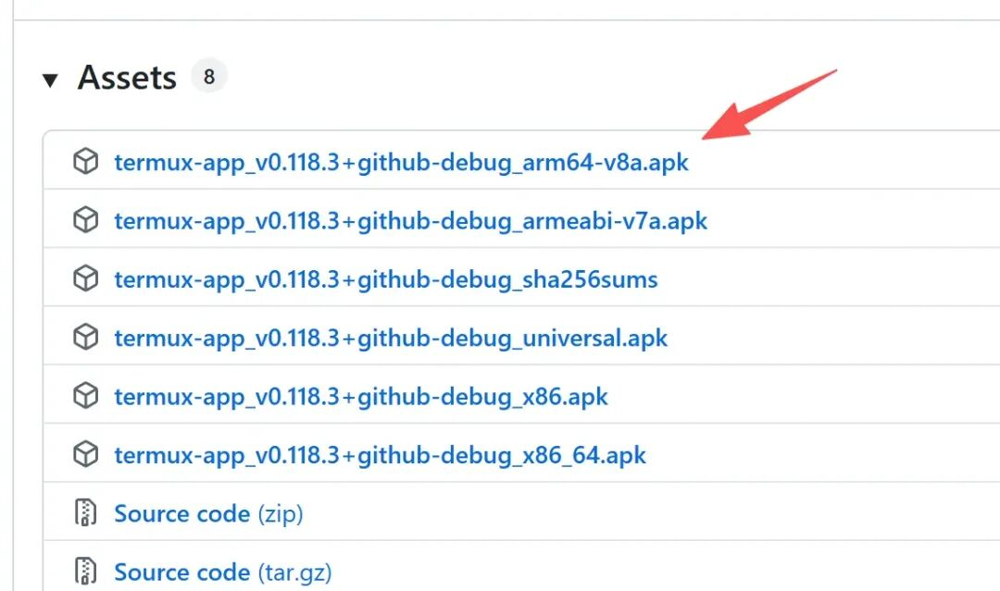

根据手机情况选择不同的安装包，大多数选第一个即可，如果不行就选择第4个。

## （二）安装 Termux

下载完成后，点击安装包开始安装。如系统提示 "禁止安装未知来源应用"，点击“设置”，开启“允许此来源安装应用”开关。返回并继续完成安装安装完成后打开应用。

APP 图标如下：

【对应截图-应用图标】

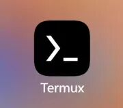

打开后的主界面是一个黑色终端：

【对应截图-主界面】

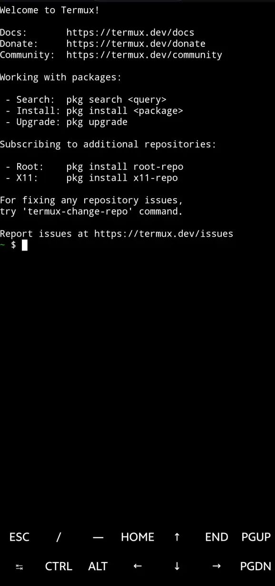

## （三）终端功能键说明【非常重要】

屏幕底部的功能键可以弥补手机软键盘的不足：

ESC：调出扩展键菜单。

CTRL：组合键触发，例如CTRL+C为终止程序。

TAB：自动补全命令。

上下箭头可查看历史命令。

【对应截图-底部功能键】

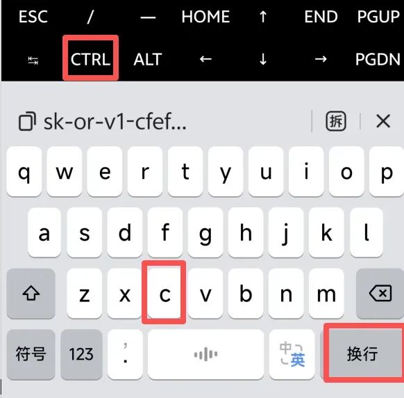

## （四）配置国内软件源。为了加速后续软件包下载，首先需要将软件源更换为国内镜像。步骤如下：

在终端输入命令：termux-change-repo ，按回车（或输入法的“换行”）执行。

【对应截图-输入换源命令】

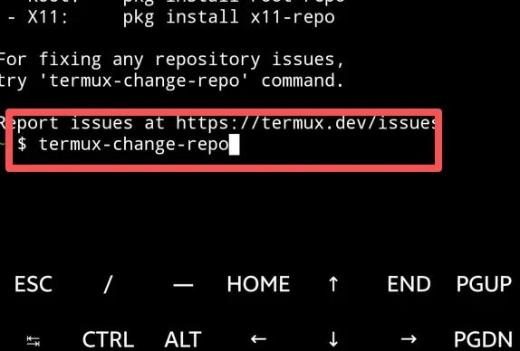

弹出的第一个选择框，直接按回车确认。

【对应截图-确认选择框】

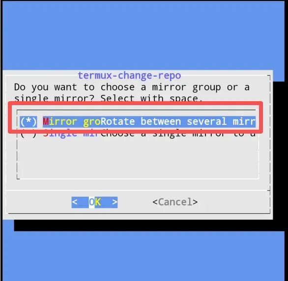

在镜像源列表中选择“中国大陆”。

【对应截图-选择大陆镜像】

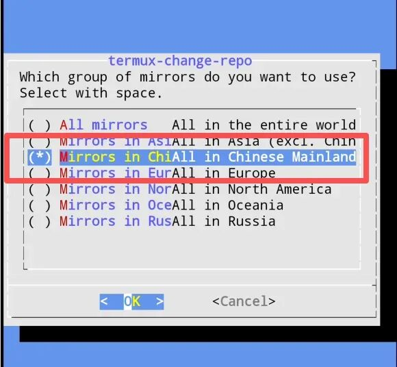

点击“OK”确认后，系统会自动更新镜像源。

【对应截图-更新镜像源】

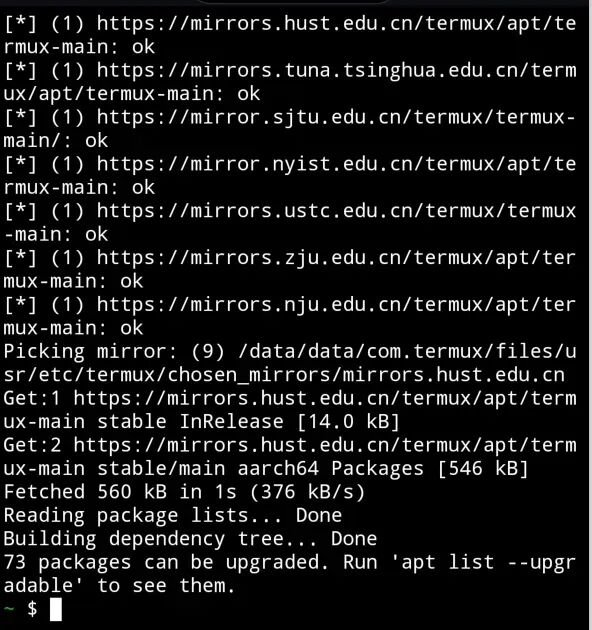

## （五）更新系统软件包更换源后，执行系统更新以确保所有软件最新：

执行命令：pkg update && pkg upgrade -y

【对应截图-执行更新命令】

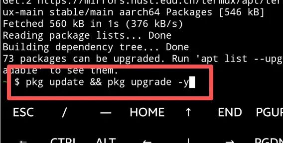

这个过程大约需要 1-3 分钟。中途可能需要手动确认一些选项，直接按回车或输入y确认即可。

---

# 四、第二步：安装与配置 Hermes Agent

官方提供了全自动一键安装脚本，会自动识别 Termux 环境并安装所有依赖。

在 Termux 终端中，输入以下命令后按回车执行：

curl -fsSL https://raw.githubusercontent.com/NousResearch/hermes-agent/main/scripts/install.sh | bash

【对应截图-开始执行安装命令】

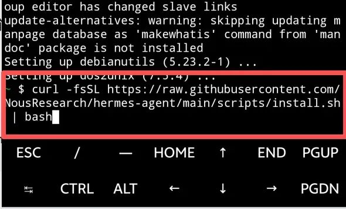

【对应截图-安装脚本开始运行】

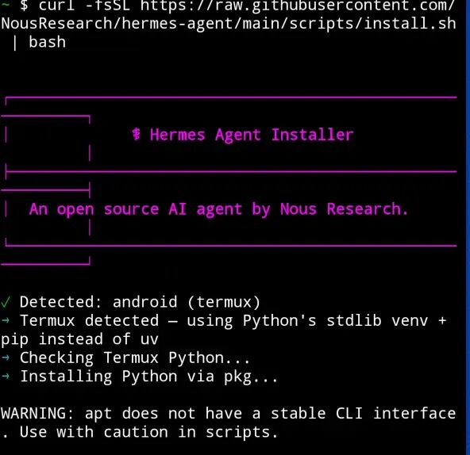

## （一）安装过程注意事项【避坑指南】

整个过程可能因网络状况花费数分钟到数小时，请耐心并注意以下几点：

网络速度是关键：网速好约 5-10 分钟，网速差会反复重试。建议开启网络速度显示。

卡死处理：如果某个步骤执行超过 5 分钟无响应，按CTRL+C终止脚本，然后按上箭头键找回命令，重新回车执行。

连接问题：如果发现网速很低，可能是连接 GitHub 不畅，同样建议终止后重试。

安装完成后，会自动进入配置向导页面：

【对应截图-安装完成进入配置】

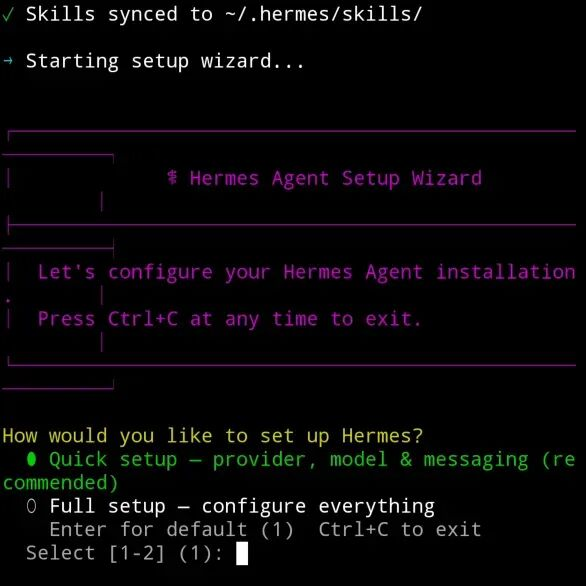

## （二）配置模型【核心步骤】

Hermes Agent 不自带模型，需要连接外部大模型服务。按向导提示操作：配置新模型。选择你准备好的模型服务商（例如：阿里云）。

【对应截图-选择模型服务商】

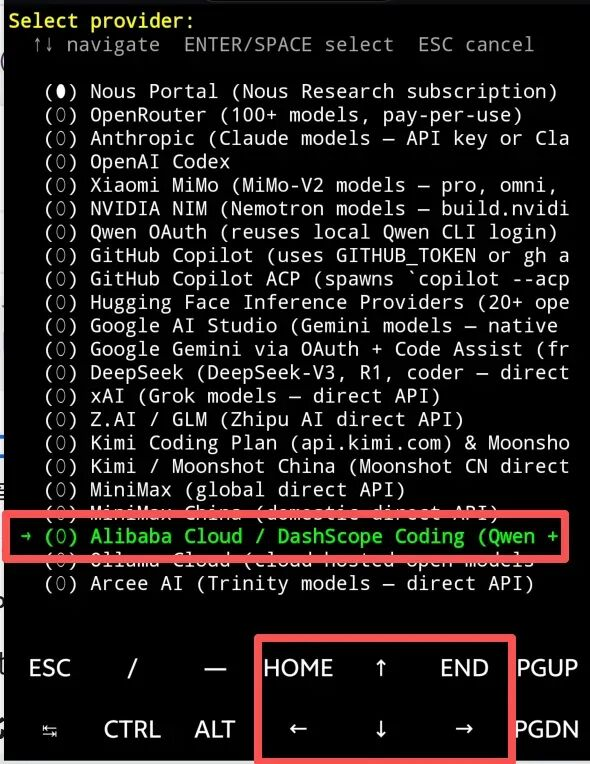

按提示输入模型的API Key。

【对应截图-输入API Key】

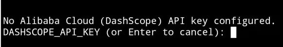

输入模型的API 端点 URL，并选择具体的模型编号。

【对应截图-配置URL和选择模型】

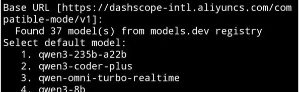

## （三）配置消息渠道（微信）

【对应截图-配置消息渠道】

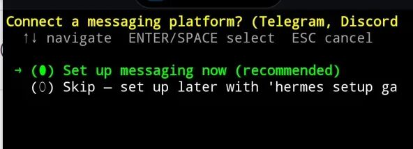

选择微信。

【对应截图-选择微信】

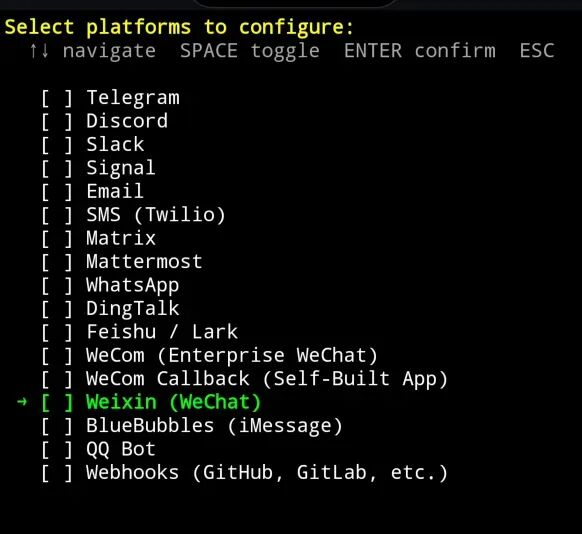

> **注意**：实测此处可能出现 BUG，未弹出微信二维码登录信息。别担心，我们先跳过，后续**利用独立命令进行专门配置**。

完成基础配置后，会启动对话，可以尝试在终端内输入文字与 Agent 交互测试。

【对应截图-启动对话】

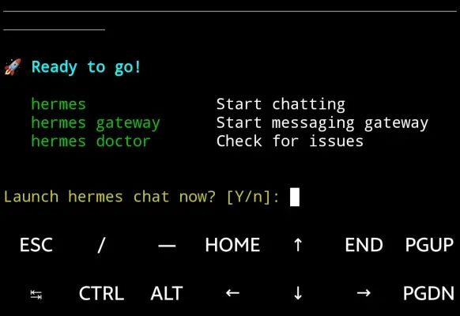

【对应截图-终端内测试对话】

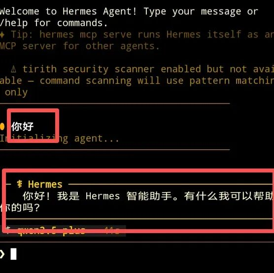

至此，Hermes Agent 已基本安装完毕。

---

# 五、第三步：连接个人微信【插件专属配置】

这是最受期待的功能。Hermes Agent 通过腾讯官方 iLink Bot API 直连，无需企业微信，扫码即可。因此前配置步骤可能不完整，需要单独执行命令完成微信网关的设置。

## （一）退出当前对话并进入网关配置

在终端对话中，输入/exit或按CTRL+C退出对话模式。

执行网关配置命令：hermes gateway setup

【对应截图-执行网关设置】

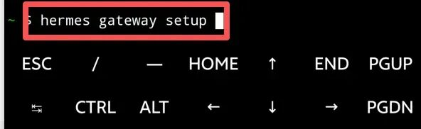

选择微信平台。

【对应截图-选择微信平台】

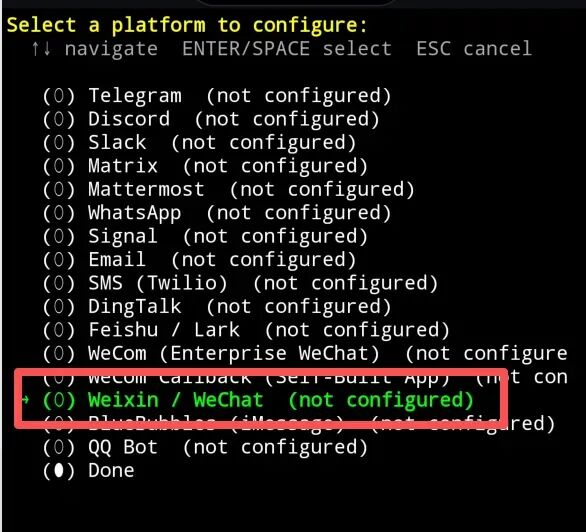

选择使用二维码登录。

【对应截图-选择扫码登录】

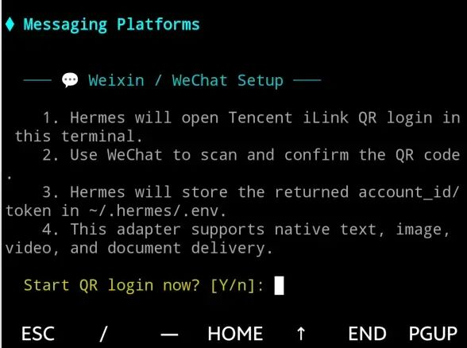

## （二）扫码绑定

终端会显示一个可点击的二维码链接。

【对应截图-显示二维码链接】

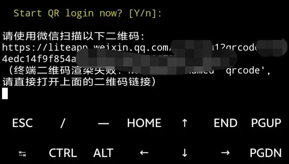

最佳实践：长按链接，选择“复制”，然后粘贴发送到“文件传输助手”或任意微信好友，直接点击即可打开扫码。

如果二维码超时，会提示刷新，使用新二维码即可。

【对应截图-二维码刷新提示】

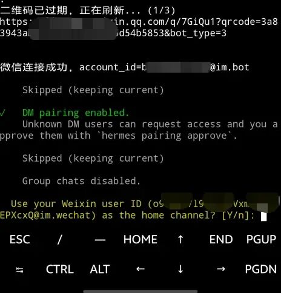

手机上扫码后，根据提示在微信中“确认连接”。

【对应截图-微信扫码后确认】

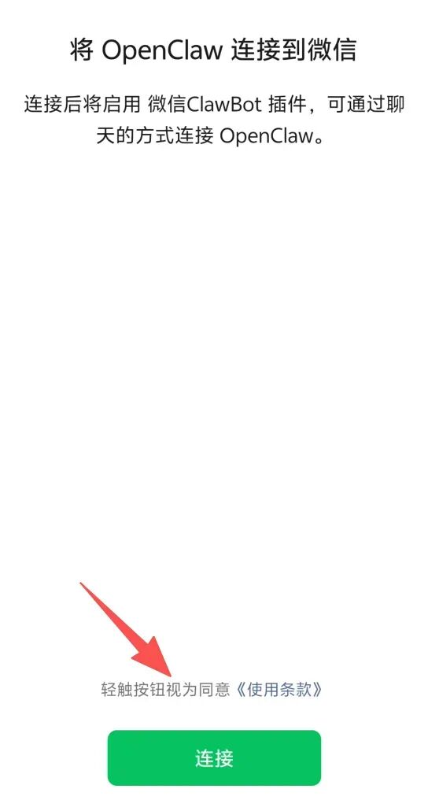

稍等片刻，微信中会出现一个名为“ClawBot”的机器人。

【对应截图-出现公众号机器人】

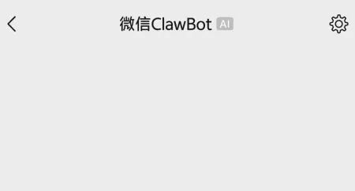

在终端中，会提示配置消息权限认证。请务必选择第二个（体验测试）。

【对应截图-选择权限认证】

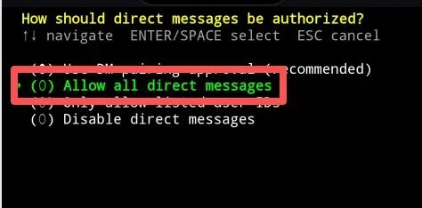

配置完成，终端显示确认信息。

【对应截图-配置完成】

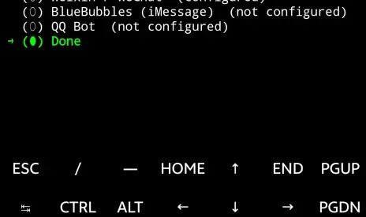

## （三）启动微信网关并测试

执行命令，启动微信网关：hermes gateway run

【对应截图-启动微信网关】

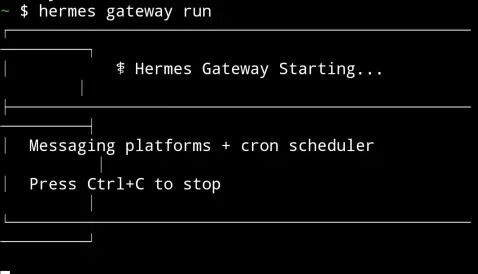

在微信中，向“ClawBot”公众号发送消息测试。

【对应截图-微信内测试成功】

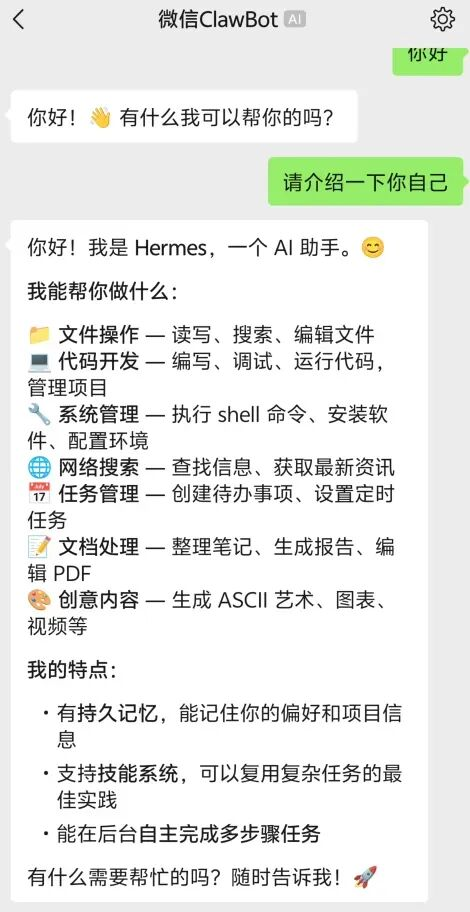

恭喜！你的个人微信已经成功连上会成长的 AI 伙伴了！

---

# 六、常见问题解答（Q&A）以下解答通过我实测验证总结，能解决绝大多数问题。

Q1：安装脚本卡住不动了怎么办？A：按 Ctrl+C 中断脚本，然后重新运行安装命令即可。如果频繁卡住，请检查手机的Wi-Fi或数据网络连接是否稳定，主要是连接github。

Q2：我输入的 API Key 安全吗？会泄露吗？A：绝对安全。所有配置信息（包括 API Key）都只保存在你手机本地的 ~/.hermes/config.yaml 文件中，不会上传到任何远程服务器。

Q3：用个人微信登录，有封号风险吗？A：风险极低。Hermes Agent 使用的是腾讯官方提供的 iLink Bot API进行连接，属于合规接口，并非逆向工程。

Q4：Termux 在后台运行时，会被手机系统自动清理吗？A：可能会。为了保证 Hermes Agent 常驻后台，建议：

（1）在手机系统设置中，为 Termux 开启“允许后台运行”和“自启动”权限。

（2）安装 Termux 的 WakeLock 插件来保持唤醒。

（3）在 Termux 中执行命令：termux-wake-lock，可以阻止系统休眠时杀死进程。

【对应截图-设置后台运行权限】

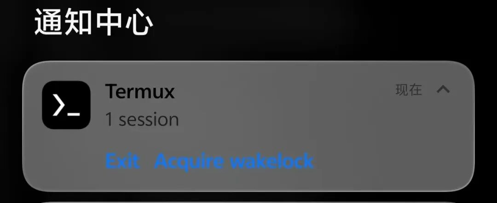

Q5：我可以使用本地运行的大模型吗？A：可以！Hermes Agent 官方支持连接本地部署的模型，实现完全离线使用。配置方法：在 hermes setup 的模型选择步骤中，选择“自定义”选项，然后填入本地模型的 API 地址即可。

Q6：如何更新或卸载 Hermes Agent？A：执行以下命令，更新：hermes update，卸载：hermes uninstall

---

# 七、总结：这不是终点，而是一个起点

Hermes Agent 的出现，悄然改变着我们与 AI 互动的方式。它从一个被动的工具，变成了一个真正能与你一同成长、积累、进化的数字伙伴。

现在，你无需昂贵的服务器，无需艰深的技术知识，只需要一部安卓手机和一个微信账号，就能和这个“会成长的智能体”开启全新的协作模式。

关注我，后续将带来更多关于 Hermes Agent 的高阶玩法拆解——如何调教它成为工作秘书、学习伙伴，或是生活助理。别让这个能成长的 AI，在你手里只做个聊天框。

---

编者：邹明，阿里云大模型高级工程师 ACP 认证持有者，熟悉本地大模型落地、多智能体实战、企业级AI应用开发，致力于用最通俗的话，讲透最硬核的 AI 实战技术，让普通人也能拥有自己的私有化 AI 助手。
