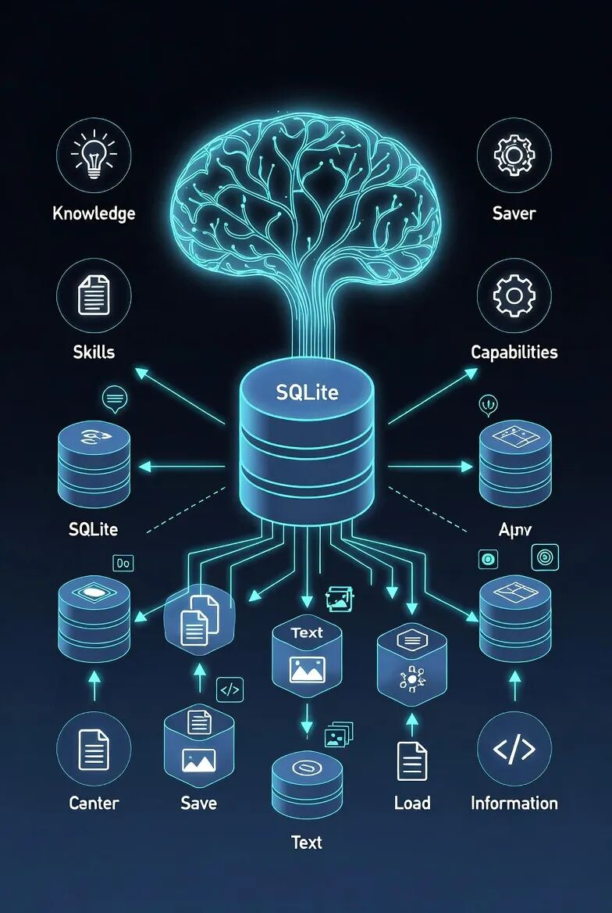

> 📎 来源: [探寻AIGC](https://mp.weixin.qq.com/s?__biz=MzkzODY5NTYyMA==&mid=2247483934&idx=1&sn=63163457a5314c7186bc629710b6df3d&chksm=c394ec1c4f4dbd7dc2f5b92ba1d8b6ebc705e1e7d6ab2b152ff176895ab52480111a779f07c3&mpshare=1&scene=1&srcid=0420ThWsQYlMX2Hj1x7802jT&sharer_shareinfo=ae643465ed7c6cf2eaa5c547dd1980ff&sharer_shareinfo_first=ae643465ed7c6cf2eaa5c547dd1980ff) | 时间: 2026-04-20 21:33

---

# Hermes Agent深度实战：4个高阶技巧让你的AI真正"聪明"起来

> 开源AI Agent领域的新星Hermes Agent，上线2个月斩获5.9万+ GitHub星标。很多人装完只会基础问答，真正拉开差距的高阶玩法，这篇文章一次讲透。


---

## 01 交互式终端：不只是聊天窗口

装完Hermes后，输入`hermes`进入交互模式。这不仅仅是一个命令行界面，而是整套系统的控制中心。

**实际场景示例：**

直接说需求："帮我写一个Python脚本，找出当前目录下所有超过100MB的文件，按大小排序输出。"

Hermes会：

1. 分析需求
2. 调用文件扫描工具
3. 执行脚本
4. 返回结果

全程无需你写一行代码。

### 4个必学的斜杠命令

| 命令 | 作用 | 使用场景 |
| --- | --- | --- |
| `/skills` | 查看已沉淀的技能 | 想复用之前的解决方案 |
| `/insights --days 7` | 生成使用周报 | 了解AI帮你做了哪些事 |
| `/model` | 切换底层模型 | GPT-4太贵时切国产模型 |
| `/help` | 查看全部命令 | 忘记指令时快速查阅 |

**关键认知：** 用满一个月后回看`/skills`，你会惊讶于积累了多少自动化能力。

---

## 02 自进化技能系统：让AI学会"举一反三"

这是Hermes区别于普通Chat工具的核心能力——**它会从每次任务中学习**。

**工作原理：**

当你完成一个需要多次工具调用的复杂任务（比如"分析网站SEO并生成报告"），Hermes会自动：

1. 复盘整个流程
2. 提取成功经验和避坑点
3. 生成结构化的技能文档
4. 存入`~/.hermes/skills/`目录

下次遇到同类任务，直接调用技能，无需重新推理。



**实测效果：**

- 首次执行：20+次工具调用
- 使用技能后：8-10次工具调用
- Token消耗降低约60%

### 技能管理实操

```
# 查看所有技能hermes skills list# 手动创建技能（把常用操作固化）hermes skills create# 导出技能（换电脑不丢失）hermes skills export# 导入技能hermes skills import
```

**建议固化的场景：**

- 每周数据报表生成
- 服务器巡检流程
- 代码审查清单
- 客户沟通话术模板

---

## 03 多平台网关：一个AI管所有渠道

做运营或客服的人最头疼什么？用户分散在微信、飞书、Discord、Slack各个平台，每个平台的对话上下文互相隔离。

Hermes的网关功能解决这个痛点：

```
hermes gateway
```

**一个进程同时接入：**

- 微信个人号/公众号
- 飞书
- Discord
- Slack
- 企业微信
- Telegram
- 共15+平台

**核心优势：跨平台上下文连续**

用户在飞书问到一半，转去微信继续，AI记得之前的全部对话。不用反复说明情况，沟通效率提升明显。

### 场景隔离配置

如果担心工作和生活混在一起，可以创建独立配置：

```
# 创建工作专用配置hermes profile create work-bot --clone# 用工作配置启动网关hermes -p work-bot gateway run
```

技能和记忆完全隔离，互不干扰。

---

## 04 从OpenClaw迁移：零成本升级

如果你是OpenClaw（龙虾）老用户，Hermes提供了完整的迁移工具，数据一件不落：

```
# 交互式迁移（推荐）hermes claw migrate# 先预览再迁移hermes claw migrate --dry-run# 只迁用户数据（更安全）hermes claw migrate --preset user-data
```

**迁移内容包括：**

- 人格设定（SOUL.md）
- 记忆数据（MEMORY.md、USER.md）
- 自建技能
- API密钥配置
- 命令白名单
- TTS语音资源

**重要：** 迁移不会删除OpenClaw的原始数据，不满意可以随时切回去。

---

## 05 进阶玩法扩展

### 子智能体委派

复杂任务可以拆给多个子代理并行处理：

> "同时分析3个竞争对手网站，分别生成分析报告，然后汇总核心结论"

Hermes会自动：

1. 生成3个子代理
2. 分别分析3个网站
3. 汇总结果

适合批量数据处理、多文档分析。

### 定时任务

用自然语言设置定时任务，不用记cron表达式：

```
# 每天早上8点推送工作日报hermes cron add "每天8点" "发送今日工作日报"# 每周五备份服务器hermes cron add "每周五18点" "备份服务器文件"
```

### MCP工具扩展

对接外部系统，让AI直接操作：

```
# 对接本地文件系统hermes mcp add file-server --command "npx @modelcontextprotocol/server-filesystem" /path# 测试连接hermes mcp test file-server
```

支持Notion、Linear、数据库等，实现端到端自动化。

---

## 写在最后

Hermes Agent的本质不是"更聪明的工具"，而是"会成长的搭档"。

四个核心优势的组合：

1. **模型无关**——不被任何一家绑定，随时切换
2. **持久记忆**——越用越懂你的习惯
3. **自进化**——自动积累经验
4. **多平台**——一处配置，处处可用

目前在开源Agent领域，同时具备这四点的，还没有第二个。

建议从交互式终端和斜杠命令开始，逐步深入到技能系统和网关配置。用满一个月后再看效率提升，会有直观感受。


---

*本文基于Hermes Agent开源项目实践经验整理，持续更新中。*
