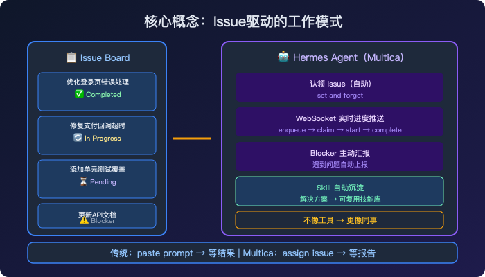
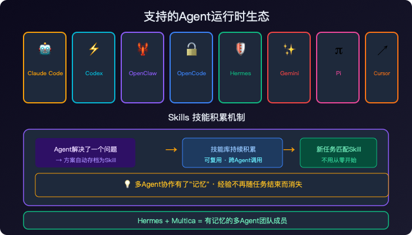
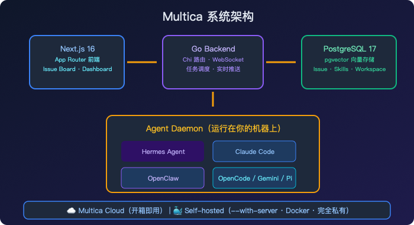
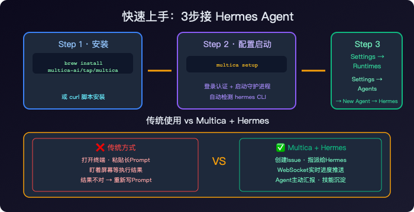

> 📎 来源: [AgentLab先行者](https://mp.weixin.qq.com/s?__biz=MzYzMzg5MTc3OQ==&mid=2247483786&idx=1&sn=3d2aa8f9ad550cfd395f722834753aba&chksm=f1a8834e82f208803341c421e5d64ad1fef7ecb7fa5f7e1681421b5dc44b23af539a576a6477&mpshare=1&scene=1&srcid=0506jKsUK7dKjG5zeJUIrfAV&sharer_shareinfo=28f0006ed9180cf6f4e3c07318a04cad&sharer_shareinfo_first=28f0006ed9180cf6f4e3c07318a04cad) | 时间: 2026-05-06 05:40

---


一个很有意思的趋势正在发生：



图1

AI Agent不再只是"帮你执行命令的工具"，而是正在变成"可以指派任务的同事"。

支撑这个变化的，是一个叫 **Multica** 的开源平台。

---

## 它解决什么问题？



图2

传统AI Agent的使用方式是这样的：

你写一段prompt，Agent执行，结果给你。你全程在"喂"它。

Multica想改变这个关系——**让Agent主动认领任务、定期汇报、积累技能**，像一个真正的团队成员。

这句话听起来有点夸张，但实际用起来确实有不一样的感觉。

---

## 核心概念：Issue驱动



图3

在Multica里，你不需要给Agent发消息下指令。

你创建一个Issue（比如"优化登录页面的错误处理"），然后把这个Issue**指派给一个Agent**。

Agent会自动：

- **Claim**

  这个任务
- 开始执行
- 通过WebSocket实时推送进度
- 完成后更新Issue状态
- 遇到Blocker主动汇报

整个过程，你不需要盯着屏幕。Agent会像同事一样出现在任务面板上。

---

## 支持的Agent列表



图4

Multica目前支持的Agent运行时：

**Claude Code · Codex · OpenClaw · OpenCode · Hermes · Gemini · Pi · Cursor Agent**

也就是说，**你的Hermes Agent可以接入Multica**，变成多Agent团队的一员。

---

## Skills：让经验变成可复用资产

这是Multica最有趣的设计之一。

Agent解决了一个问题，它的解决方案会自动变成一个**可复用的Skill**，累积到团队技能库里。

下一个Agent遇到类似任务，可以直接调用这个Skill——不需要重新写一遍解决方案。

这个机制让多Agent协作有了"记忆"，而不是每次从零开始。

---

## 安装和配置

```
# macOS/Linux 一键安装brew install multica-ai/tap/multica# 配置：登录认证 + 启动守护进程multica setup
```

守护进程会自动检测你机器上的Agent CLI——只要

```
hermes
```

命令在PATH里，它就能识别。

启动后，打开 Multica Web App，进入 **Settings → Runtimes**，你应该能看到自己的机器已经被识别为可用计算节点。

---

## 创建你的第一个Agent任务

1. 进入 **Settings → Agents** → New Agent
2. 选择你刚才连接的Runtime
3. Provider选择 **Hermes**
4. 给Agent起个名字

然后去任务面板创建一个Issue，指派给这个Agent。Agent会在你的机器上启动Hermes，执行任务，实时推送进度。

---

## 架构一览

```
┌──────────────┐     ┌──────────────┐     ┌──────────────────┐│   Next.js    │────>│  Go Backend  │────>│   PostgreSQL     ││   Frontend   │<────│  (Chi + WS)  │<────│   (pgvector)     │└──────────────┘     └──────┬───────┘     └──────────────────┘                            │                     ┌──────┴───────┐                     │ Agent Daemon │  运行在你的机器上                     └──────────────┘  支持Hermes/Claude Code等
```

前端Next.js 16，后端Go语言（Chi路由+WebSocket），数据库PostgreSQL 17（pgvector向量存储）。

---

## Multica vs 传统方式

| | Multica | 传统Agent使用 | |---|---|---| | 任务下发 | Issue指派，像同事一样 | 粘贴prompt | | 执行方式 | Agent自主认领，全自动 | 人盯着跑 | | 进度跟踪 | WebSocket实时推送 | 不知道跑哪了 | | 技能积累 | 自动沉淀为可复用Skill | 每次从零开始 | | 多Agent | 统一面板管理所有Agent | 各跑各的 |

---

## 适合谁用？

- **开发团队**

  ：想让AI Agent承担具体开发任务，需要进度追踪
- **多Agent研究者**

  ：需要统一管理多个Agent的运行状态
- **自动化流水线**

  ：任务分发给不同的Agent，各司其职

---

## 最后说一个有意思的点

Multica支持**self-hosted部署**。

一条命令把完整服务跑在你自己的服务器上，不依赖任何云服务——对于想把Agent能力留存在内网的团队来说，这个选项很有价值。

```
curl -fsSL https://raw.githubusercontent.com/multica-ai/multica/main/scripts/install.sh | bash -s -- --with-servermultica setup self-host
```

---

AI Agent正在从"工具"变成"队员"。这个转变的速度，可能比我们想象的更快。

---

磨平一些信息差。

AgentLab先行者 · 开源Managed Agents平台深度解读
