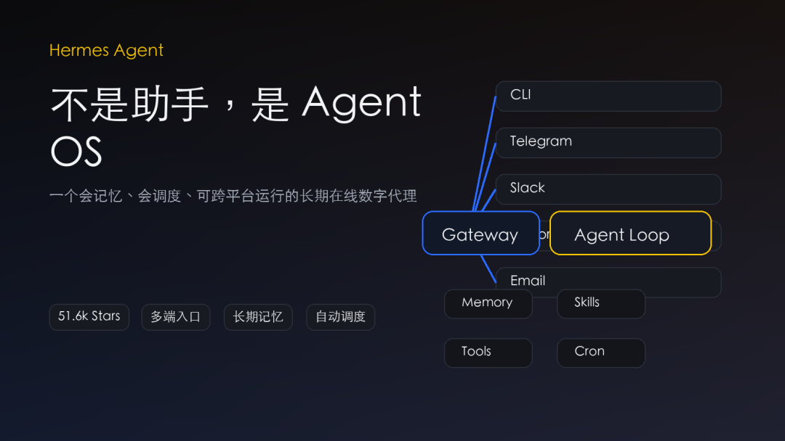
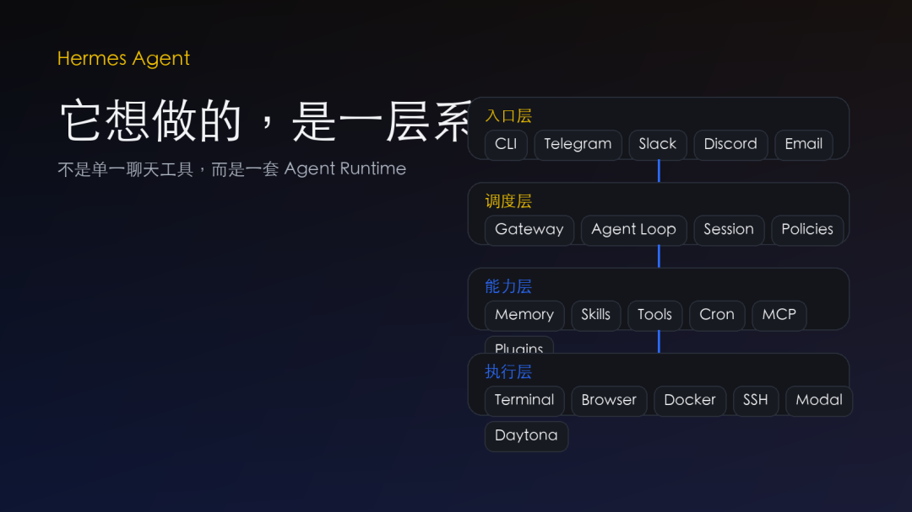
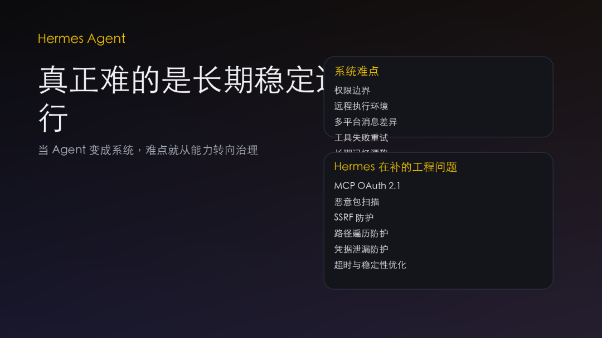
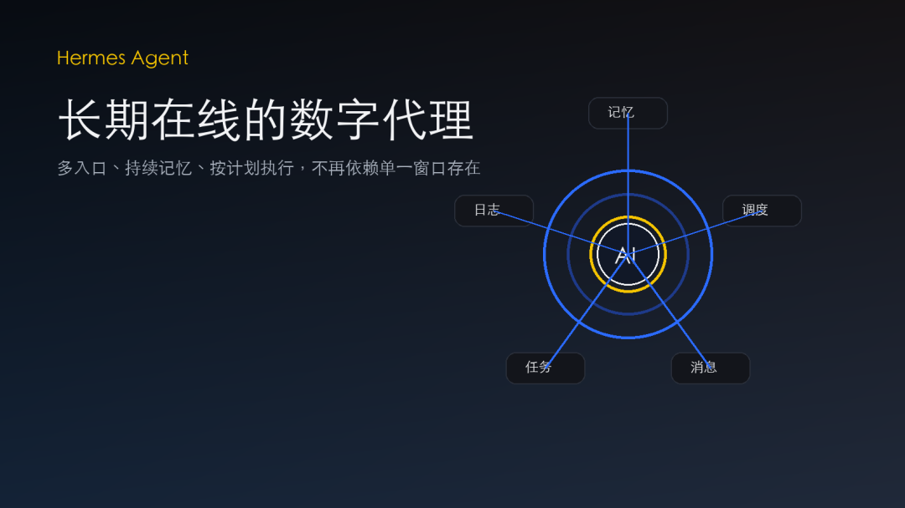
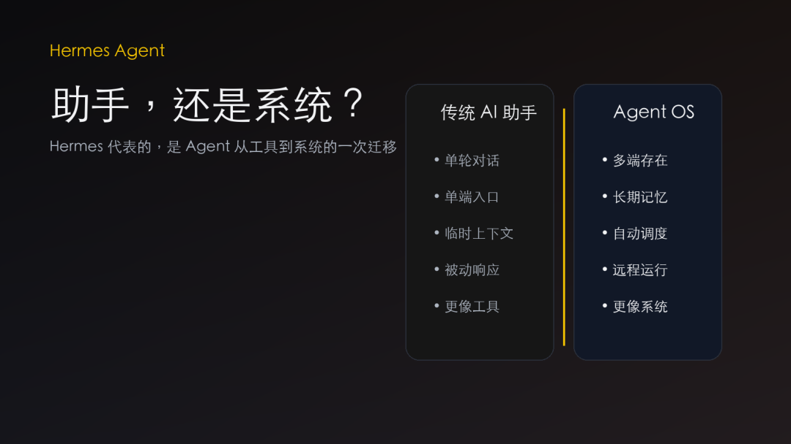
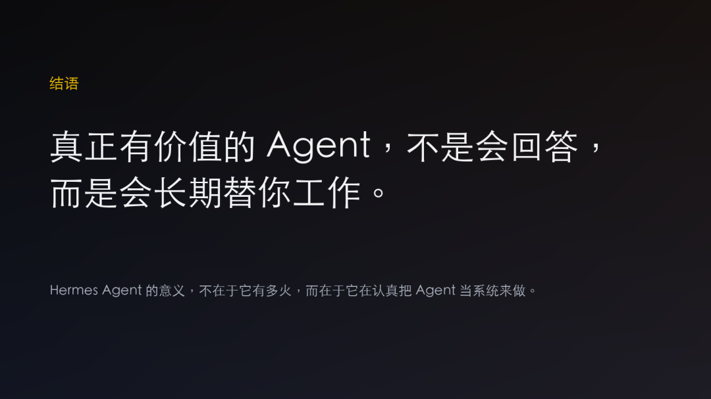

> 📎 来源: [二师兄的AIDao](https://mp.weixin.qq.com/s?__biz=MzE5MTY3MTY4OA==&mid=2247484535&idx=1&sn=f055613ce282018d230b851ff9979092&chksm=97b5942fb8c8f73f0d1f2a11e3de61cf2ba088c1720467c5e05d6957fae0baa0e16ecd62986e&mpshare=1&scene=1&srcid=04204GteOpcNoqExALeEfJOF&sharer_shareinfo=573110cc78f437722179f8eb923ac1ad&sharer_shareinfo_first=573110cc78f437722179f8eb923ac1ad) | 时间: 2026-04-20 20:42

---

最近， Hermes Agent 在 GitHub 上火得很快。

如果只看表面，它像是又一个会调工具、能跑任务的 AI Agent 项目。
 但如果真的顺着 README 、 release 和仓库结构往下看，你会发现，它想做的根本不只是“一个助手”。

**Hermes Agent 更像是在试着搭一层 Agent Runtime**。
 再说得更直接一点，它想做的，是 Agent 时代的“个人操作系统”。

这件事为什么值得注意？

因为过去很多 Agent 项目，本质上都还是“一次性工具”。
 接一个模型，配几把工具，跑一轮推理，做完任务，结束。

这种模式演示很惊艳。
 但真进入长期使用，问题也很快暴露出来。

它记不住你。
 跨不了端。
 离开当前窗口，上下文就断。
 做完一次事情，也不会真的变得更懂你。

Hermes Agent 走的不是这条路。

它最核心的关键词，其实是两个字：**闭环**。

官方对它的定义很明确：它会把经验沉淀成 skills ，会跨 session 保留记忆，会逐步形成对用户的理解，还能在不同平台持续运行。

这意味着 Hermes 想解决的，不是“这一次能不能回答好”，而是“以后能不能越来越会做”。

这一步一旦成立，产品形态就会变。
 你面对的，就不再只是一个即时响应工具，而是一个可以长期协作的数字代理。

## 它想做的，不是一把工具，而是一层系统

从代码结构看， Hermes 也确实是按系统来搭的。

它不只是一个聊天入口。
 仓库里同时有 `agent`、`gateway`、`tools`、`plugins`、`cron`、`environments` 等模块。
 这说明它从一开始就不只是想做一个“聊天壳”，而是在做一层可运行、可扩展、可迁移的 agent 基础设施。

它的价值，主要集中在四件事上。

**第一，是长期记忆**。

今天很多 AI 产品，最多做到“当前会话别忘太多”。
 Hermes 想做的是把历史会话、用户信息和技能经验，都沉淀成长期资产。

这意味着 agent 不再只是“本次帮你一下”，
 而是有机会在未来越来越懂你。

**第二，是多入口存在**。

Hermes 不只跑 CLI ，还支持 Telegram 、 Discord 、 Slack 、 WhatsApp 、 Signal 、 Email 等入口。

一旦 agent 可以跨平台持续存在，它就不再是“打开电脑才出现的工具”，
 而更像一个长期在线的服务对象。

**第三，是自动化执行**。

Hermes 内建 cron 和调度能力，强调日常报告、后台任务、定时执行和结果投递。

它不只是等你来问，
 而是在往“按计划替你做事”的方向走。

**第四，是运行时基础设施**。

它支持本地、 Docker 、 SSH 、 Daytona 、 Modal 、 Singularity 等执行后端，
 同时纳入 MCP 、插件、权限控制和安全防护。

这已经不是“prompt 工程”层面的竞争，
 而是软件系统层面的竞争。

## 真正难的，不是跑起来，而是长期稳定运行

这也是 Hermes 最值得高看一眼的地方。

今天很多团队还在卷模型、卷工具调用、卷 demo 效果。
 Hermes 卷的是另一件更难的事：

**怎么把 Agent 做成一个能长期运行的软件系统**。

这件事难得多。

因为一旦 Agent 不再是一次性工具，问题就全变了。

你要处理权限边界。
 要处理远程执行环境。
 要处理多平台消息差异。
 要处理工具失败重试。
 要处理长期记忆漂移。
 还要处理插件和外部连接带来的安全风险。

而 Hermes 最近一个版本里，已经明显在补这些现实问题。
 比如 MCP OAuth 2.1 、恶意包扫描、 SSRF 防护、路径遍历防护、凭据泄漏防护，以及超时与稳定性优化。

这说明它已经不在“能不能跑”的阶段，
 而是在进入“怎样才能长期稳定跑”的阶段。

## 它的真正价值，不在模型，而在工程产品化

如果只看 Agent 赛道，很多人会把焦点放在模型能力上。

但我看完 Hermes 之后，一个更强烈的判断是：

**它最值钱的地方，不在模型，而在工程产品化能力**。

因为模型能力会变化，供应商会变化，价格会变化，接口协议也会变化。
 但真正能把这些波动吸收掉，往上稳定托住用户体验的，是运行时系统能力。

Hermes 做的，本质上就是这层东西。

它在尝试把“模型 + 工具 + 记忆 + 调度 + 多端入口 + 安全控制”整合成一个统一的软件底层。
 一旦这层搭稳，用户面对的就不再是一个模型入口，而是一个长期可协作的 agent 实体。

## 问题也很明显

当然， Hermes 也不是没有代价。

第一，它很重。

如果你只是想要一个轻量本地代码助手， Hermes 未必是最顺手的选择。
 它能力很多，系统面很宽，配置和理解成本都不会低。

第二，它最性感的部分，也恰恰是最难治理的部分。

长期记忆、技能自进化、跨 session 用户理解，这些想象力很大。
 但也天然会带来“记错、学偏、污染、失控”的风险。

Agent 一旦从工具走向系统，竞争重点就不再只是“能不能做”，
 而是“能不能长期可靠地做”。

所以，如果一定要用一句话总结我对 Hermes Agent 的判断，我会这样说：

**它真正值得看的，不是它能不能写代码，而是它在认真尝试把 Agent 从一个功能，做成一个系统**。

这件事一旦做成，意义会远比“又一个爆款开源项目”大得多。

因为那时候，我们面对的就不再只是一个 AI 助手，
 而是一个真正长期在线、持续协作、越来越懂你的数字代理。

而 Hermes Agent ，正在朝这个方向走。

> 注：文中公开数据和仓库状态核对到 2026 年 4 月 11 日，主要依据 GitHub 仓库主页、 README 、 release 页面及当前 `main` 分支公开代码结构。
