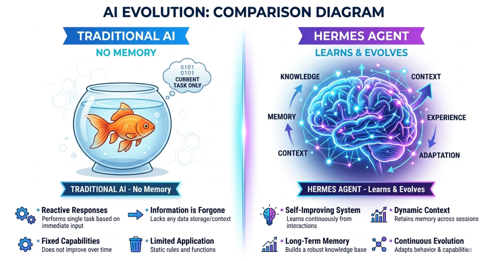
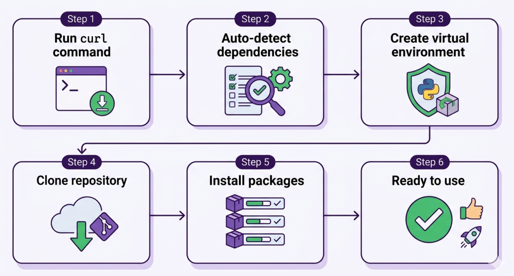
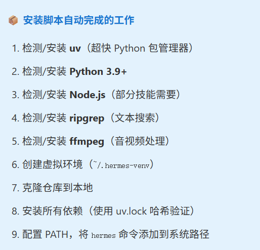
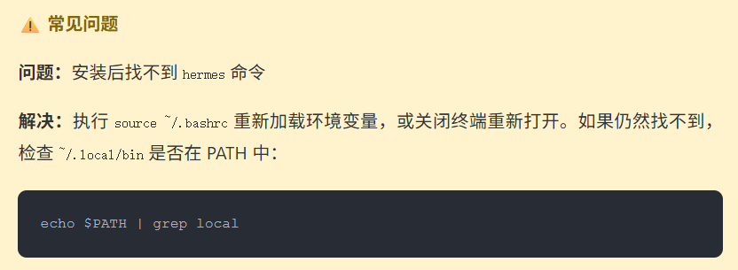
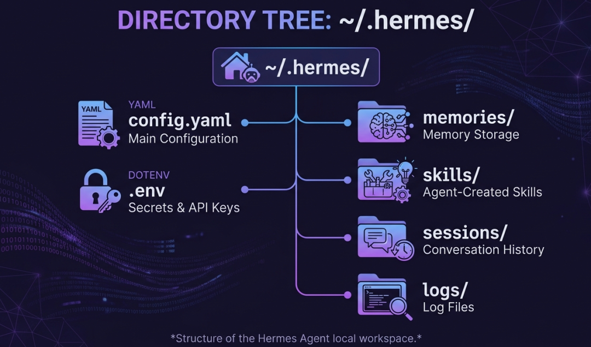
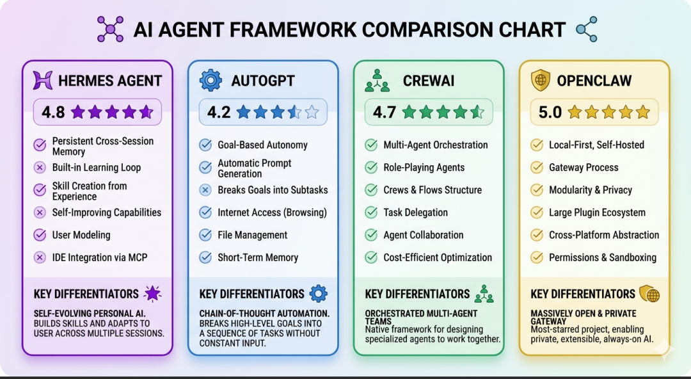
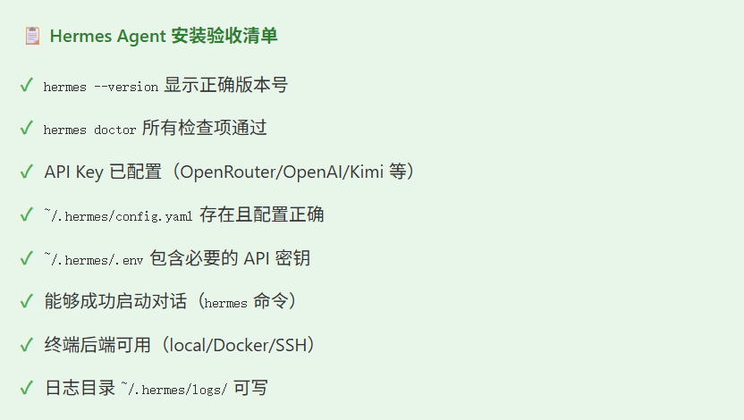
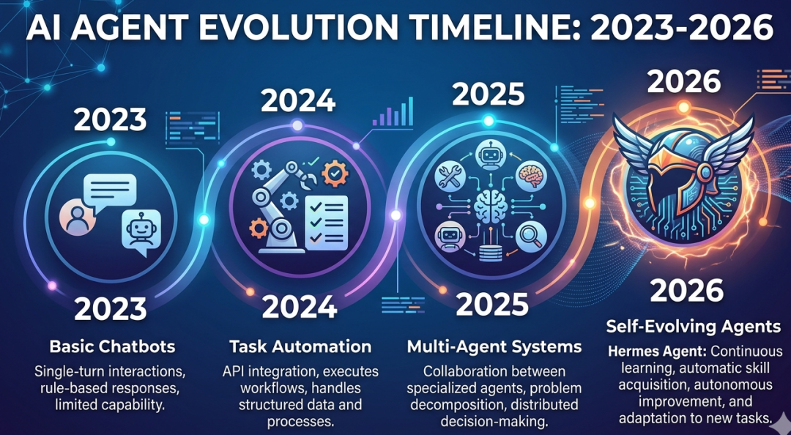

> 📎 来源: [章鱼大数据](https://mp.weixin.qq.com/s/0xgQgzowPBeFN1PSHsVq6w) | 时间: 2026-04-22 00:31

---

*不是工具，是会陪你一起成长的数字伙伴*

2026年2月25日，一个名为 Hermes Agent 的开源项目在 GitHub 上悄然上线。短短一个多月，它收获了超过 6 万颗 Stars，成为 AI 智能体领域的新星。

它凭什么这么火？一句话：**别的 AI 工具是"金鱼记忆"，Hermes Agent 是"会进化的伙伴"。**

> 核心差异：传统 AI 每次对话都是新的开始，Hermes Agent 会记住你的偏好、积累技能、跨会话成长。

## 🎯 一、Hermes Agent 到底是什么？

Hermes Agent 是由 **Nous Research** 开发的开源自主 AI 智能体（MIT 许可证）。它的核心设计理念是：一个与你共同成长的 Agent。



💡 核心创新：内置自学习循环

Hermes Agent 不是简单地调用 LLM，而是通过内置的学习循环不断优化自身：

- ✅ 自动从交互中生成 Skill（技能）
- ✅ 在使用中持续迭代技能
- ✅ 主动持久化知识和用户偏好
- ✅ 跨会话构建对用户的深度理解

### 1.1 三层记忆系统

| 记忆层级 | 作用 | 类比 |
| --- | --- | --- |
| **会话记忆** | 当前对话的上下文 | 短期记忆 |
| **持久记忆** | 跨会话的事实和用户偏好 | 长期记忆 |
| **技能记忆** | 解决方案模式和方法论 | 肌肉记忆 |

### 1.2 与传统 AI 工具的对比

| 维度 | 传统 AI 工具 | Hermes Agent |
| --- | --- | --- |
| **记忆能力** | 每次对话独立，上下文随会话消失 | 跨会话记忆，记住用户偏好和历史 |
| **技能复用** | 技能无法沉淀，每次重新配置 | 自动创建技能，持续迭代优化 |
| **安装难度** | 需手动安装依赖、配置环境 | 一行 curl 命令，2 分钟完成 |
| **执行后端** | 通常绑定本地或单一云平台 | 支持 6 种后端（local/Docker/SSH 等） |
| **消息平台** | 单一渠道 | 支持 Telegram、Discord、Slack 等 6 平台 |

## 🚀 二、一行命令安装（2 分钟搞定）



1**运行安装命令**

```
# 一行命令完整安装（推荐）
```



2**验证安装**

```
# 查看版本
```



## ⚙️ 三、配置指南：5 步完成设置

1**运行设置向导**

```
hermes setup
```

交互式配置向导会引导你完成所有必要配置。

2**选择 LLM 模型**

```
hermes model
```

Hermes Agent 支持多种 LLM 提供商：

| 提供商 | 说明 | 推荐场景 |
| --- | --- | --- |
| **Nous Portal** | 官方 Hermes 系列模型 | 原生函数调用支持 |
| **OpenRouter** | 接入 200+ 模型 | 新手推荐，统一管理 |
| **OpenAI** | GPT-4o、GPT-4o-mini | 高质量输出 |
| **Kimi** | 国内可用，长上下文 | 国内用户 |
| **Ollama** | 本地运行，完全免费 | 隐私敏感场景 |

3**配置 API Key**

```
# 编辑环境变量文件
```

**.env 文件示例：**

```
# OpenAI
```

4**配置工具集**

```
hermes tools
```

启用/禁用内置工具模块：文件操作、Shell 执行、网络请求、浏览器控制等。

5**配置消息网关（可选）**

```
hermes gateway setup
```

支持接入 Telegram、Discord、Slack、WhatsApp、Signal 等平台。

## 📁 四、核心目录结构



```
~/.hermes/
```

## 💻 五、实战：第一次使用 Hermes Agent

1**启动交互式对话**

```
hermes
```

2**基础交互示例**

```
# 打招呼
```

💡 实战技巧

- **切换模型：**`hermes model`

  交互式切换，或 `hermes chat --model <模型名>`
- **查看配置：**`hermes config`
- **编辑配置：**`hermes config edit`
- **运行诊断：**`hermes doctor`

## 🔧 六、六种执行后端配置

Hermes Agent 支持在不同计算环境中执行任务：

| 后端 | 适用场景 | 配置方式 |
| --- | --- | --- |
| **local** | 本地开发调试 | 默认，无需额外配置 |
| **docker** | 隔离执行环境 | `hermes config set backend docker` |
| **ssh** | 远程服务器执行 | 配置 SSH 密钥和目标主机 |
| **daytona** | 无服务器持久化（$5/月 VPS） | 注册 Daytona 账号后授权 |
| **singularity** | HPC 高性能计算集群 | 需 Singularity 环境 |
| **modal** | 云端函数执行 | 需 Modal 账号和 token |

🔒 安全建议

**生产环境推荐使用 Docker 沙箱：**

```
# 配置使用 Docker 后端
```

## ⏰ 七、自动化任务：内置 Cron 调度器

Hermes Agent 内置调度器，支持用自然语言定义定时任务：

```
# 示例：每天早 8 点总结昨日邮件
```

## 📊 八、Hermes Agent vs 同类框架



| 特性 | Hermes Agent | AutoGPT | CrewAI | OpenClaw |
| --- | --- | --- | --- | --- |
| **GitHub Stars** | 61,200+ ★ | ~169k ★ | ~28k ★ | 355k+★ |
| **安装方式** | 一行 curl | pip install | pip install | 云镜像/桌面端 |
| **自学习循环** | ✅ 是 | ❌ 否 | ❌ 否 | ✅ 是 |
| **消息平台网关** | 6 种 | ❌ 否 | ❌ 否 | 9 种 |
| **执行后端** | 6 种 | 本地为主 | 本地为主 | 本地为主 |

## ✅ 九、检查清单：安装完成后确认



## 🔮 十、观点：为什么 Hermes Agent 值得关注？



我的观点是：

> **Hermes Agent 代表了 AI 智能体的下一个演进方向——从"工具"到"记忆力超强的伙伴"。**

2023-2024 年，AI 智能体的核心问题是"能做什么"；2025-2026 年，核心问题变成了"能记住什么"和"能进化什么"。

Hermes Agent 的三个核心优势，正好对应这三个问题的答案：

- **能做什么：**

  一行安装，6 种执行后端，6 大消息平台，开箱即用
- **能记住什么：**

  三层记忆系统，跨会话理解用户，持久化偏好，记忆能力比OpenClaw更优秀
- **能进化什么：**

  自动创建技能，在使用中迭代，越用越聪明

🚀 如果你想要一个不只是"回答问题"，而是真正"理解你"的 AI 伙伴，Hermes Agent 值得尝试。

## 🎬 结语：开始你的第一次对话

Hermes Agent 的安装和配置已经足够简单，但真正的价值在于使用过程中的积累和进化。

给它一个任务，让它学习；给它反馈，让它改进。几次交互后，你会发现——它真的在"长脑子"。

---

📚 延伸资源

- **官方仓库：github.com/NousResearch/hermes-agent**
- **官方文档：hermes-agent.nousresearch.com**
- **函数调用框架：github.com/NousResearch/hermes-function-calling**
- **Hermes 3 技术报告：arxiv.org/abs/2408.11857**

注：本公众号文章仅用作分享交流，版权与观点均属原创作者。如有错漏或侵犯您的权益，联系我们进行更正或删除。

**精彩推荐**

# [教育部部长强调：要善用数据分析](https://mp.weixin.qq.com/s?__biz=MzAwNzYzMzQwMg==&mid=2651693963&idx=1&sn=d23e7990836ae348f2f8f04ed7a58e81&scene=21#wechat_redirect)

# [高校新一轮审核评估结果，公布！](https://mp.weixin.qq.com/s?__biz=MzAwNzYzMzQwMg==&mid=2651694352&idx=1&sn=caffb0280c83526b60dcbd13196a33f1&scene=21#wechat_redirect)

# [教育部最新文件！教师不得将AI用于下列情形](https://mp.weixin.qq.com/s?__biz=MzAwNzYzMzQwMg==&mid=2651694356&idx=1&sn=9eb6554fa653801af8f9620f1c2fe80f&scene=21#wechat_redirect)

# [推荐20款国内免费AI生成PPT工具（2025最新）](https://mp.weixin.qq.com/s?__biz=MzAwNzYzMzQwMg==&mid=2651694213&idx=2&sn=d9fb3423777768c5cb510e2c2b57cb2f&scene=21#wechat_redirect)

# [超全教师实用爆款AI工具汇总](https://mp.weixin.qq.com/s?__biz=MzAwNzYzMzQwMg==&mid=2651693616&idx=1&sn=ed6ddecd45b5edba6ee87b9db55960c3&scene=21#wechat_redirect)

# [2025“人工智能+ ”教育行业应用白皮书](https://mp.weixin.qq.com/s?__biz=MzAwNzYzMzQwMg==&mid=2651693982&idx=1&sn=d43ddee4bbb8f231543b5b118a1242f7&scene=21#wechat_redirect)

# [高校信创教育及教育信创化的建设探究](https://mp.weixin.qq.com/s?__biz=MzkwNjQ5MDc4MA==&mid=2247486252&idx=1&sn=bb65782804ffebc92607eff394e1e5e9&scene=21#wechat_redirect)

# [清华大学：DeepSeek与AI幻觉](https://mp.weixin.qq.com/s?__biz=MzkwNjQ5MDc4MA==&mid=2247490424&idx=1&sn=0c2606854f2b0019656fc12eb644e589&scene=21#wechat_redirect)

# [教育部通知！公布一批高校评估结果](https://mp.weixin.qq.com/s?__biz=MzAwNzYzMzQwMg==&mid=2651693984&idx=1&sn=9cc7b4972f29e567383f07878e02a5fa&scene=21#wechat_redirect)

# [国家级教学成果奖一等奖获奖要点分析](https://mp.weixin.qq.com/s?__biz=MzAwNzYzMzQwMg==&mid=2651693745&idx=1&sn=ddbc019439a94d7e5d352627ef538647&scene=21#wechat_redirect)

# [高校专业人才培养方案修（制）订流程图](https://mp.weixin.qq.com/s?__biz=MzAwNzYzMzQwMg==&mid=2651693952&idx=2&sn=f980fc6c96a49def388549773ee90051&scene=21#wechat_redirect)

# [DeepSeek给高校教师的深度使用攻略！](https://mp.weixin.qq.com/s?__biz=MzkwNjQ5MDc4MA==&mid=2247490363&idx=1&sn=0a78e8dc72601eb150d1bb3042b70c66&scene=21#wechat_redirect)

# [清华大学，145页，《文科生零基础AI编程》（免费下载）](https://mp.weixin.qq.com/s?__biz=MzAwNzYzMzQwMg==&mid=2651693505&idx=1&sn=31a970944570d198f2547dcd4aaa78fe&scene=21#wechat_redirect)

# [精选200个常用的DeepSeek提示词，建议收藏！](https://mp.weixin.qq.com/s?__biz=MzkwNjQ5MDc4MA==&mid=2247490466&idx=1&sn=6a90574dc18595cc9831bb90f53f4a79&scene=21#wechat_redirect)

# [官方宣布！将创新创业业绩，作为高校教师职称评定等重要依据](https://mp.weixin.qq.com/s?__biz=MzAwNzYzMzQwMg==&mid=2651693890&idx=1&sn=8f197962932dd277720d6c75338160e4&scene=21#wechat_redirect)

# [北大版-86页DeepSeek黑科技手册流出！比清华版更炸裂](https://mp.weixin.qq.com/s?__biz=MzkwNjQ5MDc4MA==&mid=2247490528&idx=1&sn=8c9d4cdbb6ba35edd501a5125c8bf21a&scene=21#wechat_redirect)

# [北大再更新，99页DeepSeek手册流出，真的太厉害了！](https://mp.weixin.qq.com/s?__biz=MzkwNjQ5MDc4MA==&mid=2247490569&idx=1&sn=c1286540b8b176e311911de37a2144a9&scene=21#wechat_redirect)

# [DeepSeek：教师必备的 20 个 AI 教学场景，重塑课堂新生态](https://mp.weixin.qq.com/s?__biz=MzAwNzYzMzQwMg==&mid=2651693571&idx=1&sn=698369438b62e70e9644813dcca9d0f2&scene=21#wechat_redirect)

# [DeepSeek洞察与大模型应用-人工智能技术发展与应用实践](https://mp.weixin.qq.com/s?__biz=MzAwNzYzMzQwMg==&mid=2651693548&idx=1&sn=646bfe3b3881c29fa0408261cf9e200c&scene=21#wechat_redirect)

**推荐关注**
