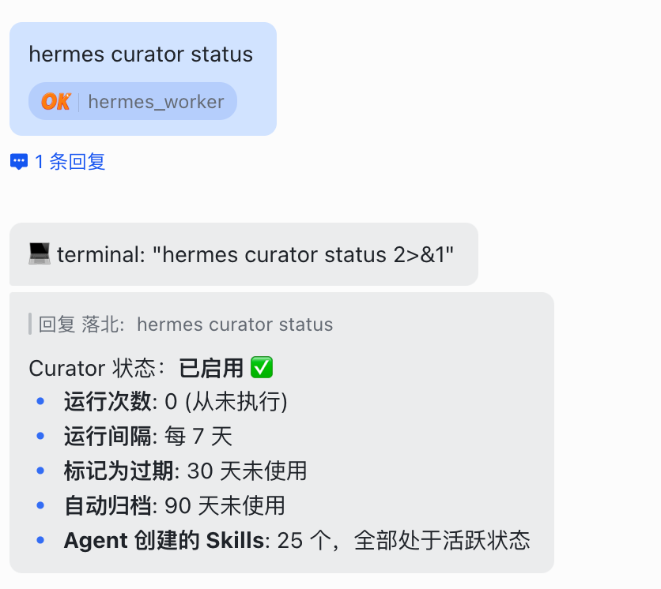
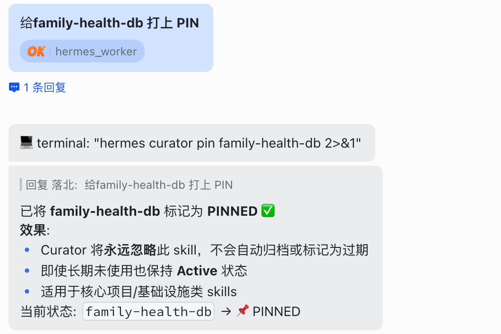

> 📎 来源: [胖小天](https://mp.weixin.qq.com/s?__biz=MzA4OTI0MDM2Mg==&mid=2247484166&idx=1&sn=966d5d1f7a3b18daefc7bcf637f4519c&chksm=91fa34217c2812a7fe5924ce3df7a522ce8785143b343c494cf0266525c0f13fe700408ce131&mpshare=1&scene=1&srcid=0511xnOoVisQJecUxh1tE6qq&sharer_shareinfo=01b4314f6e50fc89ce5841b38fefd828&sharer_shareinfo_first=01b4314f6e50fc89ce5841b38fefd828) | 时间: 2026-05-11 03:21

---

你让 Agent 帮你写代码、做研究、建工作流。

它每次都"学会"新 skill。

然后呢？

Skills 文件夹越来越大。

重复的、过期的、互相冲突的。

最后整个 agent 变成一团乱麻。

---

这是所有 open-source Agent 的死穴。

我遇到过无数次。

每次都想手动整理。

每次都放弃。

---

但现在，Hermes Curator 一键解决。

---

## Curator 是什么？

Agent 的**私人管家 + 进化教练**。

它会自动追踪每个 skill 的使用频率。

每周日凌晨，后台悄悄清理。

你的 Agent 越用越聪明，而不是越用越乱。

---

### 四大核心机制

Curator 做了四件事。

**追踪使用频率**。

高频 skill 自动标记为核心能力。

低频 skill 进入观察名单。

---

**每周自动清理**。

周日凌晨触发。

完全无感。

你睡觉的时候，Agent 在进化。

---

**Pin 技能保护**。

你手动 pin 的 skill，永不被合并或删除。

右键 Pin，一劳永逸。

---

**智能合并 + 转模板**。

功能相似的，合并成更强版本。

通用性强的，转为 reusable Template。

过期的、低价值的，归档或删除。

---

这四件事加在一起：

> Curator 不只是整理，而是进化。

---

## 配置指南

### 前提条件

确保你跑的是 Hermes v0.12.0+。

这是 Curator 首次亮相的版本。

---

### 默认开启（无需手动配置）

升级到 v0.12.0 后，Curator **默认开启**。

无需手动修改 config.yaml。

你的 Agent 自动开始追踪 skills 使用情况。

---

### 对话式配置修改

想要调整清理频率、合并策略？

**直接和 Agent 对话**。

告诉它："把 Curator 改成每两周运行一次"。

或者："关闭 auto\_merge 功能"。

Agent 会自动帮你修改配置。

不需要手动打开 config.yaml。

---

这个设计我很喜欢。

配置文件对新手是个门槛。

对话式修改，门槛降到零。

---

### 配置参数（可选手动调整）

如果你想手动调整，打开 `config.yaml`：

```
curator:  enabled: true        # 默认开启  schedule: "weekly"   # 清理频率，默认每周  auto_merge: true     # 自动合并相似 skills  pin_protection: true # Pin 技能保护
```

**参数详解**：

- `enabled: true`

  — 默认开启，无需手动设置
- `schedule: "weekly"`

  — 清理频率，可通过对话修改
- `auto_merge: true`

  — 自动合并相似 skills
- `pin_protection: true`

  — Pin 技能保护

---

## 命令实操

### 手动触发清理

想现在就试试？

```
hermes curator run --force
```

无视 schedule，立即执行。

---

### 预览合并（dry-run）

想先看看会发生什么？

```
hermes curator run --dry-run
```

输出会告诉你：

- 会合并哪些 skills
- 会删除哪些 skills
- 会转模板哪些 skills

看完再决定是否执行。

---

这个功能很关键。

第一次用 Curator，你可能担心它删掉重要 skill。

dry-run 让你先看后做。

安全。

---

### 技能健康报告

想知道你的 skills 现在处于什么状态？

```
hermes curator status
```

输出示例：



这张报告，就是你 Agent 的"体检单"。

---

## Pin 技能保护机制

**什么是 Pin？**

固定技能，永不被合并或删除。

**为什么需要？**

有些 skill 是你的宝贝。

你可能不想它被合并进别的 skill。

你可能不想它被自动删除。

Pin 就是**保护罩**。

---

**如何 Pin？**

三种方式：

**方式一：对话式（推荐）**

直接和 Agent 对话。

告诉它："把 write-code 这个 skill Pin 上"。

或者："把我的核心工作流 skills 都 Pin 保护起来"。

Agent 会自动帮你添加 Pin 标记。



---

**方式二：GUI**

右键 skill，选择 Pin。

---

**方式三：文件头**

在 skill 文件顶部添加：

```
---pinned: true---
```

---

**Pin 的价值**：

- 保护宝贝技能
- 避免被误合并
- 确保核心能力稳定

> Pin 的 skill，Curator 会自动跳过，不做任何处理。

---

## Self-Improvement Loop 闭环

Curator 解决的是 Skills 自我进化**最后一块短板**。

---

怎么闭环？

**Agent 在使用中学习**。

每次完成任务，都可能沉淀新的 skill。

---

**使用中改进**。

每次调用 skill，Agent 都可能触发改进。

Better prompt, better logic, better output.

---

**Curator 定期清理整合**。

周度清理，闭环完成。

Skills 从混乱 → 有序 → 智慧。

---

这三件事连起来：

> 以前 Agent "会思考"，现在真的会自己迭代了。

---

这不是科幻。

这是 Hermes v0.12.0 的真实功能。

---

## 为什么这个功能重要

**Skills 混乱是真实痛点**。

玩过 open-source Agent 的人都懂。

你让 Agent 做十件事。

它生成十个 skill。

其中三个重复。

两个过期。

一个和另一个冲突。

---

**手动整理几乎不可能**。

你得：

- 翻所有 skill 文件
- 判断哪个有用
- 判断哪个重复
- 手动合并或删除

太麻烦。

所以大多数人选择放弃。

---

**Curator 把这个过程自动化**。

你不用管。

每周自动清理。

你的 Agent 持续进化。

---

这个设计背后的理念：

> 把人类不想做的繁琐工作，交给 Agent 自己处理。

---

##

## 实战建议

**第一次使用**：

1. 升级到 Hermes v0.12.0+
2. 先用 `--dry-run` 看看会发生什么
3. 确认没问题，再 `--force` 执行
4. 把重要的 skill Pin 上

---

**长期使用**：

1. 每周查看 `hermes curator status`
2. 注意 Watch List 的低频 skill
3. 手动判断是否该删除或改进
4. 保持 Core Skills 稳定

---

**Pin 策略**：

- 你的核心工作流 skill → 必须 Pin
- 调试过的、稳定的 skill → 必须 Pin
- 实验性的、不确定的 skill → 不 Pin，让 Curator 判断

---

## 一个细节：时间选在凌晨

为什么是周日凌晨？

**你的 Agent 正在清理**。

你不想它在你工作时突然删掉某个 skill。

凌晨，你不在用。

清理不会打断你。

---

这个细节体现了设计者的思考：

> 把"可能打扰用户"的操作，放到"用户不在"的时间。

---

## 可能的问题

**误删重要 skill**？

第一次使用前，先 dry-run。

看到 Delete Candidates，手动判断。

重要的，Pin 上。

---

**合并效果不如预期**？

Merge Candidates 不一定都该合并。

有些 skill 虽然功能相似，但场景不同。

这种情况下，手动判断。

---

**清理频率太高/太低**？

默认 weekly。

你可以通过对话改成 biweekly 或 monthly。

---

这些问题都有解。

关键是：

**第一次用之前，先看 dry-run 输出**。

---

## 总结

从「好用的 Agent」到「能长期陪伴你一起成长的 Agent」。

中间只差一个 Curator。

---

**Curator 解决的问题**：

Skills 混乱 → Skills 有序 → Skills 智慧

---

**Curator 的核心价值**：

把人类不想做的繁琐整理工作，交给 Agent 自己处理。

---

**Curator 的设计哲学**：

Agent 不只是工具，是会进化的伙伴。

---

> Skills 从混乱到智慧，只需要一个 Curator。
