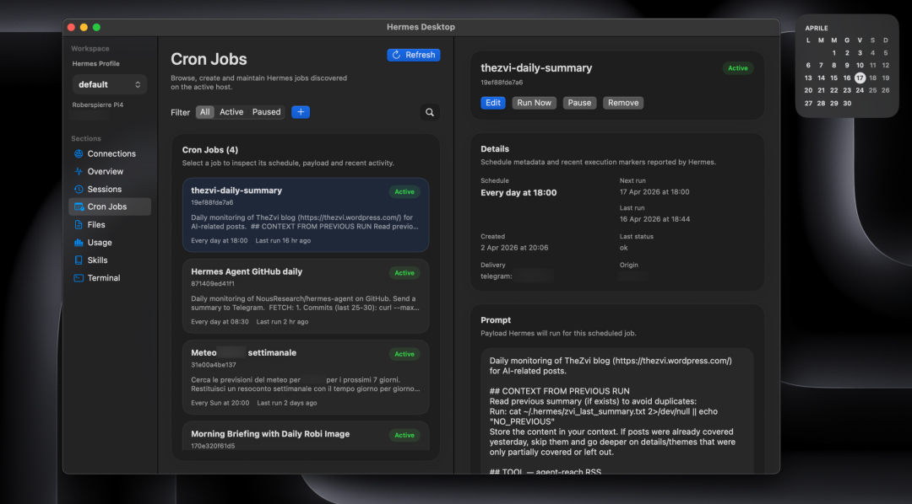
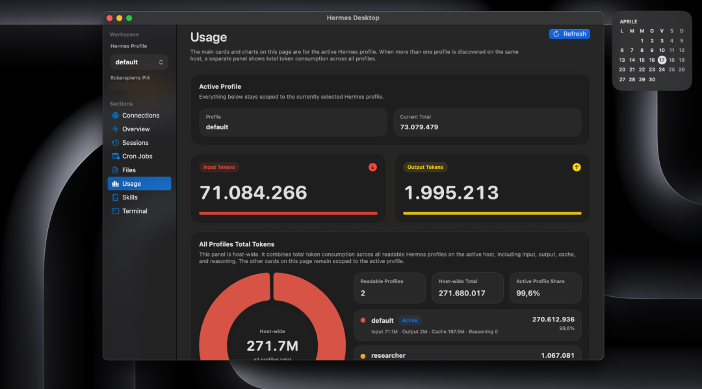
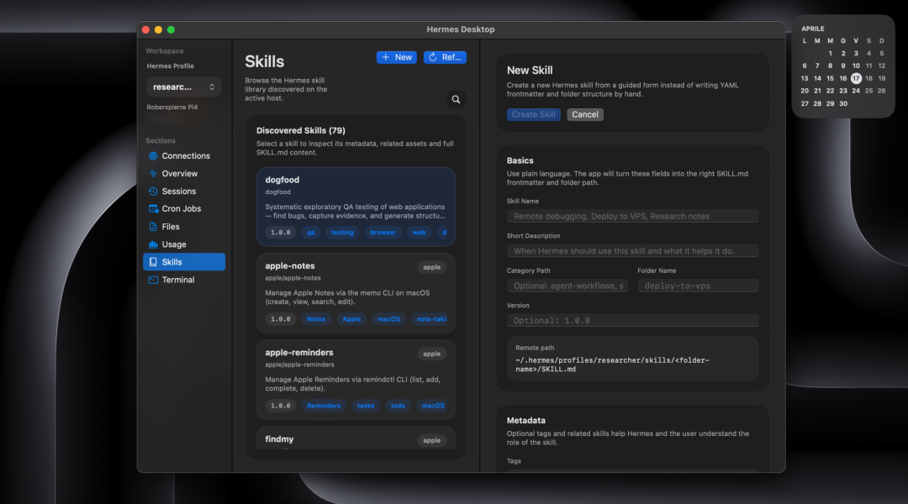
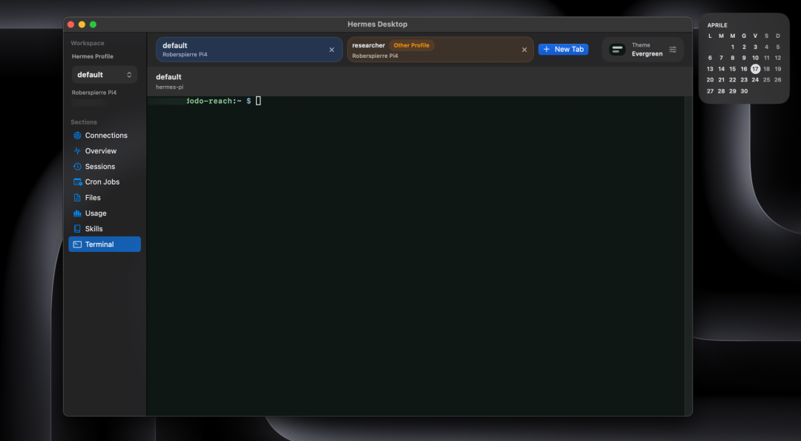

> 📎 来源: [编译硅基](https://mp.weixin.qq.com/s?__biz=MzUzMzM5MjkyOA==&mid=2247484308&idx=1&sn=fb37f428f2af0c9e2d8ee4c221846299&chksm=fbb64233deeb875c733b3df3fdfb22d6dfee84d431562810fea025b36103c825069d5a1aa63b&mpshare=1&scene=1&srcid=0420Lk6DOBNSRXTMilTw4rmj&sharer_shareinfo=69b273b7ac2f00c2fb4362028aab4139&sharer_shareinfo_first=69b273b7ac2f00c2fb4362028aab4139) | 时间: 2026-04-20 21:07

---

**Hermes Desktop** 是一款 macOS 原生应用，它让 Hermes Agent 的日常工作从终端走进了桌面。

它将那些真正重要的功能整合到一个专注的窗口里：会话管理、配置文件、使用统计、技能列表、定时任务，以及一个真正的终端。

如果 Hermes 已经成为你工作流的一部分，这款应用会让你感觉无比熟悉——同一个主机、同一套文件、同一个 Shell、同样的配置、同样的调度器、同样的会话历史。

---

## 核心特性一览

- 🚫 **无浏览器包装**：不依赖 Electron 或任何 WebView
- 🚫 **无网关 API**：直连 SSH，不走中间层
- 🚫 **无驻守进程**：主机无需安装任何守护程序
- 🚫 **无本地镜像**：文件不同步到 Mac 本地
- 🚫 **无额外同步层**：避免与真实状态逐渐失步

---

## 为什么坚持这些"不"？

**因为 Hermes 主机本身就是唯一的事实来源。**

这种刻意的克制保证了：

- 所有连接直接走 SSH
- Hermes 主机始终是唯一的数据源
- 不依赖任何网关 API
- 文件不会在本地产生冗余副本
- 无需在远程主机安装任何辅助服务

---

## 应用界面预览

以下是 Hermes Desktop 的核心功能界面：

**定时任务视图**



**使用统计视图**



**技能管理视图**



**终端视图**



---

## v0.5.0 更新亮点

v0.5.0 是 Hermes Desktop 走向成熟的关键版本，自 v0.4.1 以来，应用从一个扎实的 SSH 伴侣成长为一个完整的 macOS 日常环境：

### 主要更新

- ✅ **定时任务成为一等公民**：支持浏览、创建、编辑、暂停、恢复、立即运行、删除完整流程
- ✅ **配置文件感知**：在同一主机的不同 Hermes 配置文件之间保持体验一致
- ✅ **终端全面升级**：支持标签页、主题预设、颜色自定义，适合 macOS 上的长期 Shell 使用
- ✅ **全主机用量统计**：可汇总多个可读配置文件的用量数据
- ✅ **概览与技能工作流优化**：更好的工作区清晰度，支持远程编辑
- ✅ **通用 macOS 安装包**：同时支持 Apple Silicon 和 Intel Mac

### 始终不变的原则

- 依然直接通过 SSH 连接
- 主机依然是唯一的事实来源
- 依然没有网关 API、远程守护、本地镜像或额外同步层

---

## 与浏览器仪表盘的关系

Hermes 官方 Web 仪表盘由 Nous Research 提供，定位清晰：

> **Hermes Desktop 不是 Web 仪表盘的替代品。**
> 它是 macOS 上直接基于 SSH 日常使用 Hermes 的原生桌面工具。

两者各司其职，生态更清晰。

---

**来源**：GitHub - dodo-reach/hermes-desktop[1]

#### 引用链接

```
[1]
```

 GitHub - dodo-reach/hermes-desktop: *https://github.com/dodo-reach/hermes-desktop*
