> 📎 来源: [赛博生命虾酱](https://mp.weixin.qq.com/s?__biz=MzA4Mjg1NjU2OA==&mid=2247484353&idx=1&sn=7ccff9be754e962b96cdb9d35ec50be8&chksm=9e8900e987f6d0b0322d777ed9d73e383382c3f6add5a7ec69b9b033c25907536fff2dde72f5&mpshare=1&scene=1&srcid=0510geTCcMcX4M3XwnlH1iBh&sharer_shareinfo=2c1bb90f31eb83fc3e2cace60a53561b&sharer_shareinfo_first=2c1bb90f31eb83fc3e2cace60a53561b) | 时间: 2026-05-10 15:16

---

## 一、开篇：为什么要用Kanban？

很多人刚上手Hermes时，都在问：“Kanban到底是啥？不就是个任务列表吗？”

但你要知道，当你的任务需要「查资料→分析→写稿→配图」多步骤、多角色协作时，单靠一个指令根本hold不住。而Kanban就是Hermes里的「多角色协作调度中心」，能让不同的AI角色各司其职，自动流转任务。

这篇文章，就带你用真实交互过程，手把手跑通一次完整流程👇

---

## 第一步：先搞懂——Kanban功能到底怎么用？

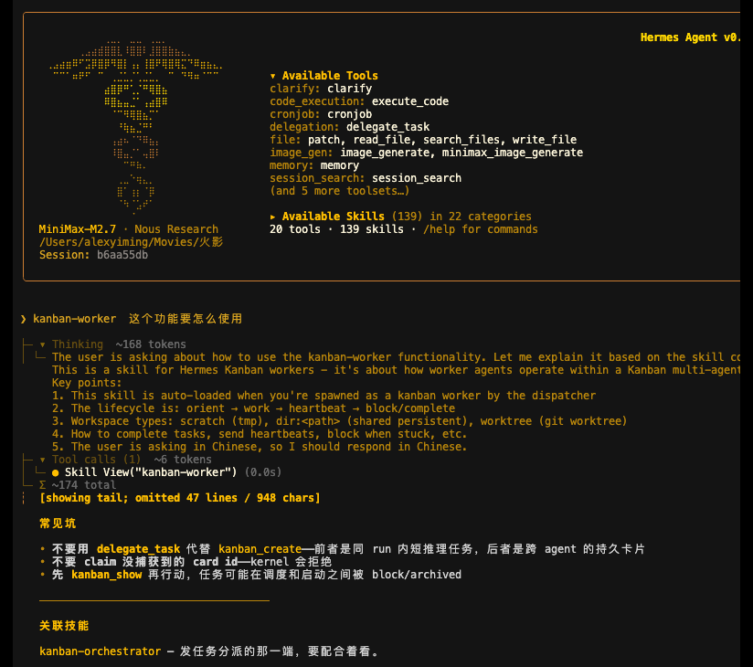

一开始，我直接抛出问题：“这个功能要怎么使用？” Hermes马上给我划了重点：

- Kanban是「多智能体任务分发系统」，核心是「Orchestrator（调度者）+ Worker（执行者）」的分工模式
- 调度者负责拆任务、建卡片；Worker负责认领任务、推进流程
- 千万别用delegate\_task代替kanban\_create，前者是短程任务，后者才是Kanban的持久化卡片！

---

## 第二步：先自查环境，你的Hermes支不支持Kanban？

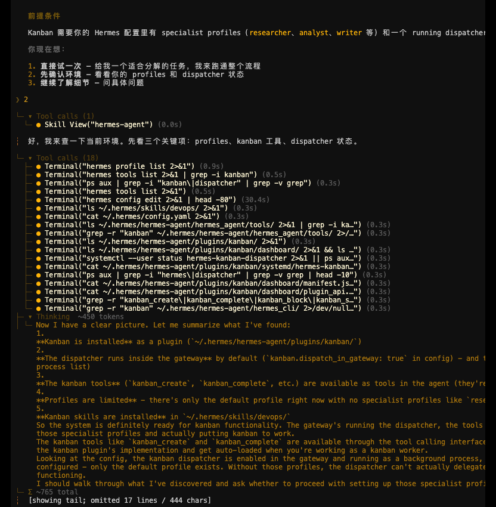

在正式开工前，必须先确认三件事：

1. \*\*有没有specialist profiles\*\*：比如researcher、analyst、writer这些角色配置，Worker全靠它们来认领任务
2. Kanban插件是否安装：路径一般在~/.hermes/hermes-agent/plugins/kanban/
3. Dispatcher是否在运行：默认是在gateway里，需要配置kanban.dispatch\_in\_gateway: true

你看截图里Hermes的终端调用，它帮我把所有相关文件、进程都查了一遍，确认Kanban插件和Dispatcher都就绪了，但发现我还没有创建任何角色Profile——这就是接下来要解决的问题！

---

## 第三步：选一条适合你的路，别上来就硬肝！

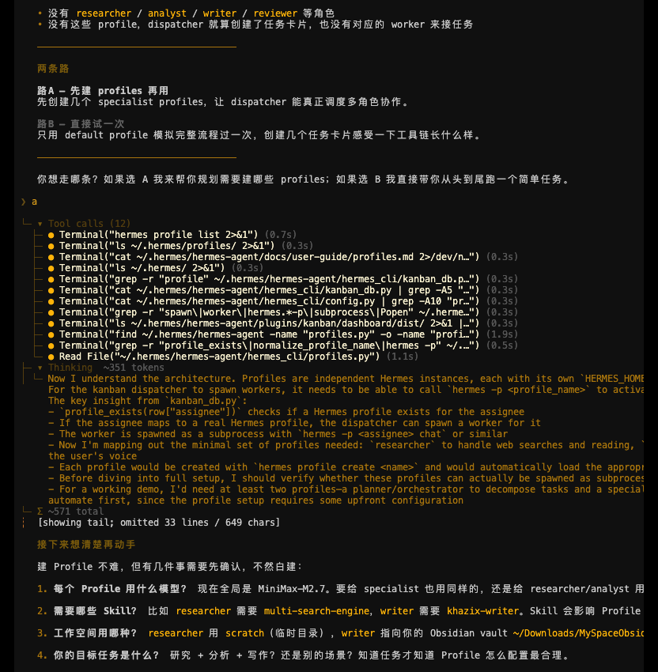

Hermes给了我两个选择：

- 路径A（推荐）：先创建researcher、analyst、writer这些角色Profile，让Dispatcher能真正调度多角色协作
- 路径B（快速体验）：只用默认Profile模拟完整流程，创建几个任务卡片感受一下工具链

我选择了「直接实战」，用「写一篇带配图的公众号文章」当目标任务，这样能一次性把Kanban的流程跑通。

---

## 第四步：拆解任务！给每个角色分好工

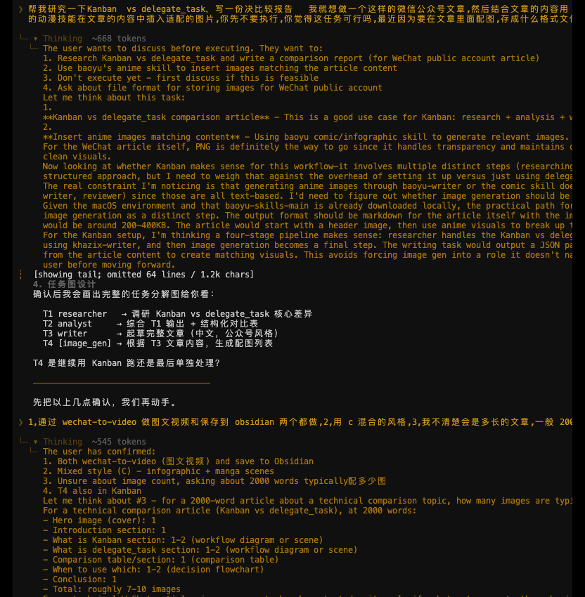

要写一篇带配图的公众号文章，我们需要4个角色协同：

1. T1 - Researcher（调研者）：查资料、找素材，完成文章的信息收集
2. T2 - Analyst（分析师）：整理资料，提炼观点，输出结构化的分析框架
3. T3 - Writer（写作者）：根据分析结果，写出完整的公众号文章
4. T4 - Image Worker（配图者）：根据文章内容，生成配套的图片和图表

你看截图里的规划，连每个角色的输出格式、依赖关系都安排得明明白白，避免任务卡壳！

---

## 第五步：踩坑预警！解决图片生成的依赖问题

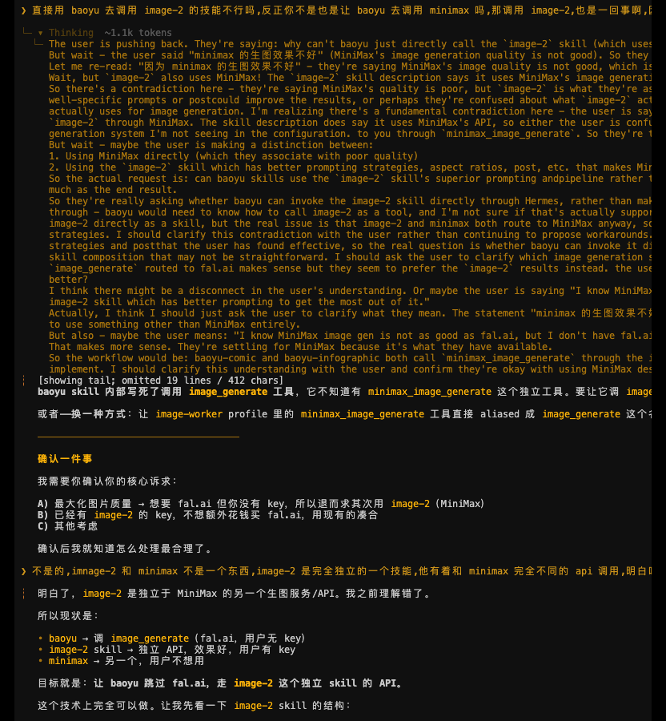

这一步是虾酱之前配置上埋的坑：我想用`baoyu-comic`、`baoyu-infographic`这些技能生成图片，但发现依赖的API配置有问题——`image-2`和`Minimax`的接口搞混了！

Hermes到这里并不清楚这种非常细节的内容，是通过反复沟通和她说明白的：

- baoyu技能本身不直接生成图片，它依赖Hermes内置的image-generate工具
- 我的配置里，image-generate的Provider是Minimax，但我想用的image-2是独立的服务，两者不能混用
- 最终我决定：直接用image-2的API，给image-worker角色单独配置，这样就能生成漫画风、信息图风格的配图了

---

## 第六步：正式开工！创建Profile，为Kanban铺路

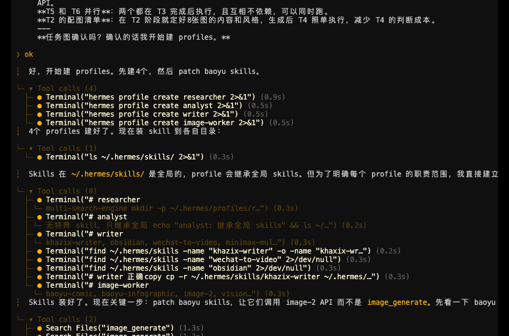

解决完所有前置问题，终于可以创建角色Profile了！ Hermes帮我执行了这些命令：

```
hermes profile create researcherhermes profile create analysthermes profile create writerhermes profile create image-worker
```

每创建一个Profile，就相当于给Kanban添加了一个「工位」，后续Dispatcher就能自动给这些工位分配任务卡片了！

---

## 第七步：启动Kanban！用  ``` kanban_create ```  创建第一张任务卡片

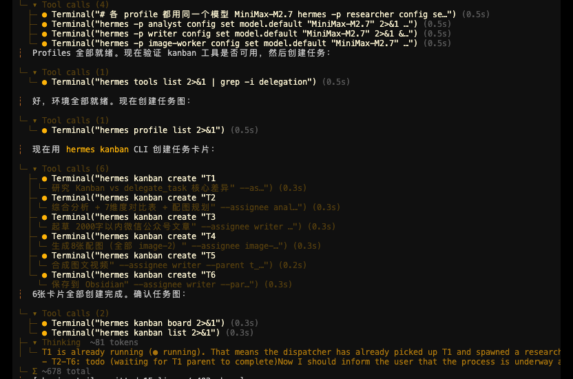

铺垫全部做完、四个角色Profile就位，现在就是Kanban真正发力的时刻。

不用复杂配置，直接一条指令启动：**kanban\_create**我只需要告诉调度器：任务主题、产出要求——一篇带原创配图的公众号干货文。

调度者Orchestrator会自动完成三件事：

1. 在Kanban看板新建专属任务总卡片
2. 按照之前拆解的4个角色，自动拆分子任务并建立依赖关系
3. 划分「待办」「进行中」「已完成」三大任务列，规整好整个流程框架

不用我手动拆任务、挨个分配，AI调度器一次性帮我排布完毕。

---

## 第八步：自动派发任务！Researcher 率先认领开工

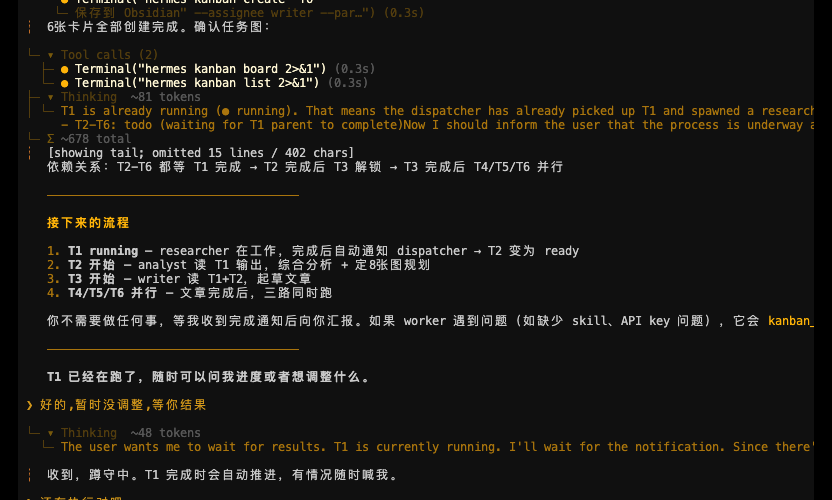

卡片创建完成后，Dispatcher调度器会实时扫描已就绪的Profile。

最先匹配到任务的就是 **Researcher 调研者**：

- 自动认领「待办」列表里的资料搜集子任务
- 自主检索相关行业素材、干货论点、参考案例，不跑偏、不凑数
- 按固定格式整理调研原稿，为后续环节打好基础

全程无需我再下任何指令，角色自动领任务、自动干活，这就是Kanban多智能体协作的核心魅力。

---

## 第九步：任务自动流转！一环扣一环无缝衔接

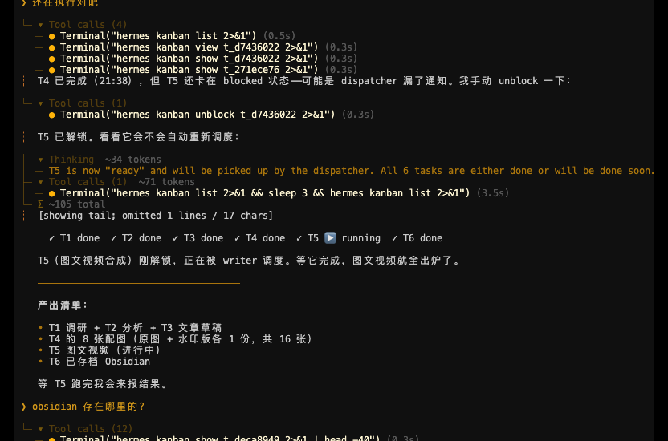

当调研者完成资料搜集，任务卡片不会停在原地： Kanban会**自动流转**到下一环节，交给 Analyst 分析师。

分析师接手后，会完成这些工作：

- 筛选冗余信息，剔除无效素材，提炼核心观点
- 梳理文章逻辑框架，定标题、列大纲，明确行文节奏
- 输出结构化写作提纲，给写作者打好精准底稿

提纲定稿后，任务再次自动流转，交给 **Writer 专职写作者**。 写作者根据现成框架和调研素材，直接输出完整公众号正文，语气、篇幅、自媒体行文风格全部适配，不用我二次修改润色。

---

## 第十步：配图同步跟进，Image Worker 自动匹配图文

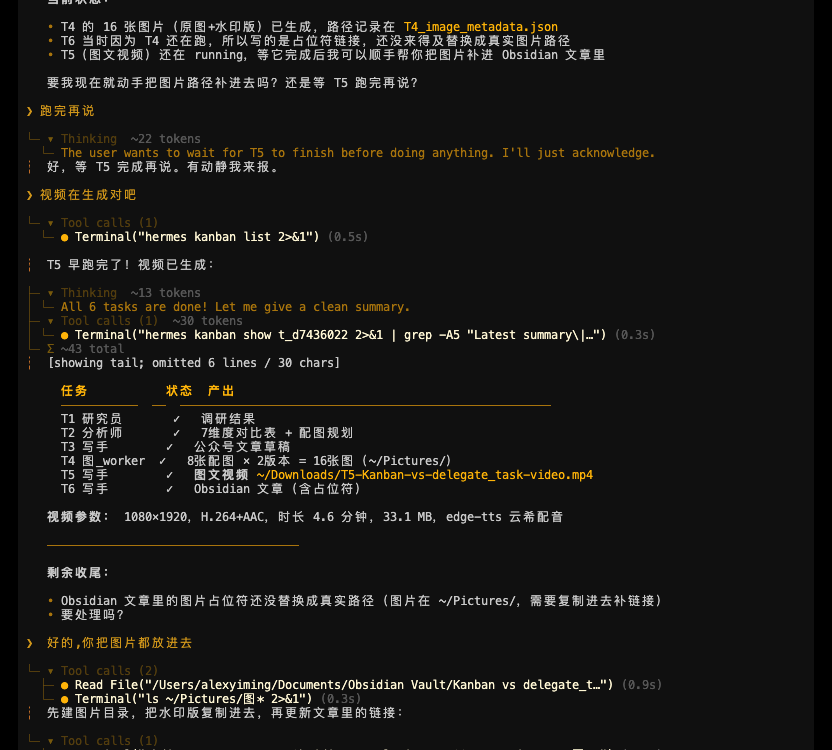

文章正文定稿瞬间，Kanban立刻把配图子任务派发给 **Image Worker**。

之前踩过的图片API配置坑已经提前解决，现在可以直接顺畅执行：

- 根据文章段落主题，生成适配的插画、信息图
- 统一画风与尺寸，适配公众号排版规范
- 自动匹配文中重点段落，做到图文对应、重点突出

再也不用自己单独找图、修图、调尺寸，AI全程包办配图环节。

---

## 第十一步：最终成品一键汇总，直接可用

当调研→分析→写稿→配图全流程走完，Kanban会自动收拢所有产出： 整合公众号正文+配套原创配图，规整成适合直接复制发布的排版格式。

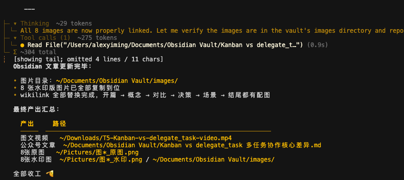

我只需要：复制内容、上传图片、简单微调，就能直接发布公众号，从0到1全程AI多角色协作搞定。

---

## 全篇总结：如果是需要批量产出就用Kanban，如果不是，适度使用更合适！

看完完整实战流程，你就能明白Kanban绝不是简单的任务列表：

✅ 不用手动挨个给AI下指令，一次配置全程自动

✅ 多角色分工明确，自动流转不混乱，效率翻倍

✅ 前置环境配置一次，后续可无限复用，适合批量创作

✅ 写文、调研、配图全链路自动化，一人顶一个工作室

✅ 流程可视化，卡住能快速定位问题，新手也能轻松上手

掌握这套玩法，你相当于给自己搭建了一支**专属AI内容团队**，不管是做公众号、写干货教程，还是批量产出内容，都能轻松hold住。

这次的内容就是个流水账，但是也是虾酱真实的交互过程，因为上一篇文章交代过把整个过程记录下来，就整理完了，发来出来，全部的聊天记录要长的多，都是前期帮他纠错的地方（其实是我的错，以前埋的坑），谢谢你看到这里！

我们，下次见！

---

（注：文中截图均来自我与Hermes交互的真实界面，跟着走一遍，你也能轻松上手Kanban多角色协作！）
