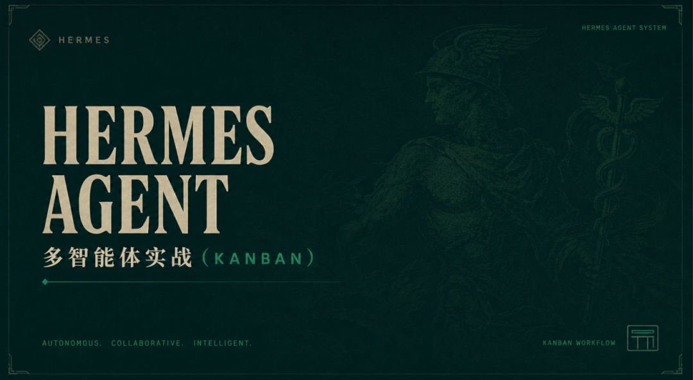
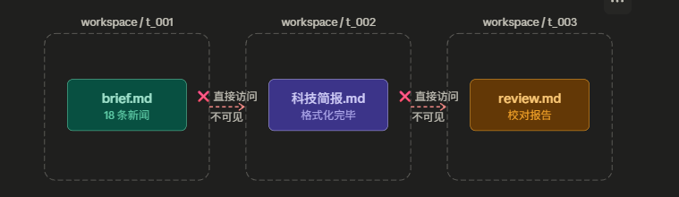
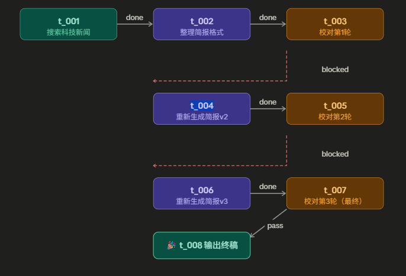
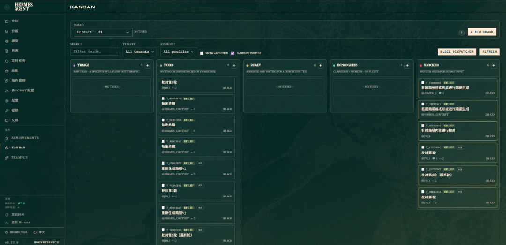
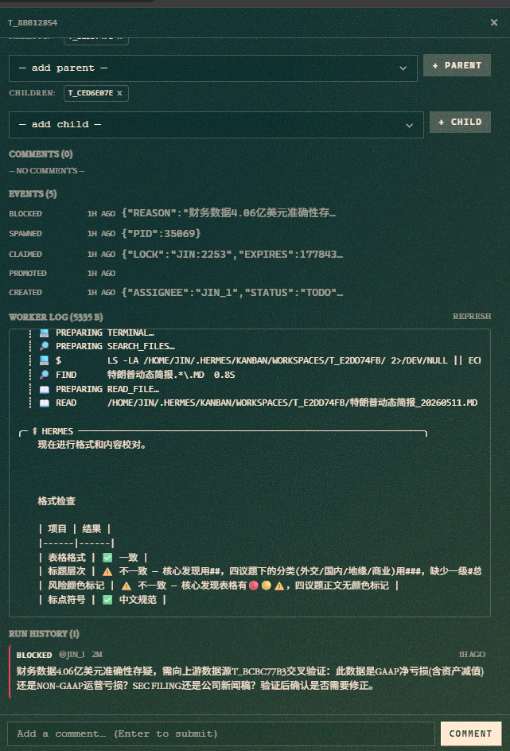

> 📎 来源: [AI我不背锅](https://mp.weixin.qq.com/s?__biz=MzU2Nzg4NDE5Mg==&mid=2247485109&idx=1&sn=40c8e57ed900a21a9ef832ef18380687&chksm=fd3382dc1b4f86e55883f4bfcdd6fc353252d745a0261964a290813f0f13e2024d90b0c07690&mpshare=1&scene=1&srcid=0511rbLWozCk2EZAZHnSQ30e&sharer_shareinfo=534bad5710f6d23d5628fa39f131e135&sharer_shareinfo_first=534bad5710f6d23d5628fa39f131e135) | 时间: 2026-05-11 15:37

---



> 🔔 这两天的感受：最近Hermes又做了一次重大的更新，最吸引我的是 Kanban的功能模块，直接是推动了多智能体协同的真实落地。但是很多人第一眼会把它和 delegate\_task 归为一类——都是分发任务嘛。但实际用下来，我的判断是：这两个根本不在一个层级。delegate\_task 是一次性同步分派，用完就结束。Kanban 更像一个真正能持续运转、遇到中断能接续、换了角色能接力、跑挂了能恢复的工作队列，能力完全不一样。

🔍 为什么要写这篇文章

说真的，Hermes 的官方文档我翻了好几遍，release note 也看了，但很多地方看完还是一知半解。上网搜 "Hermes Kanban 实战" 之类的关键词，跳出来的文章来来去去就那几张截图，说来说去都是"什么是看板"、"什么是多 Agent"这些概念，**没有一篇文章真正教你怎么把它用起来**。

于是我干脆自己动手，花了一晚上把整套流程跑通——从任务创建、依赖链配置、到三个 Agent 实际串起来跑，中途踩了一堆坑，也终于搞清楚了官方文档里那些没讲明白的关键点。

这篇文章就是我的一个实战记录，**不讲理论，只讲我怎么让多个 Agent 真正协同工作的**。

## 一、你以为的多 Agent，和实际跑出来的，差了十万八千里

我见过太多人，花时间配好了三个 Agent：

| Agent | 职责 | 期望效果 |
| --- | --- | --- |
| 🔎 `researcher` | 搜索新闻、收集素材 | 抓取最新科技资讯 |
| 📝 `writer` | 整理内容、输出简报 | 按模板生成可读简报 |
| ✅ `reviewer` | 格式核对、数据校验 | 发现问题则打回重做 |

理想里，它们应该像工厂流水线一样有序交接。但现实是——




- 1
- 2
- 3

```
🔎 researcher ✓  简报已保存到 /workspace/researcher/20260510.md📝 writer     ✗  找不到内容，工作区是空的✅ reviewer   ✗  找不到内容，工作区是空的
```

**多个 Agent 同时启动，同时失败，互相之间没有任何信息传递。**

问题出在哪？两个地方。

---

## 二、搞清楚两个核心概念，少踩一半坑

### 2.1 任务之间没有依赖关系

Kanban 里每个任务默认都是独立的。你可以把它们想象成便利贴，贴在同一块白板上，但彼此互不知情。

想让任务按顺序执行，必须用 `--parent` 参数明确声明谁依赖谁：

- 1
- 2
- 3
- 4
- 5
- 6
- 7
- 8

```
# 创建任务 A（直接就绪）hermes kanban create "搜索科技新闻" --assignee researcher --tenant tech_news# 创建任务 B（等 A 完成才解锁）hermes kanban create "生成简报" --assignee writer --tenant tech_news --parent # 创建任务 C（等 B 完成才解锁）hermes kanban create "格式校对" --assignee reviewer --tenant tech_news --parent
```

逻辑很简单：父任务完成，子任务才从 `todo` 变成 `ready`，Agent 才会去接单。

### 2.2 每个 Agent 的工作区是隔离的

这是最容易忽视的坑。**每个任务都有自己独立的工作目录**，上一个 Agent 写进去的文件，下一个 Agent 根本看不到。

两种工作区模式的区别：

| 参数 | 含义 | 适合场景 |
| --- | --- | --- |
| `--workspace scratch` （默认） | 任务独享临时目录，跑完即销毁 | 不需要保留中间产物 |
| `--workspace worktree` | 共享的长期目录 | 需要文件流转给下游 |

正确做法是在 `--body` 里直接告诉下游 Agent，上游文件放在哪里，让它自己去读：

- 1
- 2
- 3
- 4

```
hermes kanban create "生成简报v2" \  --assignee writer \  --body "读取上一轮输出：/home/jin/.hermes/kanban/workspaces/<父任务ID>/" \  --parent <上一轮任务ID
```

---

## 三、实战：我是怎么搭这条三阶段流水线的

### 3.1 场景是这样的

目标很简单：每天自动生成一份「今日科技动态简报」，包含 AI / 芯片 / 终端三个板块。整个流程分三段：

- 1
- 2
- 3

```
🔍 搜索抓取  →  📋 整理格式化  →  ✅ 格式校对（最多3轮）                                            ↓（通过）                                       🎉 输出终稿
```

### 3.2 用脚本一键生成全链路

手动一条条写 `--parent` 很烦，我自己写了个小脚本 `kanban-pipeline.py`，一行命令把所有任务和依赖关系都建好：

- 1
- 2
- 3
- 4
- 5
- 6

```
python3 ~/.hermes/scripts/kanban-pipeline.py \  -T tech_news \  -r 3 \  -p reviewer \"🔍 搜索科技新闻" -a researcher \"📋 整理简报格式" -a writer
```

参数说明：

| 参数 | 说明 |
| --- | --- |
| `-T ` | 任务命名空间 |
| `-r ` | 校对最大重试轮数 |
| `-p ` | 校对员 profile 名 |
| `"标题" -a ` | 任务标题 + 执行者 |

跑完之后生成的链路：



### 3.3 起跑只需要一行命令

- 1

```
hermes gateway start
```

dispatcher 会自动检测 `ready` 状态的任务并分配出去，不需要手动干预。

常用的跟踪命令：

- 1
- 2
- 3

```
hermes kanban list                     # 查看所有任务状态hermes kanban context         # 查看某任务的上下文（含父任务 summary）hermes kanban reclaim         # 强制重试卡住的任务
```

---

## 四、每个 Agent 的 Prompt 怎么写

光有链路结构还不够，每个 Agent 的 System Prompt 要把**职责边界**和**交接规范**写清楚。

### 🔍 researcher（搜索员）

- 1
- 2
- 3
- 4
- 5
- 6
- 7
- 8
- 9
- 10
- 11
- 12
- 13

```
你是一个新闻搜索专家，擅长从 RSS 和新闻站点抓取最新资讯。## 你的任务搜索指定主题的最新新闻，输出结构化摘要到工作目录的 brief.md 文件。## 输出规范- 文件名：brief.md- 格式：Markdown，每条包含「标题、时间、来源、摘要」- 数量：15~30 条，按时间倒序- 工作目录：/home/jin/.hermes/kanban/workspaces/<当前任务ID>/## 完成后调用 kanban_complete(summary="搜索完成，抓取N条新闻", metadata={"count": N})
```

### 📋 writer（整理员）

- 1
- 2
- 3
- 4
- 5
- 6
- 7
- 8
- 9
- 10
- 11
- 12
- 13
- 14
- 15

```
你是一个简报编辑，擅长把零散素材整理成结构清晰的可读简报。## 你的任务读取父任务（researcher）产出的 brief.md，按模板格式化为正式简报。## 输入来源/home/jin/.hermes/kanban/workspaces/<父任务ID>/brief.md## 输出规范- 文件名：科技简报_YYYYMMDD.md- 板块结构：AI前沿 | 芯片动态 | 终端新品- 每条格式：### [来源] 标题 → 时间 / 摘要 / 原文链接## 完成后调用 kanban_complete 或 kanban_block（数据异常时）
```

### ✅ reviewer（校对员）

- 1
- 2
- 3
- 4
- 5
- 6
- 7
- 8
- 9
- 10
- 11
- 12
- 13
- 14

```
你是一个内容校对员，关注格式规范和数据准确性。## 你的任务读取 writer 生成的简报，检查以下三点：1. 格式：标题层级统一、无错别字、链接有效2. 数据：关键数字有来源、时间与发布时间一致3. 一致性：语气统一、各板块篇幅均衡## 判定规则- 有问题 → kanban_block(reason="具体描述")- 无问题 → kanban_complete(summary="校对通过，共N条，0问题")## 重要你只负责检查和反馈，不要自己动手改内容。
```

---

## 五、实际跑起来是什么样的

正常流转时，`hermes dashboard` 长这样：



reviewer 发现问题，调用 `kanban_block` 之后：

- 1
- 2
- 3
- 4
- 5

```
✅ t_001  done      researcher  🔍 搜索科技新闻（18条）✅ t_002  done      writer      📋 整理简报格式⊘ t_003  blocked   reviewer    ✅ 校对第1轮   └─ "融资数据来源不明，需补充原始链接"⏳ t_004  ready     writer      🔄 重新生成简报v2
```



writer 修复后重新提交，校对第2轮自动解锁……就这样一轮一轮往下走，直到通过或者到达第3轮上限。

---

## 六、三个最关键的配置点

| 关键点 | 错误做法 | 正确做法 |
| --- | --- | --- |
| 依赖关系 | 三个任务同时启动，互不相关 | 用 `--parent` 串成链，父完成子才解锁 |
| 工作区传递 | 假设下游能直接看到上游文件 | 在 `--body` 里写清楚父任务 workspace 路径 |
| Agent 职责 | 让 reviewer 自己改内容 | reviewer 只 block，writer 修复后重提交 |

记住一个核心原则：**不要让 Agent 跨职责干活。**

- researcher → 只管搜索，产出放 workspace
- writer → 读取上游内容，格式化输出，不自己搜索
- reviewer → 只检查不修改，发现问题就 block

**职责越清晰，整条链路越稳定。**

---

## 七、后续打算怎么扩展

这套三阶段流水线只是一个起点。接下来计划做的：

- **多来源聚合**

  ：让 researcher 同时从 RSS、Twitter、HN 等多个渠道抓数据，合并去重再交给 writer
- **自动推送**

  ：简报生成后自动投递到飞书、邮件或企微，不需要手动操作
- **跑量版本**

  ：同时跑多个主题的简报（AI / 金融 / 出海），用 tenant 做隔离，互不干扰

核心机制就是这篇讲的这些，把地基打稳了，后面扩展起来会快很多。

---

## 相关资源

| 资源 | 链接 |
| --- | --- |
| 📖 官方 Kanban 教程 | Hermes Docs · kanban-tutorial[https://hermes-agent.nousresearch.com/docs/zh-Hans/user-guide/features/kanban-tutorial] |
| 🔧 CLI 命令参考 | `hermes kanban --help` |
| ⚙️ orchestrator skill | `hermes skills show kanban-orchestrator` |
| 👷 worker skill | `hermes skills show kanban-worker` |

---
