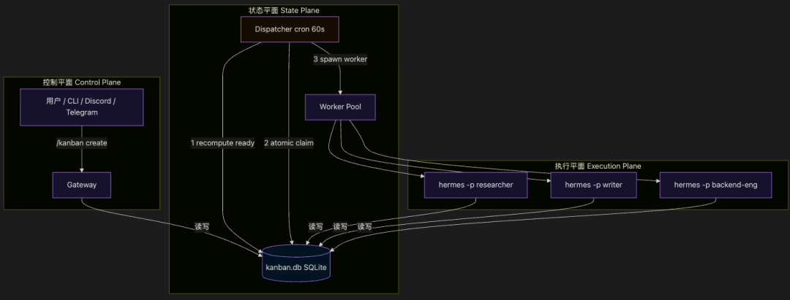
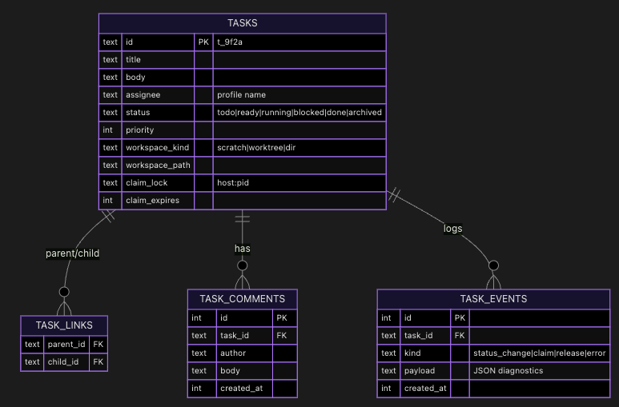
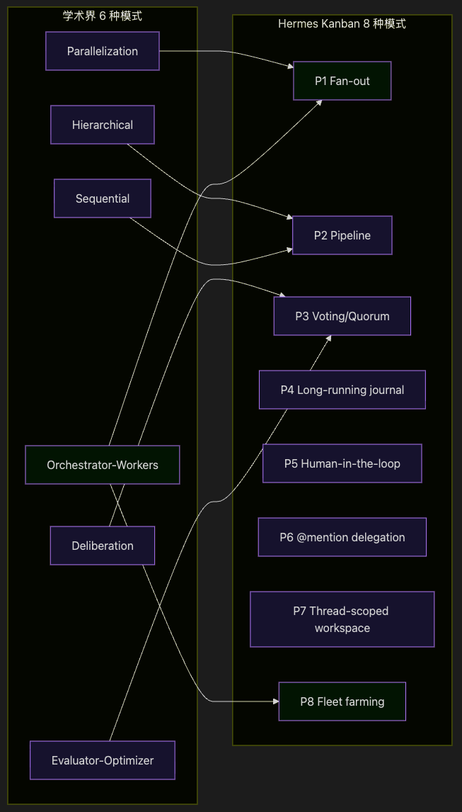
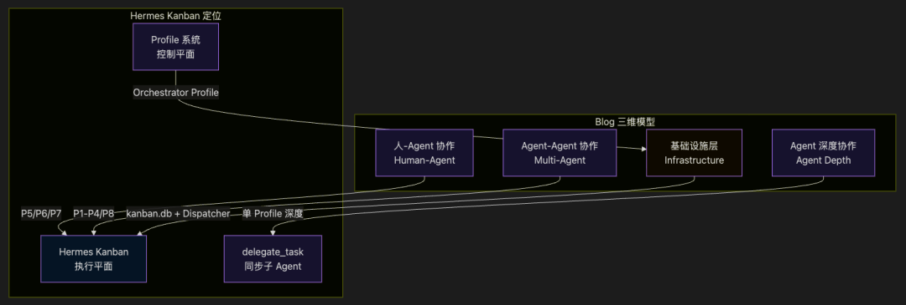
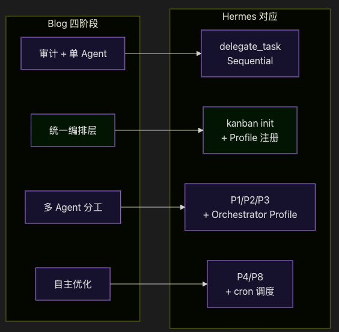
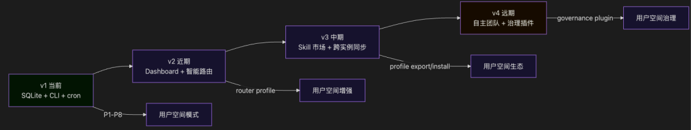

> 📎 来源: [星汉问元](https://mp.weixin.qq.com/s?__biz=Mzg4OTE5MTg5OQ==&mid=2247483998&idx=1&sn=87405e8d7aacf51fbbfc79513f472ede&chksm=ce976ed0d7ec159d6d812579b8aa313b2b9042c69259bc4452192515729ac6f53c0788f3d245&mpshare=1&scene=1&srcid=0510nDXZZWtzDKGrUwSdhjQx&sharer_shareinfo=41dee7161550d242f776bfd0447668fc&sharer_shareinfo_first=41dee7161550d242f776bfd0447668fc) | 时间: 2026-05-10 15:52

---

> 本文基于 Hermes Kanban v1 设计规范（2026-04-25，Nous Research）和官方用户文档，与我的 blog《Agent 协作模式全景解析：从学术理论到业界实践》进行系统性对比分析。

> flyer，公众号：星汉问元[Agent 协作模式全景解析：从学术理论到业界实践](https://mp.weixin.qq.com/s/NmO_igHqJefY_GfJ4g0_FQ)

---

## 一、Hermes Kanban 是什么？

**Hermes Kanban 是一个基于 SQLite 的持久化任务板，让多个命名的 Agent Profile（如 researcher、writer、backend-eng）通过操作系统进程协作完成任务，而非脆弱的进程内子 Agent 集群。**

核心特征：
- **持久化**：所有任务存储在 

```
~/.hermes/kanban.db
```

，重启不丢失
- **跨 Profile**：不同 Agent 身份共享同一个任务板
- **OS 进程隔离**：每个 worker 是独立的 

```
hermes -p
```

 进程，崩溃后自动重新认领
- **人可随时介入**：通过 CLI 或 IM Gateway（Discord/Telegram/Slack）查看、评论、解阻塞

---

## 二、架构设计：三平面分离



**关键设计决策**：

| 平面 | 职责 | 设计哲学 |
| --- | --- | --- |
| 控制平面 | 用户交互（CLI/IM） | 统一命令定义，自动同步到所有平台 |
| 状态平面 | SQLite + 调度器 | 最小化内核：4 张表、3 个索引、无 JSON 列 |
| 执行平面 | 独立 OS 进程 | **拒绝进程内子 Agent 集群** （NanoClaw 教训） |

---

## 三、数据模型



**设计亮点**：
- **单 assignee 原则**：避免认领竞争，多角色通过链接任务实现
- **workspace\_kind 解耦**：支持 scratch（临时目录）、dir（共享路径）、worktree（git 工作树），默认 scratch 以支持非编码工作流
- **claim\_lock + claim\_expires**：原子 CAS 认领 + 15 分钟过期自动回收

---

## 四、八种协作模式：从学术到工程的映射

Hermes Kanban 文档化了 8 种可复用协作模式，可以与 blog 中 6 种学术模式直接对应：



```

```

### 4.1 模式对照详解

| Hermes 模式 | 学术对应 | 核心机制 | 典型场景 |
| --- | --- | --- | --- |
| **P1 Fan-out** | Parallelization + Orchestrator-Workers | 同一 Profile 并行执行 N 个无依赖任务，OS 进程级并行 | 多角度研究、批量处理 |
| **P2 Pipeline** | Sequential + Hierarchical | 链接任务形成链，前一完成触发后一启动 | 研究→分析→写作→审核 |
| **P3 Voting/Quorum** | Parallelization + Deliberation | N 个 Agent 投票，aggregator 汇总决策 | 多视角分析、共识达成 |
| **P4 Long-running journal** | —（新增） | 同一 Profile + 共享目录 + 周期性任务，累积记忆 | 每日简报、邮件分类 |
| **P5 Human-in-the-loop** | —（新增） | block → 人评论 → unblock → 重新执行 | 需要人工审核的关键环节 |
| **P6 @mention delegation** | —（新增） | ``` @profile-name ```   自动创建任务并分配 | IM 场景下的自然协作 |
| **P7 Thread-scoped workspace** | —（新增） | 工作区与 IM 线程绑定，跨会话保持上下文 | Discord/Slack 深度协作 |
| **P8 Fleet farming** | Orchestrator-Workers 扩展 | 单一 Profile 管理 N 个并行租户任务 | 社交媒体运营 |

**关键洞察**：
- Hermes 的 P1-P3 覆盖了学术界的 4 种经典模式
- P4-P7 是**工程实践催生出的新模式**，学术界尚未系统研究
- P8 是 Orchestrator-Workers 的规模化扩展，对应 blog 中的「Agent 蔓延」治理方案

---

## 五、与 Blog 核心观点的深度对比

### 5.1 协作维度对照

Blog 提出 Agent 协作是**三个维度 + 一个基础设施层**：



```

```

| 维度 | Blog 观点 | Hermes Kanban 实现 | 契合度 |
| --- | --- | --- | --- |
| **人-Agent 协作** | Slock.ai 的 Channel 模式：透明、可干预、可追溯 | P5/P6/P7：block/unblock、@mention、thread-scoped workspace | ⭐⭐⭐⭐⭐ |
| **Agent 深度协作** | Nimbalyst 的单 Agent 深度 IDE | delegate\_task：同步 fork-join，适合单 Agent 内部推理 | ⭐⭐⭐⭐ |
| **Agent-Agent 协作** | Parameter Golf 的无锁文件系统协作 | P1-P4/P8：board-mediated 异步协作，比文件系统更结构化 | ⭐⭐⭐⭐⭐ |
| **基础设施层** | Multica 的统一 Runtime + Agent Registry | kanban.db + Dispatcher + Profile 系统 | ⭐⭐⭐⭐⭐ |

### 5.2 对「四大失败模式」的回应

Blog 总结了 95% 企业 AI 项目失败的四大模式，Hermes Kanban 的设计直接回应：

| 失败模式 | Blog 解药 | Hermes Kanban 设计 |
| --- | --- | --- |
| **1. 跳过审计** | 先花四周观察实际操作 | P4 Long-running journal 天然支持持续审计；task\_events 表完整记录 |
| **2. 过度依赖 LLM** | 85% 代码 + 15% LLM | Dispatcher 是纯代码（cron + CAS），零 LLM 参与调度；Orchestrator Profile 通过禁用工具集强制委托 |
| **3. Agent 蔓延** | 单一编排层 | kanban.db 是统一状态层；Profile 是统一身份层；租户隔离防止数据混用 |
| **4. 当项目而非基础设施** | 持续演进，专门调优团队 | SQLite 持久化 + 工作区解耦 + 8 个独立可发布 PR，支持渐进式增强 |

### 5.3 演进路线对照

Blog 建议四阶段演进：审计 → 单 Agent 深度 → 统一编排层 → 多 Agent 协作 → 自主优化

Hermes Kanban 的对应实现：



**关键契合点**：
- Blog 第二阶段「统一编排层」= Hermes 的 

```
kanban.db
```

 + Dispatcher + Profile 系统
- Blog 第三阶段「多 Agent 分工」= Hermes 的 P1/P2/P3 + Orchestrator Profile 模板
- Blog 第四阶段「自主优化」= Hermes 的 P4/P8 + cron 模板 + 租户隔离

---

## 六、关键差异与独特贡献

### 6.1 Hermes Kanban 的独特之处

| 特性 | 业界现状 | Hermes Kanban 方案 |
| --- | --- | --- |
| **进程模型** | NanoClaw：进程内 SDK 子 Agent（脆弱） | **OS 进程隔离** ，崩溃自动恢复 |
| **状态存储** | Cline：git worktree（编码-centric） | **SQLite + workspace\_kind 解耦** ，支持非编码工作流 |
| **治理层级** | Paperclip/Gemini：内核级治理（过重） | **用户空间治理** ，控制平面 = Profile + Plugin |
| **调度智能** | 多数系统：智能路由（复杂） | **Dumb Dispatcher** ，纯 cron + CAS，零 LLM |
| **身份系统** | Multica：独立 Agent 实体 | **Profile = Agent** ，复用现有 HERMES\_HOME |

### 6.2 与 Blog 调研项目的对比 ``` ```

| 项目 | 核心优势 | Hermes Kanban 特点 |
| --- | --- | --- |
| **Slock.ai** | Agent 发现 + 健康监控 | Hermes 增加**持久化任务状态机** + **人可介入** |
| **Multica** | 人-Agent 混合团队 | Hermes 增加**OS 进程隔离** + **工作区解耦** |
| **Nimbalyst** | Transcript 存储 + Tasks View | Hermes 增加**跨 Profile 协作** + **调度器** |
| **Parameter Golf** | 无锁文件系统协作 | Hermes 增加**结构化编排** + **审计日志** |

---

## 七、发展方向预测

基于设计规范和社区讨论，Hermes Kanban 可能沿以下方向演进：



```

```

| 阶段 | 预期特性 | 与 Blog 演进路线对应 |
| --- | --- | --- |
| **v1 当前** | SQLite 内核 + 8 种模式 + CLI/Gateway | 第二阶段：统一编排层 |
| **v2 近期** | Dashboard 插件 + Router Profile（智能分配） | 第三阶段：多 Agent 分工 |
| **v3 中期** | 可移植 Profile 市场 + 跨机器 kanban 同步 | 第三阶段深化 |
| **v4 远期** | 治理插件（预算/审批/审计）+ 自主 Agent 团队 | 第四阶段：自主优化 |

**核心设计哲学不变**：
- 内核保持最小（4 张表 + 1 个调度器）
- 复杂度推向用户空间（Profile/Skill/Plugin）
- 拒绝控制平面内核化（区别于 Gemini Enterprise）

---

## 八、结论

Hermes Kanban 不是 Agent 协作的终极答案，而是**当前务实的执行平面实现**。它的价值在于：

1. **填补了 delegate\_task 的四大缺口**

   持久化、跨 Profile、人可介入、依赖管理
2. **避免了 NanoClaw 的进程内陷阱**

   OS 进程 = 崩溃隔离 = 自动恢复
3. **拒绝了 Paperclip/Gemini 的治理过重**

   用户空间治理 = 灵活 = 不绑架用户
4. **验证了 Blog 的四阶段演进**

   从单 Agent → 编排层 → 多 Agent → 自主，每一步都有对应实现

对于已经在使用 Hermes 的用户，Kanban 是一个**自然延伸**：不需要新实体类型（Profile = Agent），不需要新存储（SQLite 已存在），不需要改核心（run\_agent.py 零改动）。对于正在调研 Agent 协作的团队，Hermes Kanban 提供了一个**最小可运行的参考实现**。

---

## 附录：Hermes Kanban 具体用法速查

### A.1 初始化

```
# 创建 kanban.db（如果不存在）hermes kanban init
```

### A.2 创建任务

```
# 基础创建hermes kanban create "研究 Gemini 2 失败原因" --assignee researcher# 带详细描述hermes kanban create "研究 Gemini 2 失败原因" \  --body "从成本、延迟、工具质量、授权四个角度分析" \  --assignee researcher \  --workspace scratch# 指定工作区类型hermes kanban create "修复登录 Bug" \  --assignee backend-eng \  --workspace worktree        # git 工作树，适合编码任务# 指定共享目录（适合长期任务）hermes kanban create "每日 AI 简报" \  --assignee scout \  --workspace dir:~/Obsidian/AI-Briefs/
```

### A.3 查看任务板

```
# 列出所有任务hermes kanban list# 只看自己的任务hermes kanban list --mine# 按状态筛选hermes kanban list --status running# JSON 输出（供脚本处理）hermes kanban list --json# 查看单个任务详情（含评论、事件日志）hermes kanban show t_9f2a
```

### A.4 任务依赖与链接

```
# 创建依赖链：T1 → T2 → T3hermes kanban link t_parent t_child# 解除依赖hermes kanban unlink t_parent t_child# 示例：研究 → 分析 → 写作流水线hermes kanban create "收集资料" --assignee researcher  # -> T1hermes kanban create "分析数据" --assignee analyst      # -> T2hermes kanban create "撰写报告" --assignee writer      # -> T3hermes kanban link T1 T2hermes kanban link T2 T3
```

### A.5 任务状态流转

```
# 手动认领任务（调度器自动做，也可手动）hermes kanban claim t_9f2a# 添加评论（人 or Agent 都可）hermes kanban comment t_9f2a "资料来源受限，需要替代方案"# 标记阻塞（需要人介入）hermes kanban block t_9f2a "API 限流，需要申请更高配额"# 解阻塞（人回复后继续）hermes kanban unblock t_9f2a# 完成任务hermes kanban complete t_9f2a --result "完成：成本过高是主因"# 归档（清理已完成任务）hermes kanban archive t_9f2a
```

### A.6 IM Gateway 用法（Discord/Telegram/Slack）

```
# 创建任务/kanban create "研究竞品动态" --assignee researcher# 查看任务板/kanban list# 查看详情/kanban show t_9f2a# 评论/kanban comment t_9f2a "发现重要更新"# 解阻塞（关键：Agent 卡住时人可直接解救）/kanban unblock t_9f2a
```

### A.7 调度器触发

```
# 手动触发一次调度（检查 ready 任务并认领）hermes kanban dispatch# 添加到 cron（每 60 秒自动调度）# ~/.hermes/cron/kanban_dispatch.yamlschedule: "*/1 * * * *"command: hermes kanban dispatch
```

### A.8 完整工作流示例

```
# 1. 初始化hermes kanban init# 2. 创建研究任务hermes kanban create "分析 Q2 市场趋势" \  --assignee planner \  --body "分解为四个子任务并行研究"# 3. Planner Agent 自动分解（通过 kanban_create 工具）# 生成 4 个子任务，无依赖关系（Fan-out 模式）hermes kanban create "角度：市场规模" --assignee researcher --parent T1hermes kanban create "角度：竞品动态" --assignee researcher --parent T1hermes kanban create "角度：用户反馈" --assignee researcher --parent T1hermes kanban create "角度：技术趋势" --assignee researcher --parent T1# 4. 完成父任务，触发子任务变为 readyhermes kanban complete T1# 5. 调度器自动认领并并行执行 4 个 researcher 进程hermes kanban dispatch# 6. 创建汇总任务（依赖前 4 个）hermes kanban create "汇总分析报告" --assignee analysthermes kanban link T2 T6hermes kanban link T3 T6hermes kanban link T4 T6hermes kanban link T5 T6# 7. 人查看进度hermes kanban list --status running# 8. 某个 researcher 遇到阻塞hermes kanban block T3 "竞品数据需要付费订阅"# 9. 人在 Discord 看到通知，回复解决方案/kanban comment T3 "使用公开财报替代"/kanban unblock T3# 10. 调度器重新认领 T3，继续执行hermes kanban dispatch# 11. 所有子任务完成，T6 自动变为 ready，analyst 接手hermes kanban complete T6 --result "Q2 市场趋势报告已生成"
```

### A.9 常用命令速查表

| 命令 | 用途 |
| --- | --- |
| ``` hermes kanban init ``` | 初始化数据库 |
| ``` hermes kanban create "标题" ``` | 创建任务 |
| ``` hermes kanban list ``` | 查看任务板 |
| ``` hermes kanban show  ``` | 查看任务详情 |
| ``` hermes kanban assign   ``` | 重新分配 |
| ``` hermes kanban link   ``` | 建立依赖 |
| ``` hermes kanban claim  ``` | 手动认领 |
| ``` hermes kanban comment  "内容" ``` | 添加评论 |
| ``` hermes kanban complete  ``` | 标记完成 |
| ``` hermes kanban block  "原因" ``` | 标记阻塞 |
| ``` hermes kanban unblock  ``` | 解阻塞 |
| ``` hermes kanban archive  ``` | 归档 |
| ``` hermes kanban dispatch ``` | 手动调度 |
