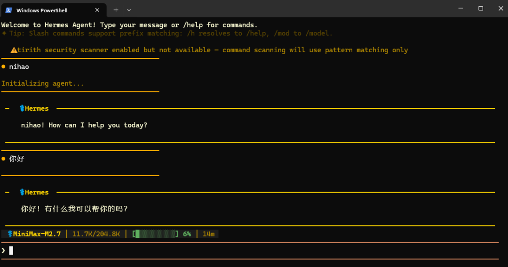
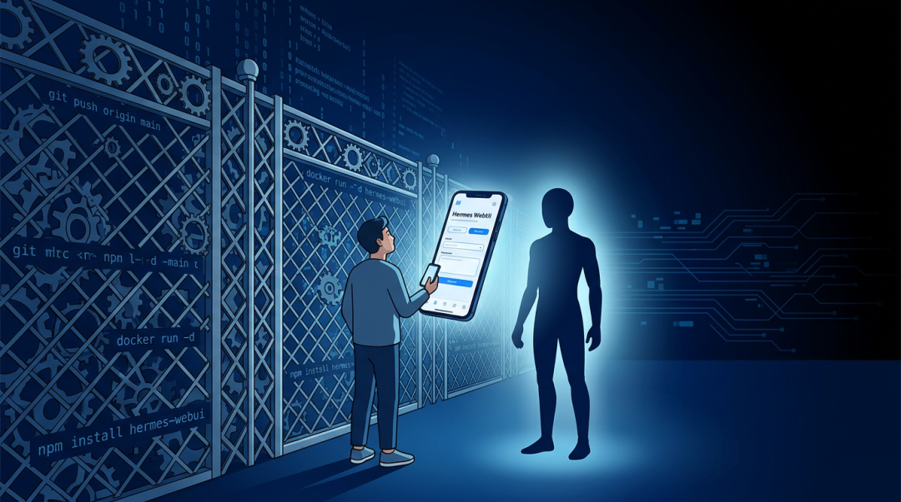
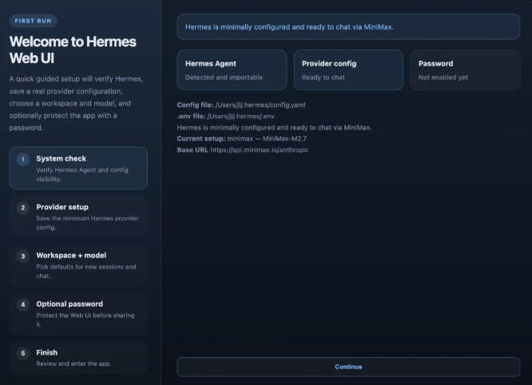

> 📎 来源: [无梦想不青春AGI](https://mp.weixin.qq.com/s?__biz=MjM5NjI1NTUxMw==&mid=2454634464&idx=1&sn=b15d2604b27f7f337bca931b13fdf8e7&chksm=b0d114be641d3f4efd56bb84fadd26c010c8a665fec764e1fc5a42521adaebc6b6a061609c8c&mpshare=1&scene=1&srcid=0422lNnr9aXsI2VLy32w2OrV&sharer_shareinfo=ffad2a2c7e463f2d87d860d4ff3fe3c4&sharer_shareinfo_first=ffad2a2c7e463f2d87d860d4ff3fe3c4) | 时间: 2026-04-22 17:34

---

# 好工具和用得起来的工具之间「隔着一个界面」

我想先问一个问题。

你现在手机上，打开次数最多的 AI 应用是什么？

ChatGPT？豆包？还是 Gemini？

大概率，这些都是对话类应用。你打字，它回答。简单、直接、不需要任何门槛。

但如果我告诉你，有一种 AI Agent，它能跨会话记住你的偏好，能在你离线的时候自动跑定时任务，会随着你使用的时间变长越来越懂你的代码风格和工作习惯——

然后你问我，这么好用的 Agent 在哪？

我告诉你，它叫 Hermes Agent。

你再问我，怎么用？

我告诉你，你得先 SSH 连上服务器，然后手动敲命令。

这时候你什么反应？

大概率是——哦，那算了。

---

## 一个好工具，死在了「门槛」上

这不是虚构的场景。这是 Hermes Agent 真实发生过的事。

Hermes Agent 并不是一个新出现的 AI 工具。它背后做的事情很有意思。

第一，它有长期记忆。你跟它说"以后写代码按照我的风格来"，它真的记住，下次不需要重新解释。你的代码规范、偏好、习惯，它会一直带着。

第二，它支持定时任务。你不在的时候，它帮你监控服务器、跑测试、给你发报告。你睡觉的时候它在工作。

第三，它的 Skills 是自己长出来的，不需要去社区下载安装。随着你使用，它会自动学习和积累专属于你的技能。

这些能力，每一个单独拎出来，都很能打。

但 Hermes Agent 一直是一个 CLI 工具。命令行交互。

会用的工程师觉得它很香。但不会用命令行的产品经理、运营、创业者呢？看着好，用不上。

这就像你知道有一个健身房，器械特别好、教练特别专业、氛围特别棒——但是你得先考到一个举重证书才能进去。

工具好用到爆，死在了门槛上。

---

## Hermes WebUI 做了什么？

然后 Hermes WebUI 出现了。

它做了一件听起来很简单的事：给 Hermes Agent 做一个网页界面。

手机浏览器打开、电脑浏览器打开，不需要 SSH、不需要记命令，直接用。

但这个"简单"的界面，把 Hermes Agent 的使用体验彻底改变了。

以前你得对着终端敲字，现在你有一个正经的聊天界面。会话列表、聊天记录、文件预览，跟用微信一样简单。

以前你得记住一堆命令参数，现在所有的控制选项都在底部 Composer Footer 里，模型切换、工作区切换、Token 用量，点点就换。

以前只能在电脑前用，现在手机浏览器打开，配合 Tailscale VPN，在地铁上也能连上自己的 Agent。

这不是功能的增加，这是**可及性**的根本改变。

---

## 一个有意思的对比

我看到 Hermes WebUI 的时候，顺手查了一下它跟同类工具的对比表。

| OpenClaw | Claude Code | Codex CLI | Hermes |
| --- | --- | --- | --- |
| 跨会话记忆 | ✅ | ⚠️ 部分 | ⚠️ 部分 |
| 自托管定时任务 | ✅ | ❌ | ❌ |
| 消息平台接入 | ✅ 15+ | ⚠️ 部分 | ❌ |
| 自托管 Web UI | 仅 Dashboard | ❌ | ❌ |
| 自动进化 Skills | ⚠️ | ❌ | ❌ |

表格里每一列，都是在解决不同的问题。

Claude Code 和 Codex CLI 解决的，是让 AI 帮程序员写代码这件事做得更好。

Hermes 解决的，是让 AI 在你的整个工作流里成为一个长期存在的搭档，而不只是单次对话的工具。

OpenClaw 跟它最像，都是开源、自托管、有记忆和定时功能的长期 Agent。最大的区别是，Hermes 的 Skills 是自动进化的，不需要依赖社区插件市场。

但 Claude Code 和 Codex CLI 有多少人每天在用？

Hermes Agent 有多少人知道但没用过？

差距在哪？门槛。Claude Code 和 Codex CLI 只需要装一个包，Hermes Agent 需要你愿意跟命令行打交道。

Hermes WebUI 做的，就是把门槛拆掉。

---

## 技术上也有点意思

说一个让我意外的细节。

Hermes WebUI 的服务端，只有一个 Python 文件，server.py，大约 154 行。

API 模块按功能分离：认证、配置、会话、流式响应、路由，每一个独立。

154 行。这是这个 Web 界面的全部后端代码。

前端的实现呢？原生 JavaScript，没有框架依赖，没有构建步骤。

这意味着什么？

意味着你装这个 WebUI，不需要 Node.js 环境，不需要 webpack 配置，直接拉下来跑就行。

Bootstrap 脚本会自动检测 Hermes Agent 环境，缺失的时候自动拉取安装，配置虚拟环境，启动服务，打开浏览器。

一行命令，全搞定。

这种"不给你添麻烦"的设计思路，让它的安装门槛几乎为零。

---

## 真正的创新，不一定是做出新东西

写到这里，我在想一件事。

我们一直在追求"更强大的 AI"、"更先进的能力"、"更多的功能"。

但有时候，真正的创新发生在另一个维度：**让好东西可以被更多人用到**。

Hermes Agent 的核心能力，记忆、定时任务、自动进化的 Skills——这些不是 Hermes WebUI 发明的新技术。

Hermes WebUI 只是把门槛降低了。

把"你得先会命令行"变成"你只需要打开浏览器"。

把"你得在电脑前"变成"你手机上也能用"。

把"你得记住一堆命令"变成"点点按钮就行"。

这个改变难吗？技术上不难。一个 154 行的 Python 文件，一个原生 JS 前端。

这个改变值钱吗？很可能比很多"炫酷新功能"更值钱。

因为它决定了有多少人真正会用这个东西。

---

## 移动友好，为什么重要？

说一个我特别想聊的维度。

Hermes WebUI 特别强调了移动端适配。手机浏览器打开，配合 Tailscale VPN，随时随地连接。

这对一个 Agent 工具来说，意味着什么？

意味着你的 AI 搭档从"只在电脑前等你"，变成了"你随时能找到它"。

你在地铁上，突然想到一个产品想法，打开手机，连接到你的 Hermes Agent，跟它说"帮我梳理一下这个功能的用户故事"。

你出差在酒店，晚上想优化一下代码，打开手机，Hermes 已经记住你之前的上下文，直接开始。

这种"随时可用"的体验，把 AI Agent 从一个"工具"变成了一种"存在感"。

它不是在你需要的时候才打开的软件，而是你工作流里一直在后台待命的东西。

这才是"Agent"这个词真正该有的样子。

---

## 好工具和用得起来的工具之间，隔着一个界面

最后说一个我一直觉得挺无奈的现象。

技术社区有大量很好的开源工具，因为没有好的界面，死在了"太难用"上。

开发者自己会觉得，"装一下嘛，也不难啊"。

但这个"也不难"，对于不会用命令行的人来说，就是一道无法跨越的鸿沟。

Hermes WebUI 做的事情，本质上是在降低这个跨越的难度。

不是重新发明 Hermes Agent 的能力，是让更多人能够到那个能力。

这件事，技术上不性感，商业上不酷炫，但实际价值可能比很多"大模型重大升级"更实在。

毕竟，一个你用不上的强大工具，跟没有有什么区别？

---

好了，聊到这儿。

评论区聊聊，点赞在看，我们下次见。

> / 作者：mojianpo
> / 投稿或爆料，请联系邮箱：406223802@qq.com

---
