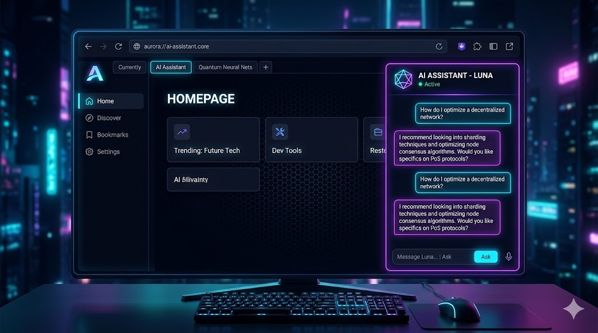
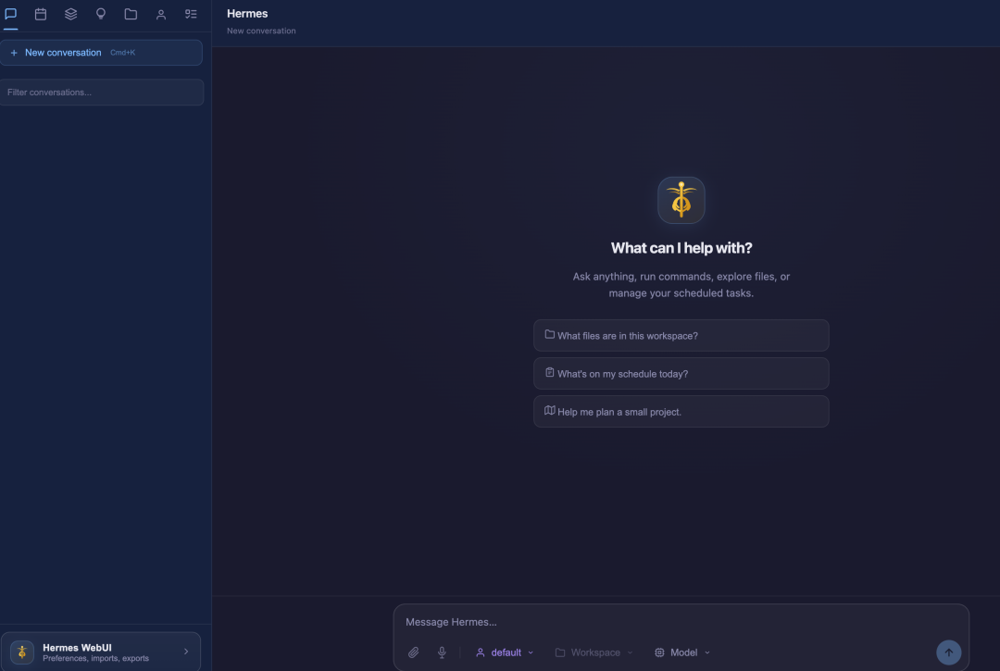
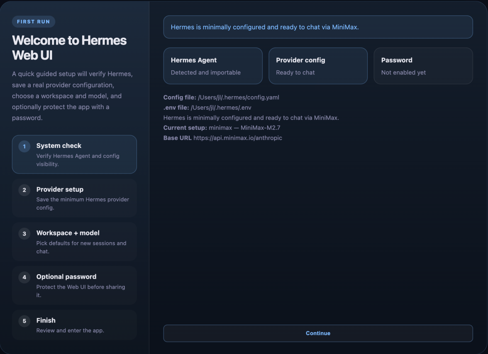

> 📎 来源: [编译硅基](https://mp.weixin.qq.com/s?__biz=MzUzMzM5MjkyOA==&mid=2247484091&idx=1&sn=f34e8e729d17f980c4f33ed5b0f13991&chksm=fb546e3cd67c5c4654deadecac3bb395e6cb4bd6f159536cb53ee3066b8abba53890755b0366&mpshare=1&scene=1&srcid=04177LtGU3GemoAqLu12GIw8&sharer_shareinfo=9d3fb0bc324c4f9a43c4f51aa80ff29d&sharer_shareinfo_first=9d3fb0bc324c4f9a43c4f51aa80ff29d) | 时间: 2026-04-17 02:19

---



## 一句话介绍

Hermes WebUI 是一个极简风格的网页界面，让你在浏览器里直接操控 Hermes Agent，手机和电脑都能用。

---

## 为什么你需要它

大多数 AI 工具每次会话都会"失忆"——它们不知道你是谁、不记得你做过什么项目、不了解你的代码规范。每次对话都要重新解释一遍。

Hermes 则不同：它能跨会话保留记忆、能在你离线时运行定时任务、会随着使用变得越来越懂你的环境。

Hermes WebUI 在此基础上更进一步——**把 CLI 的完整体验搬到了浏览器和手机端**，无需构建步骤、无需框架、前端零依赖，仅用 Python + 原生 JS 实现。

---

## 界面预览

Hermes WebUI 采用**三栏布局**：

- **左侧边栏**：会话列表和导航
- **中央聊天区**：对话主体
- **右侧文件浏览器**：工作区文件预览

模型选择、个人Profile、工作区切换等控制统一放在底部的 **Composer Footer**，随时可见。Token 使用情况通过圆形进度环直观显示。

支持**浅色/深色多主题切换**（Dark、Light、Slate、Solarized Dark、Monokai、Nord、OLED 七种），移动端有专属的汉堡菜单和底部导航栏。

---

## 核心功能一览

| 功能 | 说明 |
| --- | --- |
| 流式响应 | SSE 实时推送，Token 边生成边显示 |
| 多模型支持 | OpenAI、Anthropic、Google、DeepSeek、OpenRouter、MiniMax 等任意 Hermes 支持的模型 |
| 会话管理 | 创建、重命名、复制、归档、按项目/标签组织 |
| 定时任务 | 创建 Cron 任务，离线时自动执行并推送结果 |
| 消息平台 | Telegram、Discord、Slack、Signal、邮件等 10+ 渠道 |
| 自定义 Skills | 自动编写和保存可复用技能，无需插件市场 |
| 工作区文件浏览 | 树形目录、代码高亮、图片预览、直接编辑 |
| 语音输入 | 浏览器麦克风录制，实时转文字 |
| 密码保护 | 可选 HMAC Cookie 认证，保障自托管安全 |

---

## 快速安装

### 方式一：Bootstrap（一键）

```
git clone https://github.com/nesquena/hermes-webui.git hermes-webuicd hermes-webuipython3 bootstrap.py
```

Bootstrap 会自动检测 Hermes Agent 环境（缺失时自动拉取安装），配置 Python 虚拟环境，启动 Web 服务并打开浏览器。

### 方式二：Docker（推荐自托管）

```
docker compose up -d
```

支持 amd64 + arm64 双架构，预构建镜像托管在 GHCR。

启动后可配置密码保护：

```
HERMES_WEBUI_PASSWORD=你的密码 ./start.sh
```

默认端口 

```
8787
```

，通过 SSH 隧道远程访问：

```
ssh -N -L 8787:127.0.0.1:8787 user@你的服务器
```

---

## 手机访问：Tailscale 零配置 VPN

不想用 SSH 隧道？配合 Tailscale（基于 WireGuard 的零配置 VPN）可以一步到位：

1. 1. 在服务器和手机都装好 Tailscale，加入同一个私人网络
2. 2. WebUI 开启密码认证并监听所有网卡：

```
HERMES_WEBUI_HOST=0.0.0.0 HERMES_WEBUI_PASSWORD=xxx ./start.sh
```

1. 3. 手机浏览器打开 

   ```
   http://<服务器Tailscale IP>:8787
   ```

全程加密传输，无端口暴露，可添加到手机主屏幕当 App 用。

---

## 对比同类工具

|  | OpenClaw | Claude Code | Codex CLI | Hermes |
| --- | --- | --- | --- | --- |
| 跨会话记忆 | ✅ | ⚠️ 部分 | ⚠️ 部分 | ✅ |
| 自托管定时任务 | ✅ | ❌ | ❌ | ✅ |
| 消息平台接入 | ✅ 15+ | ⚠️ 部分 | ❌ | ✅ 10+ |
| 自托管 Web UI | 仅 Dashboard | ❌ | ❌ | ✅ |
| 自动进化 Skills | ⚠️ | ❌ | ❌ | ✅ |
| Python/ML 生态 | ❌ | ❌ | ❌ | ✅ |
| Provider 无关 | ✅ | ❌ | ✅ | ✅ |
| 开源 | ✅ MIT | ❌ | ✅ | ✅ |

与 OpenClaw 最具可比性——两者都是开源、自托管、具备记忆和定时功能的长期运行 Agent。主要区别：Hermes 的 Skills 是自动进化而非依赖社区市场；OpenClaw 曾有安全事件记录；Hermes 原生运行在 Python 生态。

---

## 技术架构

服务端仅一个 Python 文件 

```
server.py
```

（约 154 行），API 模块按功能分离：

- ```
  auth.py
  ```

  ：可选密码认证 + HMAC Cookie
- ```
  config.py
  ```

  ：环境发现 + 动态配置重载（~1110 行）
- ```
  models.py
  ```

  ：会话 CRUD + CLI 会话桥接（~377 行）
- ```
  streaming.py
  ```

  ：SSE 引擎 + Run Agent + Cancel（~545 行）
- ```
  routes.py
  ```

  ：所有 GET/POST 路由（~1996 行）

状态默认存储在 

```
~/.hermes/webui-mvp/
```

，可通过 

```
HERMES_WEBUI_STATE_DIR
```

 覆盖。

效果图展示：



初次运行时：



---

## 结语

Hermes WebUI 让 Hermes Agent 的使用门槛降到最低——不需要记命令、不需要 SSH 连服务器，手机浏览器打开就能用。如果你在用 Hermes Agent，这个 WebUI 值得一试。

项目地址：https://github.com/nesquena/hermes-webui
