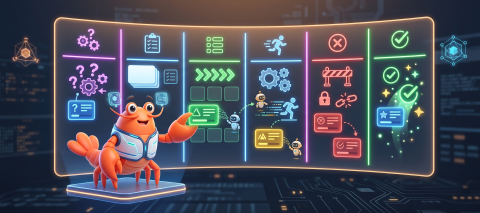
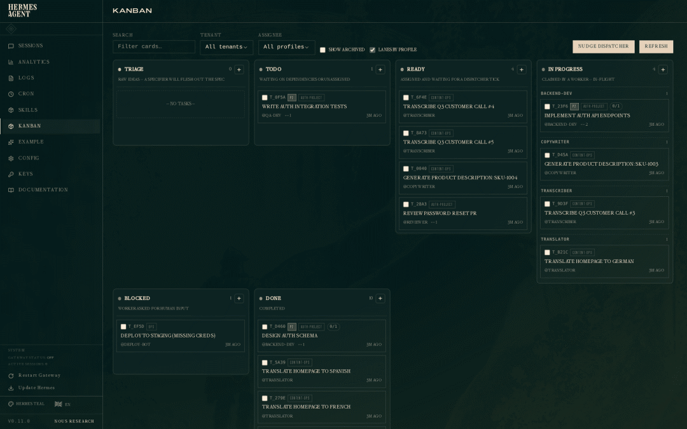
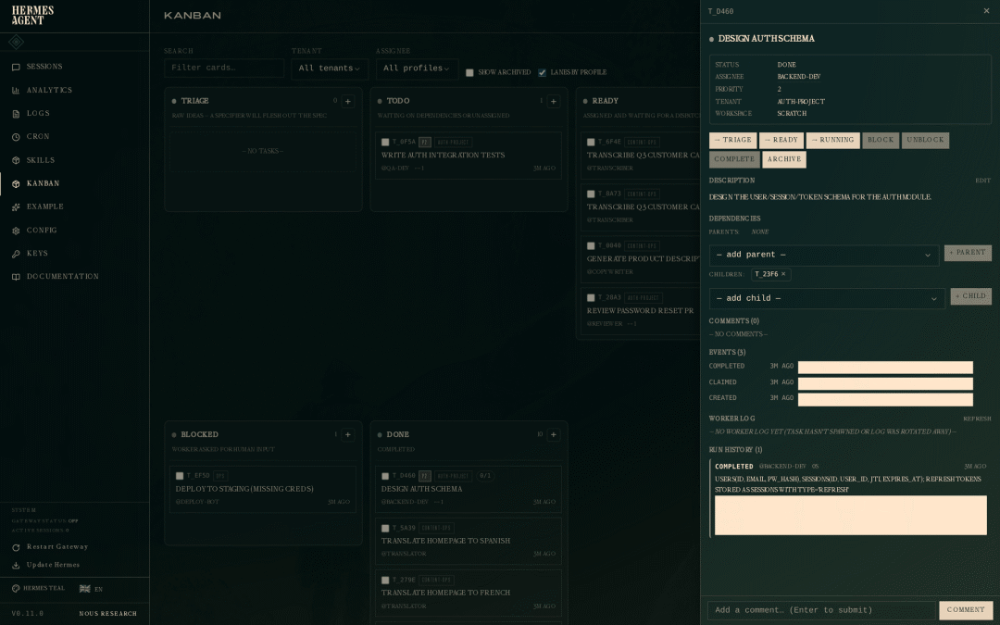
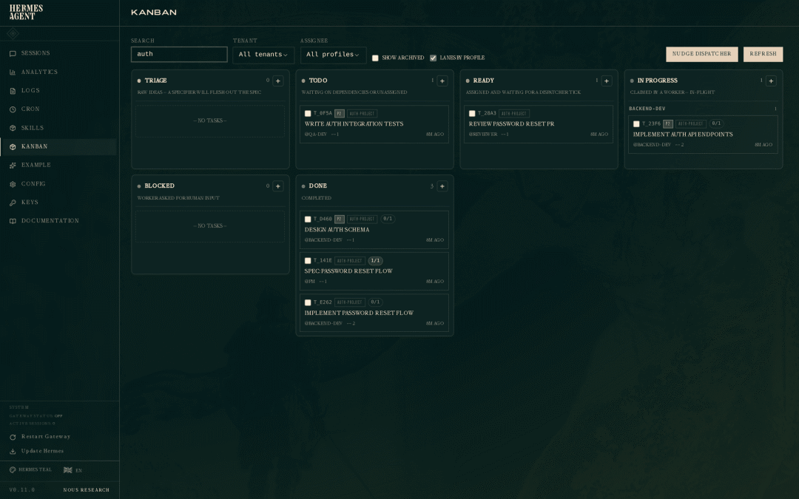
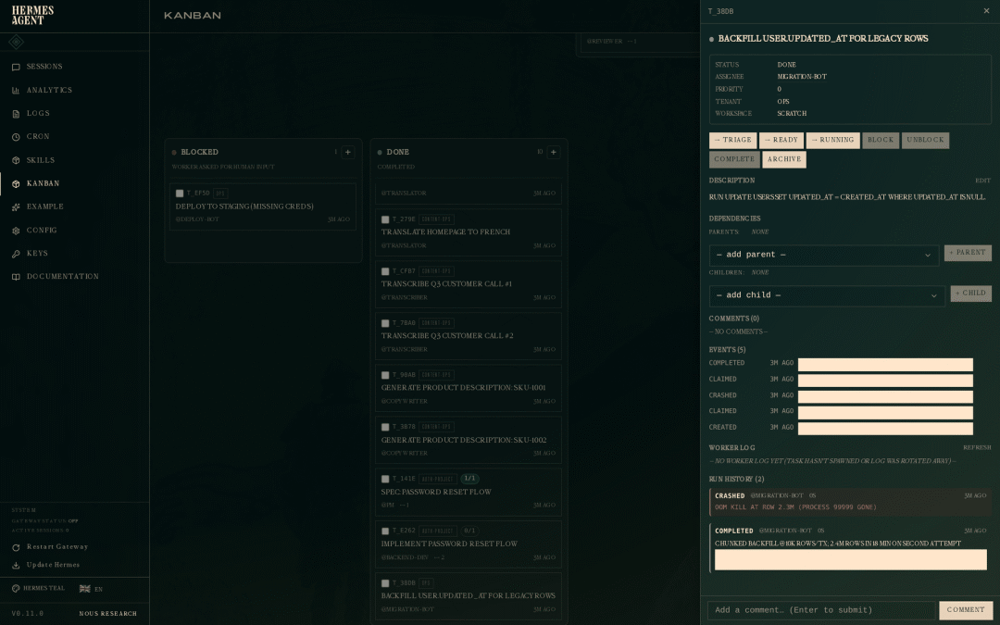
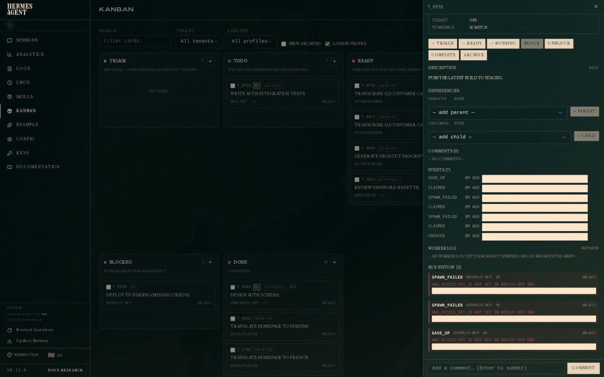
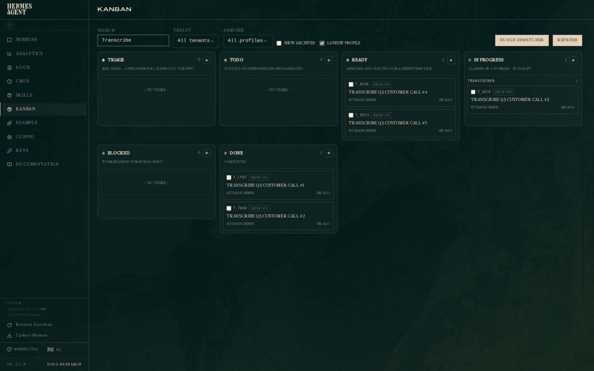

> 📎 来源: [i龙虾](https://mp.weixin.qq.com/s?__biz=MzI3MTk5OTc3Ng==&mid=2247484564&idx=1&sn=e410889004e5cd1efd309eb93f871001&chksm=ea8be11cf37b1ec201cff46626605b40fba89dd11d6e3477fe30a5758401d7a403b9ae9ef657&mpshare=1&scene=1&srcid=0504ip2NOs22sRUgdvo2UW7W&sharer_shareinfo=b79618f82d16339d8dc1ad7071d24cb2&sharer_shareinfo_first=b79618f82d16339d8dc1ad7071d24cb2) | 时间: 2026-05-04 20:45

---



今天凌晨1点30Nous Research在推特发了条消息，配了个视频。视频大概90多秒，讲的是 Hermes Agent 的新功能。

这个视频，是 Hermes Agent 自己规划、自己拍的。

不是那种"AI生成了个PPT"的意思。是真的让它自己拆任务、排依赖、找素材、剪片子，全程没有人工插手。一个Agent当导演，拆成一堆子任务，分给不同的Worker去干，最后拼出了一个完整的演示视频。

我反复看了两遍。不是因为视频多好看，是因为这个协作方式，跟以前完全不一样了。

## 以前的多Agent是怎么干活的

用过AI Agent框架的人都知道，”多Agent协作”这个概念炒了很久了。但实际用起来呢？

最常见的做法是：主Agent调用子Agent。主Agent觉得"嗯，这事儿该让翻译Agent干了"，于是spawn一个子Agent，等它干完，再spawn下一个。像极了项目经理站在工位后面盯着每个人干活。

主Agent得操心所有调度。谁先干谁后干，谁卡住了怎么处理，全靠主Agent判断。一旦任务复杂了，主Agent自己就成了瓶颈。更要命的是，子Agent一旦崩了，整个流程就卡住了，你得手动介入。

还有种做法是用subagent delegate，就是把任务扔给一个子agent，等它返回结果。简单场景够用，但你试试10个任务有依赖关系、3个worker同时在跑的情况？调度逻辑能把你写吐。

## Hermes v0.12.0 看板干了什么

这次更新的核心思路就一句话：把任务放到看板上，让Agent自己去抢。

不是你安排谁干什么，是任务上板，Agent自己认领。

具体怎么实现的呢？底层是一个本地的SQLite数据库。每个任务是一条记录，Agent认领任务的时候走的是原子事务——多个Agent同时抢一个任务，只有一个能抢到，不会出现重复执行的情况。

这个设计看着简单，但解决了分布式协作里最头疼的竞争问题。

## 看板长什么样



整个看板分六列：

Triage — 任务刚进来，还没想清楚具体干什么
 Todo — 想清楚了，但还在等别的任务完成
 Ready — 可以被认领了
 In Progress — 正在干
 Blocked — 卡住了，需要人帮忙
 Done — 搞定

最左边的Triage挺有意思。它不是一个简单的待办列表，而是一个让"规划者"先把任务描述、验收标准、依赖关系都写清楚的地方。任务在Triage阶段会被反复打磨，打磨好了才往下推。

这跟我以前用的感觉不一样。以前是人往里塞任务，这个是Agent自己往里塞，自己打磨，自己认领。

## 两个内置角色

系统内置了两个skill：orchestrator和worker。

Orchestrator负责拆任务。你给它一个大目标，比如"做一个关于Hermes Kanban的演示视频"，它会把这个目标拆成一堆具体任务：写脚本、找素材、录制、剪辑、配字幕……每个任务分配给特定的角色，比如researcher、engineer、reviewer。

Worker负责干活。每个Worker是一个独立的操作系统进程，它会看Ready队列里有没有自己能干的活，有就认领，干完了提交结果，然后继续看有没有下一个。

Orchestrator不用盯着每个Worker干活。它只需要把任务拆好、放到看板上就行了。Worker自己会来取。

## 依赖关系怎么处理

这是我觉得设计得最好的地方。

比如你要做一个功能，需要先设计数据库schema，再写API，再写测试。这三个任务有明确的先后依赖。

你在创建任务的时候用`--parent`参数指定依赖关系：

```
hermes kanban create "设计auth数据库schema" --assignee backend-devhermes kanban create "实现auth API" --assignee backend-dev --parent $SCHEMA_IDhermes kanban create "写测试" --assignee backend-dev --parent $API_ID
```



当第一个任务完成的时候，系统会自动把第二个任务从Todo提升到Ready。不是你手动去推，是依赖引擎自动做的。

而且完成任务的时候，你可以带上结构化的交接信息：

```
hermes kanban complete $SCHEMA_ID \    --summary "users(id, email, pw_hash), sessions(id, user_id, jti, expires_at)" \    --metadata '{"changed_files": ["schema.sql", "migrations/001.sql"]}'
```

下游的Worker在认领任务的时候，会自动拿到上游的summary和metadata。不用去翻聊天记录，不用去猜上游干了什么。交接信息就在上下文里。



## 崩溃了怎么办



实际跑多Agent的时候，Worker崩掉是家常便饭。OOM了、超时了、网络断了，什么情况都有。

Hermes的处理方式是：Dispatcher会定期检查每个Worker进程是否还活着（通过`kill(pid, 0)`探测）。发现某个Worker挂了，就把它的任务释放回Ready队列，下一个tick就会分配给新的Worker。

更狠的是熔断机制。如果一个任务连续失败3次，系统会自动把它锁到Blocked列，标记为"放弃"，然后通知你——通过Telegram、Discord或者Slack，你配置了哪个就通知哪个。

不会出现Agent在那里死循环反复重试同一个任务的情况。



## 协作模式不止一种



文档里提到支持9种协作模式：

扇出并行（fan-out）：一个大任务拆成多个小任务同时跑
 流水线（pipeline）：A做完传给B，B做完传给C
 投票仲裁（voting）：多个Agent各出一版，选最好的
 人工介入（human-in-the-loop）：关键节点等你审批

我最常用的是扇出并行。比如同时翻译5种语言，5个translator Worker同时在跑，谁先干完谁就去认领下一个任务。不用排队，不用等。

## 怎么开始用

安装和初始化都很简单：

```
hermes kanban inithermes dashboard
```

然后打开浏览器访问 `http://127.0.0.1:9119`，点左边的"Kanban"就能看到看板。

所有操作都有对应的CLI命令：

```
hermes kanban create "任务名" --assignee 某个角色hermes kanban claim 任务IDhermes kanban complete 任务ID --summary "干了什么"hermes kanban watch --kinds completed,gave_up,timed_out
```

最后那条`watch`命令是实时监听事件流的，终端里会滚动显示任务状态变化，挺有仪式感的。

网关会在 gave\_up 放弃事件发生时发送通知飞书/Telegram，这样你无需查看面板就能获知服务中断情况。

指定任务完成时，网关发送通知到指定消息渠道：

```
hermes kanban notify-subscribe  --platform telegram --chat-id
```

## 说点真话

这个看板还在摸索中，感觉这个东西解决的是一个很具体的问题：当你的AI Agent需要干的事情超过3步、而且步骤之间有依赖的时候，你怎么管理这些任务？

以前的办法是写脚本串起来，或者用subagent delegate一层层调。都行，但都不优雅。任务多了以后，调度逻辑本身就变成了一个新的Bug来源。

看板的做法是把调度逻辑从代码里抽出来，变成一个可视化的、可中断的、可重试的系统。你不需要写任何调度代码，只需要定义任务和依赖关系。

当然也有局限。目前看起来，这个系统更适合"任务型"的工作——有明确输入输出、可以拆成独立步骤的工作。如果你的需求是"帮我跟用户聊聊天"或者"帮我写一篇文章然后反复改"，看板可能不是最佳选择。

但如果你需要的是"同时跑5个翻译任务"、"先设计后实现再测试"、"多个Agent各自出方案然后选最好的"，这个东西会让你轻松很多。

Nous Research说这是他们"第一次深入探索多Agent协调与合作"。我觉得这个起点不错。至少比"主Agent在那盯着子Agent干活"强多了。

任务自己上板，Agent自己认领，干完了自动交接，卡住了自动通知你。

你要做的就是看看看板，偶尔解个锁。感觉还不错。

---

> Nous Research 官方推文：https://x.com/NousResearch/status/2050997692977844324
> 官方文档：https://hermes-agent.nousresearch.com/docs/user-guide/features/kanban-tutorial
