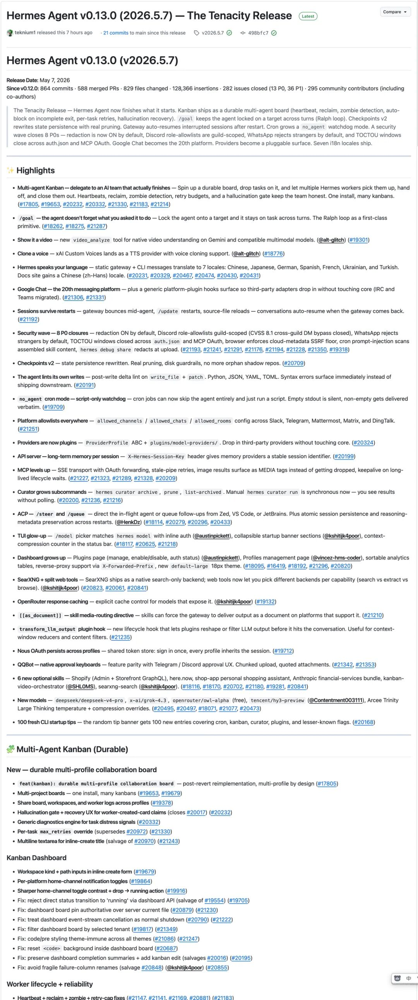
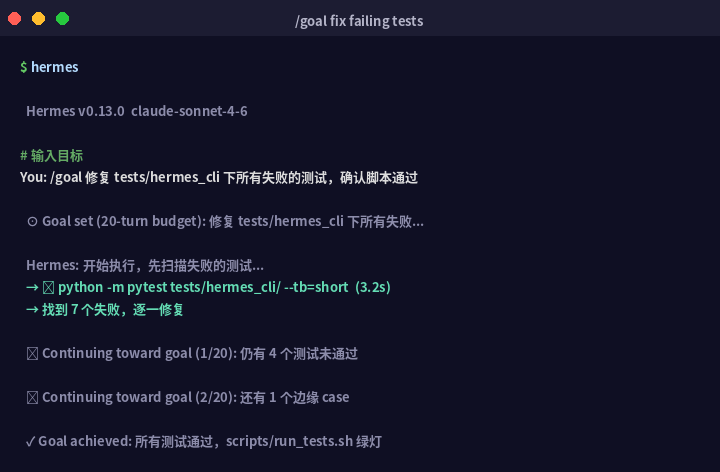

> 📎 来源: [量子智元](https://mp.weixin.qq.com/s?__biz=MzkwMTc4NTkwNg==&mid=2247488822&idx=1&sn=cfc776e94210a516f86b8e476fb6bd0e&chksm=c13d11fb35b8dd6804c037ccd9f10dc30356376b1d97399b15f9d919ee0e507b895894c7c217&mpshare=1&scene=1&srcid=0510dGOuSmbiNiUbkn8nqWoO&sharer_shareinfo=ef0c2e4f544dd2b1c6bfa1be42bcd7d9&sharer_shareinfo_first=ef0c2e4f544dd2b1c6bfa1be42bcd7d9) | 时间: 2026-05-10 15:03

---

有个朋友跟我说，他用 Hermes 改了一批脚本，但每次它修完一个 bug 就停下来，等他说"继续"，然后再修一个，又停。十几个 bug，他发了十几条"继续"。

这不是他用法的问题，也不是模型不够聪明。这是大多数 AI agent 的结构性局限：天生是一问一答的，完成一轮等你催。

Hermes v0.13.0 里有两个功能，都在往这个方向使劲，但解决的不是同一个问题。一个叫 **/goal**，一个叫 **Durable Multi-Agent Kanban**。

搞清楚这两个的区别，比单独学任何一个都重要。

## 01 | /goal 是什么，它解决了什么

/goal 是一个"持续目标机制"。你给 Hermes 设定一个目标之后，它不会像普通对话那样回答完就停，而是每轮结束后自动让一个轻量"判官"模型去评估：

> 目标完成了吗？
> 完成了 → 告诉你，停下来
> 没完成 → 自动续下一轮，不用你说"继续"

一直跑，直到达成目标、你主动暂停，或者触到默认的 20 轮上限。

判官的判断策略是偏保守的——只有当最后一轮的回复**明确确认目标已完成**，或者任务明显无法推进，它才会标 done。不确定就继续跑，不会因为 AI "以为自己做完了"就早停。如果判官出错（网络问题、返回格式异常），默认当 continue 处理——坏的判官不会让任务卡死，turn budget 才是最后的安全网。

### /goal 怎么用

最简单的用法，直接在 Hermes 聊天或交互式 CLI 里发：

|  |
| --- |
| /goal 修复 tests/hermes\_cli 目录下所有 failing tests，并确认 scripts/run\_tests.sh 通过 |

