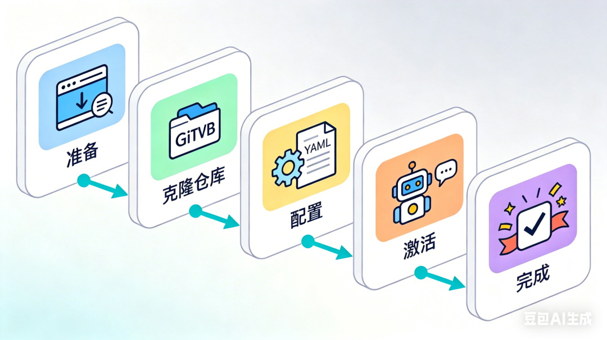

> 📎 来源: [智育派](https://mp.weixin.qq.com/s?__biz=MzYzMzAyNjg0Ng==&mid=2247484532&idx=1&sn=8404fe8b336ee3bc522392c6a9db7b04&chksm=f182e4cf9ffcd276a26d2c6b139f8f369d531d63a481304d57d38914fc4ed618707401af7221&mpshare=1&scene=1&srcid=0425cuYW1qXccLZ9NUTFY6xG&sharer_shareinfo=4c590a7fc31560465c54971cd49abadc&sharer_shareinfo_first=4c590a7fc31560465c54971cd49abadc) | 时间: 2026-04-25 19:32

---

一行命令完成安装，配置飞书机器人，5 分钟开启自进化 AI 助理之旅


---

## 一、为什么选择 Hermes？

3月24日原本只是想给一直在用的 OpenClaw 升个级，结果迎来的却是大量插件不兼容的疯狂报错。它陷入了长达数小时的彻底宕机——这是它上岗两个月来，遭遇的最大一次崩溃。后面的几次更新也都是一堆报错，而且openclaw 经常没反应了，你也不知道他是在干活还是已经休克了，使用体验急剧下降。

在这个时候关注到了另一个开源 AI 助理：**Hermes Agent**。在体验后我决定彻底切换阵营。

### Hermes vs OpenClaw：核心差异

| 特性 | OpenClaw | Hermes Agent |
| --- | --- | --- |
| **设计哲学** | 确定性工具箱 | 自主沙箱 |
| **上下文管理** | 重型背包（越用越慢） | 动态图书馆（按需加载） |
| **记忆系统** | 追加式文本文件 | SQLite+FTS5 全文检索 |
| **环境管理** | 隔离温室 | 原生系统沙箱 |
| **交互方式** | 黑盒等待 | 飞书卡片实时播报 |
| **学习能力** | 需要手动写 skill | 自动固化经验 |
| **GitHub 星标** | 增长放缓 | 48.7k（2 个月） |

Hermes Agent 是 Nous Research 开发的免费、MIT 许可的自主 AI 框架。

它的核心定位是：**一个会随着使用不断成长的「自进化 Agent」**。

---

## 二、极简安装步骤（5 分钟搞定）



### 步骤 1：一行命令安装核心引擎

打开终端，运行：

```
curl -fsSL https://raw.githubusercontent.com/NousResearch/hermes-agent/main/scripts/install.sh | bash
```

**安装程序会自动处理：**

**基础依赖**（约 1-2 分钟）：

• 检测并安装 Git（唯一先决条件）

• 安装 uv（快速 Python 包管理器）

• 安装 Python 3.11（通过 uv，无需 sudo）

• 安装 Node.js v22（用于浏览器自动化）

**Hermes 专属**（约 1-2 分钟）：

• 安装 ripgrep（快速文件搜索）

• 安装 ffmpeg（音频格式转换）

• 克隆仓库并设置虚拟环境

• 配置全局 

```
hermes
```

 命令

> **注意：**Git 是唯一需要先安装的依赖。

安装过程约 2-4 分钟，具体看网速。我昨天晚上装的时候大概 3 分钟左右。完成后会提示：

```
✅ Hermes Agent 安装完成📍 配置文件：~/.hermes/config.yaml📍 数据目录：~/.hermes/
```

> **注意：**Windows 用户需要先安装 WSL2，然后在 WSL2 内运行上述命令。

---

### 步骤 2：重新加载 Shell

安装完成后，重新加载你的 shell 配置：

```
# Bash 用户source ~/.bashrc# Zsh 用户source ~/.zshrc
```

验证安装：

```
hermes --version
```

看到版本号表示安装成功。

> **我踩的坑：**我第一次忘了 source，直接运行 hermes 说找不到命令，还以为安装失败了。

---

### 步骤 3：创建飞书机器人

Hermes 支持 15+ 消息平台，这里以飞书为例（国内最常用）。

如果之前在配置过小龙虾，也可以直接把配置好的机器人拿来用，如果没有就重新创建一个机器人。流程都一样，保存好机器人的App ID 和 App Secret，后面有用。

---

### 步骤 4：配置 Hermes

运行配置引导程序：

```
hermes setup
```

按提示依次输入以下信息：

#### 4.1 选择大模型提供商

```
? 选择你的 LLM 提供商和模型：❯ Anthropic / claude-sonnet-4-20250514  Anthropic / claude-opus-4-20250514  OpenAI / gpt-4o  Google / gemini-2.0-pro  阿里云百炼 / qwen-max
```

> **推荐：**我一直在用的阿里云百炼的 codingplan 套餐，对于日常使用来说完全够用

#### 4.2 输入 API Key

```
输入你的 API Key:
```

输入你的  API Key（或其他选择的模型）

#### 4.3 配置飞书鉴权信息

```
输入飞书 App ID:输入飞书 App Secret:选择连接模式：websocket（推荐，无需公网）
```

**推荐**：WebSocket 模式（无需公网端点）

所有配置会自动保存在 

```
~/.hermes/config.yaml
```

 中：

```
llm:  provider: anthropic  model: claude-sonnet-4-20250514  api_key: sk-ant-xxxxxmessaging:  feishu:    connection_mode: websocket    app_id: cli_xxxxx    app_secret: xxxxxxmemory:  enabled: true  max_size: 2200  # 记忆文件默认最大字符数，可按需调整skills:  auto_learn: true  # 自动学习新技能——这是"自进化"的核心group_sessions_per_user: true  # 群聊会话隔离
```

> **关键配置解读：**

> • 

> ```
> auto_learn: true
> ```

>  —— 让 Hermes 自动保存你的使用习惯，这是它"自进化"的基础

> • 

> ```
> max_size: 2200
> ```

>  —— 记忆文件默认限制，如果你的对话很长，可以适当调大

---

### 步骤 5：启动 Hermes

```
hermes gateway start
```

首次启动会进行环境检测，约 30 秒。看到以下提示表示成功：

```
✅ Hermes Gateway 已启动📍 等待飞书连接...
```

**后台运行**（可选）：

```
# 使用 nohupnohup hermes gateway start > ~/.hermes/gateway.log 2>&1 &# 或使用 systemd（Linux）sudo systemctl enable hermes-gatewaysudo systemctl start hermes-gateway
```

---

### 步骤 6：飞书配对

• 在飞书中搜索你创建的应用名称（如「Hermes 助理」）

• 点击「添加到群聊」或「私聊」

• 发送任意消息（如：

```
/help
```

）

• Hermes 会回复欢迎消息和配对码

• 在终端输入配对码完成绑定

> **提示：**配对码只在首次连接时需要，绑定后 Hermes 会记住你的飞书 ID。

**行为逻辑：**

• **私聊**：Hermes 会响应每一条消息

• **群聊**：只有当被 @ 时才会响应

• **共享群聊**：默认按用户隔离会话历史

---

## 三、从 OpenClaw 迁移（可选）

如果你之前使用 OpenClaw，Hermes 提供了一键迁移工具：

```
hermes migrate openclaw
```

**迁移内容：**

• 历史记忆（MEMORY.md）

• 配置文件（SOUL.md、IDENTITY.md 等）

• 已安装的 skills

**不迁移内容：**

• 定时任务（需要重新创建）

• 插件配置（架构不同）

> **我的迁移体验：**整体顺利，但定时任务确实需要重新创建。我让 Hermes 帮我重新设置了 3 个定时任务，大概花了 5 分钟。

---

## 四、开始使用

配对完成后，你可以在飞书中与 Hermes 对话了。

### 测试命令

```
/help          # 查看帮助/status        # 查看运行状态/memory        # 查看当前记忆/skills        # 查看已掌握技能/config        # 查看配置
```

### 真实对话记录

以下是我昨天晚上安装后的真实对话：

**我**：你好，第一次见面

**Hermes**：👋 你好！我是 Hermes，你的自进化 AI 助理。我已经记住了你的飞书账号，下次可以直接找我聊天。有什么我可以帮你的吗？

---

**我**：帮我创建一个定时任务，每天早上 8 点推送科技新闻

**Hermes**：✅ 已创建定时任务 

```
daily-tech-news
```

，每天早上 8 点执行。

我会从以下来源获取新闻：

• 36 氪

• 虎嗅

• Hacker News

需要我调整新闻源或推送时间吗？

> **感受：**这个响应速度比我预期的快，而且它会主动确认细节，不是机械地执行命令。

---

**我**：我过去一周都用你做了什么？

**Hermes**：🔍 正在检索你的历史会话...

过去 7 天，我们完成了以下任务：

• 创建了 3 个定时任务

• 分析了 5 篇公众号文章

• 生成了 2 个数据报表

需要我帮你总结具体内容吗？

⚠️ **关键洞察**：Hermes 能基于你的工作流和记忆分析自动化机会，但**需要用户确认后才创建技能**，不是完全自动。这是合理的设计——避免 AI 乱创建技能。

---

### 实测结论

| 功能 | 实测结果 | 说明 |
| --- | --- | --- |
| 记忆功能 | ✅ 正常 | 能记住用户偏好，存储到 SQLite |
| 技能建议 | ✅ 正常 | 能基于工作流分析自动化机会 |
| 自动创建 | ⚠️ 需确认 | 用户确认后才创建，不是完全自动 |


## 五、常见问题

### 问题 1：安装脚本报错  ``` git: command not found ```

**原因**：系统未安装 Git（唯一先决条件）

**解决**：

```
# macOSbrew install git# Ubuntu/Debiansudo apt-get update && sudo apt-get install -y git# CentOS/RHELsudo yum install -y git
```

然后重新运行安装命令。

---

### 问题 2：飞书机器人无响应

**检查清单**：

• 应用已发布（不是草稿状态）

• 已订阅 

```
im.message
```

 事件

• 机器人已添加到群聊或私聊

• App ID 和 App Secret 配置正确

• 连接模式选择正确（推荐 WebSocket）

---

### 问题 3：API Key 验证失败

**解决**：

• 检查 API Key 是否正确复制（无多余空格）

• 确认账户有足够额度

• 检查 API Key 权限是否包含所需模型

---

### 问题 4：记忆文件过大

Hermes 会自动管理记忆大小，限制在 2200 字符以内。

当超过限制时，它会自动整理过期内容，保留关键信息。

你也可以手动清理：

```
hermes memory cleanup
```

---

### 问题 5：网关启动失败

**查看日志**：

```
# 查看实时日志hermes gateway logs# 或查看日志文件cat ~/.hermes/gateway.log
```

**常见错误**：

• 端口被占用：修改配置中的端口号

• API Key 无效：重新配置

• 飞书凭证错误：检查 App ID/Secret

---

## 六、避坑指南

### 坑 1：Windows 用户必须用 WSL2

Hermes 不支持原生 Windows，必须安装 WSL2：

```
# Windows PowerShell（管理员）wsl --install
```

重启后在 WSL2 中运行安装命令。

---

### 坑 2：飞书应用必须发布

很多用户卡在「应用创建成功但无法使用」，原因是**没有发布**。

创建应用后，必须点击「版本管理与发布」→「发布」，等待审核通过。

---

### 坑 3：WebSocket 模式无需公网

如果你是在本地电脑或内网服务器运行，**一定选择 WebSocket 模式**。

Webhook 模式需要公网 URL 和 HTTPS 证书，不适合本地部署。

---

### 坑 4：定时任务需要重新创建

从 OpenClaw 迁移时，定时任务无法直接迁移。

需要让 Hermes 在新系统中单独帮你重新创建一次：

```
请帮我创建一个定时任务：每天早上 8 点推送科技新闻
```

---

### 坑 5：群聊需要 @ 才会响应

在群聊中，Hermes 默认只有被 @ 时才会响应。

如果需要改变这个行为，修改配置文件：

```
respond_without_mention: true  # 不@也响应（不推荐）
```

---

## 七、资源汇总

### 官方文档

• GitHub：https://github.com/NousResearch/hermes-agent

• 中文文档：https://hermes-doc.aigc.green

• Discord 社区：https://discord.gg/NousResearch

### 推荐工具

• 飞书开放平台：https://open.feishu.cn

• Claude API：https://console.anthropic.com

• 阿里云百炼：https://bailian.console.aliyun.com

---

## 结语

工具的迭代，本质上是个人系统的升级。我们选择工具，到底是在选择什么？

是选择一个只会服从的工具，还是选择一个能理解你、适应你、甚至超越你预期的伙伴？

是选择确定性的掌控感，还是选择可能性的惊喜？

接下来，就看你如何用它创造价值了。

或者，让它帮你发现，有哪些价值是你原本没想到可以创造的。

---


