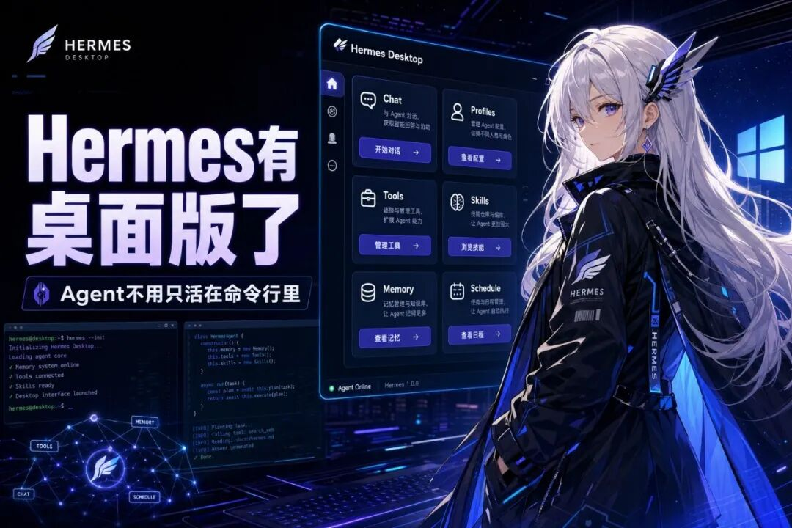
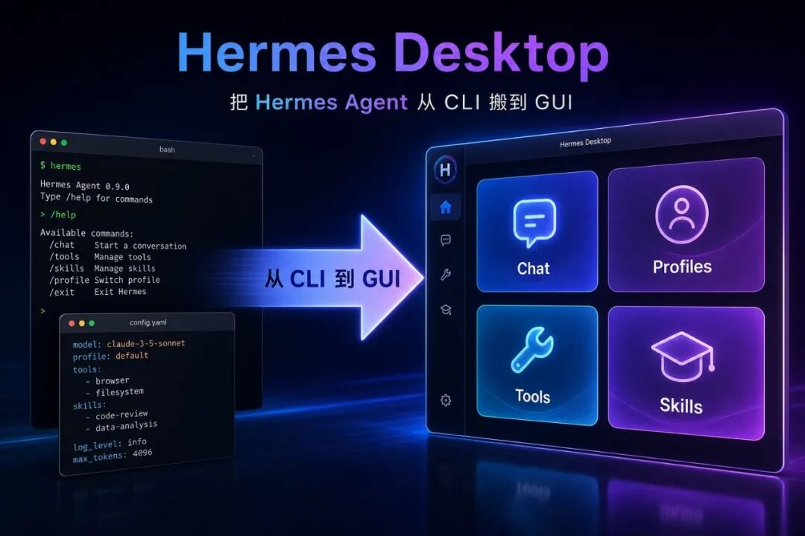
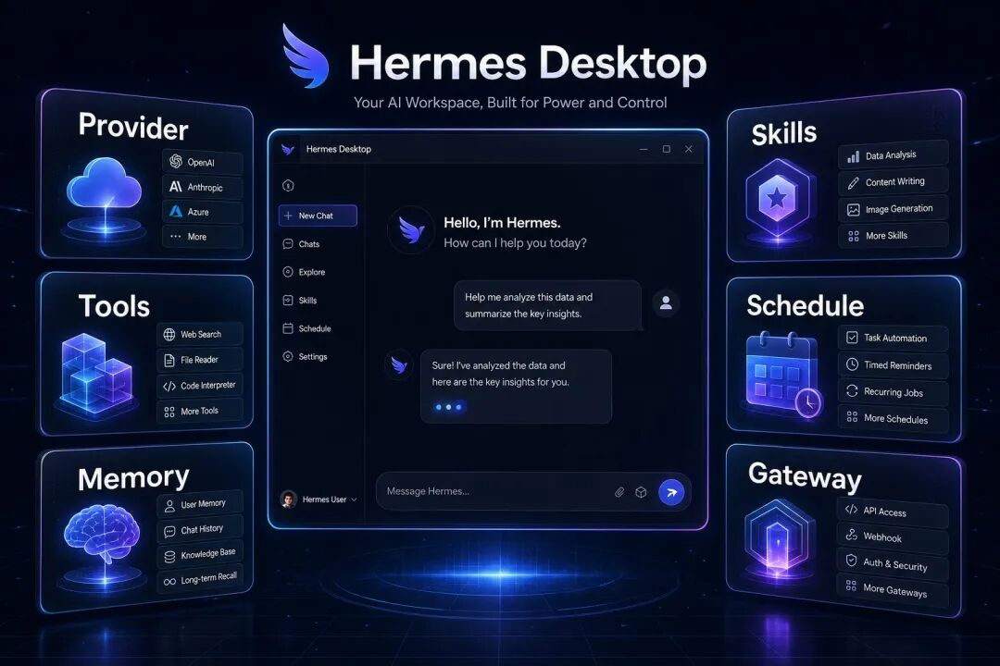
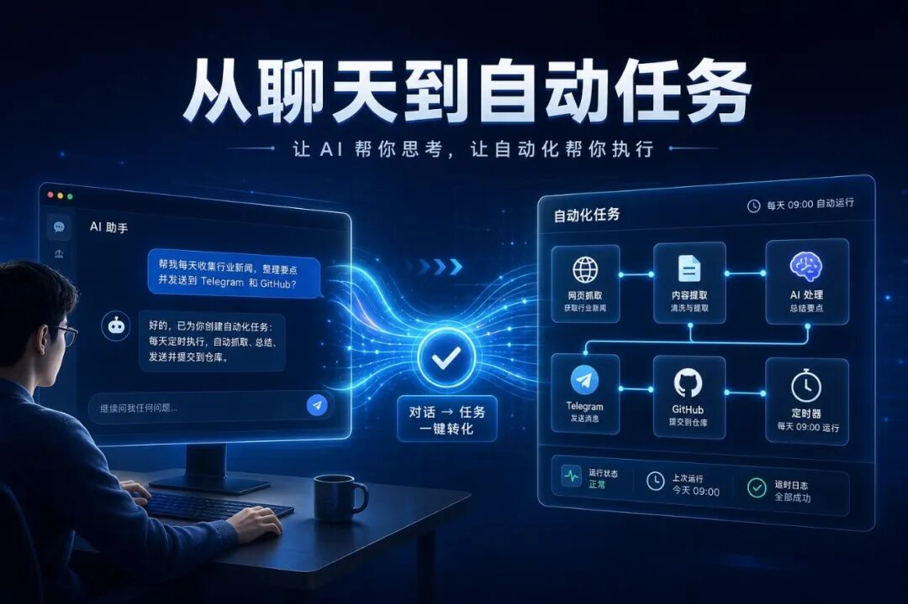
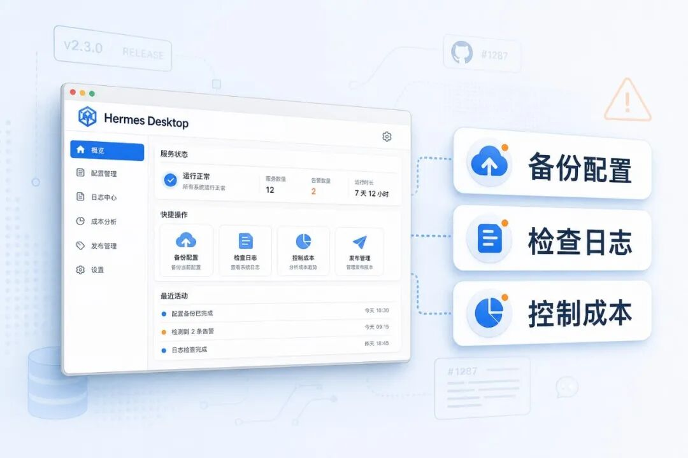
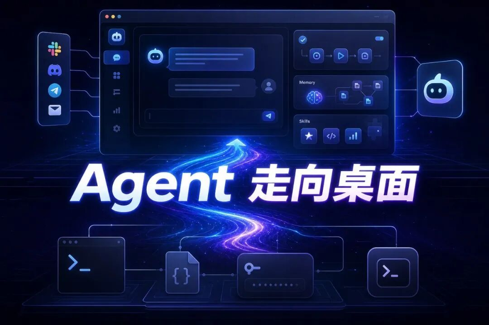

> 📎 来源: [AI 趋势方向](https://mp.weixin.qq.com/s?__biz=MzU5MTkyMzY4NQ==&mid=2247483844&idx=1&sn=4aeb1c3cb1eae74295209a736f239c24&chksm=ff912fd0aed45ac3ec6c6b9bd8f3be805eca0a0bd1b38efc302cdc1daf16ccd248e0f3f4ba4c&mpshare=1&scene=1&srcid=05174TI51Cqnb2wnkCcuiDVc&sharer_shareinfo=dd7757b876cc0b4f37511f955a7f1b3e&sharer_shareinfo_first=dd7757b876cc0b4f37511f955a7f1b3e) | 时间: 2026-05-17 16:31

---

阅读全文预计耗时 6 分钟。

# 几秒钟速读版

# 这篇讲什么：

一个叫Hermes Desktop的开源项目，把 Hermes Agent 做成了桌面客户端。

# 为什么要看：

Hermes Agent 本身很强，但命令行、配置文件、模型 Key、工具集、记忆、skills、定时任务这些东西，对普通用户并不友好。Hermes Desktop 想解决的就是这个问题：把这些能力放进一个桌面 App 里。

# 你能记住什么：

- Hermes Desktop 是 Hermes Agent 的桌面伴侣，不是另一个普通聊天软件。
- 它支持本地 Hermes，也支持远程 Hermes API。
- 它把安装、模型配置、聊天、profiles、memory、skills、tools、定时任务这些都做进了 GUI。
- 项目还在 active development，功能变化快，也可能有坑。
- 这类工具的意义不只是“好看”，而是降低 AI Agent 的使用门槛。

# 适合谁：

- 想用 Hermes Agent，但不想天天改配置文件的人。
- 想把 AI Agent 用在日常工作流里的开发者。
- 想研究下一代个人 AI 助手形态的人。
- 不适合只想找一个普通 AI 聊天窗口的人。

---

# 完整正文版

过去用 Hermes Agent，有一个很现实的问题：

它强，但不够“顺手”。

不是能力不够，而是入口偏工程化。

你要装 CLI，要配 provider，要管 API key，要理解 profile、memory、skills、toolsets、gateway、cron job。对开发者来说，这些东西可以接受。对普通用户来说，第一步就已经劝退一半。

所以 Hermes Desktop 这个项目值得看。

它不是重新造一个 AI 聊天软件。

它更像是给 Hermes Agent 套了一层桌面操作台。

# 项目地址：

https://github.com/fathah/hermes-desktop

截至我查项目时，它是一个公开 GitHub 仓库，主语言是 TypeScript，MIT License。仓库介绍很直接：

Desktop Companion for Hermes Agent。

# 翻成人话：

给 Hermes Agent 用的桌面伴侣。

不是替代 Hermes，而是帮你安装、配置、管理、聊天。

---

# 它到底解决什么问题？

Hermes Agent 本身的定位，是一个带工具调用、多平台消息、记忆系统、skills、自动任务能力的 AI assistant。

问题在于，这些能力越多，配置就越复杂。

普通用户看到的是：

模型 provider 怎么配？

OpenRouter、Anthropic、OpenAI、Gemini、Grok、Qwen、MiniMax、本地模型，选哪个？

API key 放哪里？

profile 是什么？

memory 怎么看？

skills 怎么装？

工具集怎么开关？

定时任务怎么设？

聊天记录怎么搜？

Telegram、Discord 网关怎么接？

这些不是智商问题，是产品入口问题。

CLI 适合高手。

桌面客户端适合把能力扩散出去。

Hermes Desktop 要做的事，就是把 Hermes Agent 的使用链路从“会命令行的人才能玩”，往“普通用户也能配置和使用”推一步。

这个方向很关键。

AI Agent 要真正普及，不能一直停留在命令行和配置文件里。最后一定会有一层桌面入口、移动入口、浏览器入口，把复杂能力包起来。

Hermes Desktop 就是在补这层入口。

---

# 它现在能做什么？

从项目说明和仓库信息看，Hermes Desktop 目前已经不只是一个壳。

它覆盖了 Hermes Agent 日常使用里很多关键环节。

第一，首次安装引导。

它会帮你走安装流程，包括进度显示和依赖处理。对新手来说，这一步很重要。很多工具不是死在功能上，而是死在安装第一步。

第二，支持本地和远程后端。

本地模式下，它可以连接 127.0.0.1:8642 上的 Hermes。

远程模式下，可以填 Hermes API server 的 URL 和 API key。

这意味着它不只适合单机用户，也适合有服务器、有多设备需求的人。

第三，多模型 provider 管理。

它列出的 provider 很多，包括 OpenRouter、Anthropic、OpenAI、Google Gemini、xAI Grok、Nous Portal、Qwen、MiniMax、Hugging Face、Groq，以及本地 OpenAI-compatible endpoints。

这点对 Hermes 很重要。

因为 Agent 的核心不是“只接一个模型”，而是你可以根据任务换模型，甚至接本地模型。

第四，流式聊天界面。

它支持 SSE streaming、工具执行进度、Markdown 渲染、代码高亮。

这听起来像普通聊天软件的基础功能，但对 Agent 来说，工具执行过程可见很重要。你要知道它现在是在搜网页、读文件、跑命令，还是卡住了。

第五，token 和费用显示。

聊天底部可以看 prompt / completion token 和成本，也有 /usage 命令。

这点很实用。

Agent 一旦开始用工具、开长上下文、跑自动任务，token 消耗会比普通聊天高。没有成本显示，很容易用着用着就不知道钱花到哪里去了。

---

# 真正有意思的是这些管理能力

如果 Hermes Desktop 只是做一个聊天窗口，那没什么稀奇。

真正有价值的是它把 Hermes Agent 的“系统能力”做进了桌面界面。

比如 profile switching。

Hermes 可以有不同 profile，每个 profile 可以有自己的配置、记忆、工具、人格和工作流。桌面版支持创建、删除、切换这些隔离环境。

这对多机器人协同很有用。

比如一个 profile 负责内容，一个负责量化，一个负责股票，一个负责加密风控。命令行当然也能做，但桌面管理会直观很多。

再比如 memory system。

它支持查看和编辑 memory entries，也能看 user profile memory、容量追踪，并列出了 Honcho、Hindsight、Mem0、RetainDB、Supermemory、ByteRover 等 memory providers。

记忆不是小功能。

Agent 如果没有长期记忆，每次都是临时工。

但记忆如果不能管理，就会变成黑箱。

能看、能改、能知道容量，才有可能长期使用。

还有 skills。

Hermes 的 skills 本质上是可复用工作流和专业能力包。桌面版把 skills 做成可视化入口，对普通用户很重要。

因为用户不应该每次都重新教 Agent 怎么做事。

好的工作流应该沉淀成 skill，下次直接调用。

---

# 它还把自动化入口也放进来了

Hermes Desktop 里还有 scheduled tasks，也就是定时任务。

它支持 cron builder，并且有多个 delivery targets。

这类功能看起来不如聊天窗口性感，但对 Agent 来说非常核心。

普通聊天是你问一句，它答一句。

Agent 真正有用的时候，往往是它能定时做事：

每天早上抓新闻。

每隔一小时查数据。

每天收盘后总结市场。

定期检查某个 GitHub 项目更新。

发现异常后发 Telegram。

把内容草稿写好，送到指定渠道。

这才是 Agent 和 chatbot 的分界线。

一个只是回答问题。

另一个可以进入你的工作流。

Hermes Desktop 把 scheduled tasks 做进桌面端，说明它想做的不只是“更好看的聊天界面”，而是完整的个人自动化控制台。

---

# 还有 messaging gateways

项目说明里提到，它支持多个 messaging gateways。

这也符合 Hermes Agent 的方向。

Agent 不应该只困在一个 App 里。

它应该能从 Telegram、Discord、网页、本地终端、定时任务里接收指令，再把结果发回对应渠道。

你可以把它想成一个个人 AI 操作系统的雏形：

桌面端负责配置和管理。

CLI 负责底层能力。

消息网关负责多入口交互。

工具集负责执行任务。

memory 和 skills 负责长期学习。

cron 负责主动运行。

如果这些链路都跑通，Agent 才不只是“我打开一个窗口问它问题”。

它会更像一个常驻助手。

---

# 安装方式也更接近普通软件了

Hermes Desktop 已经提供多平台安装包。

Windows 是 .exe 安装器。

macOS 是 .dmg。

Linux 有 .AppImage、.deb、.rpm。

Windows 还提到可以通过 winget：

winget install NousResearch.HermesDesktop

但这里要注意，项目说明里也写了，winget 需要等 manifest 被 microsoft/winget-pkgs 接受。没接受之前，还是从 Releases 下载 .exe。

还有几个现实提醒。

Windows 安装器目前没有 code-signed，所以 Windows SmartScreen 首次启动可能会警告。处理方式是点 “More info”，再点 “Run anyway”。

macOS 版本也没有 code-signed 或 notarized。安装后可能需要执行：

xattr -cr "/Applications/Hermes Agent.app"

或者右键打开。

Fedora 的 .rpm 也没有 GPG signed。如果系统强制检查签名，可能要加 --nogpgcheck。

这些不是大问题，但必须提前说清楚。

开源早期项目常见这种情况。

能用，不代表体验已经像成熟商业软件。

---

# 版本和成熟度：别把它当最终形态

我查到 GitHub latest release 是v0.3.5，发布时间是 2026 年 5 月 6 日。

主分支 package.json 里版本已经到0.3.6。

这说明项目还在快速迭代。

最新 release v0.3.5 的变更不算大，主要包括：

- 增加巴西葡萄牙语 pt-BR 本地化。
- 修复 skills 卸载参数，移除了 uninstall args 里的 --yes。

这类更新说明什么？

说明项目已经开始处理边角体验和国际化，但仍然是早期阶段。

仓库 README 里也明确写了：

项目处于 active development。

功能可能变化。

一些东西可能会坏。

有问题可以开 issue。

这句话要认真看。

如果你是尝鲜、研究、搭自己的工作流，可以试。

如果你要拿它做生产级自动化中枢，那就要多一层验证：备份配置，看日志，控制 token 消耗，定时任务别一上来开太猛。

---

# 这东西适合谁？

第一类，已经在用 Hermes Agent 的人。

你会直接感受到它的价值。

原来很多要进配置文件、命令行、路径里处理的事，现在有机会放到一个桌面入口里。

第二类，想用 Agent 但被安装配置劝退的人。

Hermes Desktop 最大的意义就是降低门槛。你不一定要一开始就懂所有概念，可以先把 App 跑起来，再慢慢理解 provider、tools、memory、skills。

第三类，做自媒体、量化、信息监控、自动化工作流的人。

这类人最需要的不是一个“会聊天的 AI”，而是一个能接工具、能记住偏好、能定时跑、能把结果发到不同平台的助手。

第四类，想研究个人 AI 助手下一步形态的人。

Hermes Desktop 是一个很好的观察对象。因为它不是单点功能，而是在把 Hermes Agent 的底层能力往普通用户界面上搬。

# 不太适合谁？

如果你只想要一个最稳定、最省心、完全不用折腾的 AI 聊天软件，那它现在不一定适合你。

它更像早期开发者工具，不是最终消费级产品。

---

# 我怎么看

Hermes Desktop 这类项目的价值，不在于“桌面版”三个字。

真正的价值是：

AI Agent 正在从命令行工具，往普通用户能操作的产品形态迁移。

过去一年，很多 Agent 项目都卡在同一个地方：

能力很强。

配置很复杂。

会用的人很兴奋。

不会用的人根本进不来。

这不是小问题。

任何技术要扩散，都要经历一次“入口简化”。

数据库有图形化客户端。

服务器有控制面板。

Git 有 GitHub Desktop、SourceTree。

AI Agent 也会走这条路。

Hermes Desktop 做的，就是把 Hermes Agent 的入口往前推。

它未必完美，也不会马上变成主流工具。但方向是对的。

未来真正有竞争力的个人 AI 助手，大概率不是一个单独聊天框，而是一套组合：

模型选择。

工具调用。

长期记忆。

技能沉淀。

定时任务。

多平台消息入口。

本地文件和浏览器操作。

成本追踪。

可视化管理。

Hermes Agent 已经有不少底层能力。

Hermes Desktop 是把这些能力变得更容易触达。

这就是它值得写的原因。

---

# 你可以怎么试

如果你想试，路径很简单：

先去项目 Releases 页面：

https://github.com/fathah/hermes-desktop/releases/

按系统下载对应安装包：

- Windows：.exe
- macOS：.dmg
- Linux：.AppImage / .deb / .rpm

Windows 用户如果看到 SmartScreen 提醒，不用慌。当前安装器没签名，早期开源项目常见。确认来源是 GitHub Releases 后，再选择是否继续。

装完后，第一次启动重点看这几件事：

1. 选本地 Hermes 还是远程 Hermes。
2. 配置模型 provider 和 API key。
3. 看 chat 是否能正常 streaming。
4. 看 tools、skills、memory 是否能打开。
5. 如果要用定时任务，先用低频小任务测试。
6. 如果要接 Telegram / Discord，先确认 gateway 日志和返回结果。

别一上来就把它当生产系统。

先跑通最小链路。

能聊天。

能调用工具。

能看到 token。

能切 profile。

能管理 memory。

能跑一个简单 schedule。

这些都通了，再慢慢加复杂工作流。

---

# 最后说一句

Hermes Desktop 不是“又一个 AI 客户端”。

如果只看聊天窗口，它没那么稀奇。

但如果你把它放在 Hermes Agent 这条线上看，它的意义就清楚了：

它在把一个偏工程化的 Agent 系统，变成更接近普通软件的形态。

这一步很关键。

因为未来很多人用 AI Agent，不会从命令行开始。

他们会从一个桌面 App、一个 Telegram bot、一个浏览器入口开始。

底层复杂可以继续复杂。

但入口必须越来越简单。

Hermes Desktop 就是在做这件事。

项目还早，有坑正常。

但方向值得跟。

评论区可以聊聊：

你更想要 AI Agent 保持命令行形态，还是希望它变成桌面 App？

如果 Hermes Desktop 后面继续完善，你最想让它先做好哪个功能：安装、模型配置、skills、定时任务，还是多平台消息网关？
