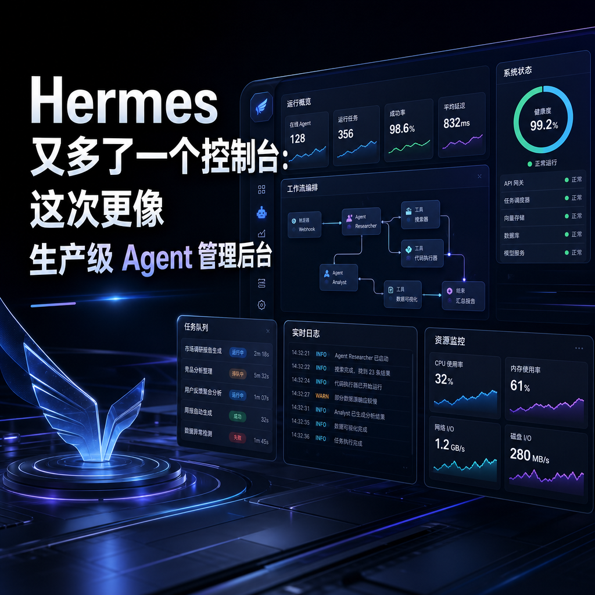

> 📎 来源: [AI 趋势方向](https://mp.weixin.qq.com/s?__biz=MzU5MTkyMzY4NQ==&mid=2247483692&idx=1&sn=ecd66967aa48e51fd1a365d0d1322040&chksm=ffb6cffa2ddbc953623c51bffa43981db2b4ec67bca0956a7cd79f2c9afba95cf4fdfd60d730&mpshare=1&scene=1&srcid=05040iYwAvDBOJ6yYMyT5vCL&sharer_shareinfo=cb1d24298f2279352a45b1ba13b29b96&sharer_shareinfo_first=cb1d24298f2279352a45b1ba13b29b96) | 时间: 2026-05-04 11:55

---

Hermes 又多了一个控制台：不只是 WebUI，而是偏生产级的 Agent 管理后台

如果你已经开始用 Hermes Agent，会慢慢遇到一个问题：

一个 Agent 好管理，多个 Agent 就开始乱。

尤其当你有多个 profile、多条 gateway、多个会话、定时任务、memory、skills、文件、token 成本、团队成员权限时，纯命令行会越来越吃力。

最近看到一个项目：

hermes-control-interface (https://github.com/xaspx/hermes-control-interface)

它不是简单给 Hermes 套一个聊天网页。

它更像是：

给 Hermes Agent 做了一个偏生产级的控制后台。

项目名叫：

Hermes Control Interface

简称 HCI。

当前 README 标注版本是：

v3.5.0

技术栈是：

Vanilla JS + Vite

Node.js

Express

WebSocket

xterm.js

一句话说清楚：

如果 Hermes WebUI 更像“个人浏览器工作台”，那 HCI 更像“多 Agent 管理后台”。

---

# 一、HCI 到底是什么？

Hermes Control Interface 是一个自托管 Web Dashboard。

它围绕 Hermes Agent 做了这些事：

聊天

终端

文件

会话

定时任务

Token 成本分析

多 Agent Gateway 管理

团队访问权限

系统维护

安全审计

而且这些都放在一个 Web 控制台里，并且有密码门禁。

它的定位不是“轻量聊天界面”。

更准确的说，它是：

Hermes Agent 运维控制台

+

多 Agent 管理后台

+

团队协作权限系统

+

浏览器终端

这就和普通 WebUI 拉开差距了。

---

# 二、为什么这个项目值得看？

因为 Agent 真正进入工作流以后，问题会从“能不能对话”变成：

能不能管理多个 Agent？

谁能访问？

谁能执行命令？

谁能改配置？

谁能删 session？

谁能管理 cron？

出问题怎么排查？

成本烧在哪里？

工具调用有没有失败？

很多 Agent 项目卡在这一步。

模型能力可以很强，但管理层很薄。

HCI 的价值在于，它不是只解决聊天体验，而是开始补 Hermes 的“控制面”。

也就是：

Agent 不只是会干活，还要能被管理、审计、授权和维护。

这对长期使用非常重要。

---

# 三、核心功能拆解

HCI 的功能很多，可以先按这棵树理解：

Hermes Control Interface

├── Chat 聊天与会话

├── Agents 多 Agent 管理

├── Gateway 管理

├── Usage Token 成本分析

├── Skills 技能中心

├── Files 文件浏览器

├── Terminal 浏览器终端

├── Cron 定时任务

├── Memory 记忆管理

├── Config 配置编辑

├── Maintenance 系统维护

└── RBAC 团队权限与安全审计

下面挑最关键的讲。

---

# 1. Chat：走 Gateway API，不只是 CLI 包装

HCI 的聊天界面在 v3.4.0 做过大改。

它从原来的 CLI subprocess，改成了 Gateway API：

/v1/responses

支持：

- 实时 SSE streaming
- tool call cards
- session resume
- stop button
- 多 profile
- gateway down 时自动 fallback 到 CLI

这个很关键。

因为很多 WebUI 只是把 CLI 输出包一层网页。

那种能用，但体验和稳定性有限。

HCI 走 Gateway API 后，聊天事件更结构化，工具调用也更容易做成卡片化展示。

---

# Tool Call Cards

每个工具调用都会显示成可折叠卡片：

工具名

状态 running / success / error

执行耗时

JSON 输入

JSON 输出

默认折叠，避免聊天区被工具日志刷屏。

这个设计很适合 Hermes。

因为 Hermes Agent 的核心能力之一就是工具调用。

如果工具调用不可视化，你很难判断它到底干了什么。

---

# Session Sidebar

HCI 也支持历史会话侧边栏：

- 查看过去 session
- 一键恢复
- 新建会话
- 显示当前模型标签
- rename session
- delete session
- export transcript

这解决的是长期使用后的会话管理问题。

Agent 用一天没问题，用一个月以后，session 管理就很重要。

---

# 2. Agents：多 Profile 管理，这是重点

HCI 比较有特色的一点是：

它不是只管一个 Agent。

它可以管理多个 Hermes profiles。

包括：

- 列出所有 profile
- 显示运行状态
- 显示当前模型
- 创建新 profile
- clone profile
- delete profile
- 设置默认 profile
- start / stop / restart gateway
- 查看 gateway log

这很适合 Hermes 的多机器人使用方式。

比如你可以有：

主控 Agent

内容 Agent

量化 Agent

代码 Agent

研究 Agent

运维 Agent

每个 Agent 用不同 profile、不同模型、不同 memory、不同 skill。

如果没有可视化管理，多 profile 很快会乱。

HCI 的 Agents 页面本质上是在做：

Hermes 多 Agent 控制面板。

---

# 3. Gateway：能启动、停止、重启，还能看实时日志

Gateway 管理是 HCI 的核心能力之一。

每个 Agent 可以进入详情页，看 Gateway tab。

支持：

- start gateway
- stop gateway
- restart gateway
- 实时日志流
- WebSocket log stream
- systemd service management
- gateway 配置面板

这对线上运行非常有用。

因为 Agent 一旦接 Telegram、Discord、API、定时任务，就不是一次性脚本了。

它会变成长期运行服务。

长期运行就必须要有：

状态

日志

重启

配置

错误排查

HCI 把这些放进浏览器里，减少了频繁 SSH 的需求。

---

# 4. Usage & Analytics：终于能看 Token 钱花哪了

Agent 长期使用后，另一个问题是成本。

HCI 提供 Usage & Analytics 页面，能看：

- Today / 7d / 30d / 90d

- 按 Agent 过滤

- 总 sessions

- 总 messages

- 总 tokens

- estimated cost

- active hours

- 按模型统计

- 按平台统计

- Top tools

- 工具调用成功率

这块非常实用。

很多人用 Agent，最开始只关心“它能不能干活”。

后面一定会关心：

哪个模型最烧钱？

哪个 Agent 用量最大？

Telegram 来的任务多，还是 CLI 多？

哪些工具最常被调用？

有没有工具失败率很高？

这些数据如果不做面板，只靠日志很难看。

HCI 把 token analytics 做出来，说明它已经在往“生产管理”方向走。

---

# 5. Skills Marketplace：技能中心可视化

HCI 提供 Skills Hub。

可以：

- 按分类浏览 skills
- 查看 skill 名称和描述
- 区分 builtin / local
- 查看 trust level
- 搜索和过滤
- 安装新 skill
- 检查更新
- 卸载 skill

Hermes 是 skill 驱动型 Agent。

所以 skill 管理体验很关键。

当 skill 数量少时，文件夹管理还能接受。

当 skill 越来越多，就需要技能中心。

HCI 在这块的价值是：

把 Hermes 的技能系统从“文件管理”推进到“插件市场式管理”。

---

# 6. File Explorer：带安全边界的文件编辑器

HCI 有文件浏览器。

功能包括：

- 左侧目录树
- 右侧文本编辑器
- 语法高亮
- 保存回磁盘
- 多 root 配置
- 路径限制在 ~/.hermes
- 防路径穿越攻击

文件浏览器看似普通，但对 Agent 很重要。

因为 Agent 经常会改：

config.yaml

MEMORY.md

SKILL.md

cron 配置

日志文件

会话文件

项目文件

如果没有文件视图，用户只能靠命令行查。

HCI 让这些文件能在浏览器里看和改。

不过这里也有一个重要提醒：

能改文件意味着风险也更高。

所以权限、路径限制、防 traversal 都很重要。

README 里明确提到做了这些安全处理。

---

# 7. Terminal：浏览器里的真终端

HCI 支持浏览器终端。

技术上是：

node-pty + xterm.js + WebSocket

也就是完整 PTY，不只是执行单条命令。

支持：

- 浏览器里跑 shell
- 移动端触控按钮
- fullscreen
- Ctrl+C 清理流程
- 30 commands/minute per IP rate limit

这个功能很强，也很危险。

强在：

你不用 SSH，也可以直接在浏览器里处理服务器问题。

危险在：

浏览器终端如果权限管不好，就等于把服务器控制权暴露出来。

所以 HCI 同时做了 RBAC、登录、CSRF、rate limit，这些不是摆设。

---

# 8. Maintenance：像一个小型运维后台

HCI 的 Maintenance 页面功能很多：

- Doctor 诊断
- Dump debug summary
- Update Hermes agent
- Backup 下载 Hermes 数据 zip
- Import 恢复备份
- HCI Restart
- Users 用户管理
- Auth API key 管理
- Audit 活动日志

这里最值得注意的是：

Backup / Import

Doctor

Audit

Users

HCI Restart

这些都不是普通聊天 WebUI 会优先做的功能。

它说明 HCI 的目标用户不是只在本机玩玩，而是偏向：

自托管

长期运行

多人访问

远程维护

---

# 四、安全：HCI 的 README 写得很重

HCI 最值得认真看的部分之一，是安全设计。

README 里强调它做了 Security Hardening。

包括：

Multi-user RBAC

bcrypt password hashing

CSRF tokens

Secure cookie

WebSocket origin verification

Input sanitization

Path traversal prevention

Rate limiting

XSS protection

Admin gate

Audit log

它还提到：

- 20 permissions
- 3 roles：admin / viewer / custom
- 21 个 mutating endpoints 加 CSRF
- terminal exec 限速
- XSS error handlers 全部 escapeHtml
- command injection 修复
- hardcoded API key 移除
- dynamic CORS origins

这说明作者知道自己在做一个高风险面板。

因为 HCI 不是普通网站。

它能：

管理 Agent

改配置

执行终端命令

读写文件

管理用户

管理 API key

重启服务

备份导入数据

这类工具如果安全没做好，风险很高。

README 里还给了安全审计分数：

Score: 7.5/10 — Production-ready

这里要客观看：

这个分数是项目文档里的自述，不等于第三方权威认证。

但至少可以说明，项目作者有安全意识，并且在持续修补问题。

---

# 五、安装方式

HCI 是 Node.js 项目。

环境要求大概是：

Node.js v18+

推荐 Node.js v20 LTS

RAM 512MB 起，推荐 1GB+

Linux / macOS / WSL2

Hermes Agent v0.3.x 或最新

需要 python3 / make / g++ 编译 node-pty

手动安装方式：

git clone https://github.com/xaspx/hermes-control-interface.git

cd hermes-control-interface

npm install

cp .env.example .env

然后编辑 .env，至少设置：

HERMES\_CONTROL\_PASSWORD=your\_secure\_password

HERMES\_CONTROL\_SECRET=your\_random\_secret

构建前端：

npm run build

启动：

npm start

默认访问：

http://localhost:10272

---

# 六、生产部署：建议走 systemd

如果你要长期运行，可以用 systemd。

示例：

# /etc/systemd/system/hermes-control.service

[Unit]

Description=Hermes Control Interface

After=network.target

[Service]

Type=simple

User=root

WorkingDirectory=/path/to/hermes-control-interface

ExecStart=/usr/bin/node server.js

Restart=always

[Install]

WantedBy=multi-user.target

启动：

sudo systemctl enable hermes-control

sudo systemctl start hermes-control

如果不是 root 用户，把路径和 User 改成你自己的用户。

---

# 七、常用环境变量

主要环境变量有：

HERMES\_CONTROL\_PASSWORD=你的登录密码

HERMES\_CONTROL\_SECRET=CSRF和内部认证密钥

PORT=10272

HERMES\_CONTROL\_HOME=~/.hermes

HERMES\_CONTROL\_ROOTS='["/root/.hermes"]'

HERMES\_PROJECTS\_ROOT=/your/projects

其中最关键的是：

HERMES\_CONTROL\_PASSWORD

HERMES\_CONTROL\_SECRET

不要偷懒。

这类控制台一旦暴露出去，就必须有强密码和安全配置。

---

# 八、HCI 和普通 Hermes WebUI 有什么区别？

可以简单这样看：

普通 WebUI：

更偏个人使用体验

聊天、文件、memory、tasks、skills 可视化

HCI：

更偏生产管理后台

多 Agent、多用户、RBAC、token analytics、gateway、terminal、maintenance、audit

如果你只是单人本机使用，轻量 WebUI 可能更够用。

如果你有这些需求：

多个 Hermes profile

多个 Agent 长期运行

需要团队权限

需要成本分析

需要 Gateway 管理

需要浏览器终端

需要审计日志

需要备份恢复

那 HCI 更合适。

它的复杂度更高，但管理能力也更强。

---

# 九、它适合谁？

我觉得适合这几类人：

Hermes 重度用户

多 Agent 使用者

自托管 Agent 服务的人

需要远程管理 Hermes 的人

有团队协作需求的人

关注 token 成本的人

想把 Hermes 当长期系统跑的人

尤其是已经把 Hermes 接到 Telegram、API、Cron、Gateway 的用户。

一旦 Agent 从“临时命令行工具”变成“长期服务”，HCI 这种控制台价值就上来了。

---

# 十、它不适合谁？

如果你只是偶尔用 Hermes 问几句话，或者本机跑一次性任务，那 HCI 可能太重了。

因为它需要：

- Node.js

- npm install

- build

- 配置 .env

- 管理服务进程

- 理解权限和安全边界

对轻度用户来说，直接 CLI 或轻量 WebUI 更简单。

HCI 更适合“认真跑 Hermes”的人。

---

# 十一、我怎么看这个项目？

我觉得 HCI 的意义在于：

它把 Hermes 从“个人 Agent 工具”，往“可运营的 Agent 系统”推了一步。

Agent 真正进入生产环境，必然需要三类东西：

控制面

观测面

安全面

HCI 正好覆盖这些：

控制面

- 启停 gateway

- 管理 profile

- 编辑 config

- 操作 cron

- 管理 skills

- 操作 terminal

观测面

- 实时 logs

- system health

- token analytics

- top tools

- activity audit

- notifications

安全面

- 登录

- 多用户

- RBAC

- CSRF

- XSS 防护

- rate limit

- path traversal 防护

- admin gate

这已经不是“做个聊天 UI”的思路了。

这是在做 Agent Ops。

也就是：

Agent 运维与治理。

---

# 十二、需要注意的风险

HCI 功能强，所以风险也更高。

尤其是它有：

浏览器终端

文件编辑

配置修改

用户管理

API key 管理

服务重启

备份导入

这类东西一定不要裸奔公网。

如果要远程访问，建议：

Tailscale

WireGuard

SSH tunnel

反向代理 + HTTPS + 强密码

限制 IP

不要直接把端口暴露到公网，然后只靠弱密码硬扛。

一句话：

HCI 是控制台，不是普通网页。

控制台就要按控制台的安全级别部署。

---

# 最后一句话

Hermes Control Interface 值得看。

它不是最轻的 WebUI，也不是给新手随便玩玩的“小面板”。

它更像是：

Hermes 的多 Agent 运维后台。

如果你只是单人轻量使用，未必需要它。

但如果你已经开始认真跑 Hermes，尤其是多 profile、多 gateway、多用户、多定时任务、多平台接入，那 HCI 这种控制界面迟早会变得很有价值。

Agent 的下一阶段，不只是更会对话。

而是要能被管理、被观察、被授权、被审计。

HCI 走的就是这条路。
