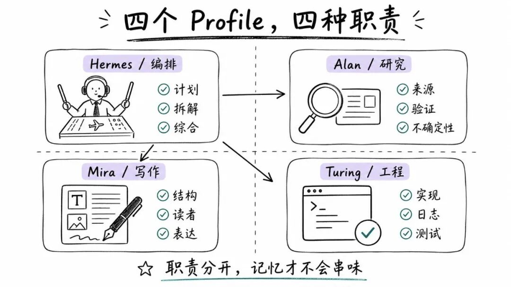
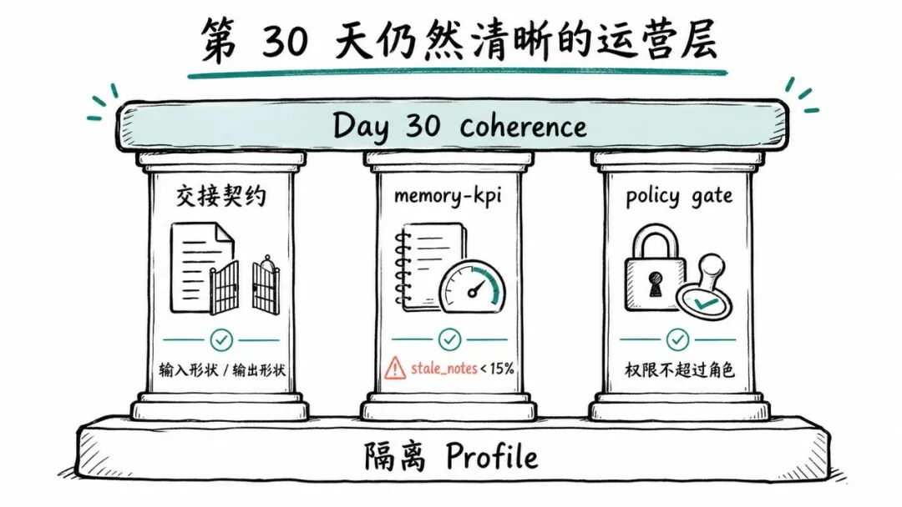
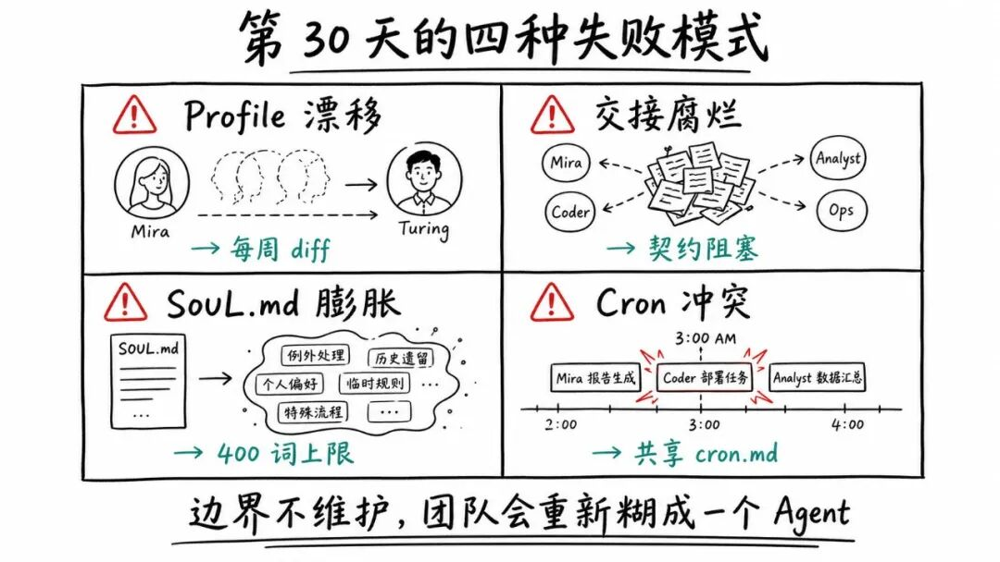

> 📎 来源: [AI的岔路口](https://mp.weixin.qq.com/s?__biz=MzI5NTg2OTk2Ng==&mid=2247485430&idx=1&sn=ac7290c4a3c506288c26a5593f08d7f0&chksm=ed81224145d1d955233836b45108139e0b9a305fba77f33aabaaaf90c68c8c3c2a4139079bb3&mpshare=1&scene=1&srcid=0426LvF9ZEhV3fsBB6ED1GPC&sharer_shareinfo=cc192c8a79b1df345838e3d051b9e776&sharer_shareinfo_first=cc192c8a79b1df345838e3d051b9e776) | 时间: 2026-04-26 19:03

---

我之前把一个 Hermes Agent 同时当研究员、写作者、程序员和编排者来用，在同一个

```
claude-sonnet-4.6
```

 profile 里连续跑了 14 天。很快，一个熟悉的问题出现了：所有输出开始混成同一种声音。

很多人会把这个问题归因于提示词，觉得是 prompt 没写好，或者模型能力不够。但真正的问题通常不在提示词，也不在模型，而在于你让一个 Agent 带着同一份记忆，承担了五种不同角色。

Hermes 里真正能解决这个问题的原语，是 **隔离 profile**。

之前看到有一个团队搭建方案：

```
orchestrator + alan + mira + turing
```

。四个角色，清晰交接，一天拿到 1,317 个收藏。这个搭建方向是对的，但它只解决了第一天的问题。

这篇文章补上第二天之后的部分：怎样让一个四 profile 团队到了第 30 天仍然保持清晰、不串味、不塌缩。关键不是再写几个更聪明的提示词，而是补齐运营层：交接契约、每个 profile 的记忆指标、按角色划分的权限闸门，以及四个很少有人展示截图的失败模式。

如果没有运营层，一个多 Agent 团队一个月内就会退化成一个边界模糊的单 Agent。

下面是完整框架：心智模型、四角色团队、七步搭建、运营手册、第 30 天常见失败模式，以及可直接复制的

```
team-agents.md
```

 模板。

## 心智模型：你需要的是角色，不是人格

错误的心智模型是：我需要一个什么都能做的天才 AI。

更好的心智模型是：我需要一个小团队。每个角色职责不同，交接清楚，彼此之间尽量减少上下文污染。

Hermes profile 正是让这件事变得可行的原语。它不是“角色皮肤”，也不是换一个说话风格那么简单。每个 profile 会同时隔离七类状态：

- configuration
- sessions
- memory
- skills
- personality
- cron state
- gateway state

这件事很重要，因为多 Agent 系统最常见的失败原因，就是所有角色共享同一份记忆和语气。

你的编码 Agent 不应该继承研究 Agent 的默认习惯。研究 Agent 也不应该带着写作者的表达偏好。只有状态持续隔离，专业化才会稳定。

## 四角色团队

四个 profile，对应四类真实工作：



- **Hermes：编排者**。负责计划、拆解、路由和综合。它是交通调度员，不是所有事情的瓶颈。
- **Alan：研究专家**。强调来源优先、怀疑精神和不确定性标注，避免团队建立在幻觉式自信上。
- **Mira：叙事架构师**。负责清晰度、结构和读者意识，把经过验证的材料变成可传播的表达。
- **Turing：构建与调试者**。负责实现、日志、diff 和可复现性。它关心测试，不关心叙事润色。

这套拆分有效，是因为它贴近真实工作方式。编排者不必同时成为优秀写作者，写作者不必负责调试，工程角色也不必承担说服读者的任务。每个角色每周都会变得更干净，因为它的记忆只围绕自己的工作积累。

## 七步搭建

下面是基础流程。

### 第一步：先准备一个可用的 Hermes

克隆之前，先确保基础 Hermes 安装是健康的：模型提供方配置正确，认证可用，普通会话能正常运行。

后面所有 profile 都会从这个基础环境复制。如果这里有问题，问题会被复制四份。

### 第二步：创建专家 profile

```
hermes profile create alan --clonehermes profile create mira --clonehermes profile create turing --clone
```

```
--clone
```

 会从当前可用的基础 profile 复制

```
config.yaml
```

、

```
.env
```

 和

```
SOUL.md
```

。新的 profile 仍然会拥有自己独立的记忆和会话历史。

### 第三步：在磁盘和 CLI 中验证

```
hermes profile listls ~/.hermes/profiles/
```

你应该能在

```
~/.hermes/profiles/
```

 下看到

```
alan/
```

、

```
mira/
```

、

```
turing/
```

。

主 Hermes 保持为编排者。

### 第四步：给每个角色写真正的 SOUL.md

这一步会把 profile 变成真正的 Agent。你需要编辑每个

```
SOUL.md
```

，让它拥有稳定身份：语气、默认行为、优势、优先级，以及必须避免的事情。

一个清晰的拆分可以是：

- **Hermes（编排者）**：规划、委派、综合、最终 QA。语气结构化、果断。
- **Alan（研究）**：证据、验证、深度、不确定性。语气来源优先、保持怀疑。
- **Mira（写作）**：清晰、结构、读者意识。语气清楚、面向受众。
- **Turing（工程）**：实现、调试、测试、可复现性。语气精确、测试导向。

如果你只是改了名字，没有改

```
SOUL.md
```

，那你得到的不是一个团队，只是四个贴了标签的克隆体。

### 第五步：项目上下文放进 AGENTS.md，不要塞进 SOUL.md

```
SOUL.md
```

 定义“这个 Agent 是谁”。

```
AGENTS.md
```

 定义“它现在在哪个项目里工作”。

不要把两者混在一起。

项目相关信息应该放进

```
AGENTS.md
```

：仓库结构、编码约定、工作流规则、当前优先级。身份保持稳定，项目上下文按需轮换。

### 第六步：增加一个团队参考文件

准备一个共享文件，记录团队成员和 profile 之间的交接方式。文末有模板。

### 第七步：分别运行 profile

```
hermes -p alanhermes -p mirahermes -p turing
```

每个 profile 都运行在独立状态里。Alan 不继承 Mira 的草稿，Turing 不继承 Alan 的研究会话。只有真正分开使用，profile 隔离的价值才会出现。

## 运营层：很多搭建指南停在这里之前

从这里开始，这套方法不再只是“怎么搭建”，而是“怎么长期运行”。

大多数多 Agent 团队第一天看起来很漂亮，第七天还能工作，第 30 天就开始变糊。差别就在运营层。



## profile 之间要有交接契约

profile 专业化之后，必须有清晰的交接方式。没有契约的交接，很容易变成这样：

Alan 把 40KB 原始研究材料丢进 Mira 的会话里，于是 Mira 也被迫变成研究员。

交接契约应该按角色对存成文件：

```
~/.hermes/team/handoffs/-to-.md
```

每个契约包含四个字段：

- **输入形状**：接收方期望拿到什么。例如 Alan → Mira 应该是一组带来源 URL 的已验证主张，不是原始摘录。
- **输出形状**：接收方会返回什么。例如 Mira → Hermes 应该是带修改记录的段落草稿，不是一篇已经宣称完成的文章。
- **失败动作**：输入不合格时怎么处理，是阻塞、要求人工 review，还是调整提示后重试。
- **验证闸门**：交接完成前必须为真的断言。例如 Alan → Mira 要求每条主张都有来源 URL；Turing → Hermes 要求每个修复都有通过的测试。

有了交接契约，你就能看到边界什么时候开始腐烂。没有它，专业化两周内就会溶解。

## 给每个 profile 看 memory-kpi

Hermes profile 隔离了记忆，这是必要条件，但还不够。每个 profile 内部的记忆也会腐烂，就像一个超过 100 页的 wiki 会慢慢变旧。

Alan 的研究笔记会过期，Mira 的草稿碎片会堆积，Turing 的调试会话会留下死分支。

每周对每个 profile 做一次记忆审计：

```
for p in alan mira turing; do  hermes -p $p memory-kpi --json | jq '.source_backed_pct, .stale_notes, .contradiction_notes'done
```

如果你同时运行 LACP，也可以在控制平面层做同样的事：

```
lacp memory-kpi --profile alan --json | jq
```

最该盯住的数字是

```
stale_notes
```

。一旦某个 profile 里过期笔记超过总量的 15%，就应该安排一次

```
brain-resolve
```

，否则它很快会开始引用自己的过期上下文。

## 按角色设置 policy gate

不同角色风险不同。

研究负责读，写作负责起草，工程负责执行，编排负责决策。单一策略不可能同时适合四个角色。

可以按下面这种形状设置每个角色的策略：

- **Alan（研究）**：风险等级 safe。可以读网页、读仓库、只写

  ```
  research/
  ```

  。不能运行 shell 命令，不能写出自己的沙箱。
- **Mira（写作）**：风险等级 safe。可以读研究输出，只写

  ```
  drafts/
  ```

  。不能读 secrets，不能执行代码。
- **Turing（工程）**：风险等级 review。可以读仓库，运行沙箱测试，写 feature branch。所有进入 main 的提交都需要编排者明确批准。
- **Hermes（编排者）**：风险等级 critical。只有它可以批准 Turing 的提交、合并分支，或触发超过预算上限的付费 API 调用。

你可以把这些规则写进每个 profile 的

```
config.yaml
```

，也可以放到 LACP 这类 harness 层执行。

原则很简单：任何 profile 都不应该拥有超过自己角色所需的权限。只有编排者可以扩大其他 profile 的权限范围。

## 用 gateway messaging 做远程监督

profile 系统是一张本地组织结构图。gateway 能把它变成一个可以远程监督的运营系统。

给每个 profile 接上自己的消息身份：

- Alan 把研究发现发到

  ```
  #research
  ```
- Mira 把草稿发到

  ```
  #writing
  ```
- Turing 把测试结果和 PR 链接发到

  ```
  #engineering
  ```
- Hermes 在

  ```
  #ops
  ```

   汇总，并在关键动作前请求人工批准

这样你离开电脑去吃午饭，也能回来之后知道每个 profile 做了什么、按什么顺序做、停在了哪里。

消息通道让四个本地 profile 变成了一个可观察的多 Agent 控制面。

## 第 30 天的四种失败模式

我观察过的四 profile 团队，几个月后几乎都会撞上下面至少一个问题。这四个问题都可以提前预防。



### 失败一：Profile 漂移

```
SOUL.md
```

 的修改会累积。

一周前，Mira 还是“清晰、面向读者”。今天它变成了“清晰、面向读者、技术精确，并且愿意起草实现说明”。

这意味着 Mira 正在慢慢变成 Turing。

修复方式：每周把每个

```
SOUL.md
```

 和第一天版本做 diff。任何新增职责都必须有明确批准记录，否则就回滚。

### 失败二：交接腐烂

契约文件存在，但没人执行。

Alan 又开始把原始 transcript 丢给 Mira。Mira 又开始让 Turing “顺手帮忙看一下”。边界就这样溶解。

修复方式：把每个交接文件接入 harness。如果输入不符合声明的形状，直接让交接失败，并要求人工 review。契约只有能阻塞，才算真实存在。

### 失败三：SOUL.md 膨胀

每个角色都会慢慢长出边缘规则。

Turing 多了一段“如何处理 Python 2 遗留代码”。Alan 多了三段“什么时候可以跳过同行评审来源”。一个月后，每个

```
SOUL.md
```

 都变成 2KB 特殊情况，Agent 反而丢掉了原始身份。

修复方式：把

```
SOUL.md
```

 限制在 400 词以内。超出的内容放进

```
AGENTS.md
```

 或按领域拆成参考文件。身份稳定，项目上下文轮换。

### 失败四：Cron 冲突

profile 会跑 cron job。

Alan 每周拉研究摘要，Mira 每周重新生成草稿，Turing 每晚跑测试，Hermes 每天做编排。到了第四周，两个任务可能都挤在凌晨 3 点，因为没人协调时间表。

修复方式：维护一个共享文件：

```
~/.hermes/team/cron.md
```

这个文件列出所有 profile 的定时任务、精确时间、预计耗时和依赖关系。新增任何 cron 之前，先查这份共享时间表。

## 团队参考文件模板

这个文件只有一个用途：让你和半年后的其他使用者都能看懂这个团队如何工作。

```
# ~/.hermes/team-agents.md## roster- **hermes** (orchestrator): plans, routes, approves, synthesizes- **alan** (research): source-first, skeptical, uncertainty-tagged- **mira** (writer): clarity, structure, audience-aware- **turing** (engineer): implementation, tests, reproducibility## when to use which profile- starting a new project → hermes (scopes and decomposes)- validating a claim → alan (source check, uncertainty tag)- drafting anything external-facing → mira (audience-first)- writing or debugging code → turing (test-first)## handoff rules- alan → mira: ranked claims with source urls. no raw transcripts.- mira → hermes: drafted section + change log. not a finished article.- turing → hermes: feature branch + passing tests + diff summary. not a merge.- hermes → any: scoped task with acceptance criteria and failure action.## good output per profile- alan: every claim has a source url and a confidence tag.- mira: every section has a named audience and a clear thesis.- turing: every change has a passing test and a reproducible diff.- hermes: every synthesis names the contributors and the open questions.## policy ceilings- alan: read-only outside research/- mira: read research/, write drafts/- turing: read repo, write feature branch, run sandboxed tests- hermes: only profile allowed to approve merges, widen permissions, or spend above budget## cron schedule(edit weekly; stagger to avoid 3am collisions)- mon 6am — alan: weekly research digest- tue 6am — mira: draft refresh from alan's digest- wed 6am — turing: test sweep + flaky test report- thu 6am — hermes: weekly synthesis + handoff audit
```

把这个文件纳入版本控制。每个团队成员的修改都通过 commit 进入。到了第 90 天，你会感谢自己这么做。

## Agent 抽取层

这套系统可以压缩成一个结构：

- **目标**：运行一个到第 30 天仍然保持清晰的四 profile Hermes 团队。
- **输入**：可用的 Hermes 基础环境、profile CLI、

  ```
  SOUL.md
  ```

   与

  ```
  AGENTS.md
  ```

   的职责拆分、交接契约、按角色设置的策略、gateway 消息通道。
- **过程**：用

  ```
  --clone
  ```

   建立四个 profile；为每个角色写不同的

  ```
  SOUL.md
  ```

  ；把项目上下文放进

  ```
  AGENTS.md
  ```

  ；在

  ```
  ~/.hermes/team/handoffs/
  ```

   编码交接契约；为每个角色设置 policy；每周运行 memory-kpi；diff 每个

  ```
  SOUL.md
  ```

  ；错开 cron；用 commit 维护

  ```
  team-agents.md
  ```

  。
- **输出**：四个隔离 profile、按角色配置的权限块、交接契约、错开的 cron 时间表、消息路由和版本化团队参考文件。
- **护栏**：任何

  ```
  SOUL.md
  ```

   修改都需要记录原因；任何不符合输入形状的交接都不能通过；任何角色扩权都需要编排者批准；新增 cron 前必须检查共享时间表。

## 结语

很多多 Agent 系统不是突然失败，而是悄悄变糊。

第一天一切正常，第七天还能跑，第 30 天所有角色开始混在一起。问题通常不在 profile 系统本身，而在于它上面的运营层没人维护。

真正让系统活到后面的，是维护契约：能阻塞的交接规则、每个 profile 的 memory-kpi、匹配角色的权限上限，以及一个能撑过未来六个月的团队参考文件。

Profile 是特性。边界才是护城河。
