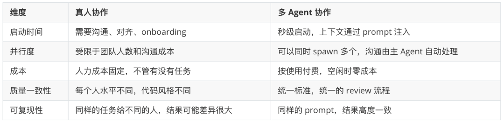

> 📎 来源: [赤手筑梦](https://mp.weixin.qq.com/s?__biz=MzkyMzY0NzgxNw==&mid=2247484321&idx=1&sn=f46b4cce9761cab82673873a495a9165&chksm=c07605f0dc300469bf6b2f0cc1ad1edef75d1d6f4e818fb6e5e4bfabe3555d85b750faf9aadc&mpshare=1&scene=1&srcid=05093H63BbSRwvlrjudOqPCD&sharer_shareinfo=1af60a7638c314843af1cdbd7b801fb1&sharer_shareinfo_first=1af60a7638c314843af1cdbd7b801fb1) | 时间: 2026-05-09 15:26

---

去年我见过一个场景，至今印象深刻。

一个开发者在终端里输入了一行命令，然后就去喝咖啡了。十五分钟后回来，三个独立的功能模块已经完成，单元测试全部通过，代码已经 merge 到主分支。

不是他写的。是三个 AI Agent 并行工作的结果。

你可能听过 Devin，听过 Cursor，听过各种"AI 程序员"。但大多数人的使用方式还是单线程的：打开一个 Agent，给它一个任务，等它做完，再给下一个。

**这就像你有一个很厉害的助手，但只让他一次做一件事。**

Hermes 的多 Agent 协作，解决的问题不是"AI 能不能写代码"——这已经没什么争议了。它解决的是"怎么让多个 AI 同时写代码，而且不会把项目搞砸"。

## 为什么要多 Agent？

先搞清楚一个问题：单个 AI Agent 已经很强了，为什么还需要多个？

因为**并行**。

一个实际的软件开发项目，很少是单线程的。前端和后端可以同时开发，API 接口和数据库 schema 可以并行设计，业务逻辑和单元测试可以分头写。

但单 Agent 工作流的瓶颈在于：即使 Agent 速度再快，它也只能一次做一个任务。你有一个包含 5 个子需求的 feature，Agent 串行完成需要 25 分钟。如果拆给 3 个 Agent 并行，理论上 8 分钟就能搞定。

更重要的是：**不同的 Agent 可以用不同的角色和视角来看同一个项目。**

想象一下，你的团队里有三个工程师：

- 一个擅长架构设计，看代码先看结构和依赖
- 一个擅长写业务逻辑，实现速度快，代码清晰
- 一个擅长测试和质量保证，专门挑毛病

这三个人同时工作，效率和质量都远高于一个人反复切换角色。

多 Agent 协作就是把这个逻辑搬到了 AI 世界。

## Hermes 的多 Agent 是怎么工作的

Hermes Agent 的多 Agent 协作，核心机制是**派生子进程（subagent）**。

你——主 Agent——接收到一个复杂的任务，比如"实现一个用户管理系统，包含注册、登录、权限控制三个模块"。

Hermes 不会让一个 Agent 从头写到尾。它会把任务拆解，然后 spawn 多个子 Agent，每个负责一个独立的子任务：

```
主 Agent（你）  ├── Agent A：实现注册模块 + 数据库 model + 单元测试  ├── Agent B：实现登录模块 + JWT 认证 + API 路由  └── Agent C：实现权限中间件 + 角色管理 + 访问控制
```

三个子 Agent 各自有独立的上下文、独立的终端会话、独立的工作目录。它们互不干扰，并行执行。

每个子 Agent 完成后，结果返回给主 Agent。主 Agent 做整合、审查、决定是否需要调整。

**整个过程你只需要做两件事：给任务、review 结果。**

## 一个完整的实战场景

假设你要开发一个电商小项目的核心功能。具体需求：

1. 商品列表 API（查询、分页、过滤）
2. 购物车功能（添加、删除、数量调整）
3. 订单系统（创建订单、计算总价、状态管理）

### 单 Agent 方式

你告诉 Agent："帮我实现商品列表、购物车和订单系统。"

Agent 开始工作：先写商品 API，写完写购物车，写完写订单。中间如果遇到问题（比如购物车需要查询商品数据），它要停下来处理。全程串行，可能花 30-40 分钟。

### 多 Agent 方式

你设计一个并行任务：

- **Agent A（后端 API）**：商品列表 API，包括 model、serializer、view、分页和过滤逻辑
- **Agent B（购物车服务）**：购物车 CRUD 操作，库存校验，价格计算
- **Agent C（订单系统）**：订单创建、状态流转、总价计算逻辑

三个 Agent 同时启动。A 写商品 API，B 写购物车，C 写订单系统。

它们各自有独立的终端 session，可以安装依赖、运行测试、调试代码。互不阻塞。

假设每个子任务需要 10 分钟，串行的话是 30 分钟。并行执行，10-12 分钟全部完成。

**省下来的 20 分钟，你可以用来做更重要的事——架构审查、业务逻辑优化、或者开始下一个 feature。**

## 关键技术细节

多 Agent 协作听起来很美好，但实际落地有几个关键挑战。Hermes 的处理方式值得拆解一下。

### 上下文隔离

每个子 Agent 有独立的对话历史和工作上下文。这意味着：

- Agent A 不知道 Agent B 在干什么
- 它们不会互相干扰对方的决策
- 但如果它们需要共享信息（比如 API 接口定义），主 Agent 负责协调

**这就像一个真实的团队：每个人专注自己的任务，但技术负责人（主 Agent）掌握全局信息。**

### 工具集控制

不同的子 Agent 可以分配不同的工具集。比如：

- 写代码的 Agent 需要 terminal 和 file 工具
- 做调研的 Agent 需要 web 搜索工具
- 做代码审查的 Agent 只需要 file 和 search 工具

这避免了不必要的工具调用，也降低了出错风险。

### 结果聚合

子 Agent 完成后，只返回最终摘要（final summary），中间的每一步工具调用结果不会全部推送到主 Agent 的上下文。

**这一点很关键。** 如果一个子 Agent 执行了 30 步操作，每一步的结果都返回，主 Agent 的上下文会被淹没。只返回摘要，主 Agent 只看结果和关键结论，保持上下文清洁。

如果需要看细节，可以随时深入——但默认情况下，你不需要。

## 和传统"多人协作"的对比

有人可能会说：这不就是项目管理吗？拆任务、分给人、收结果。

没错。**本质上就是项目管理，只是你的"人"变成了 Agent。**

但这个转变带来的差异比你想象的大。



当然，Agent 也有它的局限。复杂架构决策、创新性的系统设计、需要深入理解业务场景的判断——这些目前还是人的强项。

**但执行层面的编码工作，多 Agent 协作已经是碾压级别的效率提升。**

## 什么时候该用多 Agent？

不是所有任务都需要多 Agent。判断标准其实很简单：

**如果一个任务可以拆成 3 个以上相互独立的子任务，就值得考虑并行。**

具体场景：

- **大型 feature 开发**：前端 + 后端 + 测试，三个 Agent 并行
- **技术调研**：同时调研 A 方案、B 方案、C 方案，对比分析
- **代码重构**：不同模块的重构可以并行执行
- **Bug 排查**：多个疑似问题点可以同时调查
- **文档生成**：API 文档、用户手册、README 同步写

不适合的场景：

- 需要大量上下文共享的任务（Agent 之间不共享上下文）
- 强依赖链的任务（B 必须等 A 完成才能开始，串行不可避免）
- 需要创造性架构设计的任务（这还是需要你亲自上）

## 实操：怎么在 Hermes 里使用多 Agent

在 Hermes 中，多 Agent 协作通过 

```
delegate_task
```

 工具实现。有两种模式：

### 单任务模式

你给一个目标（goal），Hermes 自动拆分子任务，spawn 子 Agent 执行。

```
目标：调研三种不同的数据库方案，给出对比分析报告
```

Hermes 会自动派生多个子 Agent，分别调研 PostgreSQL、MongoDB、Redis 的适用场景，然后汇总成一份报告。

### 批量模式

你自己定义多个任务，明确指定每个任务的目标、上下文、工具集。

```
任务 A：实现用户注册 API任务 B：实现用户登录 API  任务 C：实现用户权限校验中间件
```

三个任务并行执行，结果同时返回。

**关键是写清楚每个子 Agent 需要什么上下文。** 子 Agent 不知道你们之前的对话历史，所以文件路径、错误信息、项目结构——所有它需要的信息，都要在 context 字段里明确给出。

## 写到这里的一个思考

多 Agent 协作本质上是在回答一个问题：**当 AI 已经能写代码了，人类的角色是什么？**

答案不是"人类不写代码了"。答案是**人类从"写代码的人"变成了"管理 AI 写代码的人"**。

你不需要写每一行代码。你需要做的是：

1. **理解需求**，拆解成可以并行执行的子任务
2. **分配资源**，决定哪个 Agent 做什么
3. **审查结果**，判断代码质量、架构合理性
4. **做决策**，在多个方案中选择最优解

这些能力——任务拆解、资源管理、质量判断、架构决策——本来就是高级工程师的核心竞争力。只是以前你带着这些能力写代码，现在你带着这些能力管理 AI。

**你的价值不在于你敲了多少行代码，而在于你能让多少行高质量的代码被正确地写出来。**

## 写在最后

多 Agent 协作不是未来的概念，是现在就能用的工具。

你不需要等某个"更强大的 AI"出现。你不需要重构你的整个工作流。你只需要在下一个复杂任务到来时，想一想：

**"这个能不能拆成几个独立的部分，让多个 Agent 同时做？"**

如果你的答案是"可以"，那你就已经在使用多 Agent 协作了。

一个人写代码的时代正在结束。

一个人管理一群 AI 写代码的时代，刚刚开始。
