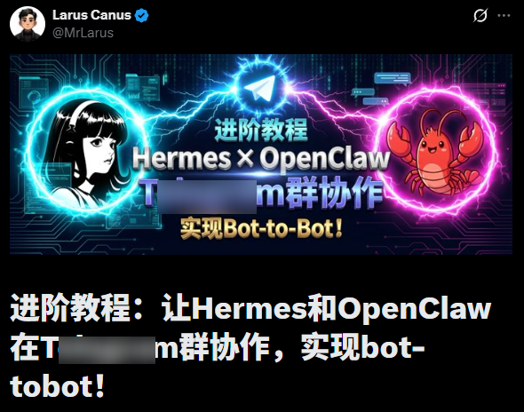

> 📎 来源: [云起泊言](https://mp.weixin.qq.com/s?__biz=MzA5NjAxMTY1OA==&mid=2461868631&idx=1&sn=9b4210e367d4e69335bdb29839fe901d&chksm=86069f6c3975542d995c0f7738c9fb20683c1eaef5a8b321e4ebb83c0d5953b38dcc3442e0d5&mpshare=1&scene=1&srcid=0422zTmaMgdnYUBmWiy96uQa&sharer_shareinfo=7fe5029f8604d0e0fb3977e8c7950858&sharer_shareinfo_first=7fe5029f8604d0e0fb3977e8c7950858) | 时间: 2026-04-22 01:10

---

平常我们在使用 **OpenClaw** 跟 **Hermes** 的时候，是不是经常在一个会话中既让它干这又让它干那，比如我的话又是让它写作又是让它帮我出计划写代码，难免会导致上下文的记忆混乱，我让它写代码呢突然给我飙出来一段关于写文章的

而且一次只能处理一个任务，在执行过程中如果想让它同时干别的事，就只能干等着

那么能不能同时有多个Agent，各司其职，互不干扰：

- 子任务 A：负责写作
- 子任务 B：负责写计划、出PRD
- 子任务 C：根据PRD进行编码


这里就要说一下 Hermes 的 **Profiles**功能：可以在同一台机器运行多个独立的Hermes

**Profile** 是一个完全隔离的 Hermes 环境。

- 每个 Profile 都有自己独立的配置、记忆、会话和技能；
- 底层通常是通过单独的 HERMES\_HOME 路径来实现目录级隔离 。

但要注意，默认 profile 仍然是 

```
~/.hermes
```

； 只有你创建并切换到命名 Profile 时，相关配置、记忆、技能、会话和日志等才会跟随当前 HERMES\_HOME 切到

```
~/.hermes/profiles//
```

 这类路径。

那么我来说一下创建过程吧~

---

### 创建方式

#### 创建空白记忆的Agent

```
hermes profile create "writer"
```

双引号内写你的 Agent 名称，比如我的计划 Agent 就叫 planner，编码 Agent 叫 coder

#### 创建克隆当前主Agent配置的Agent

```
hermes profile create "planner" --clone
```

这个会将当前主Agent的配置、API-Key等数据克隆至新的Agent，但记忆跟会话是独立的

#### 创建完整克隆当前主Agent所有配置的Agent

```
hermes profile create "coder" --clone-all
```

包含记忆、会话、配置、技能等所有数据。

---

### 使用方式

有个特色是当你创建 Agent 后，可以直接使用 Agent 名称作为命令使用：

比如我创建了

```
writer
```

：

```
hermes profile create "writer"
```

那么就可以使用

```
writer
```

作为命令使用：

```
writer setup  ##配置writer chat   ##开启会话writer model  ##配置模型writer gateway  ##配置消息网关
```

更多命令可以使用 

```
-h
```

 查看，基本与 Hermes 命令一致，不同的Agent使用不同的命令来配置。

每个 **Profile** 的 

```
memories/
```

、

```
skills/
```

、

```
sessions/
```

 和 

```
logs/
```

 目录都是独立的，不会互相读写。

##### ⚠️注意：

各个 Agent 之间建议用不同的消息网关，如果用同一个会冲突，比如主Agent用微信，子Agent用飞书，如果你有电报的话可以创建多个bot机器人来分工，也很方便

下面是我的配置目录：供参考：

```
~/.hermes/                             # 主 Agent 目录├── SOUL.md                            # 主 Agent 身份定义├── AGENTS.md                          # 共享团队规则├── memories/                          # 主 Agent 长期记忆└── profiles/                          # 专家 agents    ├── writer/                        # 写作专家    │   ├── SOUL.md    │   ├── AGENTS.md    │   └── memories/    ├── planner/                       # 计划专家    │   ├── SOUL.md    │   ├── AGENTS.md    │   └── memories/    ├── coder/                         # 编码专家    │   ├── SOUL.md    │   ├── AGENTS.md    │   └── memories/    └── ...                            # 可继续添加更多 agents
```

这样使用后，各个Agent只干自己的任务，互不影响，也不会出现上下文过长记忆混乱的情况，并且可以并发执行，提升效率。

本来看到有大佬将OpenClaw跟Hermes拉到一个群，让它们自己聊还挺有意思的，我就想试试Hermes的多个Agent看能不能行，结果就主Agent回应，子Agent在群里怎么叫都不回应。。。



有兴趣的伙伴可以用OpenClaw跟Hermes试试~
