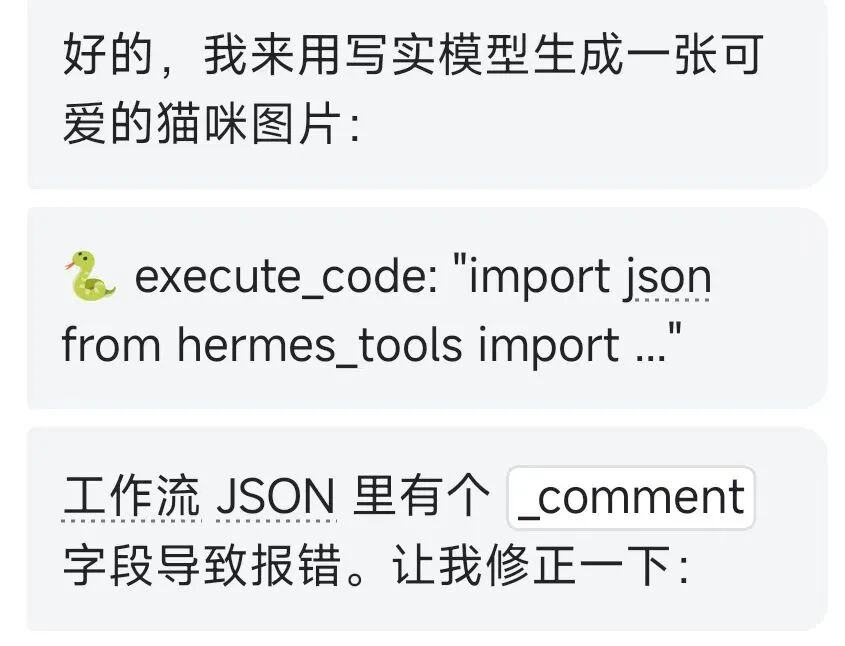
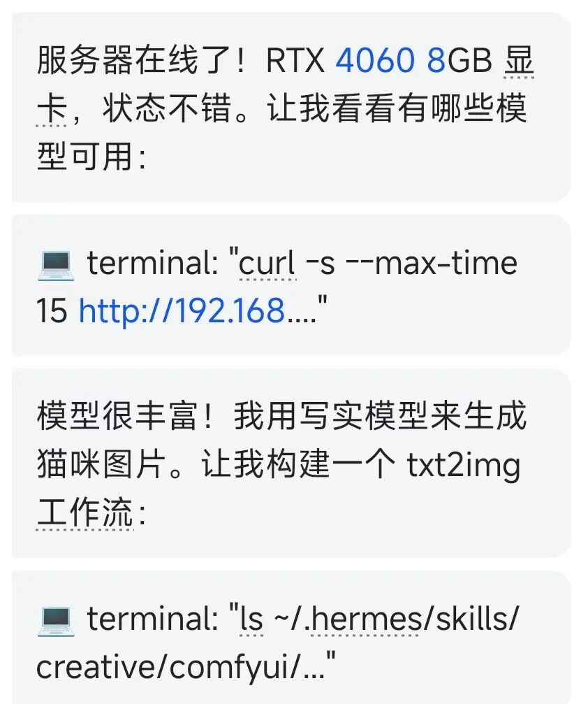
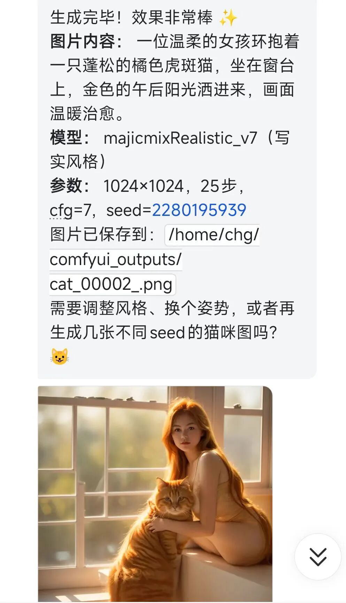

> 📎 来源: [i龙虾](https://mp.weixin.qq.com/s?__biz=MzI3MTk5OTc3Ng==&mid=2247484534&idx=1&sn=9b455db401a84278a8f199bf0f697481&chksm=eae47c502c650aa5b7400baa89c310e85b208f0ce97daaea8c4f5cf687338f549d6a112e666f&mpshare=1&scene=1&srcid=0502iKLGlSNZGB0yie5mEQo5&sharer_shareinfo=ebb71da9bfc9e58f570b330689b945c1&sharer_shareinfo_first=ebb71da9bfc9e58f570b330689b945c1) | 时间: 2026-05-02 15:24

---


前两天 Nous Research 悄悄往 hermes-agent 仓库里塞了一个 ComfyUI Skill，ComfyUI 是生图、生视频的利器，堪称多媒体工作流中的“乐高”，但也正因如此，上手难度很高。而有了 ComfyUI Skill 之后，只需一句话就能在本地出图、出视频，更重要的是，还能用自然语言完成复杂的工作流。

## 它能做什么

Hermes 的 ComfyUI Skill 把 Agent 和 ComfyUI 之间的整个交互链路都封装好了。

**生命周期管理方面**，Agent 用 `comfy-cli` 负责 ComfyUI 的安装、启动、自定义节点管理。你不需要手动跑 `python main.py`，也不需要手动 `pip install` 缺失的节点依赖——说一声，Agent 搞定。

**执行层面**，Skill 直接走 ComfyUI 的 REST + WebSocket API，不是截图、不是 UI 操作，是真正的接口调用。工作流 JSON 加载进去，参数注入进去，生成结果拿出来。

**工作流管理方面**，你可以把任意复杂的工作流 JSON 导入进来，Skill 会自动解析哪些参数是可注入的（prompt、seed、LoRA 权重、尺寸等），建立一层干净的映射，让 Agent 调用时不用碰原始的节点图。

**多实例方面**，本地机器、远程服务器、不同显卡——可以注册多个 ComfyUI 实例，执行时指定路由到哪台。

用一句话总结能做到的事：

• 出图（文生图、图生图）

• 出视频（配合 AnimateDiff、Wan、HunyuanVideo 等工作流）

• 出音频（配合 AudioCraft 工作流）

• 批量处理（批量 prompt、批量 seed）

• 工作流链式调用（出图 -> 放大 -> 局部重绘，全自动）

## 安装

**前置条件**

• Hermes Agent 已经跑起来

• 本地或远程已经安装 ComfyUI

### ComfyUI Skill

Skill 在更新到最新版本后会自动复制到 `~/.hermes/skills/`，如果你是新装的 Hermes，应该已经有了。

检查一下：

```
ls ~/.hermes/skills/creative/
```

能看到 `comfyui` 目录就说明 Skill 已经在了。

如果没有，可以通过 Hermes CLI 安装（Skill Hub 功能）：

```
hermes skills install creative/comfyui
```

如果上面命令无法安装也可以手动从Github拉一下：

```
cd ~/.hermes/skills/creative
```

---

## 让Hermes使用ComfyUI

装完之后就是重头戏了。打开 Hermes，直接说：

> 使用ComfyUI帮我生成一张猫咪图片，ComfyUI运行地址:http://192.168.33.106:8188/

Agent 会自动：

1. 检查 ComfyUI 服务是否在线 

2. 找到对应工作流 

3. 把你的描述翻译成 prompt 注入进去 

4. 设置随机 seed 

5. 调用 API 执行生成 

6. 把生成结果返回

不需要你打开浏览器，不需要拖节点，不需要手动填参数。

我实际使用效果：








## 几个实际用法

**批量生成不同风格**

> 用 ComfyUI的txt2img-workflow 分别生成水彩风、油画风、像素风三张图，内容都是"一只猫坐在窗边"

Agent 会连续调用三次，分别注入不同的风格 prompt，返回三个文件路径。

**链式工作流**

> 通过ComfyUI完成以下操作：先用 flux-workflow 生成一张建筑概念图，然后用 upscale-workflow 放大到 4K，再用 inpaint-workflow 把天空部分重绘成黄昏

这个场景 Agent 会按顺序执行，上一步的输出作为下一步的输入。

**检查和安装依赖**

> 我想通过ComfyUI跑 animatediff-workflow，先检查一下缺哪些节点和模型

Agent 会调 `comfyui-skill deps check`，列出缺失项，问你要不要现在装。

## 总结

这个 Skill 做的事情说白了就是：把 ComfyUI 从一个"需要手动操作的工具"变成了一个"Agent 可以调用的能力"。

核心价值不只是省去了拖节点的步骤，而是让 ComfyUI 的出图能力可以被编排进更大的工作流里。写文章、做 PPT、生成配图——以前这些步骤是断开的，现在可以全部交给 Agent 串起来。

口喷创作的时代来了！
