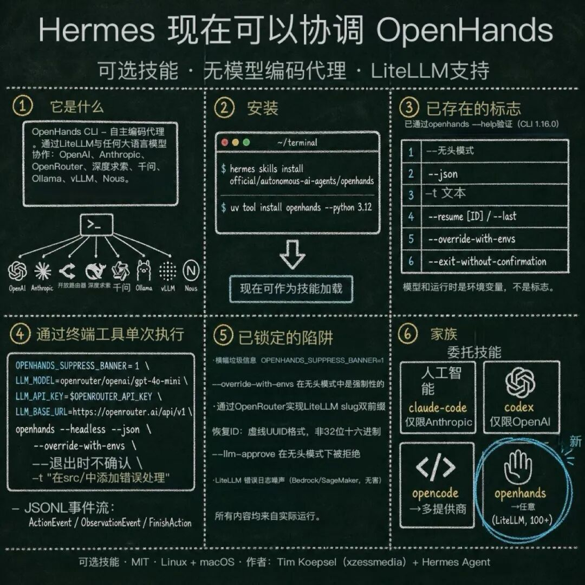

> 📎 来源: [极客BIM设计工坊](https://mp.weixin.qq.com/s?__biz=MzI2MjA3ODk0OQ==&mid=2648118350&idx=1&sn=e347ac4e19fad1d7d120eba64da91624&chksm=f3b950f8e057429b92ff1011422d29d3af41f675470c69aa25a99702f75340a2aaf8505571c7&mpshare=1&scene=1&srcid=05265r1Um35Q2lWhueWTXqps&sharer_shareinfo=85639cf3637c46a9d4d3272dbc959f3e&sharer_shareinfo_first=85639cf3637c46a9d4d3272dbc959f3e) | 时间: 2026-05-26 15:28

---



#Hermes #OpenHands #开发工具

Hermes Agent 新增了一个可选技能：可以把 OpenHands 也纳入自己的任务编排。对小白来说，它不是让你多装一个聊天窗口，而是让 Hermes 在需要写代码、改仓库、跑命令时，能调用另一套更偏工程执行的 agent。对老手来说，重点在于分工：Hermes 负责入口、记忆、跨平台和调度，OpenHands 负责更重的开发任务。

1条

安装命令

5类

内置编程技能

7.4万+

OpenHands stars

Hermes Agent 现在可以通过一个新的可选 skill 来编排 @OpenHandsDev agents。升级 Hermes 后，执行

```
hermes skills install official/autonomous-ai-agents/openhands
```

 就能安装。

更关键的是：Hermes 已经能用同一套方式调用 Claude Code、Codex、OpenCode、Hermes 自己。你可以用

```
/
```

 强制指定，也可以直接让 Hermes 自己判断该用谁。

小白先看懂：它不是一个模型，是一个调度入口

如果你刚接触这类工具，可以把 Hermes 理解成一个会长期跟你配合的“工作入口”。它能记住偏好，加载技能，从 Telegram、命令行、Discord 等地方接收任务，也能跑终端、读文件、写计划、定时执行。

OpenHands 则更像一个专门处理软件开发任务的执行团队。它背后的项目定位是 AI-driven development，官方 README 里把产品拆成 SDK、CLI、本地 GUI、Cloud 和 Enterprise 几条线：既能在本机跑，也能接云端和企业流程。

**一句话**：Hermes 管“什么时候、用什么工具、按什么习惯做事”。

**OpenHands 管**：进入代码仓库后，怎么理解需求、改代码、跑验证。

●　如果你只是问问题，不需要 OpenHands。

●　如果你要改一个真实项目，OpenHands 才开始有价值。

●　如果你想把不同 agent 串成流程，Hermes 才是重点。

为什么这个升级值得看

过去很多开发 agent 的问题是“各自很强，但入口分散”。你要记住不同 CLI 的命令、不同配置、不同上下文写法。Hermes 这次把 OpenHands 做成 skill，本质上是在统一调用方式：用户说任务，Hermes 决定要不要把任务交给 OpenHands。

这和普通插件不同。Hermes 的 skill 不是菜单按钮，而是一份带触发条件、步骤、坑点和验证方式的操作说明。它会进入 agent 的工作上下文，让 Hermes 知道“遇到这类任务应该怎样调用这个工具”。

以前

每个 agent 单独开

人来记命令和边界

现在

Hermes 作为总入口

skill 记录调用方法

主要功能：适合放进真实工作流

按 Hermes 和 OpenHands 的公开文档看，这个组合最适合三类任务：有上下文、有文件、有验证。它不只是生成一段代码，而是让 agent 进入一个工作目录，读项目，改文件，跑命令，再把结果交回给你。

▸　**代码修改**：修 bug、补测试、改配置、迁移小模块。

▸　**项目理解**：让 agent 读 README、目录、issue，再给出改法。

▸　**多 agent 分工**：Hermes 可把 OpenHands 与 Claude Code、Codex、OpenCode 放在同一套技能入口下。

```
hermes update
hermes skills install official/autonomous-ai-agents/openhands

// 使用时可以直接说：
// 用 OpenHands 检查这个仓库的测试失败原因
```

给老手的判断：值得试，但别一上来托管核心仓库

如果你已经在用 Claude Code、Codex 或 OpenCode，这次升级的价值不在“又多一个 agent”，而在“把 OpenHands 放进 Hermes 的任务路由里”。它适合做横向对比：同一个 issue，分别让不同 agent 给方案，最后由 Hermes 汇总差异。

**建议**　先用小仓库、低风险分支、可自动测试的任务试。不要第一天就让它改生产配置、账单逻辑或权限系统。

OpenHands 自身已经是一个体量很大的项目，GitHub 上 OpenHands/OpenHands 有 7.4 万以上 stars；它还拆出了 software-agent-sdk 和 OpenHands-CLI。换句话说，它不是一个临时脚本，而是一套围绕软件开发 agent 建起来的产品线。

FIX避坑

**不要把它当搜索引擎**：给明确任务、仓库路径、验收标准。

**不要省略验证**：要求它跑测试、列出改动文件、说明没覆盖的风险。

适合谁，不适合谁

适合 AI 创业者、独立开发者、技术团队负责人，也适合已经有一堆自动化脚本但缺统一入口的人。普通 AI web 用户如果只是写文案、做总结、问知识，不必急着装。这个升级的收益发生在“你真的有代码仓库和任务队列”的时候。

适合

多项目开发、工具链试验、自动化修 bug、研发流程评估。

不适合

没有本地环境、不愿看 diff、不跑测试、只想要一次性答案。

我的试用顺序

别从复杂任务开始。先更新 Hermes，再安装 OpenHands skill，找一个有测试的小项目，让它做一次“读项目并提出修改计划”。第二步再让它改一个低风险 bug。第三步才尝试让 Hermes 在多个 agent 之间分配同一任务。

●　第一天：只读不改，看它能否准确理解项目。

●　第二步：只改小文件，必须跑测试。

●　第三步：让 Hermes 比较不同 agent 的结果，而不是盲信一个答案。

好工具不是替你承担责任，而是把可验证的工作切得更清楚。

SOURCES

Teknium X post — https://x.com/teknium/status/2059038964552745378

Hermes Agent GitHub README — https://github.com/NousResearch/hermes-agent

OpenHands GitHub README — https://github.com/OpenHands/OpenHands

OpenHands Docs — https://docs.openhands.dev/
