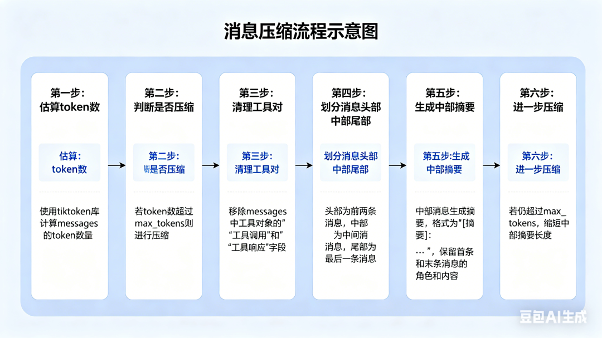

> 📎 来源: [野生AI架构师](https://mp.weixin.qq.com/s?__biz=MzU3NDQ3MjI3Nw==&mid=2247486077&idx=1&sn=6eb6ec8a50e8e3bd8550fbac29166792&chksm=fc0f418e3949b9a68291ed15d07c3c6760f435d28f31f7c1fa3f31617996c3cd63848901db6a&mpshare=1&scene=1&srcid=0426IKsdoqT6Ohu6hFWUC5MX&sharer_shareinfo=7a4c0aa08c38554a59e36cbf3c835001&sharer_shareinfo_first=7a4c0aa08c38554a59e36cbf3c835001) | 时间: 2026-04-26 18:58

---

在 AI 智能体时代，记忆管理是智能体系统的核心组成部分。Hermes 的记忆管理系统负责管理智能体的记忆库，包括用户偏好、重要信息和会话历史，同时处理上下文压缩以适应模型的token限制。

1. MemoryManager 类：记忆提供者的协调者

```
agent/memory_manager.py
```

 中的 **MemoryManager** 类是整个记忆管理系统的核心，负责协调内置记忆提供者和外部记忆插件。

1.1 设计理念

MemoryManager 的设计体现了以下几个关键理念：

01**单一责任原则**：每个记忆提供者负责特定类型的记忆管理，MemoryManager 只负责协调它们

02**可扩展性**：支持添加外部记忆插件，扩展系统的记忆管理能力

03**容错性**：一个记忆提供者的故障不会影响其他记忆提供者的运行

04**优先级管理**：内置记忆提供者始终优先于外部记忆提供者

1.2 记忆提供者管理

MemoryManager 实现了严格的记忆提供者管理机制：

内置提供者：始终注册为第一个提供者，且不能被移除

外部提供者：一次只允许注册一个外部记忆提供者，防止工具 schema 膨胀和冲突

工具路由：为每个记忆工具维护到对应提供者的映射，确保工具调用被正确路由

2. 记忆预取和同步机制

2.1 记忆预取

记忆预取机制允许智能体在处理用户输入前，预先获取与当前对话相关的记忆：

1**查询处理**：分析用户输入，生成相关查询

2**多提供者查询**：向所有记忆提供者发送查询

3**结果合并**：合并来自不同提供者的预取结果

4**上下文注入**：将预取的记忆注入到对话上下文中

**优势：**提高相关性、减少重复、长对话中保持上下文连续性

2.2 记忆同步

记忆同步机制确保对话内容被持久化到记忆系统中：

回合捕获：捕获用户输入和智能体响应

多提供者：将对话内容同步到所有记忆提供者

背景预取：为下一个回合预先获取相关记忆

3. 上下文压缩器：智能处理上下文窗口

```
agent/context_compressor.py
```

 实现了上下文压缩器，用于应对大型语言模型的token上下文窗口限制。

3.1 压缩策略

头部保护：保留对话的前几个消息，通常包含任务描述和重要背景

尾部保护：保留对话的最后几个消息，包含最新的交互

中部压缩：对中间的消息进行摘要，保留关键信息

工具保护：确保工具调用和结果的完整性，避免信息丢失

迭代压缩：如果一次压缩后仍超出token限制，进行进一步压缩

3.2 核心代码示例



以下是上下文压缩的核心实现：

```
defcompress(self, messages, max_tokens=None):
```

4. 内置记忆提供者

```
agent/builtin_memory_provider.py
```

 实现了内置记忆提供者，它是 Hermes 智能体的默认记忆管理组件：

文件存储：使用文件系统存储记忆内容，如 

```
MEMORY.md
```

 和 

```
USER.md
```

简单查询：基于关键词匹配的简单查询机制

记忆操作：支持添加、更新和删除记忆条目

用户配置：维护用户的配置文件，记录用户偏好和特性

5. 架构设计洞察

Hermes 记忆管理系统的设计体现了以下技术思想，对构建任何需要管理大量上下文信息的系统都具有参考价值：

01**分层架构**：将记忆管理分为提供者、协调者和压缩器三个层次，每个层次有明确的职责

02**插件架构**：通过记忆提供者插件机制，支持扩展记忆管理能力，无需修改核心代码

03**智能压缩**：通过上下文压缩，平衡信息保留和token使用，应对模型上下文窗口限制

04**容错设计**：通过多提供者协调，提高系统的可靠性，一个提供者故障不影响整体

05**性能优化**：通过预取和缓存，优化记忆访问性能，提高用户体验

总结

Hermes 的记忆管理系统通过 **MemoryManager** 协调记忆提供者，通过**上下文压缩器**处理模型token限制，为智能体提供了高效、可靠的记忆管理能力。其模块化设计和可扩展性是最大优势——允许开发者轻松添加新的记忆提供者，用户可根据需要选择最适合的记忆管理策略。

— 完 —
