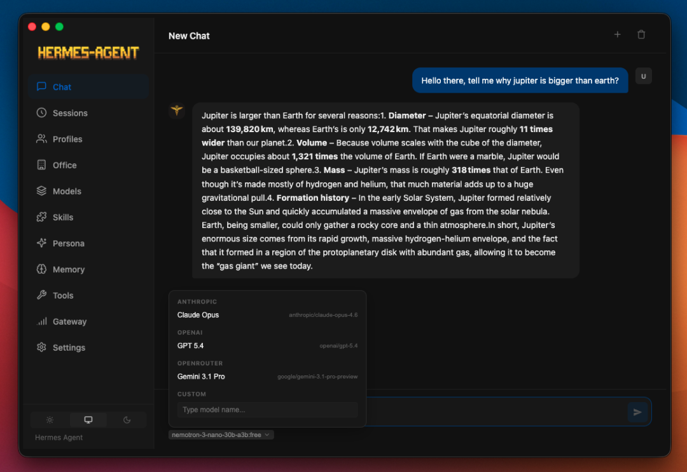
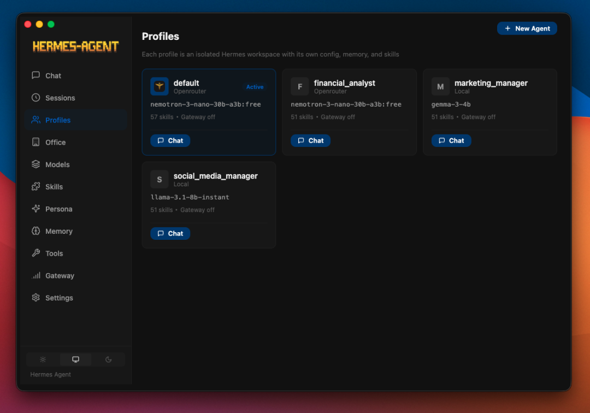
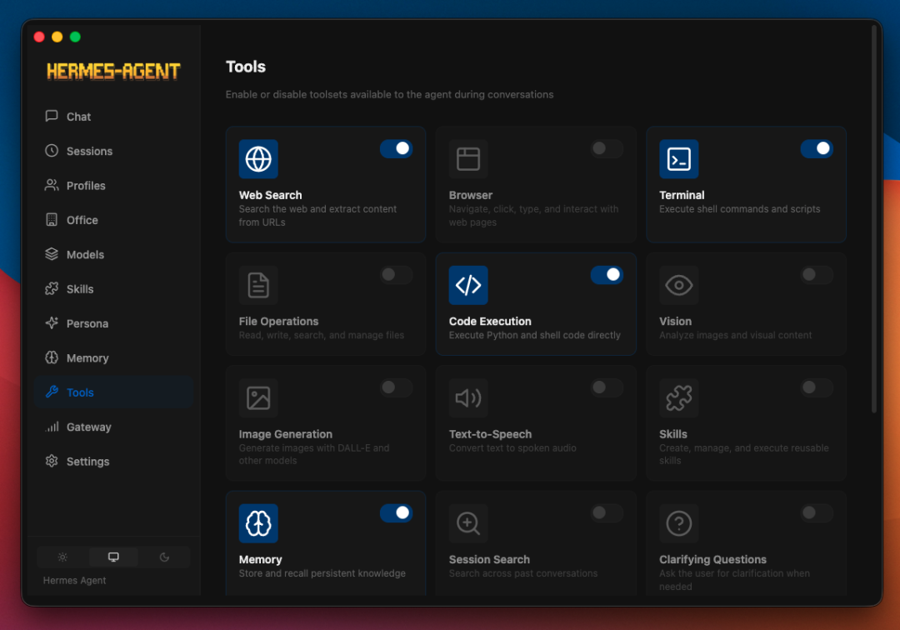
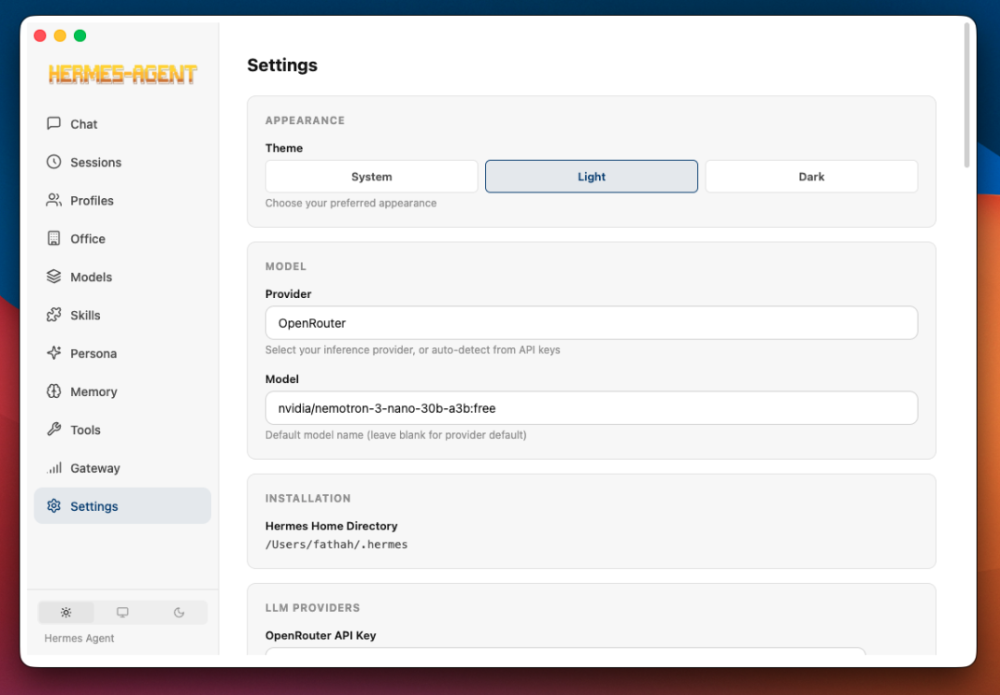
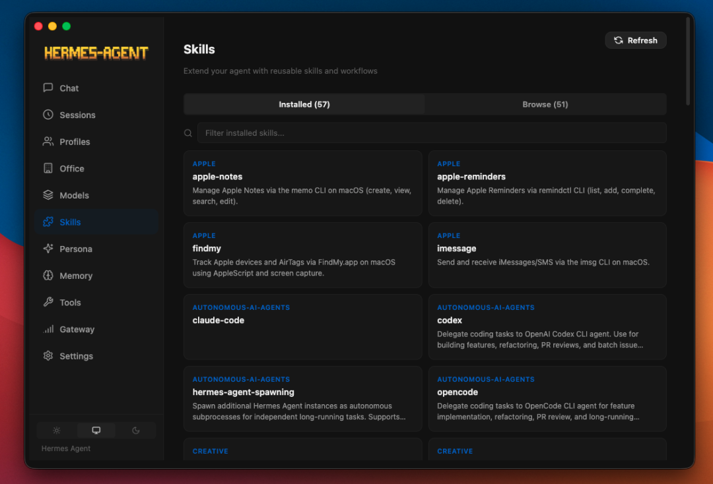
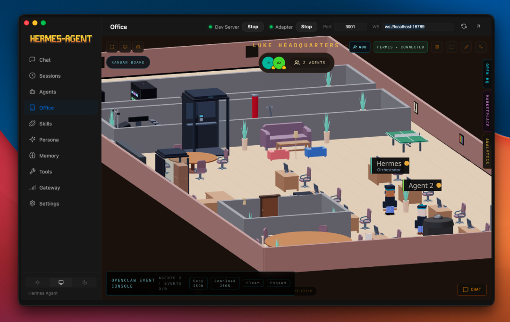

> 📎 来源: [AI拾研所](https://mp.weixin.qq.com/s?__biz=Mzg2NTEzODgzOA==&mid=2247483746&idx=1&sn=4ff56e6fa00e17831372dd3b75daae6a&chksm=cf75e907de6c6645790dd151904777c9030719300291309557d51937884be0692d925013e115&mpshare=1&scene=1&srcid=0511Msh7daF3YkTBHR9I35ub&sharer_shareinfo=c58c6a84ba0f7ff1b57ade71e1b98032&sharer_shareinfo_first=c58c6a84ba0f7ff1b57ade71e1b98032) | 时间: 2026-05-11 21:56

---

等了挺久的东西，终于出来了。

Hermes Agent 这个项目，关注开源 AI 圈的人应该不陌生。Nous Research 做的 AI 助手，能调工具，能接多个消息平台，也能保留上下文记忆，GitHub 上关注度一直不低。但它之前有个很明显的门槛，纯命令行。

装环境、配 provider、启服务、切模型、接 Telegram，每一步都要敲命令、改配置。技术人觉得还好，但大部分人的反应基本是：这也太麻烦了，算了不玩了。

现在这个门槛降下来了。

一个叫 fathah 的开发者做了 Hermes Desktop，把 Hermes 里很多高频能力做成了图形界面。我试了几天，觉得值得聊聊。

最痛的一个点，是切模型。

Hermes 支持不少模型提供商，包括 OpenRouter、Anthropic、OpenAI、Gemini、Grok、通义千问、MiniMax、Hugging Face、Groq，还有各种本地端点。命令行里切模型，通常要改配置文件、重启服务，有时候还要排查 provider 报错。

到了 Desktop 里，就是一个下拉框。

点一下，切完继续聊。

这个改动看起来小，用起来差距很大。写长文可以用 Claude，快速问答可以用 OpenAI 系列，跑简单任务可以切到本地开源模型省成本。以前切一次模型可能要折腾几十秒，现在几秒钟解决。

这个体验一旦习惯，很难回去。

聊天界面做得也比较实用。

它用 SSE 做流式渲染，文字会持续输出，不是等半天一次性吐结果。工具调用的时候有进度展示，底部还有 token 计数器，可以看到当前对话用了多少 token，大概花了多少钱。

我觉得计数器是整个界面里很有价值的功能。

用 API 调模型，最怕的不是贵，而是不知道自己什么时候贵起来了。很多人跟 AI 聊半小时，回头一看账单才发现成本已经上去了。有了实时计数，会自然地控制对话长度，该收就收。

它还保留了 22 个斜杠命令，比如 /new 开新对话，/clear 清空，/web 搜索，/image 生图，/browse 浏览网页，/code 写代码，/shell 跑命令，/usage 看用量。

这些能力命令行里本来也有，但做成 GUI 之后，使用频率明显会提高。

路径越短，越容易触发。

会话管理也补上了。

Hermes Desktop 用 SQLite FTS5 做全文搜索。你可以搜关键词，把历史上相关对话捞出来。会话按日期分组，点进去还能接着聊。

这点其实很关键。

AI 对话不是一次性的。上周讨论过一个问题，这周想接着聊，但你已经记不清是在哪一轮对话里了。以前只能翻历史，现在搜索框一搜就出来。

对于真正长期使用 AI Agent 的人来说，这比多一个炫技功能更重要。

消息网关也做成了 GUI。

Telegram、Discord、Slack、WhatsApp、Signal、飞书、钉钉、企业微信、iMessage，还有邮件和短信，都可以在界面里配置。以前接 Telegram，要改好几个配置文件，还要排查网络和 token。现在就是填 bot token，保存，测试。

打通之后，手机上就能跟 AI 对话。Desktop 负责配置和管理，后端或网关在本机/服务器上跑起来之后，日常使用不一定非要守着电脑。

还有一个很适合开源玩家的功能：技能管理。

Hermes 有技能系统，可以装各种技能包，比如写代码、做文档、爬网页、管日历。Desktop 里有 Skills 页面，可以看到已安装的技能，点进去看详情，也可以卸载，或者从社区装新的。

这类功能放在命令行里，很多人根本不会去碰。放进 GUI，就变成了可以逛、可以试、可以慢慢扩展的东西。

它还支持本地和远程两种模式。

本地模式适合个人使用，数据尽量留在本机。远程模式可以连到服务器上的 Hermes API。比如公司电脑装 Desktop，连接家里服务器上的 Hermes；或者反过来，用服务器负责常驻，桌面端负责管理和调试。

平台覆盖也比较全。

Windows 有 exe，macOS 有 dmg，Linux 有 AppImage、deb、rpm。首次启动会检测有没有装过 Hermes，没有的话会引导安装。顺利的话，几分钟内就能跑起来。

Hermes Agent 是 Nous Research 做的底座，Hermes Desktop 是 fathah 发起维护的社区桌面项目。

这也是开源社区有意思的地方：有人做底层能力，有人做上层体验，各取所需，然后把门槛一点点降下来。

当然，项目还在开发中，功能和界面后面都可能继续变。协议是 MIT，开源免费。

一直想试试 AI Agent，但被命令行劝退的人，这个值得看看。

项目地址放文末，也可以去 GitHub 搜 Hermes Desktop。

##
