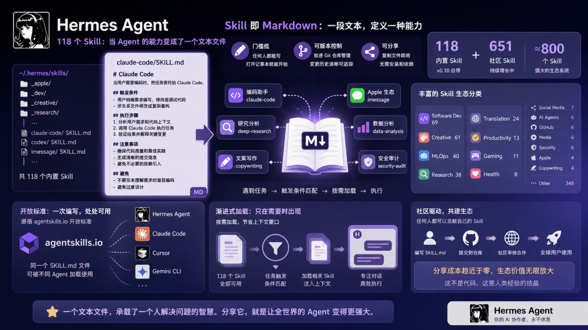
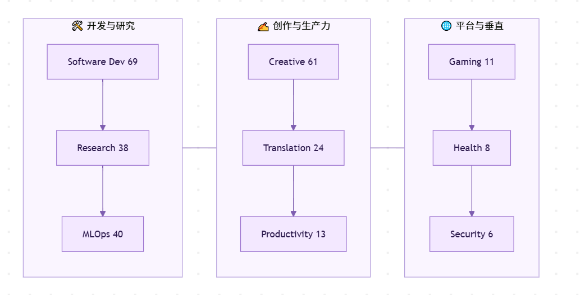

> 📎 来源: [AI赋能说](https://mp.weixin.qq.com/s?__biz=MzI3NjE4OTAyMg==&mid=2247488709&idx=2&sn=ee2fe91ee0ea9d71a875755f8b672f9d&chksm=eaf0813372141d441c643caf42b0700a794997015065cc2cf11861ecbce0f0adf96ed3caa61e&mpshare=1&scene=1&srcid=0510aE94sjdziOjQaLzhclwj&sharer_shareinfo=0f060548f25473ca43eda4d44b2ef58a&sharer_shareinfo_first=0f060548f25473ca43eda4d44b2ef58a) | 时间: 2026-05-10 15:55

---

打开 Hermes v0.10 的 skills 目录。118 个文件。

全是 Markdown。

没有 .py，没有 .js，没有任何可执行的代码。只有纯文本。文件名叫 SKILL.md。

我盯着屏幕看了几秒。这就是一个 Agent 的全部能力？

## 一个文本文件能做什么

随便打开一个。比如 claude-code。

里面写着：当用户需要编码时，把任务委托给 Claude Code。触发条件是什么，执行步骤是什么，注意事项是什么。

没有函数调用。没有 API 封装。就是一段话，告诉 Agent 遇到这种情况该怎么做。

再打开 codex。同样的结构。当用户需要编码时，委托给 OpenAI Codex。

还有 Apple 生态的四个 Skill：iMessage、Reminders、FindMy、Notes。教 Agent 怎么和苹果的原生应用交互。

全是文字。全是 Markdown。

想了想。这不就是一本操作手册吗。

新员工入职，你给他一本手册。手册里写着：遇到客户投诉怎么处理，遇到退货请求走什么流程，遇到技术问题找谁。

手册不是能力。但手册让能力有了方向。

## 118 个内置，651 个社区

v0.10 自带 118 个 Skill。社区已经贡献了 651 个。

加起来快 800 个。

分类看一眼：

Software Dev 69 个，Creative 61 个，MLOps 40 个，Research 38 个。这四类占了大头。

还有 Translation 24、Productivity 13、Gaming 11、Health 8、Social Media 7、AI Agents 6、GitHub 6、Media 6、Security 6、Apple 4、Copywriting 4。

剩下 348 个归在 Other。

数字本身不重要。重要的是这些东西的生长速度。从 0 到 651，社区自发贡献。没有人审核代码，因为没有代码可审。写一段 Markdown，提交，就是一个新 Skill。

## 为什么是 Markdown

这是我最想聊的。

Skill 不是配置文件。配置文件定义参数。Skill 定义过程。

Skill 也不是 prompt 模板。模板是填空题。Skill 是一整套做事的方法。

它告诉 Agent：遇到这种任务，按我的方式来。先做什么，再做什么，注意什么，避免什么。

用 Markdown 写，意味着三件事。

第一，门槛低。任何人都能写。不需要会编程，不需要懂 API，不需要搭环境。打开记事本就能开始。

第二，可版本控制。放进 Git 仓库，和代码一起管理。谁改了什么，什么时候改的，一清二楚。

第三，可分享。发一个文件给别人，别人放进自己的 skills 目录，立刻可用。不需要安装，不需要配置，不需要依赖。

这让我想起 npm。

npm 之前，JavaScript 的代码复用靠复制粘贴。npm 之后，一行命令就能引入别人的工作成果。生态爆发了。

Skill 对 Agent 做的事情，和 npm 对 JavaScript 做的事情，结构上是一样的。

把能力变成可分享的单元。

## 开放标准：agentskills.io

Hermes 的 Skill 不是私有格式。

它遵循 agentskills.io 的开放标准。这意味着同一个 SKILL.md 文件，可以被不同的 Agent 加载。

Claude Code 能用。Cursor 能用。Gemini CLI 能用。

写一次，到处跑。

这和 npm 包只能在 Node.js 里用不一样。这更像是一个跨运行时的标准。

awesome-hermes-agent 是社区维护的仓库，收集优质 Skill。任何人可以提交，任何 Agent 可以使用。

不对。等一下。

这意味着你为 Hermes 写的 Skill，别人可以直接拿去给 Claude Code 用。反过来也一样。

Skill 的价值不绑定在任何一个 Agent 上。它属于写它的人。

## 渐进式加载

118 个 Skill 不会同时塞进上下文。

Hermes 用的是 progressive disclosure。按需加载。

当前任务触发了哪个 Skill 的条件，才把那个 Skill 的内容注入上下文。其余的不动。

这解决了一个实际问题：token 是有限的。如果 118 个 Skill 全部加载，光 Skill 本身就要占掉大量上下文窗口。留给用户对话的空间就不够了。

按需加载，意味着 Skill 可以无限增长，而单次对话的 token 消耗不会线性增加。

想了想。这也像人。

你会做很多事。但你不会同时想着所有事。有人问你做菜，你才调出做菜的记忆。有人问你写代码，你才切换到编程的思维模式。

能力在那里。但只在需要的时候出现。

## 我在想什么

看完这 118 个 Skill 和社区的 651 个，我脑子里反复出现一个画面。

一个人坐在电脑前，打开编辑器，写了一段 Markdown。

写的是他做某件事的方法。他怎么调试代码，他怎么写文档，他怎么做代码审查。

写完了。保存。放进 skills 目录。

从此以后，他的 Agent 就按他的方式做事了。

不需要训练模型。不需要微调。不需要写代码。

一个文本文件，改变了 Agent 的行为。

这是「Skill 即 Markdown」的设计哲学。

它把 Agent 的能力从黑箱里拿出来，变成了人人可读、可写、可改的东西。

你不满意 Agent 的做法？打开 SKILL.md，改几行字。

你有更好的方法？写一个新的 SKILL.md，分享给社区。

你换了一个 Agent？把 skills 目录复制过去，能力跟着你走。

这不是技术突破。没有新的模型架构，没有新的训练方法。

但它可能是 AI Agent 领域的一个转折点。

当能力变成文本，分享的成本趋近于零。当分享的成本趋近于零，生态就会爆发。

npm 证明过这件事。Docker Hub 证明过这件事。

现在轮到 Skill 了。

---

**参考资料**

- Hermes Agent GitHub[1]
- agentskills.io 开放标准[2]
- awesome-hermes-agent 社区仓库[3]
- Hermes v0.10 Release Notes[4]

Reference

[1] 

Hermes Agent GitHub: *https://github.com/NousResearch/hermes-agent*

[2] 

agentskills.io 开放标准: *https://agentskills.io*

[3] 

awesome-hermes-agent 社区仓库: *https://github.com/awesome-hermes-agent/awesome-hermes-agent*

[4] 

Hermes v0.10 Release Notes: *https://github.com/NousResearch/hermes-agent/releases/tag/v0.10.0*

**下方是赋能君的AI学习交流永久免费星球，想学习更多内容，欢迎扫码加入。**

🙌 如果你阅读到这里，说明我们对信息的认可区域是有一定交集的，可以说我们是同道中人，所以如果你有自认为不错的信息获取渠道，欢迎留言或者私聊我，谢谢。

都看到这里了，就给个关注吧👀：

喜欢我的文章，可以请你右下角顺手来一波点赞&在看&分享三连么👉
