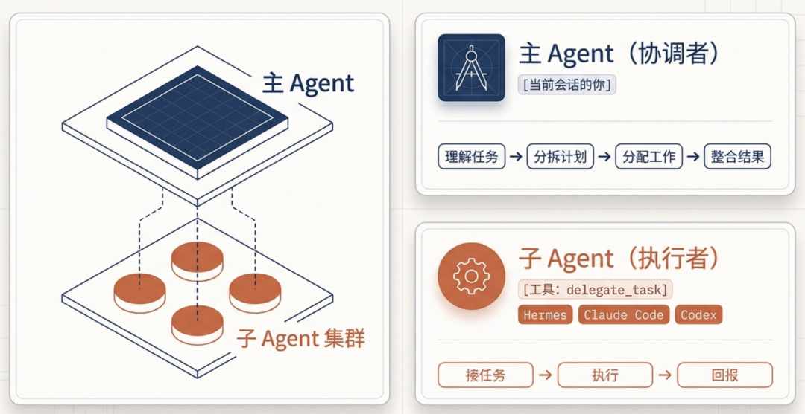
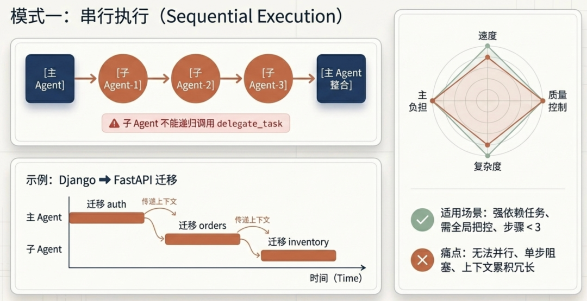
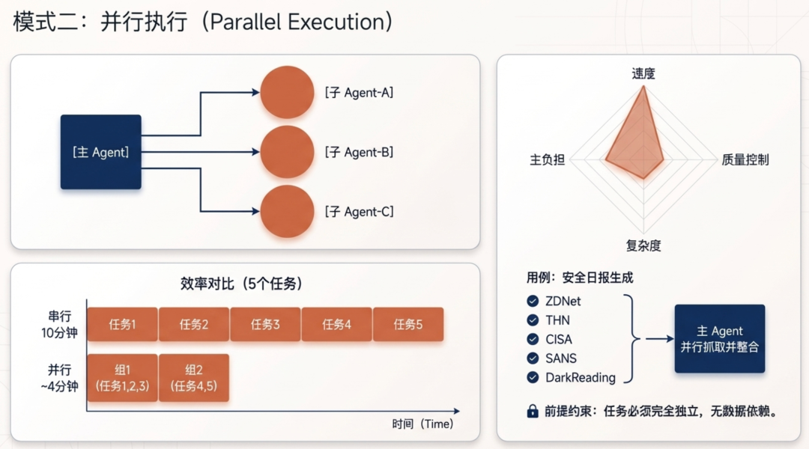
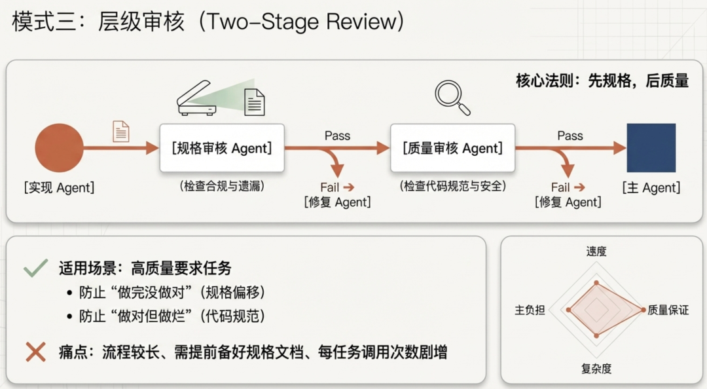
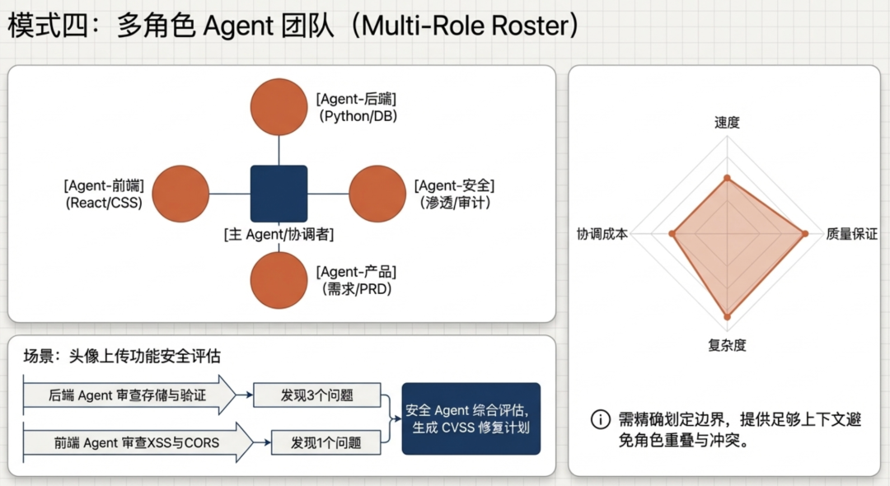
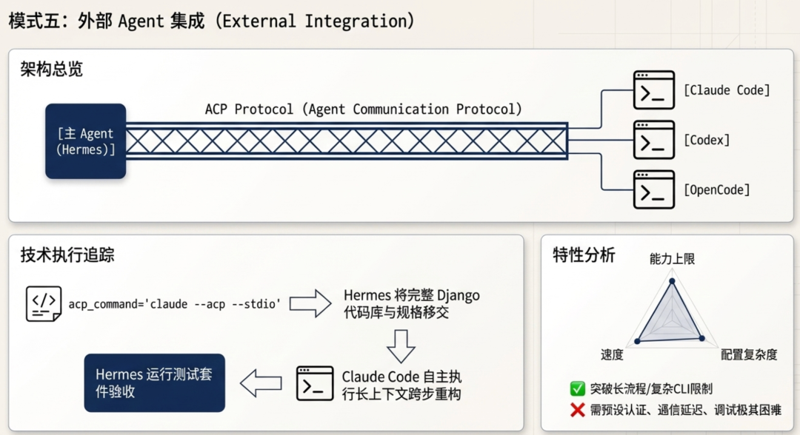
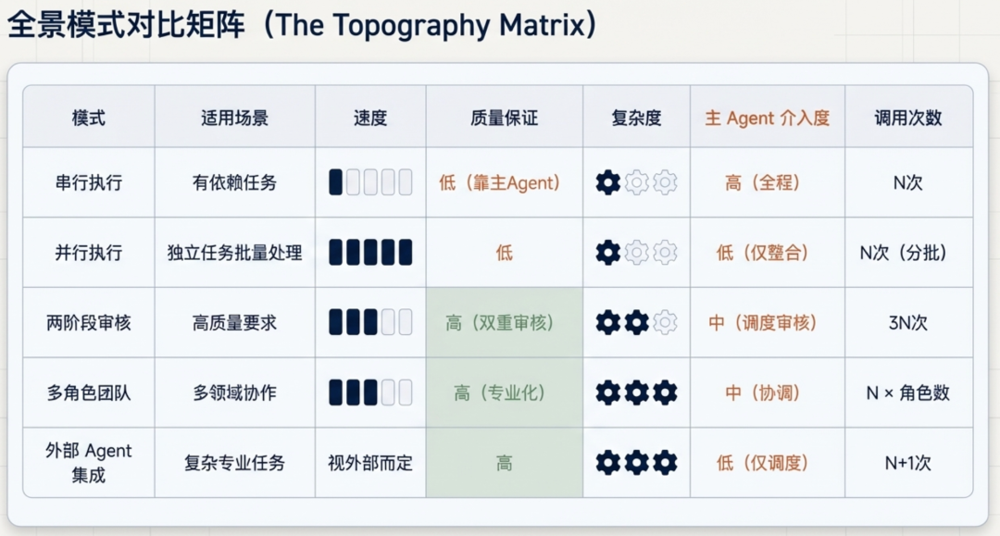
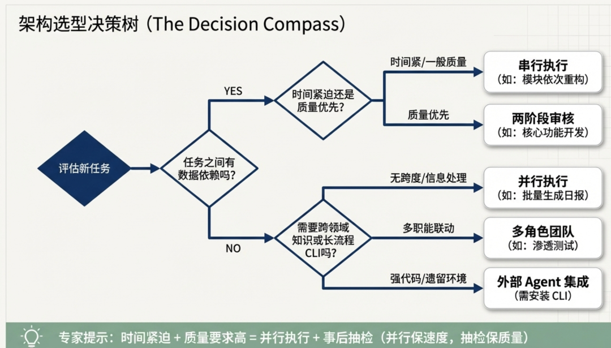

> 📎 来源: [斐哥讲AI](https://mp.weixin.qq.com/s?__biz=MzYzNTg3NTM2NA==&mid=2247483700&idx=1&sn=3f3184d80fe11f33ecae3e3e52ea3ac1&chksm=f186f2cd852f008fae6e65fc7c26ccdfa8dbdf28a73aff572907a088d778e396914dfdff7a40&mpshare=1&scene=1&srcid=0420b1ftFIt0bsykpHd0Hcuc&sharer_shareinfo=9590649dfa4aeac9a637545d05aff307&sharer_shareinfo_first=9590649dfa4aeac9a637545d05aff307) | 时间: 2026-04-20 19:15

---

## 前言

## 嗨，我是斐哥（斐·AI）。

单个 AI Agent 的能力有上限。当任务复杂到需要并行处理、多角色分工、或跨领域协作时，多 Agent 协作就成了必然选择。

本文系统梳理 Hermes 支持的五种多 Agent 模式，对比不同协作架构的优劣，并给出各场景下的实践建议。

---

## 一、Agent 分工模式总览



Hermes 的多 Agent 能力分为两层：

|  |  |  |
| --- | --- | --- |
| 层级 | 工具 | 定位 |
| 主 Agent | 当前会话的你 | 协调者：理解任务、分拆计划、分配工作、整合结果 |
| 子 Agent | delegate\_task | 执行者：接任务、执行、回报 |

子 Agent 可以是：

- Hermes 自身（同一模型，不同上下文）
- Claude Code（Anthropic CLI Agent）
- Codex / OpenCode（OpenAI/第三方 CLI Agent）

---

## 二、模式一：串行执行（Subagent 顺序调用）



### 架构

```
主 Agent → 子Agent-1 → 子Agent-2 → 子Agent-3 → 主 Agent 整合
```

### 原理

子 Agent 按顺序一个接一个执行，每个拿到完整上下文，独立完成后把结果交回主 Agent。

### 使用场景

- 任务有依赖关系（下一步依赖上一步结果）
- 需要主 Agent 把控流程（每步完成后决策）
- 步骤少（3 步以内）、每步较复杂

### 示例

大型重构项目，需要逐模块处理：

```
主 Agent 理解任务："把 Django REST API 迁移到 FastAPI，涉及 auth/orders/inventory 三个模块"分拆为串行任务：Task-1: 迁移 auth 模块（token 逻辑、用户模型）Task-2: 迁移 orders 模块（订单 CRUD、支付回调）Task-3: 迁移 inventory 模块（库存扣减、仓储对接）主 Agent 调度：delegate_task(goal="迁移 auth 模块...", context=完整上下文)         ↓ auth 完成delegate_task(goal="迁移 orders 模块...", context=auth 结果 + 原始上下文)         ↓ orders 完成delegate_task(goal="迁移 inventory 模块...", context=orders 结果 + 原始上下文)         ↓ 主 Agent 整合 + 写迁移文档
```

### 优点

- 简单直观，容易把控
- 每步结果直接流入下一步
- 主 Agent 全程可见可控

### 缺点

- 无法并行，速度慢
- 某步失败会阻塞后续
- 上下文随步骤累积可能变长

### 风险提示

- 子 Agent 不能调用 delegate\_task（无递归）
- 子 Agent 失败时，建议派新的修复 Agent 而非主 Agent 亲自接手（避免上下文污染）

---

## 三、模式二：并行执行（Batch Tasks）



### 架构

```
主 Agent → [子Agent-A | 子Agent-B | 子Agent-C] 三路同时执行
```

### 原理

使用 delegate\_task 的 tasks 数组，最多 3 个任务同时跑，各子 Agent 完全独立，共享结果由主 Agent 整合。

### 使用场景

- 任务完全独立（无数据依赖）
- 需要快速得到多个结果再综合判断
- 探索性研究（多个信息源并行抓取）

### 示例

安全日报生成，多源并行抓取：

```
主 Agent："请帮我抓取以下 5 个安全资讯源，整理成今日日报"并行任务列表：Task-A: 抓取 ZDNet Security RSSTask-B: 抓取 The Hacker NewsTask-C: 抓取 CISA AdvisoryTask-D: 抓取 SANS Internet Storm CenterTask-E: 抓取 DarkReading结果返回：[  {source: "ZDNet", items: [...]},  {source: "THN", items: [...]},  {source: "CISA", items: [...]},  {source: "SANS", items: [...]},  {source: "DarkReading", items: [...]}]主 Agent 整合：去重 → 按安全相关性过滤 → 按热度排序 → 生成最终日报
```

### 优点

- 速度最快（3 路并行 vs 串行 3 倍时间）
- 每个子 Agent 上下文干净（无其他任务干扰）
- 适合 IO 密集型任务（等待网络/文件时其他 Agent 在工作）

### 缺点

- 任务必须相互独立（有依赖则无法并行）
- 结果整合由主 Agent 负责，有一定复杂度
- 默认最多 3 路并发（可通过分组突破）

### 效率对比

|  |  |  |
| --- | --- | --- |
| 模式 | 5 个任务各 2 分钟 | 总耗时 |
| 串行 | 5 × 2 = 10 分钟 | 10 分钟 |
| 并行（3路） | 组1(3个) 2分钟 + 组2(2个) 2分钟 | ~4 分钟 |

---

## 四、模式三：层级审核（两阶段 Review）



### 架构

```
主 Agent → 实现 Agent → 规格审核 Agent → 质量审核 Agent → 主 Agent
```

### 原理

每个任务完成后，经过两层独立审核（规格合规 → 代码质量），审核通过才进入下一步。这是 subagent-driven-development 技能的核心流程。

### 使用场景

- 对输出质量要求高的任务
- 需要防止"做完但没做对"（规格偏移）
- 需要防止"做对但做烂"（代码风格、安全等）

### 示例

实现一个新功能点：

```
Step 1: 实现 Agentdelegate_task(    goal="实现用户注册功能",    context="完整规格说明 + TDD 要求")→ 返回：已实现，测试全部通过Step 2: 规格审核 Agent"检查：是否所有规格要求都实现了？有没有多做或少做？"→ 返回：PASS 或 [具体差距列表]Step 3: 如有差距 → 修复 Agent 补上Step 4: 质量审核 Agent"检查：代码风格、安全性、测试覆盖、命名规范"→ 返回：APPROVED 或 [问题列表]Step 5: 如有问题 → 修复 Agent 处理Step 6: 全部通过 → 进入下一个任务
```

### 关键原则

- 先规格，后质量（顺序不能颠倒）
- 审核 Agent 不应该审查自己参与实现的部分
- 发现问题 → 修复 Agent 处理 → 重新审核（不要跳过复审）

### 优点

- 质量稳定，每个任务都经过两道关卡
- 问题早发现（规格偏移比代码风格问题更容易修正）
- 避免主 Agent 亲自 review 造成的上下文污染

### 缺点

- 流程较长（适合重要任务，不适合快速探索）
- 需要提前准备好规格文档
- Agent 调用次数多（每个任务至少 3 次）

---

## 五、模式四：多角色 Agent 团队



### 架构

```
主 Agent（协调者）├── Agent-后端（专精 Python/数据库）├── Agent-前端（专精 React/CSS）├── Agent-安全（专精渗透测试/安全审计）└── Agent-产品（专精需求分析/PRD）
```

### 原理

不同子 Agent 扮演不同角色，每个有自己独立的工具集和知识域，主 Agent 按需调度不同角色，处理复杂的多域任务。

### 使用场景

- 大型功能开发（后端 + 前端 + 安全联动）
- 安全渗透测试（信息收集 → 漏洞扫描 → 漏洞利用 → 报告）
- 复杂项目评估（技术可行性 + 商业可行性 + 资源评估）

### 示例

为一个新功能做安全评估：

```
主 Agent 协调："对用户上传头像功能做完整安全评估"调度后端 Agent（2 分钟）："审查头像上传的后端实现：文件验证、存储路径、访问控制"→ 返回：发现 3 个问题调度前端 Agent（2 分钟）："审查头像上传的前端实现：输入校验、XSS 风险、CORS"→ 返回：发现 1 个问题调度安全 Agent（2 分钟）："综合上述发现，评估整体风险等级，给出修复优先级"→ 返回：综合报告主 Agent 整合：汇总所有发现 → 按 CVSS 评分排序 → 生成修复计划
```

### 优点

- 专业化强（每个 Agent 深耕自己领域）
- 覆盖面广（主 Agent 不可能同时精通所有方向）
- 可并行（多个角色同时工作）

### 缺点

- 协调成本高（主 Agent 需要正确拆分任务边界）
- 角色定义模糊时可能产生重复或遗漏
- 需要足够的上下文让每个 Agent 理解自己的职责

---

## 六、模式五：外部 Agent 集成



### 架构

```
主 Agent（Hermes）├── Claude Code（Anthropic CLI，作为子 Agent）├── Codex（OpenAI CLI，作为子 Agent）└── OpenCode（第三方 CLI，作为子 Agent）
```

### 原理

Hermes 作为协调层，通过 ACP（Agent Communication Protocol）协议调用外部专业 Agent，每个 Agent 可以用不同模型、不同工具链。

### 使用场景

- 需要执行复杂的 CLI 操作（Claude Code 适合长流程开发）
- 需要不同模型能力（Codex 的代码能力、Claude 的推理能力）
- 遗留系统交互（特定工具有现成的环境）

### 示例

用 Claude Code 做复杂重构：

```
主 Agent："帮我完成这个 Django 项目的 FastAPI 迁移"调度 Claude Code Agent（通过 acp_command='claude --acp --stdio'）：给它完整的迁移规格 + 当前代码结构→ Claude Code 自主完成整个迁移流程→ 返回：迁移完成的代码库 + 变更清单主 Agent 审核结果：运行测试套件 → 确认迁移质量 → 生成迁移报告
```

### 优点

- 各取所长（不同 Agent 用最适合的模型和工具）
- 可处理极复杂任务（Claude Code 适合长上下文、多步骤）
- 解耦主 Agent 和具体执行细节

### 缺点

- 配置复杂（需要各 CLI Agent 已安装且认证）
- 调试困难（子 Agent 出问题时诊断成本高）
- 通信开销（AC P协议调用有额外延迟）

---

## 七、模式对比总览



---

## 八、场景选型指南



### 按任务类型选模式

|  |  |  |
| --- | --- | --- |
| 任务类型 | 推荐模式 | 原因 |
| 多源信息抓取（日报生成） | 并行执行 | 各源完全独立，并行收益最大 |
| 代码重构（多模块依次改） | 串行执行 | 模块间可能有依赖 |
| 功能开发（要求高质量） | 两阶段审核 | 需要规格和代码双重保障 |
| 安全渗透测试 | 多角色团队 | 信息收集/扫描/利用/报告分工明确 |
| 复杂系统设计 | 外部 Agent 集成 | 任务太复杂，需要最强大的代码能力 |

### 按时间和质量权衡

```
时间紧迫 + 质量要求一般→ 串行执行（快速完成，主 Agent 把控）时间充裕 + 质量要求高→ 两阶段审核（质量优先）时间紧迫 + 质量要求高→ 并行执行 + 事后抽检（并行保证速度，抽检保证质量）
```

### 按团队配置选工具

|  |  |
| --- | --- |
| 团队配置 | 推荐方案 |
| 纯 Hermes 用户 | 串行 + 并行 + 两阶段审核（纯内调度） |
| Claude Code 已安装 | 复杂任务交给 Claude Code |
| 多 CLI Agent 都有 | 按任务类型分配给最合适的 Agent |

---

## 九、实战建议

### 建议一：先用简单模式

不要一开始就设计复杂的多 Agent 架构。从串行执行开始，确保任务能跑通，再升级到并行或两阶段审核。

### 建议二：控制子 Agent 上下文

子 Agent 的 context 要完整但专注：

- 提供足够背景让它理解任务
- 不要塞入无关信息（子 Agent 不会用到的那部分）
- 超出它关注范围的上下文会干扰它

### 建议三：失败时派新 Agent 修复

子 Agent 失败时，不要让主 Agent 亲自去修（会污染主 Agent 上下文）。应该：

```
子 Agent 失败 → 主 Agent 派新的修复 Agent → 新 Agent 定位问题 → 修复 → 复审
```

### 建议四：并行任务要真正独立

并行执行的子任务必须无任何数据依赖。一个检查方法是：

> "如果任务 B 先于任务 A 完成，任务 A 还能正常执行吗？"如果答案是"不能"，则不能并行。

### 建议五：善用 Batch 分组

默认最多 3 路并发。如果有 10 个独立任务：

```
第一批：3 个并行（~2 分钟）第二批：3 个并行（~2 分钟）第三批：3 个并行（~2 分钟）第四批：1 个并行（~2 分钟）总计：4 批 ~8 分钟（vs 串行 20 分钟）
```

---

## 十、总结

Hermes 的多 Agent 能力是分层设计的：

- delegate\_task 是核心工具，支持串行和并行两种基本模式
- 两阶段审核 是质量保障机制，适合重要任务
- 多角色团队 是复杂任务的协作架构，需要主 Agent 有较强的协调能力
- 外部 Agent 集成 是能力扩展，适合专业任务的最优工具选择

没有"最佳"模式，只有"最适合当前任务"的模式。理解每种模式的特点和适用边界，才能在实际工作中灵活切换。
