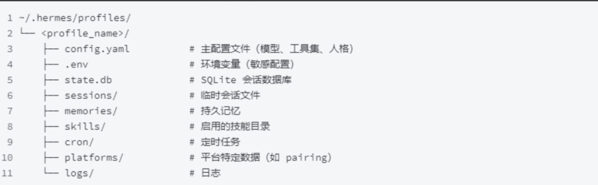
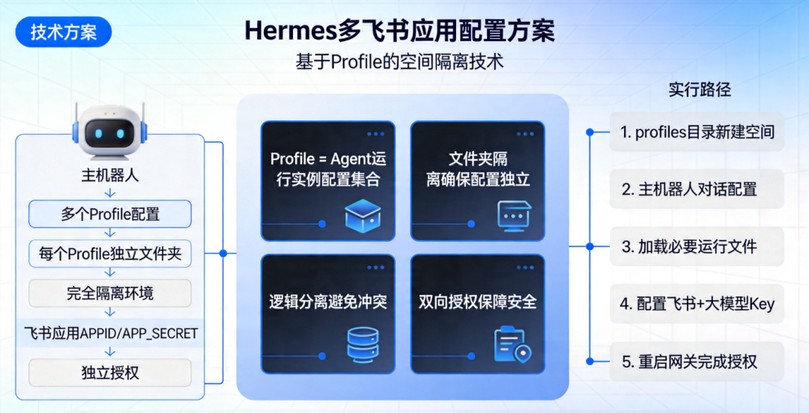
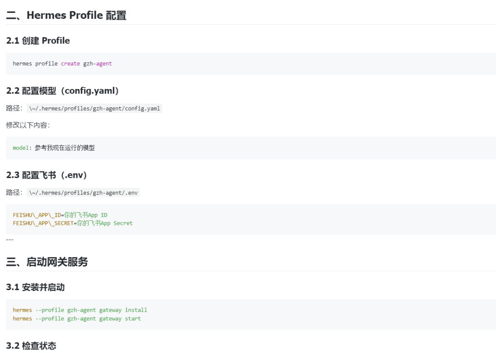
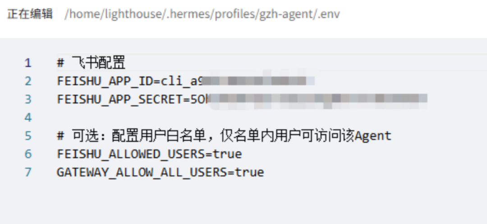
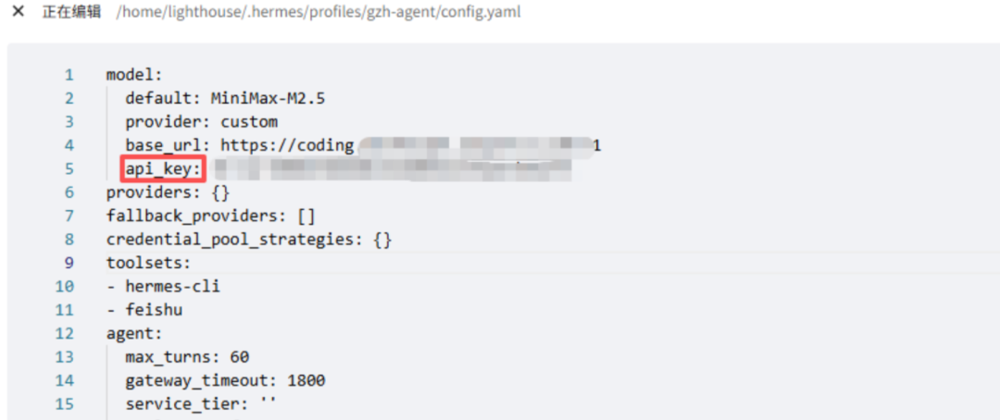
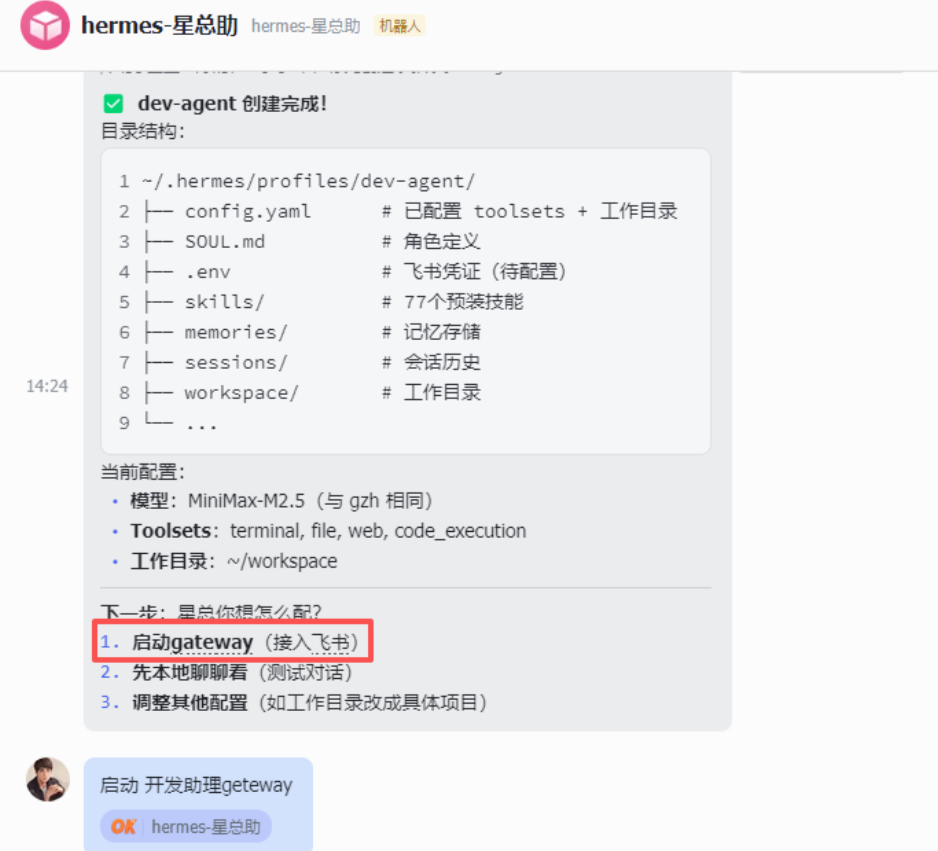
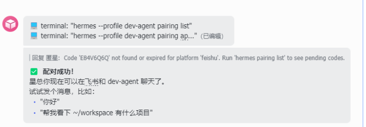

> 📎 来源: [匿星AI](https://mp.weixin.qq.com/s?__biz=MzYzOTA1MDAzMQ==&mid=2247486412&idx=1&sn=e93487594af381dc378604422c5da6ef&chksm=f1966433199a0b6669d01ba86662a6f46d206fe9a30bb1ea3f07f493cf5707356ade7193d8be&mpshare=1&scene=1&srcid=0424xMMJLZ3PdF3pa6nkKY2x&sharer_shareinfo=0c884d31d9ac91cd49e8e86077ec59f9&sharer_shareinfo_first=0c884d31d9ac91cd49e8e86077ec59f9) | 时间: 2026-04-24 00:19

---

既然小龙虾能配置多个飞书应用，那 Hermes 如何配置呢。在看了 Hermes 的源码结构是有点懵的，感觉好乱，无从下手。

花了一天时间，找了两种方案，配置了几次才成功，有需要的朋友可以去尝试。

如果不知道腾讯云如何部署Hermes 看这篇[小龙虾已死，新王Hermes登基，附腾讯云+飞书0基础部署指南](https://mp.weixin.qq.com/s?__biz=MzYzOTA1MDAzMQ==&mid=2247486363&idx=1&sn=56283a3968caa0cc84171888549cf579&scene=21#wechat_redirect)

我是匿星，主业程序员，专注于AI编程，副业工具提效，和5000+朋友一起共同创富！

## 一、 实现方案：基于 Profile 的空间隔离

**实现思路**

Hermes 的 **Profile** 是 Agent 运行实例的配置集合。



我们可以通过为每个飞书应用创建一个独立的文件夹，实现配置与逻辑的完全隔离。

**配置流程简述：**

1. 在 

   ```
   profiles
   ```

    目录下新建独立空间文件夹。
2. 通过与主机器人对话，参考 SOP 自动构建运行环境。
3. 加载必要文件，配置飞书与大模型 Key。
4. 重启网关（Gateway）并完成飞书双向授权。

   

## 二、 详细操作步骤

### 第一步：准备 SOP 指令文件

为了让 AI 辅助我们完成复杂的配置，需要先准备一份 SOP 文档。 将整理好的 

```
gzh-agent-sop.md
```

 上传到服务器指定位置（例如：

```
/home/lighthouse/
```

）

sop 可以扫底部二维码领取



### 第二步：指令触发空间创建

在 Hermes 的管理界面或通过命令行对话框，输入以下提示词（Prompt）：

```
我需要创建一个独立空间，用于配置一个可以和其他机器人通信的飞书应用。参考 `/home/lighthouse/gzh-agent-sop.md` 路径下的 SOP，完成新 Profile 的创建工作。
```

### 第三步：更新配置文件

创建完成后，进入对应的 Profile 路径（以 

```
gzh-agent
```

 为例）：

```
路径：/home/lighthouse/.hermes/profiles/gzh-agent/
```

1. **编辑 .env 文件：**

   点击“小眼睛”图标显示隐藏文件，打开 

   ```
   .env
   ```

   。

   填入该应用对应的飞书 

   ```
   APPID
   ```

    和 

   ```
   APP_SECRET
   ```

   。
2. **配置大模型 Key：**

   检查并更新当前 Profile 使用的模型配置，确保 API Key 正确无误

   

   

### 第四步：启动网关飞书授权

配置保存后，需要启动或重启该 Profile 对应的网关服务，使配置生效。

**执行校验命令：** 在服务端执行生成的授权校验命令。

**粘贴授权码：** 将飞书后台提供的校验码粘贴至配置界面。





我是匿星，今天分享就到这里，如果观看不便，可以移步飞书，查看更详细教程。

如果想和更多人一起交流 AI 使用心得？**扫描下方二维码**，拉你进「AI提效交流群」，一起调教出最懂你的 AI 助手


