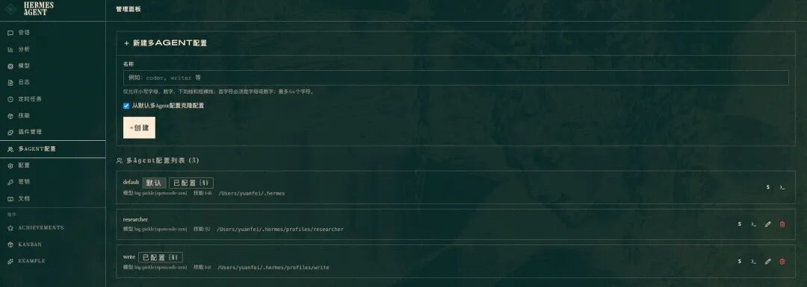
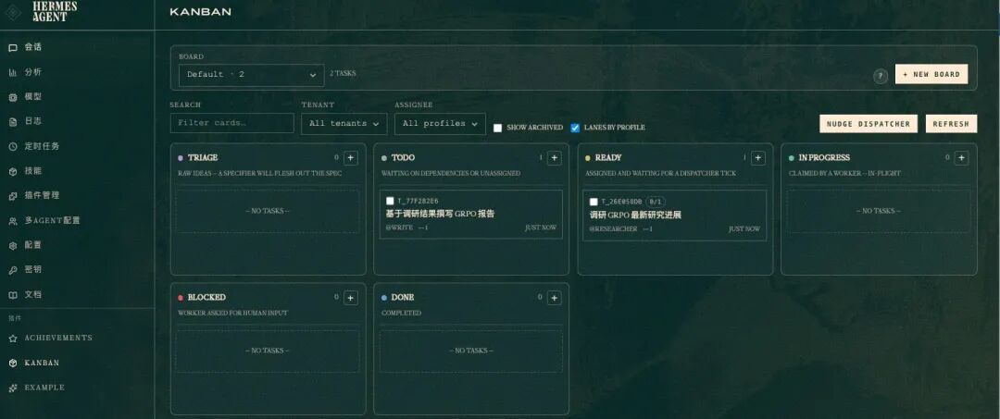
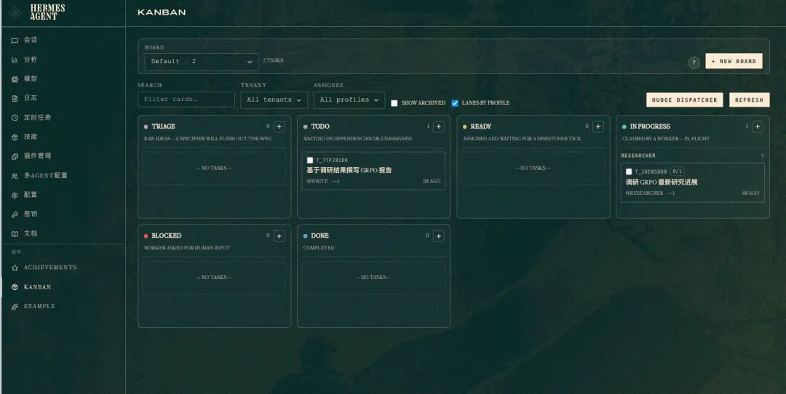
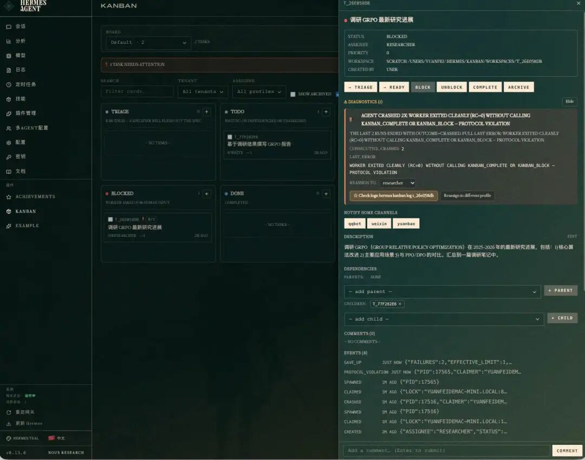
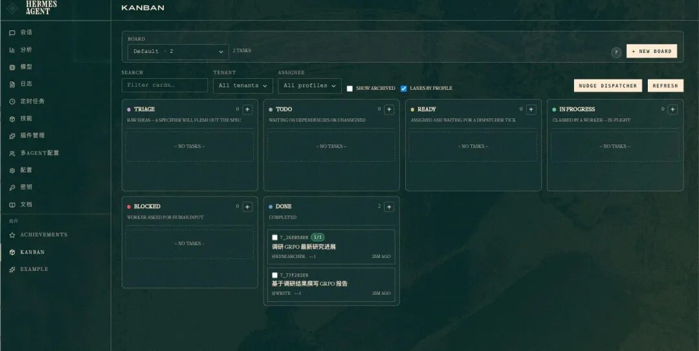

> 📎 来源: [飞哥的技术与烟火](https://mp.weixin.qq.com/s?__biz=MzAxNjU3NTY0MA==&mid=2454267940&idx=1&sn=3f54428e2edd309c6b49f85485ed67de&chksm=8d690b65a0368be6cc9cfdf8638627875369b670486a6727d0b256ed0ccad085a7e8a6996daf&mpshare=1&scene=1&srcid=0510TzuxmQAOojhrYFtp0yTf&sharer_shareinfo=28682b1d6ed9752def80a8dd694d7c3c&sharer_shareinfo_first=28682b1d6ed9752def80a8dd694d7c3c) | 时间: 2026-05-10 13:24

---

> 字数 808，阅读大约需 5 分钟

👇关注我，后续继续分享更多的 AI Agent、技术开发相关的文章.

紧接着上一篇:[Hermes(爱马仕)：如何搭建多Agent(智能体)任务编排系统](https://mp.weixin.qq.com/s?__biz=MzAxNjU3NTY0MA==&mid=2454267914&idx=1&sn=4f23c2cb35caa5243f00f227e0b46f8c&scene=21#wechat_redirect),继续讨论来点实用的,按照之前的操作我们应该已经按需求有了多Agent的角色以及给其安装了对应Skill,那么接下来我们就实操跑一个任务看下多agent如何开始做任务的.

以下是基于 

```
hermes v0.13.0
```

 版本操作的,低于该版本通过以下命令进行更新Hermes:

```
hermes update --yes
```

## 操作步骤

### 先开 Hermes Web UI

Kanban 任务状态在 Dashboard 里看得最清楚：

```
hermes dashboard #  Hermes Web UI → http://127.0.0.1:9119
```

会输出对应webui的本地访问网址,直接进行浏览器打开就行😌.

打开以后可以查看多Agent配置,以及agent profile配置位于什么位置:



多Agent配置

可以看到两个 Agent：

```
researcher
```

（负责调研）和 

```
write
```

（负责写作），每个都有自己的 Profile 配置——模型、工具集、权限。

***（UI 设计很有 90 年代内味儿 🫠）***

### 一句话下任务

然后我们直接使用聊天渠道给Hermes下任务:

不用写代码，直接聊天框里说：

```
> 创建一个调研 GRPO 最新进展的任务，分配给 researcher，再让 write 写个报告放到 Documents 文件夹。
```

**⚠️ researcher\write 可以取个中文名**.

系统自动拆成两个任务，建立依赖关系：

- **T1**（researcher）：调研 GRPO — 无依赖，直接跑
- **T2**（write）：撰写报告 — 依赖 T1，自动排队

T1 没做完 T2 不会启动，完全不用手动协调。



KanBan界面

以下界面可以看见正在进行中的任务:



任务执行界面

### 翻车了

任务开始后 

```
researcher
```

 直接 

```
blocked
```



任务详情和失败(BLOCK)

之前使用的火山Coding Plane过期,导致创建的

```
researcher
```

 使用了火山里面的模型,执行任务的时候就Block了.

### 修模型、重新跑

配置文件改一下，用回主模型：

```
# ~/.hermes/profiles/researcher/config.yamlmodel:  default: big-pickle  provider: opencode-zen  api_mode: chat_completions
```

然后 unblock + 重启 gateway：

```
hermes kanban unblock t_26e058dbhermes gateway restart
```

几分钟后 researcher 重新跑起来，**还自动拆了 2 个 subagent 并行查论文**——一个在 arXiv 搜 GRPO vs PPO 对比，一个在 Semantic Scholar 找 2025-2026 最新进展，互不干扰。

任务跑完后，它的工作报告直接传递给了 write Agent，后者基于调研结果撰写完整报告，保存到本地

```
Documents
```

文件夹内。整个过程不需要人工介入，Dashboard 上能看到每个任务的流转状态。



执行完成

## Kanban 的价值

这套机制最大的好处不是"跑通任务"，而是**异常处理全自动**：

1. 1. **失败自动阻塞** — 模型挂了任务卡住，不会浪费额度无限重试
2. 2. **修完自动恢复** — unblock 后接着进度跑，不用重来
3. 3. **依赖自动排队** — 上游没完成下游等着，零协调成本

配合 Web UI 能看每个任务的实时状态、日志和重试历史，一套完整的 AI 任务编排系统就跑起来了。

---

👇关注我，后续继续分享更多的 AI Agent、技术开发相关的文章.

**你也在搭多 Agent 系统？碰到了什么坑？评论区聊聊👇**
