> 📎 来源: [青菜浪人](https://mp.weixin.qq.com/s?__biz=Mzg4MzAwMzkwOA==&mid=2247492192&idx=1&sn=beb8235aa755cef1965eedd9ffdbac41&chksm=cea977393690c9d659ed4136ba678b41ab4b3073f4ccad008fa582dd5fa160d456209156df83&mpshare=1&scene=1&srcid=0425cpC6CxFI0fPlCwGCCaTb&sharer_shareinfo=769cbe24e495ed1173603da5eb37ca16&sharer_shareinfo_first=769cbe24e495ed1173603da5eb37ca16) | 时间: 2026-04-25 19:40

---

什么是 Hermes-Agent？

> Hermes-Agent 是一款开源的自主 AI 智能体框架，由 Nous Research 开发。它的最大特点是自我进化能力——用得越多，它越懂你！

🧠 持久记忆：跨会话记住你的偏好和习惯

🔧 40+内置工具：搜索、代码执行、文件处理开箱即用

🔄 自我学习：自动从任务中提炼可复用技能

🌐 多平台支持：终端、Telegram、Discord、飞书等

GitHub：https://github.com/NousResearch/hermes-agent

 一、安装指南

执行脚本前需先安装 git，否则会执行失败。可前往 git 官网【https://git-scm.com/book/zh/v2/%E8%B5%B7%E6%AD%A5-%E5%AE%89%E8%A3%85-Git】 获取安装步骤

Hermes-Agent官网地址：https://hermes-agent.nousresearch.com/docs/getting-started/installation

|  |
| --- |
| Bash                   curl -fsSL https://raw.githubusercontent.com/NousResearch/hermes-agent/main/scripts/install.sh | bash |

常见问题

问题1：如执行脚本报以下错误

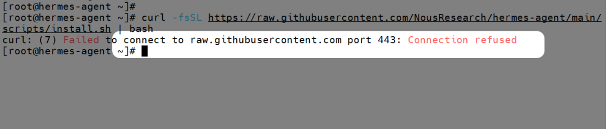

可尝试修改 DNS 服务器为 114.114.114.114、8.8.8.8 后再重新执行测试。

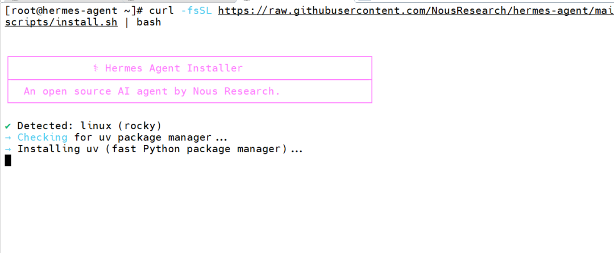

问题2：如执行 git 命令时频繁出现以下错误

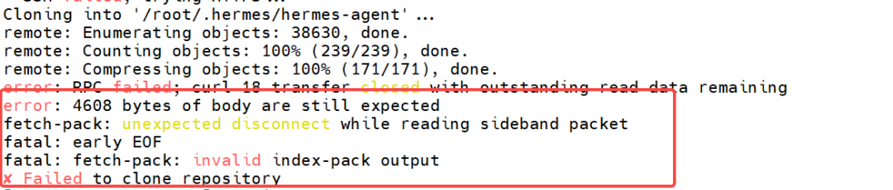

可直接前往 GitHub 下载整个项目文件，之后解压再进行安装：

|  |
| --- |
| Bash                   # Linux 系统中可使用 unzip 进行解压                   unzip hermes-agent-main.zip                   mv hermes-agent-main hermes-agent |

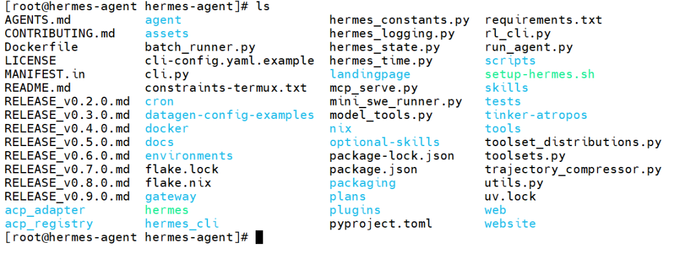

 二、开始安装 Hermes-Agent

此处可直接参考官网文档中给出的完整命令

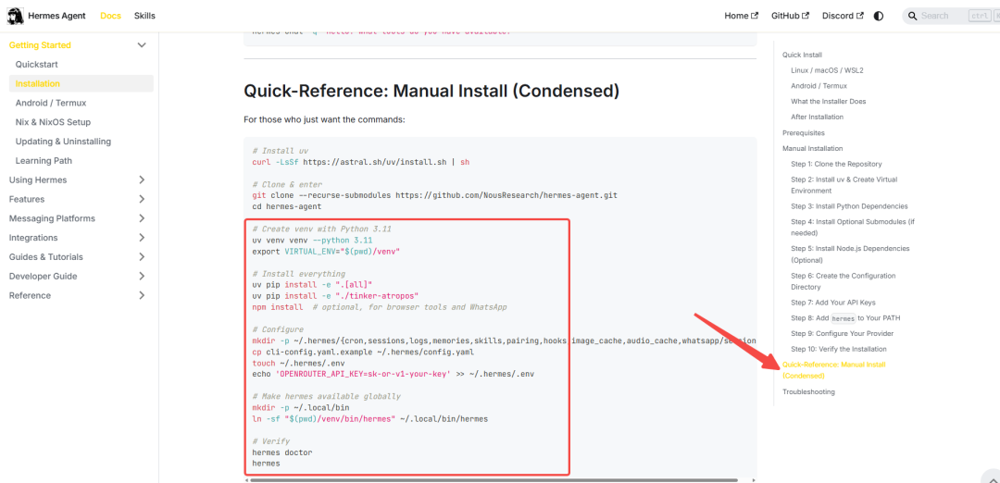

不过这里我们直接跳过前两步，从第三步开始执行：

|  |
| --- |
| Bash                   uv venv venv --python 3.11                   export VIRTUAL\_ENV="$(pwd)/venv"                    uv pip install -e ".[all]"                                   npm install                    mkdir -p ~/.hermes/{cron,sessions,logs,memories,skills,pairing,hooks,image\_cache,audio\_cache,whatsapp/session}                   cp cli-config.yaml.example ~/.hermes/config.yaml                   touch ~/.hermes/.env                   echo 'OPENROUTER\_API\_KEY=sk-or-v1-your-key' >> ~/.hermes/.env                    mkdir -p ~/.local/bin                   ln -sf "$(pwd)/venv/bin/hermes" ~/.local/bin/hermes                    hermes doctor                   hermes |

 一键部署脚本

这里提供一个 shell 脚本，方便一键执行：

|  |
| --- |
| Bash                   #!/bin/bash                   set -euo pipefail                    # ====================== Hermes 项目自动部署脚本 ======================                   # 前置要求：已安装 uv、python3.11、npm、git                   # 使用方法：chmod +x install.sh && ./install.sh                   # 注意：请执行完成后替换 ~/.hermes/.env 中的 API Key                   # ====================================================================                    echo "===== 开始部署 Hermes 项目 ====="                    # 1. 创建 Python 虚拟环境                   echo "创建 Python 3.11 虚拟环境..."                   uv venv venv --python 3.11                    # 2. 设置虚拟环境变量                   echo "配置虚拟环境变量..."                   export VIRTUAL\_ENV="$(pwd)/venv"                    # 3. 安装项目依赖                   echo "安装项目主依赖..."                   uv pip install -e ".[all]"                                     # 4. 安装前端 npm 依赖                   echo "安装 npm 前端依赖..."                   npm install                    # 5. 创建 Hermes 配置目录                   echo "创建 Hermes 配置目录..."                   mkdir -p ~/.hermes/{cron,sessions,logs,memories,skills,pairing,hooks,image\_cache,audio\_cache,whatsapp/session}                    # 6. 复制配置文件                   echo "复制配置文件模板..."                   cp cli-config.yaml.example ~/.hermes/config.yaml                    # 7. 创建环境变量文件                   echo "创建环境变量文件..."                   touch ~/.hermes/.env                   echo 'OPENROUTER\_API\_KEY=sk-or-v1-your-key' >> ~/.hermes/.env                    # 8. 创建全局命令软链接                   echo "创建 hermes 全局命令软链接..."                   mkdir -p ~/.local/bin                   ln -sf "$(pwd)/venv/bin/hermes" ~/.local/bin/hermes                    # 9. 环境检查并启动                   echo "===== 环境检查 (hermes doctor) ====="                   hermes doctor                    echo "===== 启动 Hermes ====="                   hermes                    echo -e "\n===== 部署完成 ====="                   echo "请手动编辑 ~/.hermes/.env 文件，替换为你的真实 OPENROUTER\_API\_KEY"                   echo "重启终端后，可直接全局执行 hermes 命令" |

运行结束后看到如下图的显示，就是安装成功了！

此时显示的为默认模型，这里是不可用的，后面可以修改为自己需要使用的模型。

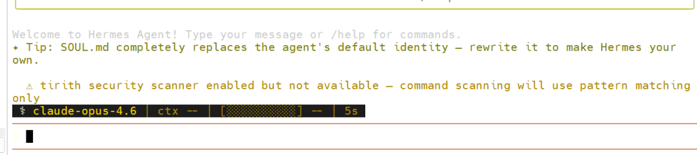

 

三、添加模型（以火山方舟模型为例）

编辑配置文件

|  |
| --- |
| Bash                   vi ~/.hermes/config.yaml |

修改为兼容 OpenAI 格式

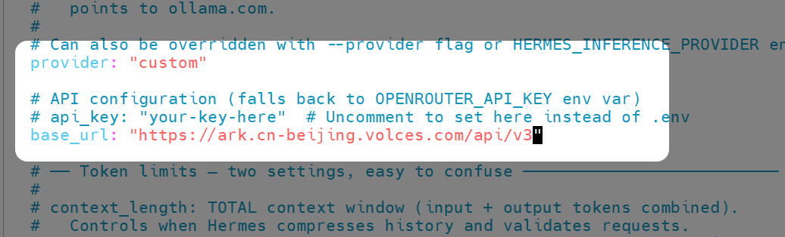

 修改默认模型

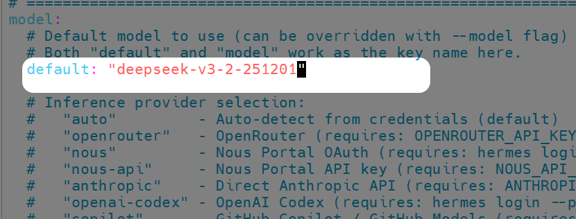

配置 API\_KEY

|  |
| --- |
| Bash                   vi ~/.hermes/.env |

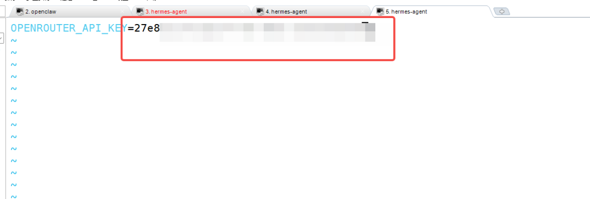

 重启服务，使配置生效

常用命令可以前往 官网文档 获取

|  |
| --- |
| Bash                   # 开启后台保活                   sudo loginctl enable-linger root                   # 重启服务                   hermes gateway restart                   # 运行 CLI                   hermes |

此时就可以进行对话了

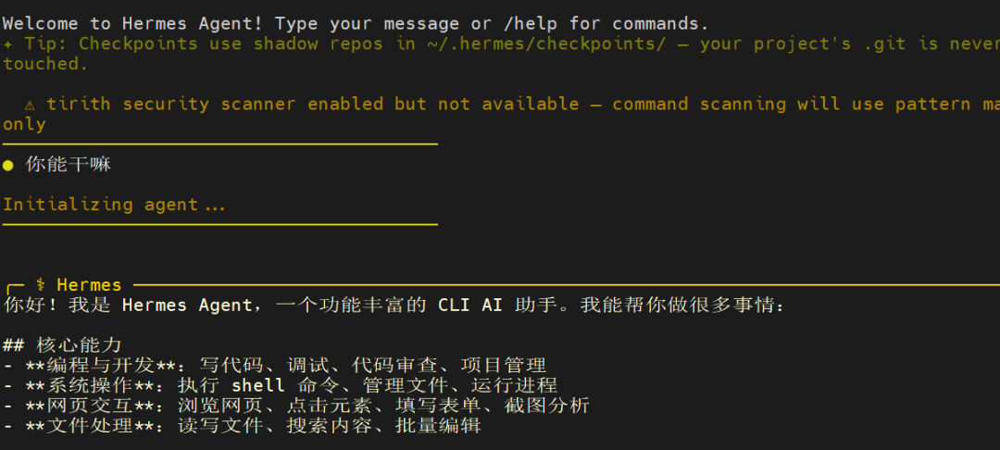

 

四、接入飞书中使用

 创建飞书应用（可选）

创建一个飞书应用，前往 飞书开发者后台 操作

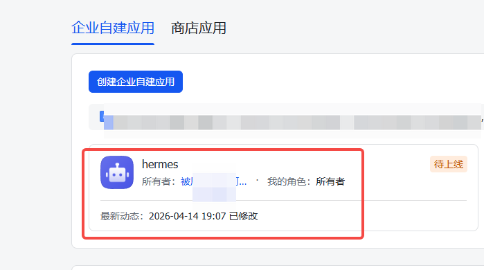

启用机器人能力

启用应用的机器人能力

 配置飞书机器人

配置飞书机器人

|  |
| --- |
| Bash                   hermes gateway setup |

选择你要配置的消息渠道：

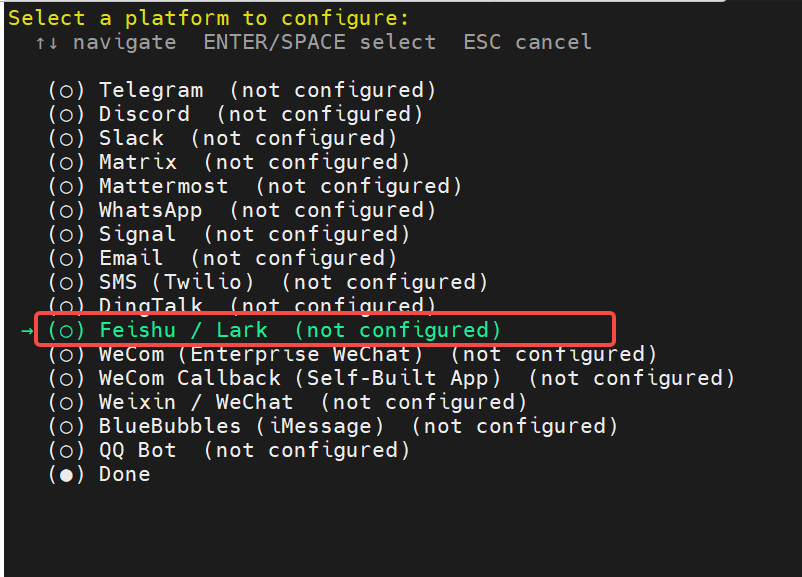

这里可以选择手动输入机器人授权码或扫码添加：

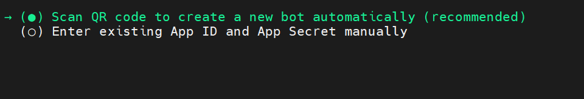

添加机器人后会自动安装所需的飞书插件。复制弹出的链接在飞书中打开就可以绑定或创建新的机器人了

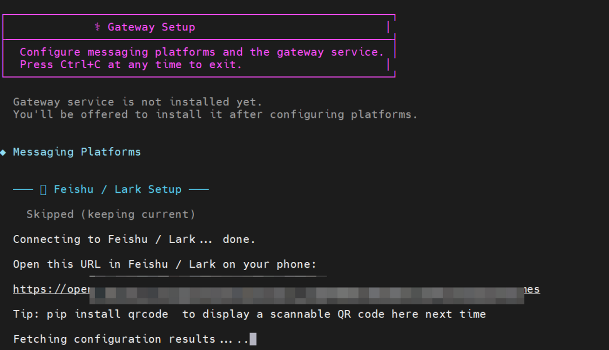

无特殊需要，后续的保持默认即可。

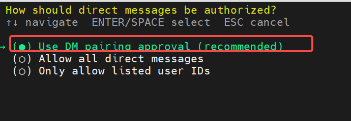

 完成配对

安装后在飞书给机器人发消息，会得到一个授权码

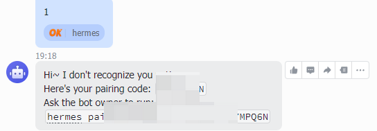

在服务器侧执行授权

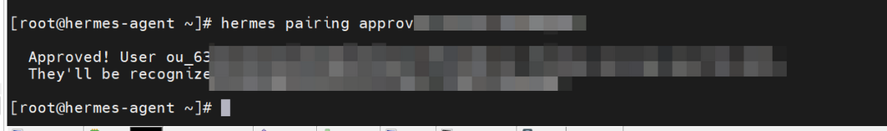

此时就可以在飞书和机器人对话了

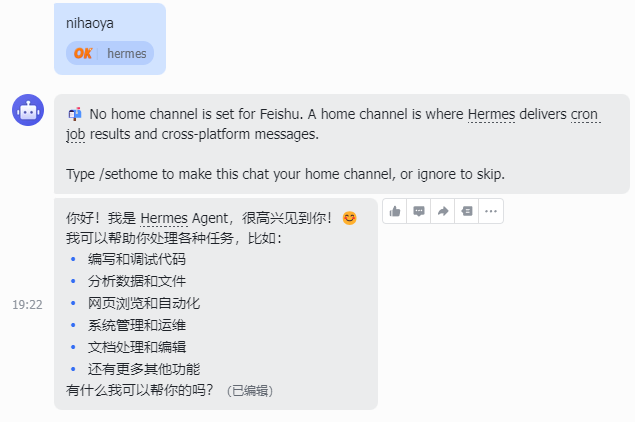

 

# ▽往期推荐△

# [Windows玩不了VLLM？WSL2部署教程，小白也能快速上手！](https://mp.weixin.qq.com/s?__biz=Mzg4MzAwMzkwOA==&mid=2247491605&idx=1&sn=53aaaa366650735abe974ef49ed48e00&scene=21#wechat_redirect) [告别复杂配置！轻松使用VLLM部](https://mp.weixin.qq.com/s?__biz=Mzg4MzAwMzkwOA==&mid=2247491562&idx=1&sn=24172cab1398d8e6c3d550b56dde5405&scene=21#wechat_redirect)[署大模型](https://mp.weixin.qq.com/s?__biz=Mzg4MzAwMzkwOA==&mid=2247491562&idx=1&sn=24172cab1398d8e6c3d550b56dde5405&scene=21#wechat_redirect) [手把手教你用DeepSeek：轻松拥有自己的AI助理](https://mp.weixin.qq.com/s?__biz=Mzg4MzAwMzkwOA==&mid=2247491052&idx=1&sn=1967176afab00ae602cfb50e2a88d489&scene=21#wechat_redirect) [夜莺监控系统部署小记](https://mp.weixin.qq.com/s?__biz=Mzg4MzAwMzkwOA==&mid=2247491845&idx=1&sn=33f342193e0d15ace767686c95de264a&scene=21#wechat_redirect) [告别手动！AI+Python自动化生成网络巡检报告](https://mp.weixin.qq.com/s?__biz=Mzg4MzAwMzkwOA==&mid=2247491760&idx=1&sn=6aa772006f403e738ee1ece78c18f7e1&scene=21#wechat_redirect) [告别单机局限！多机多卡部署大模型，GPU集群实战指南来了！](https://mp.weixin.qq.com/s?__biz=Mzg4MzAwMzkwOA==&mid=2247491626&idx=1&sn=30efd0e1dca09a78a48f721a1004696d&scene=21#wechat_redirect) [告别网络依赖！DeepSeek+Vs Code，离线状态也能轻松驾驭](https://mp.weixin.qq.com/s?__biz=Mzg4MzAwMzkwOA==&mid=2247491083&idx=1&sn=d9f32f83e95562a173990ca8bf0dbd85&scene=21#wechat_redirect) [手把手教你用DeepSeek：轻松拥有自己的AI助理](https://mp.weixin.qq.com/s?__biz=Mzg4MzAwMzkwOA==&mid=2247491052&idx=1&sn=1967176afab00ae602cfb50e2a88d489&scene=21#wechat_redirect) [普通电脑也能运行AI大模型？DeepSeek本地部署全攻略](https://mp.weixin.qq.com/s?__biz=Mzg4MzAwMzkwOA==&mid=2247491023&idx=1&sn=ee194ffa0812201fb7ca242bbce2a084&scene=21#wechat_redirect) [OpenClaw 部署实战：飞书集成篇](https://mp.weixin.qq.com/s?__biz=Mzg4MzAwMzkwOA==&mid=2247492148&idx=1&sn=88bfe6a3634af5aa3742a822ab20f839&scene=21#wechat_redirect) [数据库备份不用愁！Python帮你快速搞定](https://mp.weixin.qq.com/s?__biz=Mzg4MzAwMzkwOA==&mid=2247491197&idx=1&sn=098dbc9b83b6eff6d2b495f2cd34fea4&scene=21#wechat_redirect) [利用Python + MySQL，快速实现本地密码本自由](https://mp.weixin.qq.com/s?__biz=Mzg4MzAwMzkwOA==&mid=2247491177&idx=1&sn=c82c2ad7c42b294a71e07d3a289f59c9&scene=21#wechat_redirect) [Linux系统邮件告警神器：高效脚本大放送！](https://mp.weixin.qq.com/s?__biz=Mzg4MzAwMzkwOA==&mid=2247490975&idx=1&sn=28a29e36d4340b4253c09062b18190d1&scene=21#wechat_redirect) [揭秘！禁ping设备如何巧妙测试网络延迟](https://mp.weixin.qq.com/s?__biz=Mzg4MzAwMzkwOA==&mid=2247490950&idx=1&sn=5778c486b34fb52fa939882d1ba09fda&scene=21#wechat_redirect)
