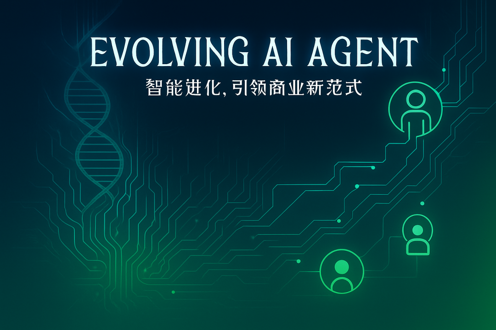

> 📎 来源: [自进化智能体](https://mp.weixin.qq.com/s/SWqxgGBPHrjFYKeltH5Znw) | 时间: 2026-04-24 23:57

---



**「如果你也关心这个方向，这里****⬇️****会持续更新」**

---

在 Hermes-Agent 的 Memory System 中，Honcho 是最被低估却最具革命性的可选插件。它不是简单的向量数据库或键值存储，而是 **Plastic Labs 开发的 AI-native 身份建模平台**（https://honcho.dev）。官方 Hermes 文档将其描述为“AI-native memory backend that adds dialectic reasoning and deep user modeling”，核心目标是：**让Agent不仅仅记住你说过什么，而是逐步构建一个动态的“你是谁”的模型**——你的偏好、沟通风格、目标模式、决策逻辑，甚至隐含的思考方式。

传统 Agent 的记忆是“被动存储 + 检索”，Honcho 则是“主动推理 + 持续学习”。它采用 **Peer Paradigm（对等范式）** 和**Dialectic Reasoning（辩证推理）**，让Agent与用户形成“对等关系”，通过每一次对话后的后台分析，提炼出可累积的**Conclusions（结论）**，实现跨会话、跨Agent的个性化深化。这正是 Hermes “用得越久越强大”的关键加速器之一。

延续前面三篇文章的分析：

[Hermes-Agent 入门指南：自进化 AI Agent的核心特性与快速上手](https://mp.weixin.qq.com/s?__biz=MzUxNTA0MzY0Nw==&mid=2247485764&idx=1&sn=93b14a80498ab8472ac73fcdcb1258c1&scene=21#wechat_redirect)

[Hermes-Agent 整体技术架构解析：模块化设计与运行时引擎](https://mp.weixin.qq.com/s?__biz=MzUxNTA0MzY0Nw==&mid=2247485776&idx=1&sn=ee294e339bd7f3cffc70139f3e0197aa&scene=21#wechat_redirect)

[Hermes-Agent 内置闭环学习循环：从输入到输出的完整流程与优化机制](https://mp.weixin.qq.com/s?__biz=MzUxNTA0MzY0Nw==&mid=2247485785&idx=1&sn=2351a11b2ff6c2e3d47c5ad465962b6d&scene=21#wechat_redirect)

[Hermes-Agent 持久化 Memory System：Agent curation、FTS5 搜索与用户建模原理](https://mp.weixin.qq.com/s?__biz=MzUxNTA0MzY0Nw==&mid=2247485793&idx=1&sn=511b9b519c1280704592cf9509c9ff6a&scene=21#wechat_redirect)

本文基于Hermes 官方文档、Honcho 官方集成指南、GitHub README、Vectorize.io 深度分析以及 Plastic Labs 博客，完整拆解 Honcho 的用户建模原理、架构机制、在 Hermes 中的集成方式、与内置 Memory 的协同，以及实际落地价值。读完后，你会对“AI 记忆”的有新的理解：未来 Agent 不是靠更大上下文窗口取胜，而是靠**建模身份、推理关系、持续演化**成为你的“数字分身”。

### 一、Honcho 的核心设计哲学：Peer Paradigm + Dialectic Reasoning

Honcho 的设计源于 Plastic Labs 对“用户-Agent关系”的重新思考。传统范式是“用户 vs 助手”（asymmetric），Honcho 则提出 **Peer Paradigm**：把用户和 AI 都视为**Peer（对等实体）**，置于同一个 Workspace（工作空间）中。

- **User Peer**：从用户消息中观察，学习你的偏好、目标、沟通风格、决策模式。
- **AI Peer**（如 Hermes 实例）：从助手消息中构建，记录Agent自身的“知识表示”。

这种对等设计实现了：

- **多Agent隔离**：不同 Hermes 实例（例如编码助手 vs 个人助理）拥有独立的 Peer Profile，避免上下文污染。
- **关系建模**：不仅建模“你”，还建模“你与Agent的互动动态”（turn-taking、反馈循环等）。
- **可扩展性**：支持多 Peer 会话（群聊、多Agent协作），远超单一用户-助手模式。

在此基础上，**Dialectic Reasoning（辩证推理）** 是 Honcho 的灵魂。它不是简单提取关键词或嵌入向量，而是**让 LLM 在对话结束后进行深度反思**：

- 分析整个交换（exchange），提炼 **Conclusions**（显性洞见，例如“你偏好简洁回复”“你经常关注 API 限额”）。
- 这些 Conclusions 不是一次性事实，而是**累积演化**的：随着对话增多，模型不断精炼、修正，形成对你的“运行时画像”（running model of who you are）。

官方描述精准：“Instead of simple key-value storage, **Honcho maintains a running model of who the user is — their preferences, communication style, goals, and patterns — by reasoning about conversations after they happen.**”

社区 Substack 进一步将这种建模描述为**跨越 12 层身份建模**（12 identity layers），从基础事实层到深层动机、关系动态、长期目标等（虽官方文档未明确编号，但原理一致）。 这不是静态标签，而是动态、辩证的：Agent通过工具（如 

```
honcho_conclude
```

）主动“讨论”上下文，形成闭环。

### 二、技术架构：从消息到 Peer Representation 的异步推理流水线

Honcho 的底层架构高度模块化，基于 Postgres + pgvector（或 LanceDB/Turbopuffer），核心实体包括：

- **Workspace**：应用/Agent级隔离。
- **Peer**：身份核心，每个 Peer 有自己的**Representation（表示）** 和**Peer Card（快速画像）**。
- **Session**：对话线程，支持多 Peer 参与。
- **Message**：原子消息，带源 Peer 标签，支持 directional（方向性）或 unified（统一）观察模式。
- **Collection**：向量嵌入文档集合，用于 RAG 和内部表示（Conclusions 就存这里）。
- **Document**：嵌入后的数据块。

**用户建模的核心流水线（异步 Derivation Pipeline）**：

1. 1. **消息捕获**：对话结束（或按 

   ```
   writeFrequency
   ```

    配置），消息存入 Session。
2. 2. **后台触发 Deriver（衍生器）**：异步任务队列处理：

- 提取 Observations（观察）。
- 生成 Session Summary（会话摘要）。
- 更新 Peer Representation（使用 LLM 进行 pattern detection、inference generation）。
- 高级模式下触发 “Dream”（surprisal-based 高级处理，使用专业模型）。

1. 3. **Conclusions 持久化**：推理结果存入保留 Collection，支持向量嵌入 + 语义索引。
2. 4. **Semantic Indexing**：支持 hybrid search（关键词 + 向量），供后续工具调用。

配置关键参数控制深度：

- ```
  dialecticReasoningLevel
  ```

  ：minimal / low / medium / high / max（控制 LLM 推理强度）。
- ```
  dialecticDynamic
  ```

  ：true 时根据查询复杂度自动调整。
- ```
  observation
  ```

  ：unified（默认）或 directional（分析对话动态）。
- ```
  recallMode
  ```

  ：hybrid（自动注入 + 工具） / context / tools。

这种异步设计确保**不阻塞 Agent 主循环**，却能实现“持续学习”（continual learning）。Vectorize.io 强调：Honcho 是“dialectic user modeling”的代表，专注于建模“你如何思考”，而非仅存“说过什么”。

### 三、在 Hermes-Agent 中的集成：Prompt 注入 + 工具暴露 + 记忆 Provider 抽象

Hermes 将 Honcho 作为 **Memory Provider Plugin**（v0.8.0 模块化设计），通过 

```
memory_provider.py
```

 抽象无缝接入 AIAgent 循环。

**工作机制**：

- **Prompt-time Context Injection**：会话启动时，Honcho 的 Peer Card + 相关 Conclusions 自动注入系统提示（与 MEMORY.md/USER.md 并行，但更动态）。
- **Cross-Session Continuity**：FTS5 搜索基础上叠加 semantic search over conclusions，实现“即使几个月前也记得你的风格”。
- **Durable Writeback**：Agent在任务中主动调用 

  ```
  honcho_conclude
  ```

   工具，将新学到的偏好持久化。

**暴露的 4 大工具**（tools/registry.py 自动注册）：

- ```
  honcho_profile
  ```

  ：快速无 LLM 调用，返回 curated key facts（Peer Card）。
- ```
  honcho_search
  ```

  ：语义搜索原始摘录。
- ```
  honcho_context
  ```

  ：Dialectic Q&A，由 Honcho LLM 合成历史答案（最强大）。
- ```
  honcho_conclude
  ```

  ：主动写 durable facts（用户明确偏好或纠正时触发）。

**CLI 与配置**：

```
hermes memory setup  # 选择 honcho，输入 API Key 或本地 URLhermes honcho status  # 查看状态hermes honcho peer    # 多Agent场景更新 Peer 名
```

配置示例（

```
~/.hermes/config.yaml
```

）：

```
memory:  provider: honchohoncho:  observation: directional  peer_name: "my-coding-assistant"
```

支持云服务（honcho.dev API Key）或自托管（Docker + Postgres）。自托管社区一键脚本（elkimek/honcho-self-hosted）已适配 Hermes。

### 四、与内置 Memory 的区别、协同与优势

Hermes 内置 4 层记忆（Prompt Memory、Session Search、Skills、Honcho 可选）是互补的：

|  |  |  |
| --- | --- | --- |
| 维度 | 内置 Memory (MEMORY.md/USER.md + FTS5) | Honcho（Dialectic Layer） |
| 存储方式 | 文件 + SQLite（本地） | Server-side + 向量 |
| 更新方式 | Agent curation + nudge | 自动辩证推理 + Conclusions |
| 搜索 | FTS5 关键词 + LLM 摘要 | Semantic search over conclusions |
| 个性化深度 | 显性事实 | 隐性模式 + 思考方式 |
| 多Agent支持 | 无隔离 | Peer 隔离 + 独立画像 |
| 适用场景 | 即时事实、技能过程 | 长期关系、个性化助手 |

**协同效应**：内置层提供稳定、缓存友好的热层；Honcho 提供深度、演化的冷层。Prompt Builder 会智能合并两者，避免 token 膨胀，同时保持 prompt caching 效率。

Vectorize.io 总结：Honcho 是“最适合个人助理”的选择，因为它专注于“how the user thinks”，让Agent从“工具”升级为“懂你的伙伴”。

### 五、实践指南：快速体验 Honcho 用户建模

1. 1. **启用**：

```
hermes memory setup   # 选 honcho# 或自托管：配置 baseUrl 为 localhost:8000
```

1. 2. **测试跨会话回忆**：

- 第一会话：“我偏好 Rust，讨厌 verbose 日志，决策时优先数据驱动。”
- 新会话：“根据我的风格，帮我起草一份周报。”
- Hermes 会自动通过 

  ```
  honcho_context
  ```

   或 prompt 注入，生成高度个性化的回复。

1. 3. **手动触发**：

- ```
  /honcho_conclude
  ```

   或自然语言让Agent总结。
- ```
  honcho_profile
  ```

   查看当前 Peer Card。
- ```
  honcho_search "我的决策偏好"
  ```

   测试语义召回。

1. 4. **多Agent场景**：不同 Hermes 实例用不同 

   ```
   peer_name
   ```

   ，Honcho 自动隔离。

真实反馈（Reddit / YouTube）：启用 Honcho 后，Agent“像认识你多年”，回复风格、深度、提醒时机都精准匹配。

### 六、Honcho 重新定义了 Agent 的“记忆”边界

Honcho 的原理告诉我们：

- **记忆不是存储，是关系**：Peer Paradigm 把用户-Agent从“主从”变成“对等对话”，Agent真正“理解”你。
- **推理优于检索**：Dialectic + Conclusions 让模型从数据中“生长”出洞见，实现 compounding（知识复利）。
- **持续学习是基础设施**：异步 Deriver + 可配置深度，让 Agent 像人类一样“反思后进步”。
- **可扩展到未来**：支持 multi-peer、group chat、shared context，为多Agent生态铺路。

这正是 Hermes 区别于 OpenClaw 等 Agent 的精髓：不是更大工具箱，而是**更深的身份共鸣**。用 Honcho，你收获的不是记忆条目，而是“一个越来越懂你的数字分身”。

**立即行动**：运行 

```
hermes memory setup
```

 启用 Honcho，然后开启一次长期对话项目。观察几次对话后 

```
honcho_context
```

 返回的深度——你会感受到那种“被真正理解”的震撼。

**参考资料：**

- Hermes 官方 Honcho 文档：https://hermes-agent.nousresearch.com/docs/user-guide/features/honcho
- Honcho 官方 Hermes 集成指南：https://docs.honcho.dev/v3/guides/integrations/hermes
- Plastic Labs Honcho GitHub：https://github.com/plastic-labs/honcho
- Vectorize.io 分析：https://vectorize.io/articles/hermes-agent-memory-explained
- Substack 深度解读：https://mranand.substack.com/p/inside-hermes-agent-how-a-self-improving

Honcho 不是插件，而是 Hermes 进化成“终身伙伴”的关键引擎。欢迎评论区分享你的 Honcho Profile 洞见，一起探索 Agent 身份建模的边界！

---

**如您觉得有收获，不妨分享给您的朋友~~**

**更多精彩内容，敬请关注「自进化智能体」公众号🔽**🔽****


