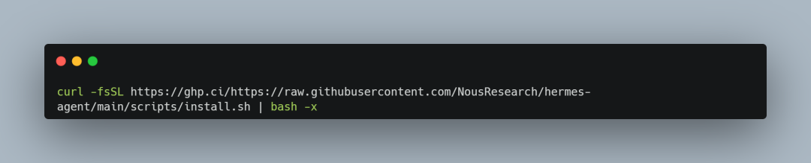
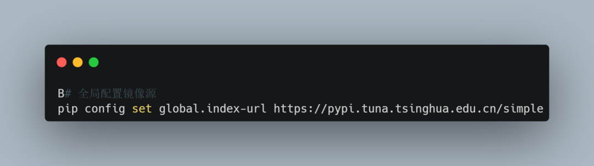
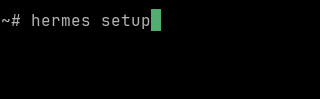
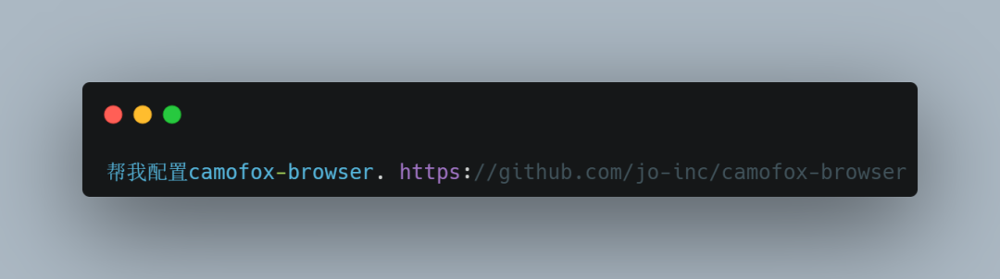

> 📎 来源: [Agent落地实战派](https://mp.weixin.qq.com/s?__biz=MzA3OTQ3OTY5Ng==&mid=2450819199&idx=1&sn=23545c51aac796d529bb88d686da1a8f&chksm=89f56471167c8b8898051ec94f647a62487dffa242340e37c846cc7202932de1bf2b4a2180c1&mpshare=1&scene=1&srcid=0428XFmRJTiyzngixFwY5CLZ&sharer_shareinfo=bba53656d91d302827745475427d9131&sharer_shareinfo_first=bba53656d91d302827745475427d9131) | 时间: 2026-04-28 06:45

---

龙虾已谢幕，马仕正当时：2026 年 Hermes Agent 部署调优实录

在深度使用两周后，我决定把所有的生产任务从 OpenClaw（龙虾）全量迁移到Hermes Agent。做出这个决定不为别的，只为两个字：稳定。

# 为什么说它是目前最稳的 Agent 框架？

工业级的稳定性：最近升级过龙虾的朋友都知道，升级不挂几乎是奢望，全球用户一起对着白屏发愁是常有的事。Hermes 由 Nous Research 开发，走的是企业级路线。它自带完备的重试机制和状态保护，不需要你天天为了修环境而头秃，实测稳定性提升了 30% 以上。

自我进化的记忆：它最硬核的功能是能根据操作路径自动编写Skills，并配合四层记忆体系，让 AI 越用越顺手。

精密的“副驾”模式 (Auxiliary)：这是省钱的杀手锏。它可以自动调度模型，让便宜量大的模型（如 MiniMax）处理高频重复的 Token 消耗，把 Opus 或 OpenAI 这种昂贵的大脑留给深度思考和计划制定。

笔者带大家把踩过的坑复盘一遍，手把手教你如何调优这台企业级生产力工具。

---

# 1. 准备工作：环境“点火”加速

在国内云服务器（如阿里云）或你本地环境下，直接运行官方脚本大概率会卡死。先做两件事完成“热身”：

第一步：GitHub 脚本加速

使用镜像源绕过网络瓶颈，避免连接超时：



第二步：Python 彻底换源

安装完毕后，为了防止后续下载依赖包时卡住，务必将 Python 换成国内源（TUNA）：



避坑指南：如果你在 venv 虚拟环境里执行，记得进入环境后再跑一遍换源命令，确保环境隔离依然有效。

---

# 2. 安装与设置：一劳永逸

运行完安装脚本，执行初始化配置：



```

```

预警：配置 API Key 时，终端是不显示字符的。很多人以为没粘上，结果连粘两次导致 Key 失效。如果弄错了，别急，直接 vim ~/.hermes/.env 手动修正即可。

---

# 3. 核心调教：三件必做的事

第一件：配置灵魂 (SOUL.md)

默认的助手没有性格。你可以先跟它聊两天，然后问它：“根据咱们的沟通习惯，帮我生成一份推荐的 SOUL.md。”

笔者经验：我个人的灵魂配置核心只有三条：

禁止谄媚、附和，必须实事求是。

输出格式严格遵循 Markdown，且中英文对照。

优先评估风险，不懂不要编。

第二件：配置副驾路由 (Auxiliary)

这是 Hermes 的省钱秘籍。指定副模型处理网页抓取、图片分析或会话压缩。

操作：直接说：“帮我把压缩辅助模型配成 qwen-max 或 minimax。”

验证：检查日志 ~/.hermes/logs/agent.log。如果看到辅助任务走了低成本接口，说明你省钱成功了。

第三件：配置浏览器反爬 (Camofox)

Agent 读网页报错通常是因为被反爬了。配置 Camofox 模拟真人环境：

指令：“帮我配置camofox-browser. https://github.com/jo-inc/camofox-browser”



亮点：Hermes 会自动识别高危指令并请求授权，比龙虾那种莫名其妙的数字码清晰太多。

---

# 4. 进阶：记忆系统与自动化审计

记忆系统：三层护航

笔记层：MEMORY.md 存事实，USER.md 存画像。

外挂层 (Mem0)：通过 hermes memory setup 挂载，适合重度知识管理。

搜索层 (Session Search)：自动将对话持久化到本地 SQLite。即便模型断联，也能翻出历史记录。

审计钩子 (Hooks)

想知道 Agent 在终端偷偷干了什么？做一个Terminal Audit Hook：

指令：“帮我写一个审计钩子，每次执行终端命令后，自动把内容和结果追加到日志。” 这种掌控感就是安全感的来源。

---

# 5. 终极防御：Docker 沙箱

担心 Agent 误删库？必须给它一个“笼子”。

指令：“帮我配置一个 profile，使用 docker 作为终端后端。”

实测：我在沙箱里执行 rm -rf /，触发系统保护，宿主机毫发无伤。它的多 Profile 切换逻辑非常丝滑，一句话就能切换环境。

---

# 6. 自动复盘：最伟大的亮点

Hermes 每累计 15 次工具调用，就会在后台开个“复盘小会”。它会思考：刚才的对话是否有值得固化为永久技能的经验？

结果：终端会提示 Skill saved。这种无需人工干预、自动沉淀方法论的能力，才是真正的 AI 助手。

---

# 后记：旧主换新朝，开源谁人知

经过这段时间的调校，Hermes 表现出了极高的鲁棒性。它不需要顶级模型（SOTA）强行续命，我全程使用MiniMax-2.7-highSpeed，无论是配置、升级还是自动化任务，从未崩过。

一句话总结：龙虾适合当玩具，Hermes 才是生产力。

所谓：龙虾已谢幕，马仕正当时。旧主换新朝，开源谁人知？希望这篇教程能帮你少走弯路。
