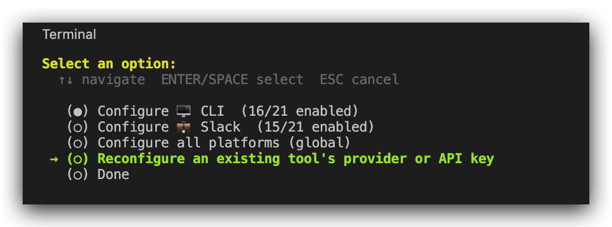
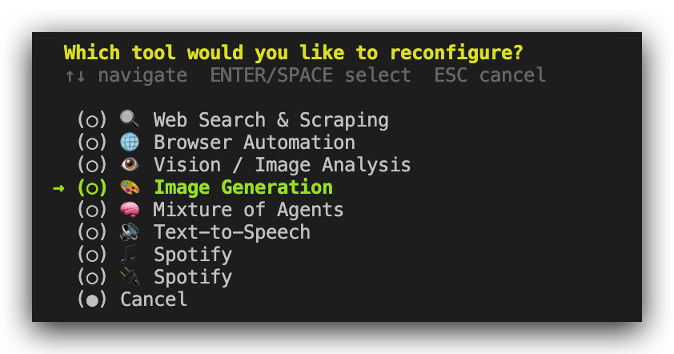
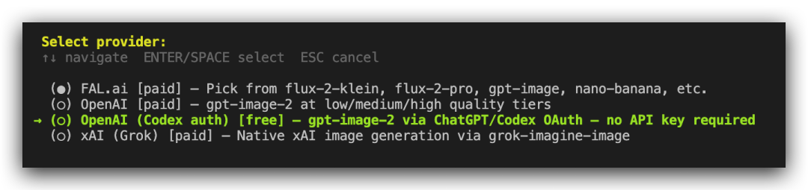
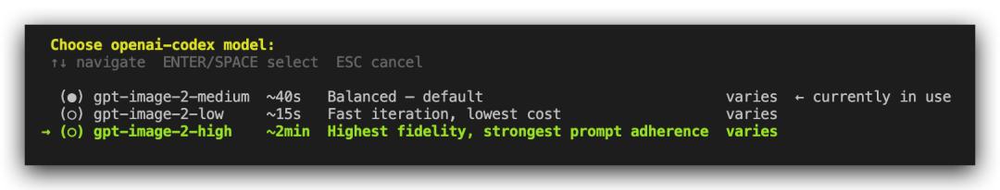
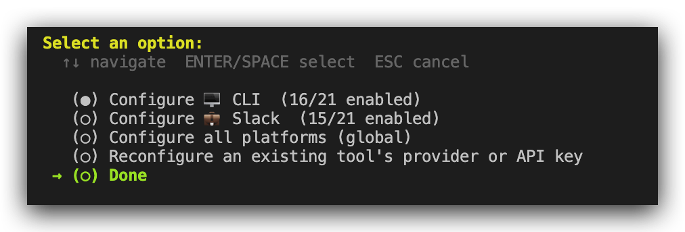
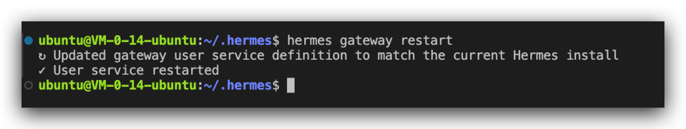
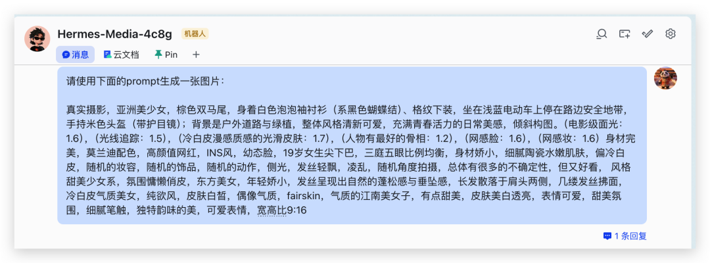
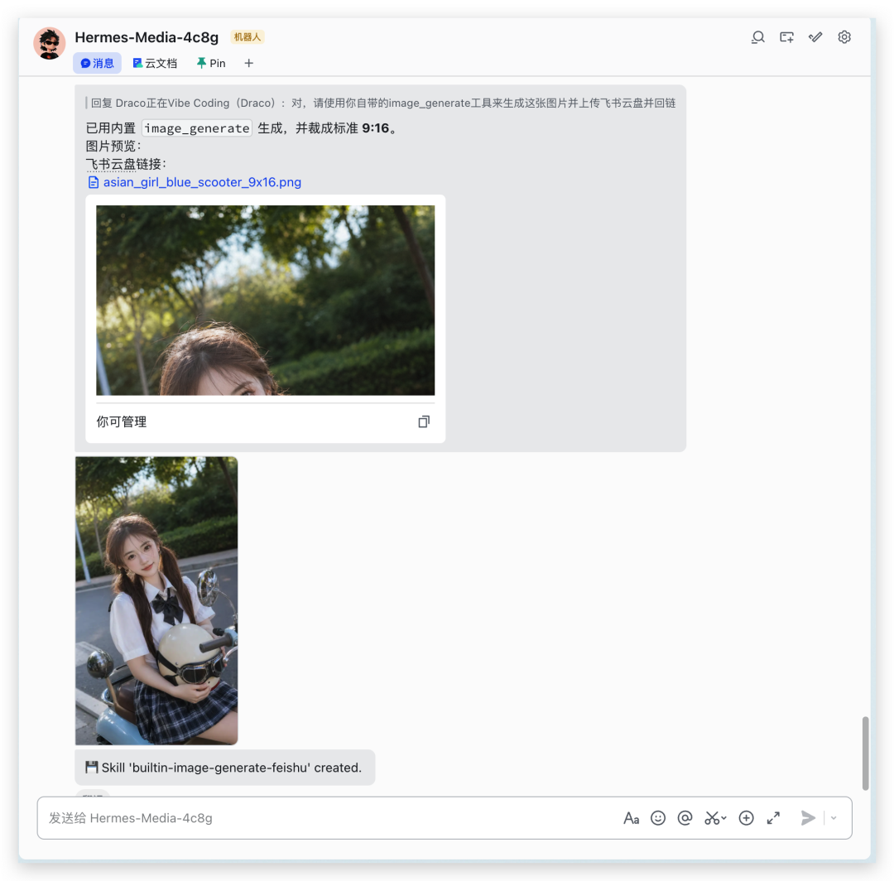

> 📎 来源: [Draco正在VibeCoding](https://mp.weixin.qq.com/s/C1rhMtibR4uLmLyqfB8aWg) | 时间: 2026-04-26 00:33

---

如果你拥有ChatGPT的Plus或Pro订阅，那么恭喜你！你不仅可以让Hermes用上GPT-5.5，还可以给Hermes装配上GPT-Image-2这个新的生图王者！

## 具体步骤如下

在命令行输入：

```
hermes tools
```

然后选择：

```
Reconfigure an existing tool's provider or API key
```



然后选择：

```
Image Generation
```



然后选择：

```
OpenAI (Codex auth) [free] — gpt-image-2 via ChatGPT/Codex OAuth — no API key required
```



然后选择：

```
gpt-image-2-medium
```

 (另外两个也可以，up to you）



然后

```
Done
```

就行了：



然后重启一下gateway：

```
hermes gateway restart
```



回到你的Hermes聊天框输入prompt（随便从即梦官网复制粘贴了一个）：

> 注意，由于我自己封装了多个生图skills，后面补了一嘴，让它调用自己自带的“image\_generate”工具，否则它会优先调用我的即梦或者Nano Banana生图Skills。



1分钟左右之后，搞定：




> 横版


