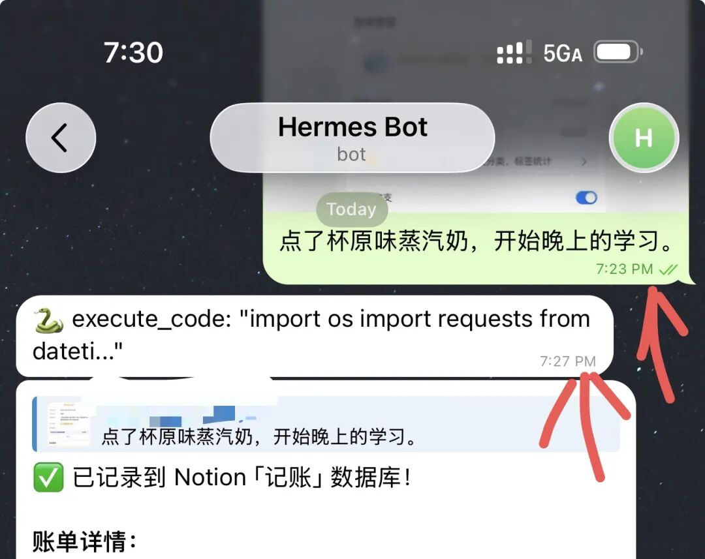

> 📎 来源: [爱折腾的小龙虾](https://mp.weixin.qq.com/s?__biz=MzYzMzIxMDA0OQ==&mid=2247484285&idx=1&sn=b3b7ab0ec6e1b2183898d76839aaf81a&chksm=f15c74d9f76d992d4484aca55a0ee90b11c332ec7f93a19aa4d228a9d3e59de31a03d62abf8c&mpshare=1&scene=1&srcid=04282JvCROJZH33H7KWoDeSC&sharer_shareinfo=4060e31e909bcee4e02bc31cfd142514&sharer_shareinfo_first=4060e31e909bcee4e02bc31cfd142514) | 时间: 2026-04-28 19:43

---

这个赫妹真聪明

到咖啡馆断开自己的热点，然后花了3分钟，连上咖啡馆的 WiFi。

在断开之前，赫妹还在处理事情。然后网络重连后，他自己搞定，自己连接，继续记账，漂亮。

 比 openclaw小龙虾强多了

 #hermes #赫妹
