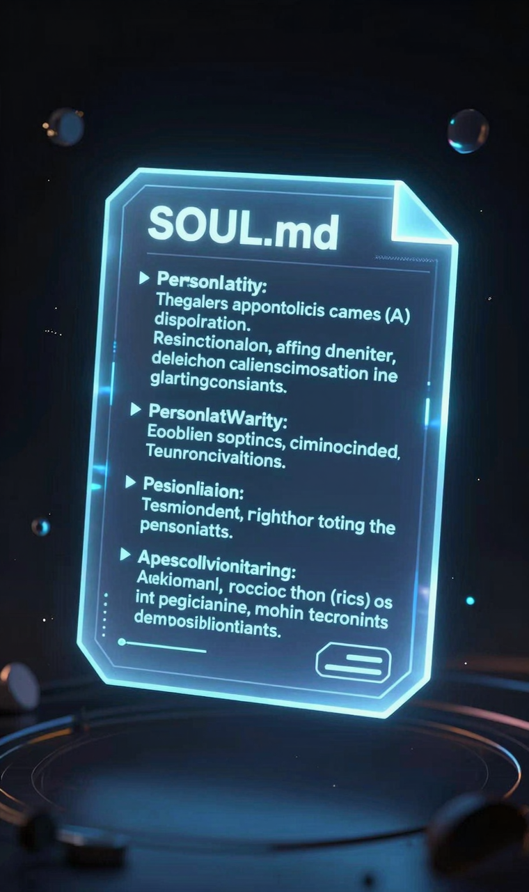
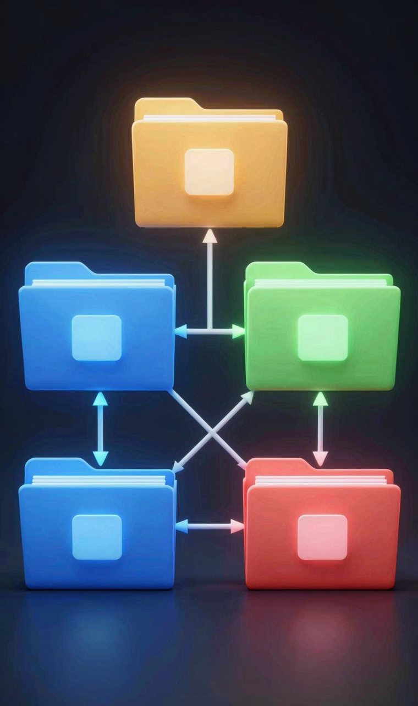
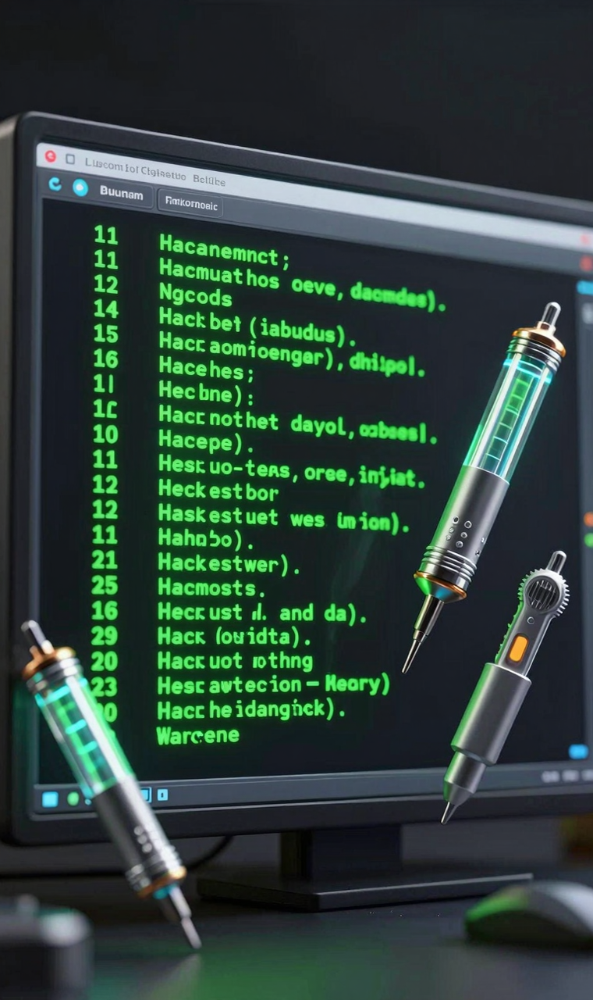

> 📎 来源: [AI落地实验室](https://mp.weixin.qq.com/s?__biz=MzYzMzgwODc5Mg==&mid=2247484946&idx=2&sn=ac4f54d259cf19697c7bf92106f479e9&chksm=f1004958ac5bc0af544429e7aa4b3689f8cc8a466ca8f3506cec86c7fb4e540aee88b6188b05&mpshare=1&scene=1&srcid=0428DTCrsUllGloAwH2g61Vo&sharer_shareinfo=0a7c977d43bc27dabcb560555028d73b&sharer_shareinfo_first=0a7c977d43bc27dabcb560555028d73b) | 时间: 2026-04-28 06:45

---

📖 很多人装了Hermes，用了两天就说"跟OpenClaw没啥区别"。不是Hermes不行，是你跳过了最关键的几步。今天讲5个配置技巧，做完之后你会发现，这根本不是同一个东西。

---

## 一、你可能装了个寂寞

我最近研究Hermes，发现一个特别普遍的现象。

很多人装上之后，兴冲冲地用了两天，然后给出评价：跟OpenClaw感觉大差不差啊。

然后就扔那儿了。

我一开始也纳闷。后来仔细看了一下，发现问题出在哪。

这些人装完Hermes，直接就开始问问题、让它干活。默认配置，默认人格，默认一切。

这就好比你买了一辆新车，连座椅都没调，后视镜也没调，导航也没设，油门踩下去就上路了。然后说：这车不行啊，跟我上一辆差不多。

不是车不行。是你没调。

---

## 二、SOUL.md：最容易被忽略的灵魂文件

Hermes装好之后，有一个文件叫SOUL.md。

很多人根本不知道这玩意是啥。

简单说，SOUL.md就是你给Hermes写的一份自我介绍。你是干嘛的，你说话什么风格，你做事习惯先干啥，遇到问题怎么处理，全写在这里。

你不写，它就只能用默认的套路跟你聊。

默认套路碰上默认用户，就是两个陌生人互相客套。越聊越觉得：就这？

我跟你说一个偷懒的办法，巨好用。

你跟Hermes聊一段时间之后，直接跟它说："根据我们的对话调整一下SOUL.md。"

它会自己总结你的偏好，更新进去。因为你一直在纠正它，它知道你喜欢什么风格、讨厌什么说法。

这个动作做完，你再跟它对话，完全是两个东西。

这是Hermes跟OpenClaw拉开差距最根本的地方。OpenClaw是一个工具，Hermes是一个分身的起点。而SOUL.md就是那个分身的灵魂。

没有灵魂的分身，就是个壳。

---

## 三、主备模型：把钱花在刀刃上

这个操作我觉得挺聪明的。

Hermes的Token优化设计很赞。它允许你给不同的模块配不同的模型。

什么意思？

记忆总结、技能创建这些核心模块，配你花了钱的高阶模型。网页搜索、格式整理这些脏活累活，交给免费模型。

贵的用在刀刃上，杂活让免费的来。

OpenRouter里有大量免费模型，配进去之后日常跑几乎不消耗Token。

不是越贵越好，是把对的模型放在对的位置。

这块我自己还在摸索，目前全部用的付费API。理论上这个逻辑是对的，但实操效果还需要验证。大家可以自己试试，踩坑了回来告诉我，我们一起沉淀经验。

---

## 四、记忆机制：5个文件各管各的

Hermes有5个文件在管记忆。大多数人只知道state.db是聊天记录，然后就放着不管了。

其实每个文件各有分工：

SOUL.md，你给它定义的人格。你主动维护。

user.md，它对你的长期观察。它自己写入，你偶尔看看就行。

memory.md，事情级别的记忆。每次对话它会自动注入上下文，你也可以手动往里写重要的东西。

skills/文件夹，把可复用的流程固化下来。比如你经常让它用某个固定格式出周报，这个流程固化进去之后它每次直接调，不用你重新说一遍。

state.db，全部聊天记录。这个反而最不重要，它基本只在skills找不到答案的时候才去翻。

说实话，你把SOUL.md写好，memory.md偶尔维护一下，剩下的它自己会处理。不用你操心。

---

## 五、两个实用命令

第一个，hermes doctor。

很多人把这类Agent想得太难了，觉得出问题就完蛋了搞不定。

实际上Hermes自带诊断功能。跑一下hermes doctor，它会帮你检查哪里配置有问题、哪里可以优化。

没你想的那么吓人。有问题让它自己查就行。

第二个，hermes migrate openclaw。

如果你之前在用OpenClaw，花了不少心思配置了技能和记忆，这个命令可以一次性全部迁移过来。技能、记忆、配置，选Yes就完事。

不用从零开始。

---

## 六、写在最后

回到开头那个问题。

为什么你装上Hermes觉得跟OpenClaw没区别？

大概率不是产品的问题。是你跳过了最关键的几步。

SOUL.md没填，记忆机制没配，主备模型没调。你用着默认配置、默认人格跟它对话，然后说"就这"？

Hermes不是装完就能用的那种工具。它是你投入越多，它越像你。

你愿意写SOUL.md，它就愿意懂你。

你愿意维护memory.md，它就记得住你。

你愿意花时间配主备模型，它就帮你省Token。

OpenClaw是一个你用完就走的工具。Hermes是一个你愿意长期养的搭档。

而养的前提，是你得先花时间告诉它，你是谁。

作者：小马哥

公众号：AI落地实验室

企业AI落地赋能 ｜ AI Agent ｜ 实战干货 ｜ 科技潮流

---

如果你也在研究AI Agent，想知道怎么把这些工具真正用起来而不是"装了个寂寞"，欢迎关注「AI落地实验室」。

有具体的AI落地需求，可以直接私信我聊聊。不收费，先聊，聊完你觉得有价值再说。
