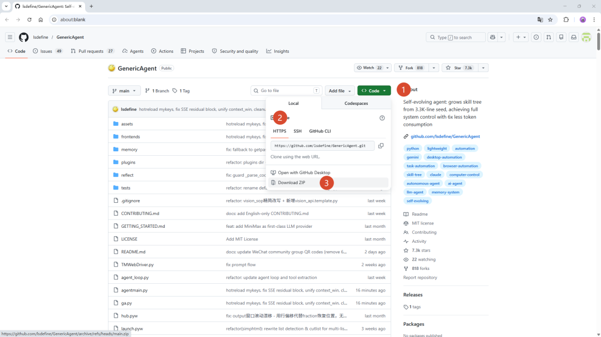

> 📎 来源: [AI教员](https://mp.weixin.qq.com/s?__biz=MzY4NTE5Mjg0NA==&mid=2247484575&idx=1&sn=94bc4e6a65112b3fff2f81f8d90db2e8&chksm=f200ae98d000b2ee9ffe577a2f87027d20c3c75a75384d9be446de3a59aa1f4448cfcc7a5e07&mpshare=1&scene=1&srcid=0430OC4655XvFmqBWJ7jN37s&sharer_shareinfo=14e2e6d18e848f29dfba18fb64389025&sharer_shareinfo_first=14e2e6d18e848f29dfba18fb64389025) | 时间: 2026-04-30 19:36

---

## 写在前面

### Generic Agent 是什么？

**Generic Agent**（简称 **GA**）是一个本地运行的 AI 助手框架。与只能聊天的 AI 不同，GA 的核心理念是**替你把事情做完**——它能读取代码、操作文件、调用工具、连接各种平台，自动完成复杂任务。

你可以把它理解为：一个永远在线、听得懂人话、并且真的会动手干活的数字员工。

它不是一个聊天机器人，而是一个**能替你执行任务的 Agent**。

> **学完本章，你将拥有一个可以正常对话的 GenericAgent（GA）运行环境。**

GA 的几个核心特点：

- **本地运行**：代码跑在你自己的电脑上，数据不出本地，更安全。
- **多模型支持**：可以配置 Claude、GPT、DeepSeek、智谱等任意大模型，也可同时配置多个模型做自动切换。
- **工具丰富**：能读文件、写代码、执行命令、管理 Git、安装 Python 依赖，还能接入钉钉、飞书、企业微信、QQ、Telegram 等通讯平台。
- **自动完成任务**：你说一句话，它会自己规划步骤、调用工具、给出结果，不需要你手动一步步操作。
- **持续进化**：GA 能读取自己的代码，自己安装缺失的依赖，自己建立 Git 连接——你的指令越多，它越懂你需要什么。

想象这样一个场景：

> 你对 GA 说："帮我把桌面上的数据文件整理一下，按项目分类放进文件夹，再给我生成一份汇总报告。"

> GA 收到任务，读取桌面文件、分析内容、按文件名判断项目归属、创建文件夹、移动文件、生成汇总——全程自动，你只需要确认结果。

这就是 Generic Agent 在做的事。

## 🎯 学习目标

1. 1. 在本地安装好 Python 并下载 GenericAgent 项目代码
2. 2. 完成 `mykey.py` API 密钥配置，让 GA 能连接大模型
3. 3. 成功启动 GA 并完成第一次对话

---

## 1.1 安装 Python

GA 依赖 Python 运行，我们先把它装好。

> ⚠️ 推荐 **Python 3.11 或 3.12**。不要使用 3.14（与 `pywebview` 等依赖不兼容）。

### Windows

1. 1. 打开下载链接：https://www.python.org/ftp/python/3.12.10/python-3.12.10-amd64.exe
2. 2. 运行安装包，**底部的 "Add python.exe to PATH" 一定要勾上**，然后点击安装
3. 3. 验证安装：按 `Win + R` 输入 `cmd` 打开终端，输入：

```
python --version
```

看到 `Python 3.x.x` 就说明安装成功了。

### macOS

macOS 和大多数 Linux 发行版自带 Python 3，打开终端（Terminal）验证：

```
python3 --version
```

看到 `Python 3.x.x`（3.11 或 3.12）即可。如果版本低于 3.10，前往 Python 官网 下载安装。

1. 1. 打开下载链接：https://www.python.org/ftp/python/3.12.10/python-3.12.10-macos11.pkg
2. 2. 运行安装包，一步一步跟着流程安装即可
3. 3. 验证安装：打开系统自带终端，输入：

```
python3 --version
```

看到 `Python 3.x.x` 就说明安装成功了。

---

## 1.2 下载项目

我们需要把 GenericAgent 的代码下载到本地。两种方式任选其一：

**方式一：下载 ZIP（推荐新手）**

1. 1. 打开 https://github.com/lsdefine/GenericAgent



下载

1. 2. 点绿色 **Code** 按钮 → **Download ZIP**
2. 3. 解压到你喜欢的位置（例如 `D:\GenericAgent`）

**方式二：Git Clone**

如果已经安装了 Git，在终端执行：

```
git clone https://github.com/lsdefine/GenericAgent.git
```

---

## 1.3 安装最小依赖

打开终端，进入项目目录(运行以下命令)，安装两个核心依赖：

```
# 1. cd 到下载的 GA 文件目录cd d:     (如果你的安装地址在D盘，终端打开后默认在c盘,安装在c盘跳过此步骤，仅限windows用户)cd "你的GenericAgent路径"               （示例： cd D:/Document/GenericAgent-main） # 2. 安装最小环境依赖pip install streamlit pywebview# 如果你的 Python 3 对应 pip3，则用：pip3 install streamlit pywebview
```

> 💡 其余依赖不用手动装。

---

## 1.4 配置 API 密钥（mykey.py）

GA 需要连接大模型才能工作。我们通过 `mykey.py` 告诉它用哪个模型、怎么连。

1. 1. 进入项目文件夹，把 `mykey_template.py` 复制一份，重命名为 `mykey.py`
2. 2. 用任意文本编辑器打开 `mykey.py`，填入你的 API 信息。**选一种填就行**，不用的配置可以删掉或留着不管

### 新手推荐配置：Claude 主力 + GPT 兜底

直接复制到 `mykey.py`，替换两个 `apikey` / `apibase`：

```
# ── 主力：Claude Opus 4.6（CC switch 反代（Reverse Proxy），最常见）──native_claude_config0 = {    'name': 'claude-main',                        # /llms 显示名 & mixin 引用名    'apikey': 'sk-user-<你的relay-key>',          # 非 sk-ant- 前缀 → Bearer 鉴权    'apibase': 'https:///claude/office',  # CC switch 端点    'model': 'claude-opus-4-6',                    'fake_cc_system_prompt': True,                # CC 透传渠道必须置 True    'thinking_type': 'adaptive',               # 某些渠道必须要求填thinking_type字段    'max_retries': 3,    'read_timeout': 180,}# ── 备选：GPT-5.4 做兜底 ──native_oai_config = {    'name': 'gpt-backup',    'apikey': 'sk-<你的 OpenAI key>',    'apibase': 'https://api.openai.com/v1',    'model': 'gpt-5.4',    'reasoning_effort': 'high',    'max_retries': 3,    'read_timeout': 120,}# ── Mixin 自动切换（Failover）──mixin_config = {    'llm_nos': ['claude-main', 'gpt-backup'],    'max_retries': 10,    'base_delay': 0.5,    'spring_back': 300,}
```

> 每次启动GA默认读的是第一个api信息。可以点击设置切换。

📋 所有内置渠道一览（点击展开）

#### 一线直连渠道（填 apikey / apibase 即用）

| 渠道 | 推荐变量名 | apikey 形式 | apibase | 示例 model | 备注 |
| --- | --- | --- | --- | --- | --- |
| Anthropic 官方 | native\_claude\_config\_anthropic | sk-ant-xxx | https://api.anthropic.com | claude-opus-4-6[1m] | sk-ant- 前缀自动切 x-api-key 鉴权 |
| OpenAI 官方 | native\_oai\_config | sk-proj-xxx | https://api.openai.com/v1 | gpt-5.4 | 支持 api\_mode: 'responses' |
| OpenRouter | oai\_config\_openrouter | sk-or-xxx | https://openrouter.ai/api/v1 | anthropic/claude-opus-4-6 | model 用 provider/model 格式 |
| 智谱 GLM-5.1 | native\_claude\_glm\_config | xxx.yyy | https://open.bigmodel.cn/api/anthropic | glm-5.1 | 推荐用 Anthropic 路径 |
| MiniMax（Anthropic） | native\_claude\_config\_minimax | sk-xxx | https://api.minimaxi.com/anthropic | MiniMax-M2.7 | 204K 上下文 |
| MiniMax（OAI） | oai\_config\_minimax | sk-cp-xxx | https://api.minimaxi.com/v1 | MiniMax-M2.7 | 回复带 think 标签 |
| Moonshot / Kimi | oai\_config\_kimi | sk-xxx | https://api.moonshot.cn/v1 | kimi-k2-turbo-preview | 温度强制 1.0 |
| DeepSeek V4 | native\_oai\_config\_deepseek | sk-xxx | https://api.deepseek.com | deepseek-v4-pro | ⚠️ 不带 /v1 |
| 阶跃星辰 | oai\_config\_stepfun | xxx.yyy | https://api.stepfun.com/v1 | step-2-16k | OAI 兼容 |
| 豆包 / 火山引擎 | oai\_config\_volcengine | xxx-xxx | https://ark.cn-beijing.volces.com/api/v3 | doubao-seed-1-8 | OAI 兼容 |
| 硅基流动 | oai\_config\_siliconflow | sk-xxx | https://api.siliconflow.cn/v1 | deepseek-ai/DeepSeek-V3 | 新用户 16 元免费额度 |

#### 反代 / 透传类渠道（需要 `fake_cc_system_prompt = True`）

| 渠道类型 | 推荐变量名 | apibase | 示例 model | 备注 |
| --- | --- | --- | --- | --- |
| CC Switch（最常见） | native\_claude\_config0 | https://host/claude/office | claude-opus-4-6 | 多数中文低价站走此协议 |
| CRS 反代 | native\_claude\_config\_crs | https://host/api | claude-opus-4-6[1m] | CRS 官方协议 |
| AnyRouter | native\_claude\_config\_anyrouter | https://host/v1 | claude-opus-4-6 | 与 CC switch 同协议族 |
| Sider（订阅桥接） | sider\_cookie | 自动 | gpt-5.4 / claude-opus-4-6 | 没有 API 时的兜底 |

#### 本地模型

| 方案 | 推荐变量名 | apibase | 示例 model | 备注 |
| --- | --- | --- | --- | --- |
| Ollama | native\_oai\_ollama | `http://127.0.0.1:11434/v1` | qwen2.5:14b | 末尾 /v1 不能漏 |
| llama.cpp | oai\_config\_llamacpp | `http://127.0.0.1:8080/v1` | default | 建议走文本协议 |
| vLLM | native\_oai\_vllm | `http://127.0.0.1:8000/v1` | 你 load 的模型 id | 需支持 function calling |
| LM Studio | oai\_config\_lmstudio | `http://localhost:1234/v1` | LM Studio 模型 id | GUI 本地部署最省心 |

⚙️ 关键可调字段速查

| 字段 | 默认 | 作用 | 何时要改 |
| --- | --- | --- | --- |
| name | 取 model | 显示名 & mixin 引用名 | 有 mixin 时建议显式填 |
| apikey | —— | 鉴权 Key | 必填 |
| apibase | —— | API 端点地址 | 必填 |
| model | —— | 模型名，后缀 [1m] 触发 1m 上下文 | 必填 |
| fake\_cc\_system\_prompt | False | 伪装 Claude Code CLI 指纹 | CC switch / CRS 必须 True |
| api\_mode | chat\_completions | 可选 responses | ⚠️**GPT-5.4 只能走 `responses`**，必须显式设置 |
| thinking\_type | adaptive | adaptive / enabled / disabled | 关思考用 disabled |
| thinking\_budget\_tokens | —— | 仅 enabled 生效 | low≈4096 / high≈32768 |
| reasoning\_effort | —— | none ~ xhigh | o 系列 / Responses API 支持 |
| temperature | 1 | 采样温度 | Kimi 强制 1.0 |
| max\_tokens | 8192 | 单次回复最大 token | 长思考可提到 32768 |
| context\_win | 24000 | 历史裁剪阈值 | 1m 上下文设 800000 |
| max\_retries | 1 | 自动退避重试次数 | 不稳定渠道改 3 |
| connect\_timeout | 5 | 连接超时秒 | 海外端点调大 |
| read\_timeout | 30 | 流式读取超时秒 | 开思考须 180+ |
| stream | True | 是否走 SSE 流式 | CDN 截断时改 False |
| proxy | —— | 单 session 代理 | 海外端点加代理 |

### 🆕 DeepSeek V4 接入配置

DeepSeek 于 2026 年4月24日发布了 V4 系列模型，相比之前的 V3 / R1 有重大升级：

| 特性 | 说明 |
| --- | --- |
| 模型 | `deepseek-v4-flash` （免费/低价）和 `deepseek-v4-pro`（旗舰） |
| 上下文 | **1M tokens** |
| 思考模式 | 默认开启，支持 `reasoning_effort`：`high`（默认）/ `max` |
| Tool Calling | ✅ 已完善，Agent 场景可用 |
| 兼容性 | OpenAI SDK 格式，`base_url` 为 `https://api.deepseek.com`（注意：**不再带 `/v1` 后缀**） |

> ⚠️ **旧配置迁移提醒**：如果你之前用的是 `deepseek-chat` / `deepseek-reasoner`，官方已宣布这两个模型名将逐步弃用。它们目前等价于 `deepseek-v4-flash` 的非思考 / 思考模式。建议尽早迁移到新模型名。

#### 最简配置（推荐 V4-Pro）

```
native_oai_config_deepseek = {    'name': 'deepseek-v4',    'apikey': 'sk-<你的 DeepSeek API Key>',    'apibase': 'https://api.deepseek.com',           # ⚠️ 不带 /v1    'model': 'deepseek-v4-pro',    'thinking_type': 'enabled',                      # 开启思考链（默认就是开）    'reasoning_effort': 'high',                      # high 或 max    'read_timeout': 180,                             # 思考模式耗时长，务必调大    'stream': True,                                  # 推荐开启，实时显示回复}
```

#### 省钱配置（V4-Flash，适合日常对话）

```
native_oai_config_deepseek = {    'name': 'deepseek-v4-flash',    'apikey': 'sk-<你的 DeepSeek API Key>',    'apibase': 'https://api.deepseek.com',    'model': 'deepseek-v4-flash',    'thinking_type': 'disabled',                     # 不展示思考过程，回复更简洁    'read_timeout': 60,    'stream': True,}
```

> ⚠️ **关于 V4 的思考 tokens**：V4 系列模型**始终会产生思考 tokens**（即使设置 `thinking_type: 'disabled'`）。`disabled` 的作用是让 GA 不显示思考链内容，但后端仍会消耗思考 tokens 并计费。如果想真正减少思考开销，可以用 `'reasoning_effort': 'low'` 来降低思考深度。

> 💡 **如何获取 API Key**：前往 DeepSeek 开放平台 注册账号，在「API Keys」页面创建密钥即可。新用户通常有免费额度。

> 💡 **思考模式注意事项**：开启思考模式（`thinking_type: 'enabled'`）时，`temperature`、`top_p` 等采样参数**不生效**（设了也不报错，但会被忽略）。如果需要精确控制采样，请关闭思考模式。

#### 🌟 Native Claude 接口配置（推荐）

DeepSeek V4 支持 Anthropic 协议端点，GA 的 `native_claude` 接口对思考链和 Tool Calling 的处理更成熟，**推荐优先使用此方式**：

```
native_claude_config_deepseek = {    'name': 'deepseek-v4-native',    'apikey': 'sk-<你的 DeepSeek API Key>',    'apibase': 'https://api.deepseek.com/anthropic',  # Anthropic 兼容端点    'model': 'deepseek-v4-pro',    'thinking_type': 'enabled',    'reasoning_effort': 'high',    'read_timeout': 180,    'stream': True,}
```

> 💡 两种接口（OpenAI 格式 / Anthropic 格式）用同一个 `sk-` 开头的 API Key，不需要另外申请。

🔄 Mixin配置模式：允许GA在模型断开后自动切换模型

一次配好主 + 备 + 兜底，任何一个 429/5xx/超时都自动切下一个：

```
mixin_config = {    'llm_nos': ['claude-main', 'claude-backup', 'gpt-backup'],  # 按优先级    'max_retries': 10,      # 整个 rotation 总重试上限    'base_delay': 0.5,      # 秒，指数退避起始    'spring_back': 300,     # 秒，切到备用后多久尝试回到主}
```

**约束**：`llm_nos` 中的名字必须精确匹配到其他 config 的 `name` 字段；所有被引用的 session **必须同属** Native 系列（NativeClaude + NativeOAI 可混）或**全不属** Native 系列。

---

## 1.5 启动 GenericAgent

### 首次启动

在终端中执行：

```
# 1. cd 到项目目录cd "你的GenericAgent路径"# 2. 启动python launch.pyw
```

> 如果是windows系统，可以双击launch.pyw启动。

> 看到浏览器弹出 Streamlit 聊天界面（或 pywebview 窗口），就说明启动成功了。如果用命令行模式 `python agentmain.py`，终端出现 `>>>` 提示符即为正常。

### 让 GA 自动安装剩余依赖

启动后，在对话框输入一句话，GA 会自己读代码、找出需要的包、全部装好：

```
请查看你的代码，安装所有用得上的 python 依赖
```

### 🛠️ 推荐：提升使用体验的两个任务

**建立 Git 连接**（方便以后更新代码）：

```
请帮我建立 git 连接，方便以后更新代码
```

GA 会自动配好。如果你电脑上没有 Git，它也会帮你下载 portable 版。

**创建桌面快捷方式**（以后双击图标就能启动）：

```
请帮我在桌面创建一个 launch.pyw 的快捷方式
```

### 使用 Hub 总控台（可选）

`hub.pyw` 是 GA 的总控台——一键启动/停止所有后台服务，并实时查看日志。

启动方式：在终端执行 `python3 hub.pyw`，或直接双击 `hub.pyw` 文件。勾选想启动的服务即可，不用记命令行参数。

📋 Hub 可管理的服务列表（点击展开）

| # | 服务名 | 角色 | 启动命令 |
| --- | --- | --- | --- |
| 1 | reflect/autonomous.py | 自主行动反射器：30 分钟无输入自动触发 | python agentmain.py --reflect reflect/autonomous.py |
| 2 | reflect/scheduler.py | 定时任务调度器 + L4 会话归档 | python agentmain.py --reflect reflect/scheduler.py |
| 3 | frontends/dingtalkapp.py | 钉钉机器人 | python frontends/dingtalkapp.py |
| 4 | frontends/fsapp.py | 飞书 / Lark 机器人 | python frontends/fsapp.py |
| 5 | frontends/qqapp.py | QQ 开放平台机器人 | python frontends/qqapp.py |
| 6 | frontends/qtapp.py | PySide6 桌面悬浮球 | python frontends/qtapp.py |
| 7 | frontends/stapp.py | 默认 Streamlit Web UI | python -m streamlit run frontends/stapp.py |
| 8 | frontends/stapp2.py | Anthropic 风格 Streamlit UI | python -m streamlit run frontends/stapp2.py |
| 9 | frontends/tgapp.py | Telegram 机器人 | python frontends/tgapp.py |
| 10 | frontends/wechatapp.py | 个人微信（首次扫码登录） | python frontends/wechatapp.py |
| 11 | frontends/wecomapp.py | 企业微信机器人 | python frontends/wecomapp.py |

 

**往期精选：**

1. [我把女朋友"蒸馏"成了一个AI](https://mp.weixin.qq.com/s?__biz=MzY4NTE5Mjg0NA==&mid=2247484264&idx=1&sn=1a2da546d917106c65be1bd6cc2b3517&scene=21#wechat_redirect)
2. [国内 OpenClaw 产品全景对比](https://mp.weixin.qq.com/s?__biz=MzY4NTE5Mjg0NA==&mid=2247483767&idx=1&sn=dabfb07cbb4a6f847517f889392deb86&scene=21#wechat_redirect)
3. [国内大模型申请API Key攻略合集](https://mp.weixin.qq.com/s?__biz=MzY4NTE5Mjg0NA==&mid=2247484456&idx=3&sn=1cd7404cf78c34e4181ea5903d7abf32&scene=21#wechat_redirect)
4. [不会装 Skill？你只用了 WorkBuddy 的一半](https://mp.weixin.qq.com/s?__biz=MzY4NTE5Mjg0NA==&mid=2247484082&idx=1&sn=c81475ba751e4b6f36bf6f7c6ed9947c&scene=21#wechat_redirect)
5. [腾讯推荐的 Skill 你装了几个？这 10 个值得收藏](https://mp.weixin.qq.com/s?__biz=MzY4NTE5Mjg0NA==&mid=2247484190&idx=2&sn=79c4c610304077b34d3e162375291bdf&scene=21#wechat_redirect)
6. [一只龙虾变多只：用飞书打造腾讯系多Agent协作](https://mp.weixin.qq.com/s?__biz=MzY4NTE5Mjg0NA==&mid=2247484145&idx=1&sn=cbab8fb31a3ce1b3b6725e0a22c8b727&scene=21#wechat_redirect)
7. [让AI秒变专属助手：我用Skill把重复工作全部自动化了](https://mp.weixin.qq.com/s?__biz=MzY4NTE5Mjg0NA==&mid=2247484257&idx=1&sn=72652379263ae5a561128dee454e4f7b&scene=21#wechat_redirect)
8. [元宝派 + WorkBuddy = 随时随地远程办公，内附邀请码！](https://mp.weixin.qq.com/s?__biz=MzY4NTE5Mjg0NA==&mid=2247484242&idx=1&sn=2336ccb608f3508c3b4589cf4038a6a4&scene=21#wechat_redirect)
9. [手机就是你的AI办公室！WorkBuddy微信小程序保姆级教程](https://mp.weixin.qq.com/s?__biz=MzY4NTE5Mjg0NA==&mid=2247484332&idx=1&sn=762e4618d41949f40881d35ce8b1bd3e&scene=21#wechat_redirect)
10. [Windows本地部署Hermes Agent，微信扫码即用（附完整教程）](https://mp.weixin.qq.com/s?__biz=MzY4NTE5Mjg0NA==&mid=2247484367&idx=1&sn=95d6caf68c7d26cba9cbbd5b3619f666&scene=21#wechat_redirect)
