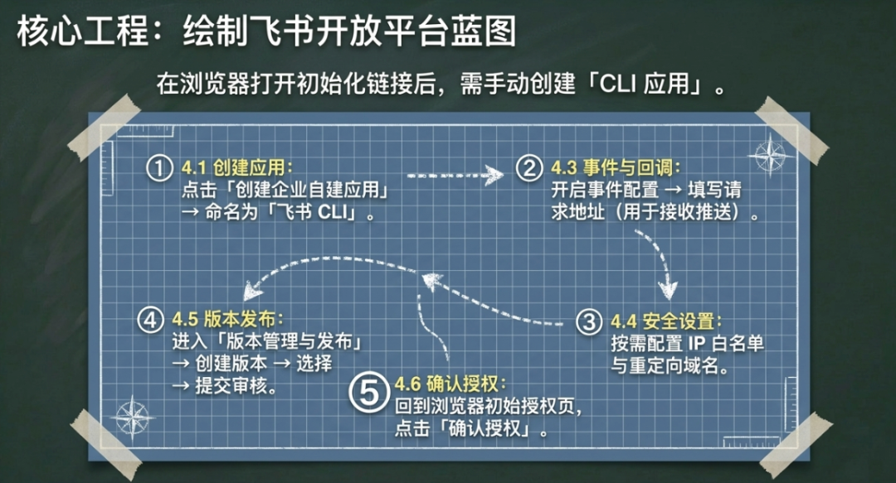
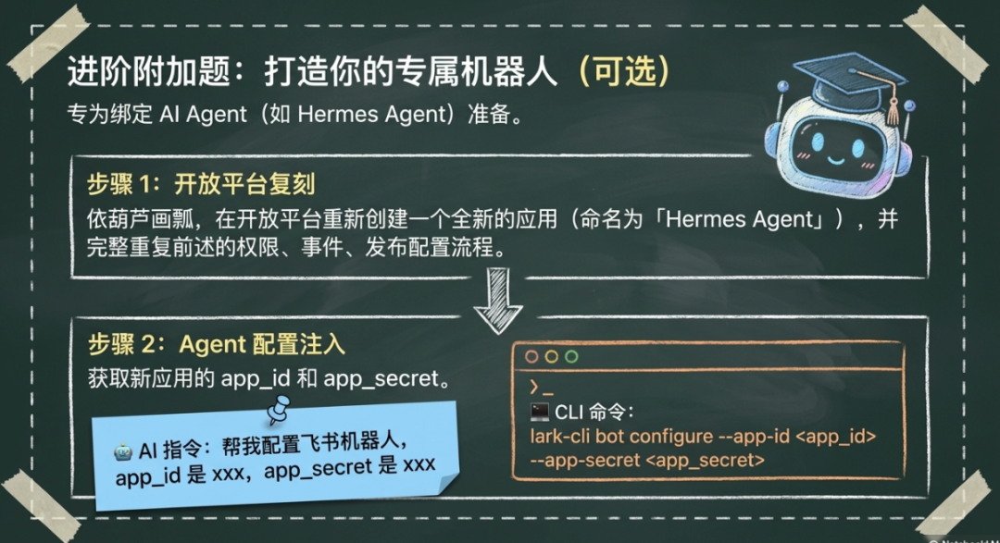
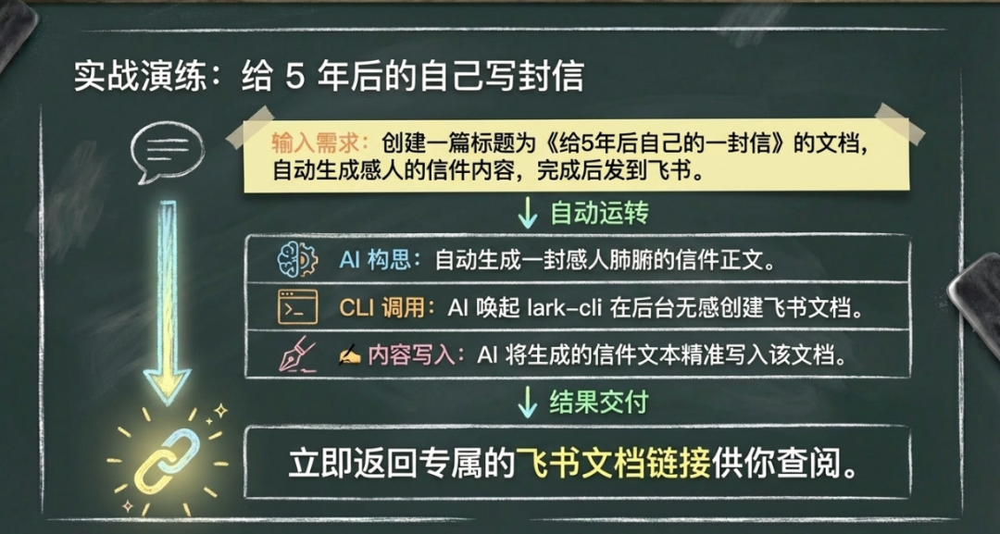
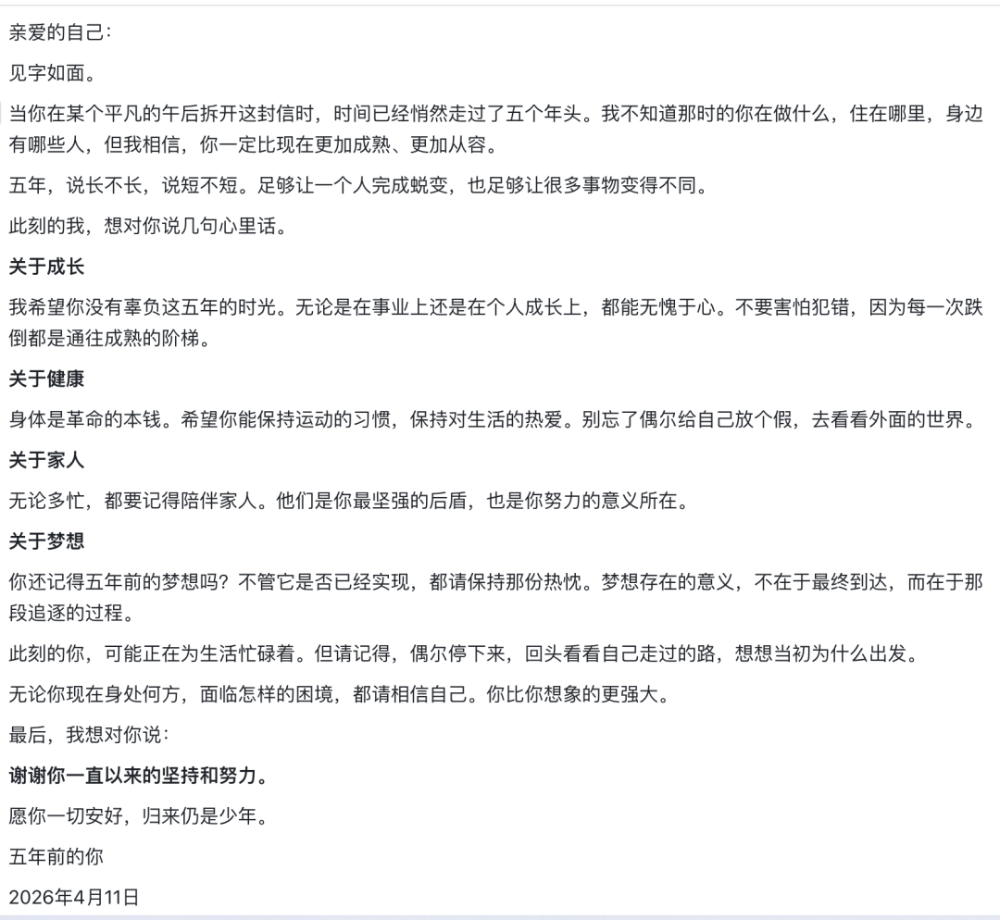
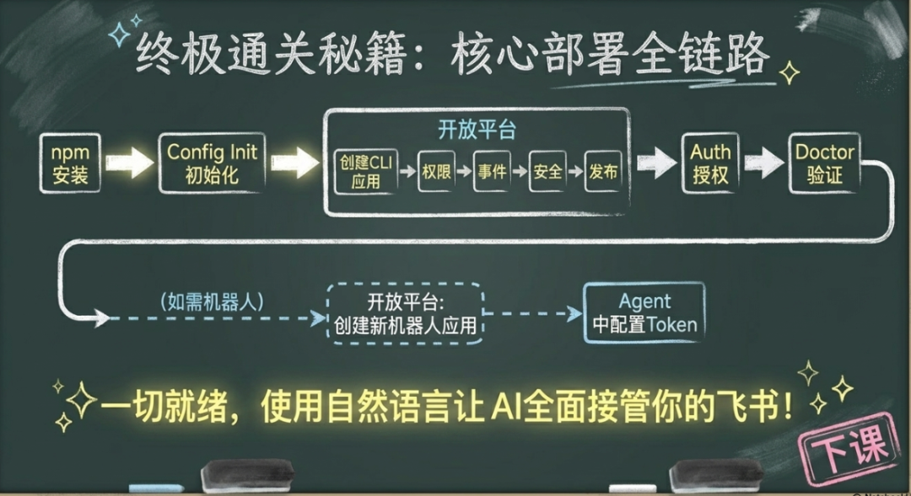

> 📎 来源: [斐哥讲AI](https://mp.weixin.qq.com/s?__biz=MzYzNTg3NTM2NA==&mid=2247483674&idx=1&sn=70102af2d451e6475ce7599e66f401f8&chksm=f1648b5e55e8f3ab2b90ff4b2578ab6a82b4648dcd39c123d300f18c93e28c8a0ec844a8da3f&mpshare=1&scene=1&srcid=0422zIaTmHCAphLsexCWI8aY&sharer_shareinfo=ca77006550810806f69bbe7946b7855f&sharer_shareinfo_first=ca77006550810806f69bbe7946b7855f) | 时间: 2026-04-22 00:54

---

## 一、什么是飞书 CLI

lark-cli 是飞书官方命令行工具，配置好后可以让 AI 帮你操作飞书。

### 能做什么？


- 云文档：创建、更新、搜索、分享文档
- 发送消息：发消息到群聊或用户
- 日历管理：创建日历事件、查看日程、添加提醒
- 联系人：搜索用户、获取用户信息
- 群组管理：查看群列表、管理群成员
- 任务管理：创建任务、设置截止日期
- 视频会议：创建会议、获取会议信息
- 通讯录：搜索部门、获取成员列表
- 更多：网络钩子、审批等企业功能

### 有什么好处？

- 不用打开飞书网页，直接用命令行或 AI 操作
- 可以自动化重复性工作（如每天生成报告发到飞书）
- 与 AI Agent 结合，实现智能化工作流

---

## 二、安装

### 方式一：让 AI 帮你安装（推荐）

告诉 AI：

```
"帮我安装飞书 CLI"
```

AI 会自动帮你执行安装命令。

### 方式二：命令行安装

```
npm install -g @larksuite/cli
```

验证安装：

```
lark-cli --version
```

---

## 三、初始化配置

### 方式一：让 AI 帮你配置（推荐）

告诉 AI：

```
"帮我配置飞书 CLI"
```

AI 会引导你完成整个配置流程。

### 方式二：命令行配置

运行以下命令：

```
lark-cli config init --new --brand feishu
```

运行后会显示一个链接，在浏览器打开。

---

## 四、在飞书开放平台创建 CLI 应用

打开链接后，会跳转到飞书开放平台，需要手动创建一个「CLI 应用」。



### 4.1 创建应用

1. 1. 在飞书开放平台点击「创建企业自建应用」
2. 2. 填写应用名称（如「飞书 CLI」）和描述
3. 3. 创建后自动进入应用详情页

### 4.2 权限管理

1. 1. 进入应用 → 左侧菜单「权限管理」
2. 2. 添加以下权限：

|  |  |  |
| --- | --- | --- |
| 权限名称 | 权限标识 | 用途 |
| 获取与发消息 | im:message | 发送消息 |
| 读取消息 | im:message:readonly | 读取消息 |
| 云文档读取 | docx:document:readonly | 读取文档 |
| 云文档写入 | docx:document:write\_only | 创建/更新文档 |
| 日历读取 | calendar:calendar:read | 读取日历 |
| 日历写入 | calendar:calendar.event:create | 创建日历事件 |

1. 3. 点击「开通」

### 4.3 事件与回调

1. 1. 左侧菜单「事件与回调」→「事件配置」
2. 2. 点击「开启」
3. 3. 配置请求地址（如需要接收飞书事件推送）

### 4.4 安全设置

1. 1. 左侧菜单「安全设置」
2. 2. 配置 IP 白名单（如需要）
3. 3 配置重定向域名（如需要）

### 4.5 版本管理与发布

1. 1. 左侧菜单「版本管理与发布」
2. 2. 点击「创建版本」
3. 3. 填写版本号和更新说明
4. 4. 选择「线上」发布
5. 5. 提交审核（企业自建应用通常无需审核）

### 4.6 确认授权

回到浏览器授权页面，点击「确认授权」。

---

## 五、完成用户授权

### 方式一：让 AI 帮你授权（推荐）

告诉 AI：

```
"帮我完成飞书授权"
```

AI 会引导你完成授权流程。

### 方式二：命令行授权

回到终端，运行：

```
lark-cli auth login --recommend
```

按提示在浏览器完成授权。

---

## 六、验证配置


### 方式一：让 AI 帮你检查（推荐）

告诉 AI：

```
"帮我检查飞书 CLI 配置是否正常"
```

AI 会运行检查命令并告诉你结果。

### 方式二：命令行验证

```
lark-cli doctor
```

看到 ok: true 表示配置成功。

---

## 七、创建飞书机器人（可选）



如需创建飞书机器人（如 AI Agent），需要单独创建一个应用：

### 7.1 在飞书开放平台创建机器人应用

1. 1. 打开 飞书开放平台
2. 2. 点击「创建企业自建应用」
3. 3. 填写应用名称（如「Hermes Agent」）和描述
4. 4. 创建后进入应用详情页

### 7.2 机器人配置

1. 1. 权限管理：根据机器人功能添加所需权限
2. 2. 事件与回调：配置机器人事件（如接收消息）
3. 3 安全设置：配置 IP 白名单、重定向域名等
4. 4. 版本管理与发布：创建版本并发布

### 7.3 在 AI Agent 中配置

告诉 AI：

```
"帮我配置飞书机器人，app_id 是 xxx，app_secret 是 xxx"
```

或使用命令行配置：

```
lark-cli bot configure --app-id  --app-secret
```

---

## 八、使用方式

### 自然语言操作（推荐）

配置好后，直接告诉 AI 你的需求：

```
"帮我创建一篇飞书文档，标题是《XXX》""把YYY内容更新到ZZZ文档""搜索我所有关于ZZZ的文档""帮我创建一个飞书机器人"
```

### 命令行操作

```
# 创建文档lark-cli docs +create --title "标题" --markdown "# 标题\n\n内容"# 更新文档lark-cli docs +update --doc  --mode append --markdown "\n\n新内容"# 获取文档lark-cli docs +fetch --doc # 搜索文档lark-cli docs +search --query "关键词"# 查看群列表lark-cli im chat list# 发消息lark-cli im message create --receive-id-type chat_id \  --data '{"receive_id":"<群ID>","msg_type":"text","content":"{\"text\":\"Hello\"}"}'
```

---

## 九、使用实例



### 实例：给5年后的自己写封信

告诉 AI：

```
"帮我创建一篇文档，是写给5年后的自己的，标题是《给5年后自己的一封信》，内容是一封信的格式，开头是'亲爱的自己'，邀请AI根据主题自动生成内容，完成后发到飞书文档。"
```

AI 会自动：

1. 1. 生成一封感人的信
2. 2. 创建飞书文档
3. 3. 把内容写入文档
4. 4. 告诉你文档链接
5. 5. 《给5年后自己的一封信》展示

   

---

## 十、常见问题

|  |  |
| --- | --- |
| 问题 | 解决 |
| 提示 not configured | 告诉 AI "帮我配置飞书 CLI" |
| Token 过期 | 告诉 AI "帮我重新授权飞书" |
| 权限不足 | 告诉 AI "帮我开通XX权限" |
| 发布后不生效 | 告诉 AI "帮我发布飞书应用" |

---

## 一句话总结



```
安装 → config init → 开放平台创建CLI应用（权限/事件/安全/发布）→ 授权 → doctor验证如需机器人：开放平台再创建机器人应用（权限/事件/安全/发布）→ 在Agent中配置之后用自然语言让 AI 操作飞书即可
```
