> 📎 来源: [斐哥讲AI](https://mp.weixin.qq.com/s?__biz=MzYzNTg3NTM2NA==&mid=2247483828&idx=1&sn=358d4bd3376d1710650878d04823fc53&chksm=f1902be0cdc5bd708f80a7a1fad4c8d849613f7f1c36da7a24466612e3f1b75b09bb5f9c5148&mpshare=1&scene=1&srcid=04304nbdocL9Lmxllfz57OgE&sharer_shareinfo=a84ae2cf90c775cf6bb124314d65313d&sharer_shareinfo_first=a84ae2cf90c775cf6bb124314d65313d) | 时间: 2026-04-30 19:40

---

嗨，我是斐哥（斐·AI）。大多数人用 AI 都是"一次性"的——问完答完，下次重新开始。但 Hermes 的 Memory 和 Skills 系统，打破了这个循环。真正的高手，让 AI 在一次次对话中越来越懂自己。

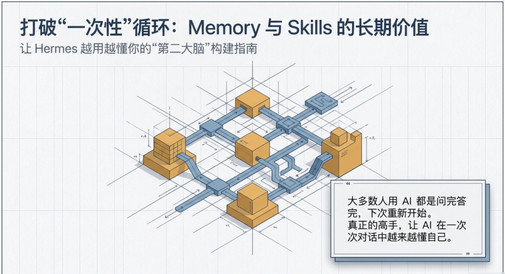

## 一、Memory 心智 — 一次记住，长期复用

### 什么是 Memory？

Memory 是 Hermes 的持久记忆系统。你告诉它的事情，会被永久保存，下次新对话自动加载。

### 什么是"Memory 心智"？

不是"AI 帮我记着"，而是主动塑造 AI 对你的认知。很多人把 Memory 当成备忘录——重要的事存进去，需要时再调用。更高级的用法是：把 Memory 当成 AI 的"认知框架"，你通过 Memory 告诉 AI你是谁、你关心什么、你习惯怎么工作。

### 需要主动 Memory 的四类信息

第一类：身份信息

> "记住，我是互联网产品经理，做 B 端 SaaS 产品，团队有 8 个人，开发周期是两周一迭代。"

第二类：偏好信息

> "记住，我写东西喜欢先说结论再说原因，回复尽量在 500 字以内，不要太多客套话。"

第三类：项目常量

> "记住，我们现在这个项目叫 X，核心功能是 Y，技术栈是 Next.js + Supabase，数据库用的是 PostgreSQL。"

第四类：工作习惯

> "记住，我习惯周五下午集中处理下周的安排，其他时间不喜欢被打断。"

---

### 为什么要主动 Memory？— 艾宾浩斯遗忘曲线

艾宾浩斯遗忘曲线（Ebbinghaus Forgetting Curve）告诉我们：人对新信息的记忆，会随时间快速衰减——20 分钟后忘掉 42%，1 天后忘掉 67%，一周后忘掉 79%。

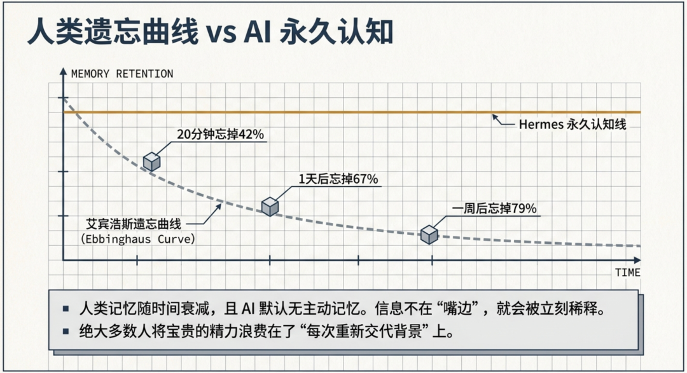

AI 的上下文窗口和人的记忆一样——信息不在"嘴边"就会被稀释。更关键的是：AI 没有主动记忆，你不说它就当不重要。

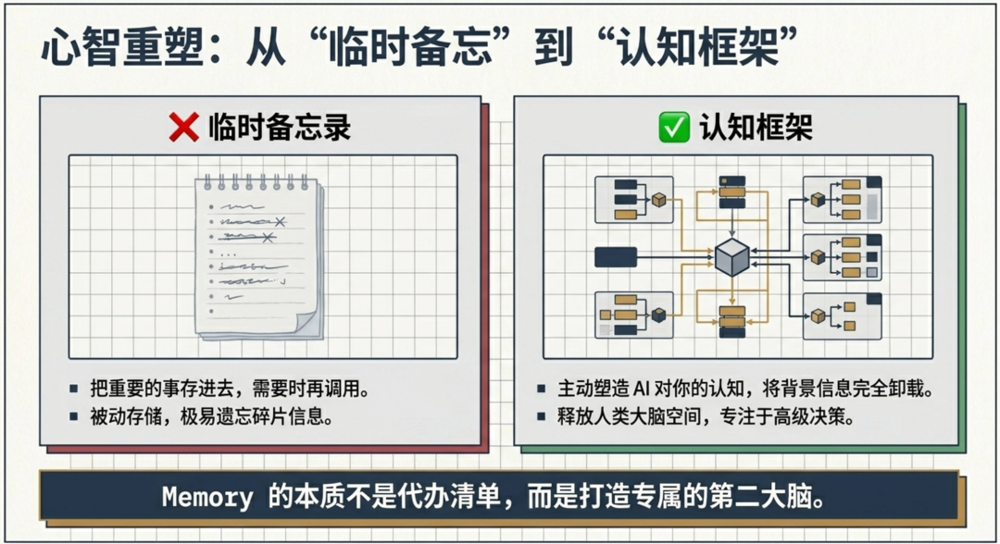

Memory 心智的本质是把 AI 当成你的第二大脑，主动把"背景信息"卸载出去，让自己腾出认知空间做判断。

三种 Memory 写作模板

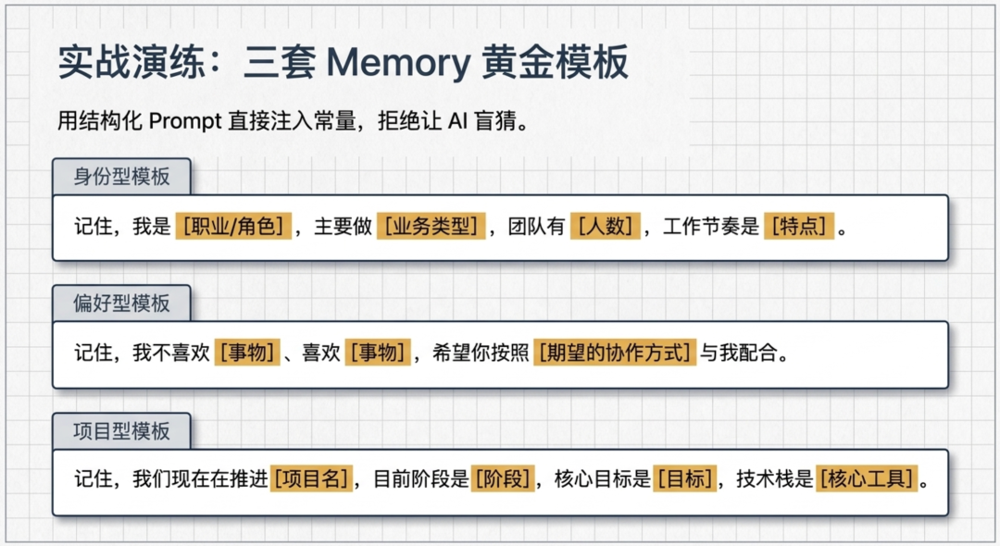

### Memory 的使用边界：什么时候用 Memory，什么时候用 Skills？

很多人搞不清什么时候该用 Memory，什么时候该用 Skills。一个简单的判断原则：

|  |  |
| --- | --- |
| 场景 | 用 Memory 还是 Skills |
| 这是"我的"背景信息 | Memory |
| 这是完成某类任务的"标准流程" | Skills |
| 我想让 AI 记住"我是谁" | Memory |
| 我想让 AI 学会"怎么做" | Skills |
| 每次任务都不同的信息（如项目进度） | Memory |
| 所有任务都通用的经验（如写 Prompt 的方法） | Skills |

两者可以同时用：

> "记住，我是品牌运营（Memory）。帮我写一份活动方案时，参考 [品牌活动策划模板]（Skills）的结构。"

---

## 二、Skills 系统 — 把经验变成可复用的模板

### 什么是 Skill？

一个 Skill 就是一份文档，记录了"完成某类任务的标准化流程和经验"。当你用 Hermes 完成了一个它不熟悉的任务，最终成功后，可以让 Hermes 把这次的做法总结成一个 Skill。下次遇到同类任务，直接加载 Skill，不需要重新摸索。

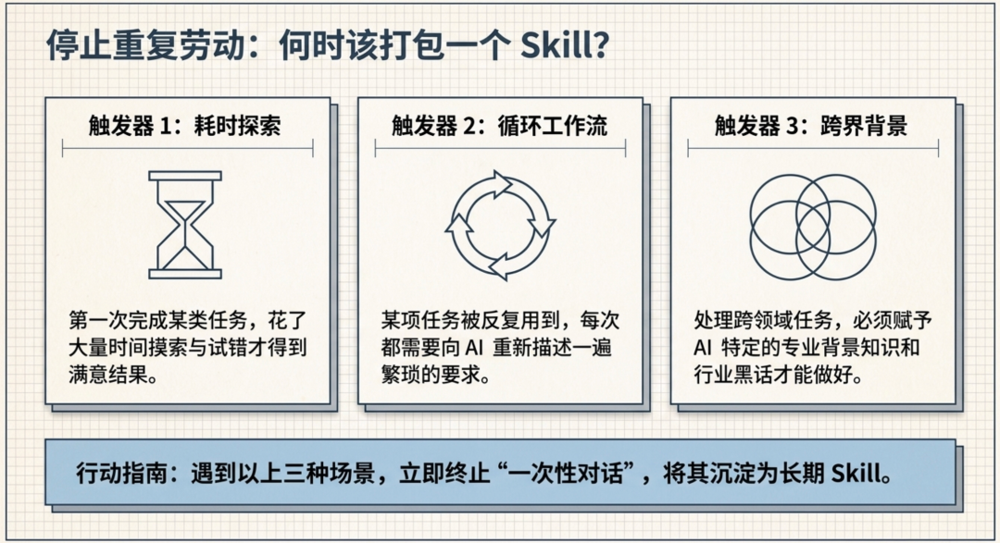

### 什么时候应该沉淀 Skill？

遇到以下情况，值得沉淀：

- 第一次完成某类任务，花了大量时间探索
- 某个工作流反复用到，每次都要重新描述
- 跨领域任务，AI 需要特定背景才能做得更好

### Skills 的正确用法

❌ Memory 用作临时剪贴板 — 有价值的信息散落在对话里，结束后全丢了✅ 主动沉淀 — 重要结论在对话结束前写入 Memory

❌ Skills 只存技术相关 — 其实任何有固定流程的事情都可以沉淀✅ 工作流、写作模板、分析框架 都可以变成 Skill

❌ 从不回头清理 Memory — 记忆越来越多，但没有优先级✅ 定期整理 — 告诉 Hermes "更新一下，把旧的 X 信息删掉"

---

### Skill 样例：品牌活动策划模板

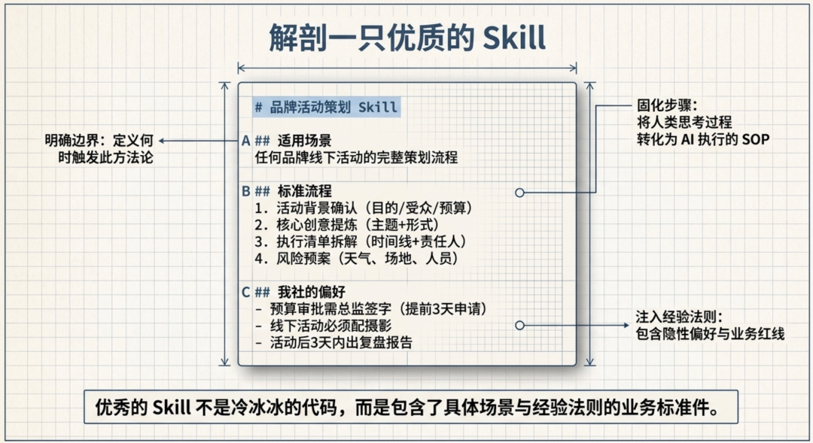

### 刻意练习理论：Skills 为何有效

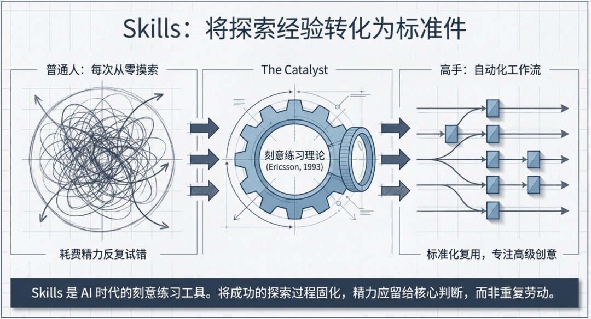

刻意练习理论（Deliberate Practice，Ericsson, 1993）的核心观点：高手和普通人的差距，不在于天赋，在于是否把工作流程"自动化"。

普通人每次做品牌活动都要从零摸索——高手有模板，直接套用，精力留给创意判断。

Skills 就是 AI 时代的"刻意练习工具"：把你从"临时搜索"中解放出来，升级为"自动化复用"。

---

## 三、Memory 和 Skills 的关系

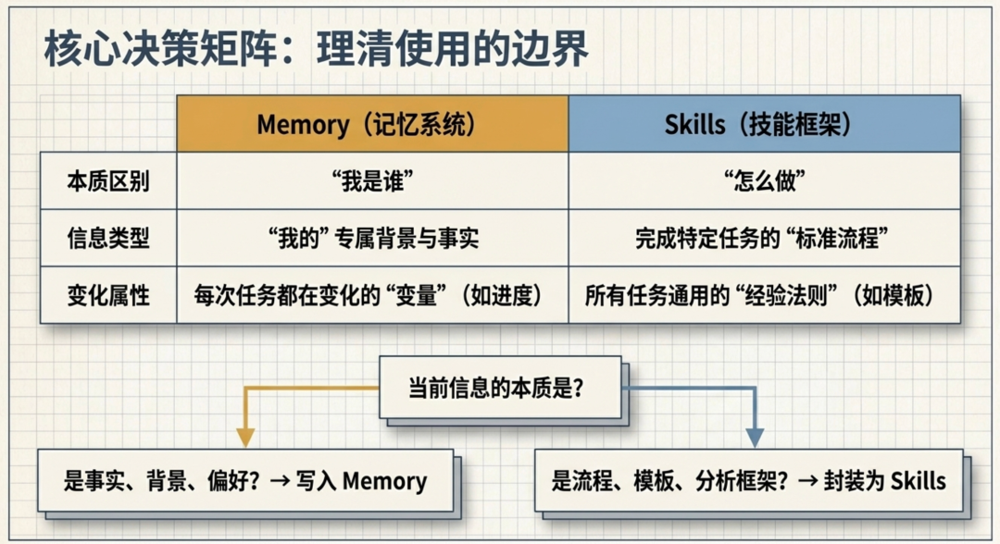

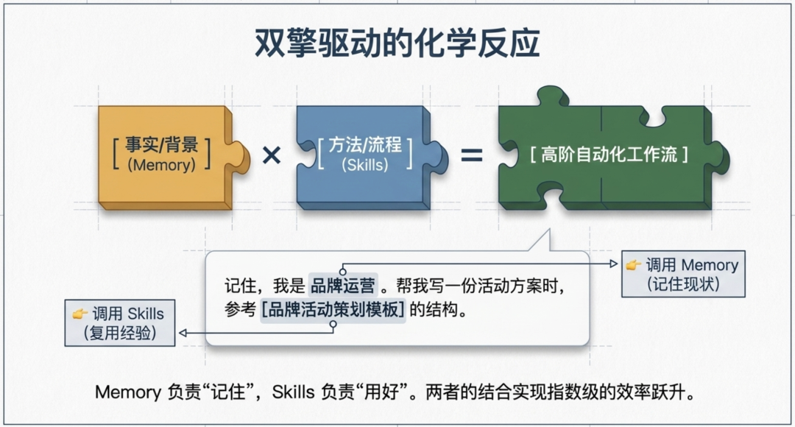

Memory = 你告诉 AI 的事实

Skills = AI 从经验中总结的方法

两者配合：Memory 让 AI 了解你的背景，Skills 让 AI 复用你的经验。一个负责"记住"，一个负责"用好"。

> 如果你用 Hermes 超过一个月，但 Memory 里还是空的——那你就错过了它最有价值的功能。从今天开始，培养 Memory 心智。

---

### Memory 长期维护：避免记忆膨胀

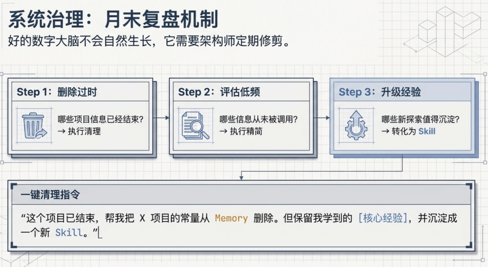

Memory 不是越多越好。长期使用后，你需要定期整理：

建议每月底做一次 Memory 盘点：

- 哪些信息已经过时？→ 删除或更新
- 哪些信息从未被调用？→ 评估是否必要保留
- 哪些新经验值得沉淀成 Skill？→ 升级为 Skill

清理指令示例：

> "这个项目已经结束了，帮我把 X 项目的项目常量从 Memory 里删除。但保留我在这个项目里学到的 [某经验]，可以沉淀成 Skill。"

---

### 常见错误：Memory 的两个极端

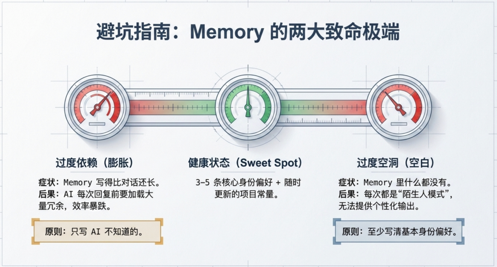

极端一：过度依赖（Memory 写得比对话还长）→ AI 在每次回复前要读一大段 Memory，效率反而下降→ 原则：Memory 只写"AI 不知道的"，不要把对话内容重复写入

极端二：过度空洞（Memory 里什么都没有）→ 每次新对话都是陌生人模式，AI 无法提供个性化帮助→ 原则：至少写清楚"我是谁、我做什么、我的基本偏好"

健康的 Memory 状态：3-5 条核心信息 + 随时更新的项目背景，随时可以扩展但不过度膨胀。

---

关注斐·AI

日常折腾 AI 工具，琢磨 Agent 与 Skill 开发，偶尔写点 SOP 和AI安全研究。有问题或想看什么主题，留言告诉我。
