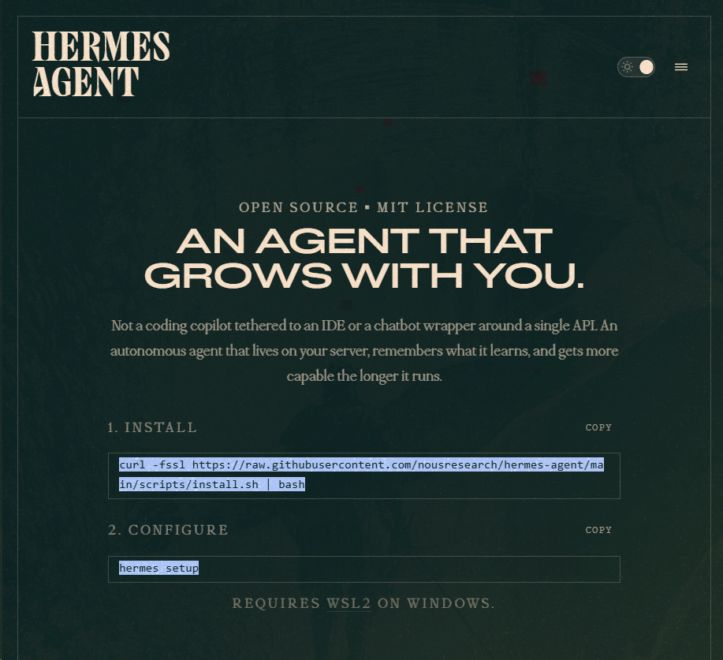

> 📎 来源: [布鲁斯AI](https://mp.weixin.qq.com/s?__biz=MjM5Mjg2OTk2MQ==&mid=2656900919&idx=1&sn=482005ea4513a86898169e4a121aaa19&chksm=bc7c9007f90a43f161cda704afb0796f784089d13a236d76bece9dd378101df9cb3e992129f1&mpshare=1&scene=1&srcid=0424wiRvR7j7qyxIwYUEp7HL&sharer_shareinfo=e7153fe6d15c877ccc5978dba80032a1&sharer_shareinfo_first=e7153fe6d15c877ccc5978dba80032a1) | 时间: 2026-04-24 21:36

---

#

Hermes Agent 是由全球知名开源AI实验室 **Nous Research**（Hermes大模型系列的开发方）于2026年2月推出的**自进化开源AI智能体**，也是目前GitHub上唯一内置完整闭环学习系统的Agent项目，截至2026年4月已斩获超18k Star，MIT开源协议完全免费商用，核心定位是「与用户共同成长的持久化个人AI智能体」。



与传统无状态的ChatGPT、Claude等对话工具，或绑定IDE的代码助手不同，Hermes Agent 从设计之初就瞄准「持久运行的自治系统」——它可以部署在任意基础设施上，跨会话永久记住你的偏好、习惯与历史任务，完成工作后自主沉淀可复用的技能，使用时间越长、能力越强，真正实现「越用越懂你」。

---

## 一、核心基础信息

| 项目维度 | 详细说明 |
| --- | --- |
| 官方出品 | Nous Research（开源Hermes、Nomos、Psyche系列大模型的AI实验室，以工具调用能力见长） |
| 开源地址 | https://github.com/NousResearch/hermes-agent |
| 官方文档 | https://hermes-agent.nousresearch.com/docs |
| 开源协议 | MIT 协议（完全免费，支持个人与商业二次开发） |
| 支持系统 | Linux、macOS、WSL2（Windows原生不支持，需安装WSL2） |
| 核心亮点 | 内置闭环学习循环、多层持久记忆、自主技能生成与迭代、全平台消息网关、多环境灵活部署 |

### 与传统AI工具的核心差异

绝大多数AI工具是「无状态一次性工具」，每次对话从零开始，任务完成即遗忘；而Hermes Agent 构建了完整的 **「执行-学习-优化」闭环**：

1. 完成复杂任务后，自动提取解决方案生成可复用的技能文档
2. 跨会话永久存储你的偏好、项目背景与历史经验
3. 技能在后续使用中持续自我迭代优化
4. 不依赖你的本地设备，可7×24小时在云端独立运行

---

## 二、核心架构与核心能力

### 2.1 核心架构拆解

Hermes Agent 的架构可拆解为7大核心模块，从底层到上层形成完整的自治体系：

1. **终端运行层**：支持6种终端后端，覆盖从个人笔记本到企业级集群的全场景部署，包括本地、Docker、SSH远程服务器、Daytona（无服务器开发环境）、Singularity（HPC超算集群）、Modal（GPU无服务器云计算），其中Daytona和Modal支持空闲时休眠、需求时唤醒，闲置成本几乎为零。
2. **全平台消息网关层**：单进程即可同时接入多个消息平台，支持CLI终端、Telegram、Discord、Slack、WhatsApp、Signal、飞书、企业微信等，跨平台对话上下文完全同步，手机、电脑无缝切换。
3. **三层记忆引擎层**：这是Hermes Agent 持久化能力的核心，采用「SQLite + FTS5全文检索 + LLM摘要」的技术方案，分为三层：

1. 会话记忆：当前对话的上下文，由LLM实时摘要生成
2. 持久记忆：跨会话的事实、偏好、项目背景，永久存储，支持全文检索
3. 技能记忆：从经验中沉淀的可复用流程，即结构化Skill文档

4. **闭环学习系统层**：项目最核心的差异化竞争力，实现自主技能生成与迭代。当完成5步以上工具调用的复杂任务后，Agent会自动提取解决流程，生成符合agentskills.io开放标准的Markdown技能文档，存储后下次同类任务直接调用；使用过程中发现更优方案，还会自动更新优化技能。
5. **工具集层**：内置40+开箱即用的工具，按工具集分类管理，无需额外配置即可启用，核心包括：

1. | 工具集 | 核心能力 | 额外依赖 |
   | --- | --- | --- |
   | web | 网页搜索、网页内容提取 | 可选Firecrawl增强 |
   | terminal | 终端命令执行、进程管理 | 无 |
   | file | 文件读写、内容替换、批量搜索 | 无 |
   | browser | 浏览器自动化、点击、填表、截图 | 需Browserbase服务 |
   | cron | 自然语言定时任务 | 无 |
   | vision | 图片内容分析 | 需视觉大模型 |
   | memory | 持久记忆管理 | 无 |

6. **安全防护层**：五层安全防线，从执行前到执行中全流程防护，包括用户授权白名单、危险命令强制审批、容器隔离运行、MCP凭证过滤、上下文注入扫描。
7. **模型适配层**：完全模型无关，不绑定任何特定大模型，支持Nous Portal、OpenRouter（200+模型）、OpenAI、Anthropic、Ollama本地模型，以及任意OpenAI兼容的API端点，一条命令即可切换模型，无供应商锁定。

### 2.2 核心特色能力

1. **自主技能进化**：无需人工编写技能，Agent从完成的任务中自主沉淀、迭代技能，理论上能力无上限。
2. **跨会话持久记忆**：彻底解决AI「健忘症」，永久记住你的工作习惯、偏好、项目背景，无需每次对话重复交代上下文。
3. **全场景灵活部署**：最低可运行在5美元/月的VPS上，也可部署在GPU集群或无服务器平台，不依赖本地设备，关闭电脑也能7×24小时工作。
4. **全平台统一入口**：一个网关进程搞定所有通讯平台，在Telegram发起的任务，切到Discord、终端可继续执行，历史完全同步。
5. **自然语言定时自动化**：内置cron调度器，用自然语言即可设置定时任务，比如「每天早上9点搜索AI行业新闻，总结后发到我的Telegram」，执行结果可推送到任意平台。
6. **子智能体并行处理**：可生成隔离的子智能体，同时并行处理多个工作流，大幅提升复杂任务的处理效率。
7. **研究级能力支持**：内置批量轨迹生成、Atropos RL强化学习环境，支持模型训练相关的研究场景。

---

## 三、超详细使用教程（从0到1上手）

### 3.1 前置环境准备

| 环境项 | 要求说明 |
| --- | --- |
| 操作系统 | Linux、macOS、WSL2（Windows用户必须安装WSL2，原生Windows不支持） |
| 必备依赖 | 仅需预装Git，其他所有依赖（Python、Node.js等）均由安装脚本自动处理 |
| 网络要求 | 可正常访问GitHub、大模型API端点 |
| 必备资源 | 至少一个大模型提供商的API Key（推荐OpenRouter，支持200+模型，按量付费，无月费） |

### 3.2 一键安装（3分钟完成）

1. 打开终端（macOS/Linux）或WSL2终端（Windows），执行以下一键安装命令：

1. ```
   curl -fsSL https://raw.githubusercontent.com/NousResearch/hermes-agent/main/scripts/install.sh | bash
   ```

2. 安装脚本会自动完成以下操作，无需人工干预：

1. 安装Python 3.11（通过uv包管理工具）
2. 安装Node.js v22
3. 安装ripgrep、ffmpeg等系统依赖
4. 安装Hermes Agent 所有Python依赖
5. 配置`hermes`全局命令

3. 安装完成后，重载Shell配置，让命令生效：

1. ```
   # bash用户执行source ~/.bashrc# zsh用户（macOS默认）执行source ~/.zshrc
   ```

4. 验证安装是否成功，执行环境诊断命令：

1. ```
   hermes doctor
   ```

     若终端输出全绿色的✓标记，说明安装成功；若有红色报错，根据提示修复环境问题即可。

### 3.3 基础配置（必做步骤）

安装完成后，需先完成核心配置，才能正常使用Hermes Agent。

#### 步骤1：全量配置向导（新手推荐）

执行以下命令，启动交互式全量配置向导，跟着提示一步步完成所有基础配置：

```
hermes setup
```

向导会引导你完成模型提供商配置、默认模型选择、工具权限设置、消息网关配置等全流程，适合新手用户。

#### 步骤2：模型配置（核心必做）

若不想用全量向导，可单独执行模型配置命令，选择你的大模型提供商：

```
hermes model
```

执行后会弹出交互式菜单，可选的提供商包括：

- **OpenRouter（最推荐）**：支持200+主流大模型，按量付费，无需多个API Key
- **OpenAI**：GPT系列模型
- **Anthropic**：Claude系列模型
- **Nous Portal**：官方订阅服务，零配置
- **Custom Endpoint**：自定义OpenAI兼容端点，可接入Ollama本地模型、国内大模型等

选择提供商后，粘贴你的API Key，再选择默认使用的模型，即可完成配置。配置完成后，可随时用`hermes model`命令切换模型或提供商。

#### 步骤3：工具权限配置

执行以下命令，管理启用/禁用的工具集，按需开启你需要的工具，减少不必要的Token消耗和权限风险：

```
hermes tools
```

在交互式菜单中，可勾选启用的工具集，建议新手先开启`web`、`terminal`、`file`、`memory`、`skills`、`cron`这几个核心工具集，覆盖80%的日常使用场景。

### 3.4 基础使用：CLI终端交互

完成基础配置后，执行以下命令，即可启动Hermes Agent 交互式终端，开始对话：

```
hermes
```

启动后，直接输入自然语言指令，即可让Agent执行任务。以下是新手必学的核心斜杠命令，在对话中直接输入即可执行：

| 命令 | 功能说明 |
| --- | --- |
| `/new` 或 `/reset` | 开启全新对话，清空当前会话上下文 |
| `/model [提供商:模型]` | 临时切换当前对话使用的模型 |
| `/personality [名称]` | 设置Agent的人格/风格 |
| `/retry` | 重试上一轮任务 |
| `/undo` | 撤销上一轮对话 |
| `/skills` | 查看当前已沉淀的所有技能 |
| `/usage` | 查看Token消耗与用量 |
| `/compress` | 压缩当前会话上下文，减少Token消耗 |
| `/stop` | 中断Agent当前正在执行的任务 |
| Ctrl+C | 强制中断当前任务 |

#### 新手入门示例指令

1. 基础问答：`帮我总结一下2026年4月AI行业的3个核心热点新闻`
2. 文件操作：`在当前目录创建一个test文件夹，里面生成一个README.md文件，写入Hermes Agent 测试项目的说明`
3. 技能沉淀触发：`帮我分析这个GitHub仓库的核心信息，包括Star数、最近更新时间、核心功能、贡献者活跃度，仓库地址：https://github.com/NousResearch/hermes-agent`

1. （完成该复杂任务后，Agent会自动询问是否保存为技能，确认后即可生成可复用的GitHub仓库分析技能）

4. 定时任务：`帮我设置一个定时任务，每天晚上8点，检查当前服务器的CPU、内存使用率，生成报告并保存到server_status.log文件中`

### 3.5 进阶配置：全平台消息网关（7×24小时在线）

CLI终端仅能本地使用，若想实现手机、电脑随时访问，7×24小时在线运行，需要配置消息网关，最常用的是Telegram Bot接入，以下是详细步骤：

#### 步骤1：创建Telegram Bot，获取基础信息

1. 打开Telegram，搜索`@BotFather`，发送`/newbot`命令，跟着提示创建Bot，获取**Bot Token**（格式：123456:ABC-DEF1234ghIkl-zyx57W2v1u123ew11）
2. 搜索`@userinfobot`，发送任意消息，获取你的**数字User ID**（用于白名单配置，防止他人访问你的Agent）

#### 步骤2：配置网关

1. 执行交互式网关配置命令：

1. ```
   hermes gateway setup
   ```

2. 在菜单中选择`Telegram`，粘贴刚才获取的Bot Token，输入你的User ID作为白名单，完成配置。
3. 也可手动编辑配置文件`~/.hermes/.env`，添加以下内容：

1. ```
   TELEGRAM_BOT_TOKEN=你的Bot TokenTELEGRAM_ALLOWED_USERS=你的User ID
   ```

#### 步骤3：启动网关

1. 临时启动网关，测试是否正常：

1. ```
   hermes gateway
   ```

     启动后，打开Telegram，给你创建的Bot发送任意消息，若Agent正常回复，说明配置成功。

2. 生产环境推荐将网关安装为系统服务，实现开机自启、后台常驻运行：

1. ```
   hermes gateway install
   ```

     安装完成后，可通过以下命令管理服务：

   ```
   # 查看服务状态systemctl status hermes-gateway# 重启服务systemctl restart hermes-gateway# 停止服务systemctl stop hermes-gateway
   ```

配置完成后，你可以在Telegram上随时给Bot发指令，让Agent执行任务，即使关闭电脑，只要服务器正常运行，Agent就会持续工作。Discord、Slack、飞书等平台的配置流程与Telegram一致，通过`hermes gateway setup`命令即可完成。

### 3.6 安全最佳实践（必做）

Hermes Agent 拥有终端命令执行、文件操作等高危权限，必须做好安全配置，以下是生产环境必做的安全设置：

1. **开启Docker容器隔离（最重要）**

1. 所有终端命令在隔离的Docker容器内执行，即使执行危险命令，也不会影响宿主机，是最核心的安全防线。

   ```
   # 设置终端后端为Dockerhermes config set terminal.backend docker# 重启Hermes服务生效
   ```

     开启后，危险命令检查会自动跳过，因为容器本身就是隔离边界，Agent无法伤害宿主机。

2. **严格配置用户白名单**

1. 所有消息平台必须配置允许访问的用户白名单，严禁开启`GATEWAY_ALLOW_ALL_USERS=true`，防止陌生人访问你的Agent。

3. **危险命令审批**

1. 未开启Docker隔离时，默认会对16类高危命令触发强制人工审批，包括递归删除、修改系统权限、SQL删库、远程脚本执行等，审批选项包括：

     非绝对信任的命令，严禁选择`always`永久加白。

- `[o]nce`：仅此一次允许执行
- `[s]ession`：本次会话内都允许
- `[a]lways`：永久加入白名单
- `[d]eny`：拒绝执行

4. **定期环境诊断**

1. 遇到问题或定期执行`hermes doctor`，检查环境配置、权限设置是否存在安全风险。

---

## 四、进阶用法与实战案例

### 4.1 技能系统的深度使用

技能系统是Hermes Agent 自我进化的核心，除了自动生成技能，你也可以手动管理、创建、分享技能。

1. **查看已有的技能**

1. 在对话中输入`/skills`，或直接发送`列出我所有的技能`，Agent会展示所有已沉淀的技能，包括技能名称、触发关键词、版本号。

2. **手动创建技能**

1. 直接用自然语言告诉Agent：`帮我创建一个技能，名称是「服务器性能监控」，功能是检查服务器的CPU、内存、磁盘使用率，生成结构化报告，异常时给出告警提示`，Agent会自动生成符合标准的技能文档，存入技能库，后续直接触发关键词即可调用。

3. **技能的迭代优化**

1. 当你使用某个技能完成任务后，若发现有可优化的点，直接告诉Agent：`刚才使用的「服务器性能监控」技能，帮我增加网络带宽监控的功能，优化报告的格式`，Agent会自动更新技能文档，完成迭代。

4. **社区技能分享**

1. Hermes Agent 兼容`agentskills.io`开放标准，可从社区下载他人分享的技能，也可将自己的技能分享到社区。

### 4.2 记忆系统的优化技巧

1. **主动引导记忆**

1. 遇到重要的偏好、设置、规则，直接告诉Agent：`把这个记住：我写代码默认用Go语言，缩进用4个空格，注释必须用中文`，Agent会立即将这条信息写入持久记忆文件，下次会话自动生效。

1. ⚠️ 注意：本次会话写入的记忆，需要下次启动Hermes才会生效，当次对话不会热更新。

2. **记忆管理**

1. 执行`hermes memory`命令，可管理持久记忆，包括查看、编辑、清理记忆内容，避免无效记忆过多导致Token消耗增加。

3. **项目上下文注入**

1. 在你的项目目录中创建`AGENTS.md`或`SOUL.md`文件，写入项目的背景、规范、要求，在该目录启动Hermes Agent时，会自动注入该文件的内容，让Agent完全适配你的项目需求，无需每次对话重复交代项目背景。

### 4.3 典型实战案例

#### 案例1：个人7×24小时AI助手

- 部署场景：5美元/月的VPS，配置Telegram网关，开启Docker隔离
- 核心功能：

- 日常问答、信息检索，永久记住你的偏好
- 定时任务：每天早上推送行业新闻、天气提醒，晚上推送当日待办完成情况
- 日程管理：自然语言添加日程，到期自动提醒
- 内容创作：帮你写文案、邮件、报告，记住你的写作风格

- 实现方式：完成基础部署和Telegram网关配置后，直接用自然语言设置对应的功能，Agent会自动沉淀相关技能，越用越贴合你的使用习惯。

#### 案例2：开发者自动化运维助手

- 部署场景：云服务器，SSH后端接入，配置Slack网关，开启Docker隔离
- 核心功能：

- 服务器监控：定时检查服务器状态，异常时自动发送告警到Slack
- 自动备份：定时执行数据库、项目文件备份，同步到对象存储
- 日志分析：自动检索服务日志，定位报错原因，给出解决方案
- 项目部署：自动拉取代码、构建、部署项目，完成上线流程

- 实现方式：开启`terminal`、`file`、`cron`工具集，让Agent完成一次完整的部署流程，自动沉淀项目部署技能，后续可直接调用完成自动化部署。

#### 案例3：行业研究与数据分析助手

- 部署场景：本地macOS + Modal无服务器GPU后端，配置Discord网关
- 核心功能：

- 行业信息跟踪：定时检索目标行业的新闻、研报、政策，生成周度/月度分析报告
- 数据抓取与分析：自动抓取目标网站的数据，清洗、分析后生成可视化图表
- 竞品跟踪：定时监控竞品的产品更新、市场动作，生成跟踪报告

- 实现方式：开启`web`、`file`、`cron`、`code execution`工具集，完成一次完整的行业分析后，自动沉淀对应的技能，后续可自动定时执行。

---

## 五、常见问题与踩坑指南

| 常见问题 | 原因分析 | 解决方案 |
| --- | --- | --- |
| 安装脚本执行失败 | 网络问题无法访问GitHub，或缺少Git依赖 | 1. 确认已安装Git，执行`git --version`验证；2. 配置网络代理，确保可正常访问GitHub；3. 卡住时按Ctrl+C终止，重新执行安装命令 |
| Windows系统无法安装 | 原生Windows不支持，仅支持WSL2 | 安装微软官方WSL2，在WSL2终端中执行安装命令 |
| 消息平台Bot无响应 | 未配置用户白名单，或网关未正常启动 | 1. 检查`TELEGRAM_ALLOWED_USERS`是否配置正确的User ID；2. 执行`systemctl status hermes-gateway`查看网关服务是否正常运行；3. 查看网关日志，排查报错信息 |
| 记忆不生效，对话还是会忘 | 本次写入的记忆当次会话不生效，或记忆未正确写入 | 1. 写入记忆后，重启Hermes Agent生效；2. 执行`hermes memory`查看记忆是否正确写入MEMORY.md文件 |
| Token消耗过快 | 上下文未压缩，或开启了过多不必要的工具 | 1. 定期用`/compress`命令压缩会话上下文；2. 禁用不需要的工具集，减少工具描述的Token占用；3. 选用性价比更高的模型，如DeepSeek、Claude Haiku |
| 频繁弹出命令审批 | 未开启Docker隔离，默认审批模式严格 | 1. 生产环境开启Docker后端隔离，自动跳过危险命令检查；2. 绝对信任的命令，可选择`always`永久加入白名单（谨慎使用） |
| 跨平台对话上下文不同步 | 网关未正常运行，或使用了不同的profile | 1. 确保hermes gateway进程持续运行；2. 确认多个平台使用的是同一个Hermes profile配置 |

---

## 六、适用场景与选型建议

### 6.1 最适合的使用场景

1. **个人长期AI助手**：核心优势场景，越用越懂你，7×24小时在线，无需每次重复交代上下文，替代传统无状态的对话AI。
2. **开发者自动化运维**：定时监控、自动部署、日志分析、故障处理，沉淀运维技能，大幅降低重复性工作负担。
3. **跨平台消息与工作中枢**：同时接入多个工作沟通平台，统一处理消息、任务、提醒，无需在多个软件之间来回切换。
4. **AI研究与模型训练**：内置RL强化学习环境、轨迹生成与导出功能，适合Agent相关的研究场景。
5. **中小企业轻量自动化**：可低成本部署在VPS上，实现客服自动化、运营数据统计、定时报表推送等功能，MIT协议可免费商用。

### 6.2 不适合的场景

1. 只想简单用AI对话，不想做任何配置的用户，直接使用ChatGPT、Claude网页版更合适。
2. 需要深度本地系统集成、大量本地文件操作的场景，OpenClaw的适配性更好。
3. 对一键回滚、撤销有强需求的场景，Hermes Agent 无内置快照回滚机制，需配合Docker隔离使用。

---

## 七、总结

Hermes Agent 真正打破了传统AI工具「无状态、用完即忘」的核心痛点，通过闭环学习循环、多层持久记忆、自主技能进化，实现了「与用户共同成长」的AI智能体形态。它不是一个静态的工具，而是一个会随着你的使用，越来越懂你、越来越强大的「数字分身」。

对于想要拥有完全私有、可定制、7×24小时在线、长期可用的AI助手的用户，Hermes Agent 是目前开源社区最值得尝试的项目，最低5美元/月的成本，即可拥有一个持续进化的专属AI智能体。

项目仍处于快速迭代阶段，官方团队保持高频更新，几乎每周都会发布新版本，新增功能、优化体验，后续的生态与能力还有很大的想象空间。

需要我补充一份**本地Ollama模型接入的详细步骤**，帮你实现完全离线、免费的Hermes Agent私有部署吗？
