> 📎 来源: [没用知识库](https://mp.weixin.qq.com/s?__biz=MzE5OTA5MzQxMQ==&mid=2247483778&idx=1&sn=0f840b98d46580c2a139186fa79b25e2&chksm=97f9c3bdd6e8b5f4164ba5611f4647a2304667c58ee0b06d269901a06d02ce538094a821b411&mpshare=1&scene=1&srcid=0423csykaYb0yafPKHyaj3op&sharer_shareinfo=7ce46f8b0e79fd86160ca3726c0cf1cc&sharer_shareinfo_first=7ce46f8b0e79fd86160ca3726c0cf1cc) | 时间: 2026-04-23 23:57

---

> 归类：操作指引 | HERMES

> 前置知识：已完成 第三弹 - HERMES 的安装与初始化

> 阅读时间：约 6 分钟

> 读完这篇指南，你将学会：

> ✅ 注册并开通飞书

> ✅ 在 HERMES AGENT 中通过扫码一键自动绑定飞书

> ✅ （可选）安装飞书 CLI，让 AGENT 获得操作飞书文档等高级权限

完成基础配置后，HERMES AGENT 已经可以在本地控制台中与你对话。为了让它成为随时待命的私人助理，我们需要将其接入日常通讯工具。

*关于平台的选择：许多人第一反应是接入微信。但微信接入往往依赖不稳定的第三方协议（如网页版或 iPad 协议），存在极高的风控封号风险。相比之下，飞书官方提供了开放且完善的 API，是目前作为个人 AI 助理最稳定、体验最好的终端选择。如果你确有强烈的微信接入需求，后续我们会单独出一篇微信配置指南。*

本文将聚焦于如何将本地的 HERMES 稳定接入飞书。

---

**系列文章：**

**[「0基础AI应用入门 - HERMES篇」第一弹 - 制作Ubuntu安装U盘](https://mp.weixin.qq.com/s?__biz=MzE5OTA5MzQxMQ==&mid=2247483685&idx=1&sn=c58829ecf4fa24090c47b5a44624a578&scene=21#wechat_redirect)**

**[「0基础AI应用入门 - HERMES篇」第二弹 - 安装Ubuntu系统](https://mp.weixin.qq.com/s?__biz=MzE5OTA5MzQxMQ==&mid=2247483728&idx=1&sn=bca72ce9014a59aa3fb20820e3b7a2d0&scene=21#wechat_redirect)**

**[如何注册 MiniMax 并获取 API Key](https://mp.weixin.qq.com/s?__biz=MzE5OTA5MzQxMQ==&mid=2247483740&idx=1&sn=e4137a8b1ecf7e80aba46ada1129d58d&scene=21#wechat_redirect)**

**[「0基础AI应用入门 - HERMES篇」第三弹 - HERMES AGENT 的安装与初始化](https://mp.weixin.qq.com/s?__biz=MzE5OTA5MzQxMQ==&mid=2247483756&idx=1&sn=7dd84acc8a84240ecc841ba7735580e8&scene=21#wechat_redirect)**

## 步骤正文

### 第一步：注册飞书账号

如果你还没有飞书账号，首先需要注册一个个人飞书账号，并创建一个属于自己的“企业/团队”（飞书允许个人免费创建组织）。

**操作方法：**

1. 1. 访问飞书官网 (https://www.feishu.cn/)，点击右上角的“免费使用”。
2. 2. 使用手机号或邮箱注册一个飞书个人账号。
3. 3. 登录后，系统会提示你加入或创建一个企业/团队。选择“创建”，随便填写一个团队名称（例如“我的个人助理”），行业和规模随意选择即可。
4. 4. 创建完成后，你就会进入飞书的工作台界面，这就相当于你拥有了一个完全由你掌控的私有办公空间。

---

### 第二步：在 HERMES 中扫码绑定飞书

得益于 HERMES AGENT 最新快速的更新适配，我们现在**不需要去飞书后台繁琐地手动创建应用和配置权限了**。HERMES 能够生成一个二维码，你只需要用飞书扫一扫，它就会自动在你的企业里创建一个机器人应用并绑定好所有接口。

**操作方法：**

1. 1. 在 Ubuntu 桌面环境中，按下快捷键 

   ```
   Ctrl + Alt + T
   ```

    重新打开一个新的终端窗口。
2. 2. 输入以下命令并按回车：

   ```
   hermes setup gateway
   ```
3. 3. 选择你的消息平台：

- ◦ **终端显示**：

  ```
  Select platforms to configure:
  ```
- ◦ 使用键盘的 

  ```
  ↓
  ```

   键，将高亮光标移动到 

  ```
  Feishu / Lark
  ```

   上，按空格键 (

  ```
  Space
  ```

  ) 选中，然后按回车键 (

  ```
  Enter
  ```

  ) 确认。
- ◦ ⚠️ **避坑警告**：光标移动到位后记得先按空格键，前面的括号里变为

  ```
  ✓
  ```

  选中再回车。不然你就会像作者一开始一样，莫名其妙的直接结束设置😂。
- 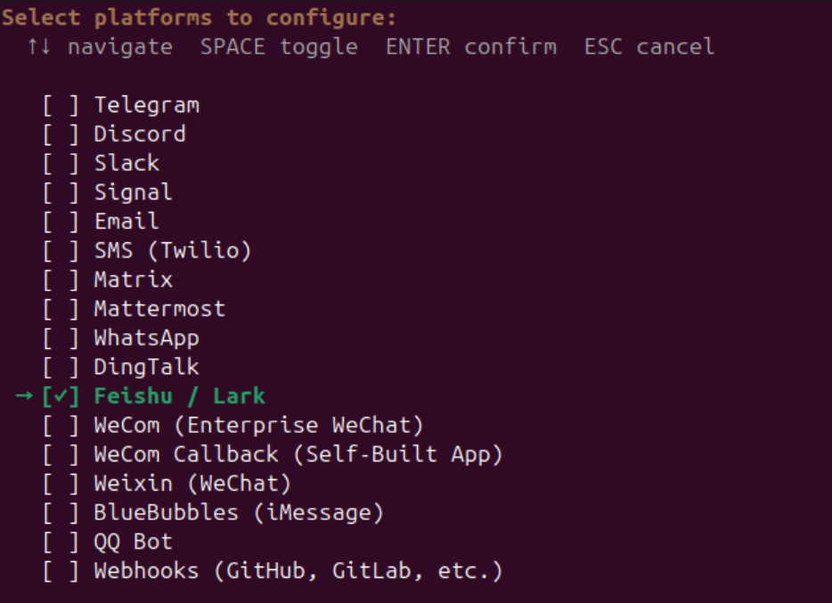

4. 4. 选择如何建立机器人应用：扫描二维码或者手动配置。

- ◦ **终端显示**：

  ```
  How would you like to set up Feishu / Lark?
  ```
- ◦ 选择第一项扫码新建 

  ```
  Scan QR code to create a new bot automatically
  ```

   ，按回车键 (

  ```
  Enter
  ```

  ) 确认。
- 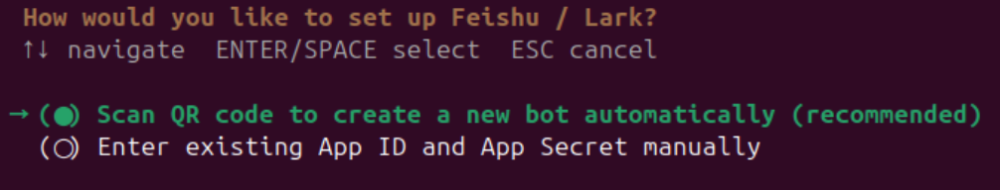

5. 5. 稍等片刻，**终端屏幕上会出现一个巨大的二维码**！
6. 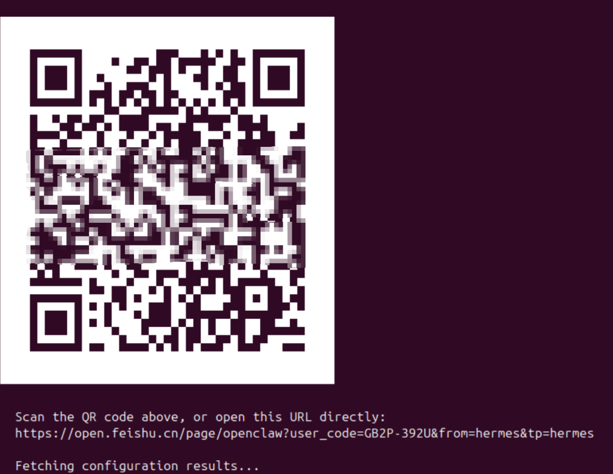
7. 6. 拿出你的手机，打开刚才注册好并登录了团队的 **飞书 APP**。
8. 7. 点击飞书右上角的“➕”号，选择“扫一扫”，扫描终端上的二维码。
9. 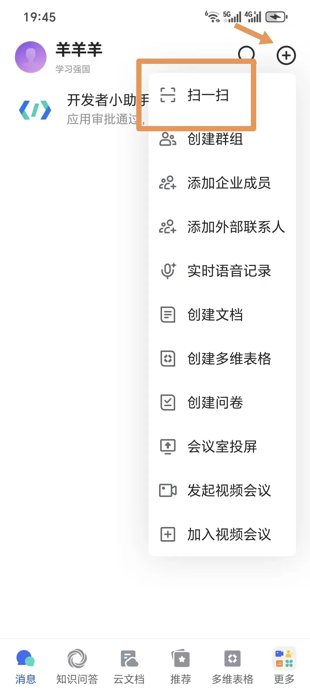
10. 8. 手机上会打开“创建 Hermes Agent 飞书应用”的页面，为你的智能助手取一个喜欢的名字，点击

    ```
    立即创建
    ```

    。
11. 
12. 9. 手机端显示创建成功后，终端上的二维码会消失，并进入下一步设置：消息授权方式。

- ◦ **终端显示**：

  ```
  How should direct messages be authorized?
  ```
- ◦ 选择第二项允许组织内所有成员发送消息 

  ```
  Allow all direct messages
  ```

   ，按回车键 (

  ```
  Enter
  ```

  ) 确认。
- 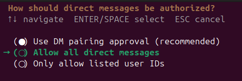

13. 10. **群聊设置**

- **终端显示**：

  ```
  How should group chats be handled?
  ```
- 选择第一项群聊@提及 

  ```
  Respond only when @mentioned in groups
  ```

   ，按回车键 (

  ```
  Enter
  ```

  ) 确认。
- 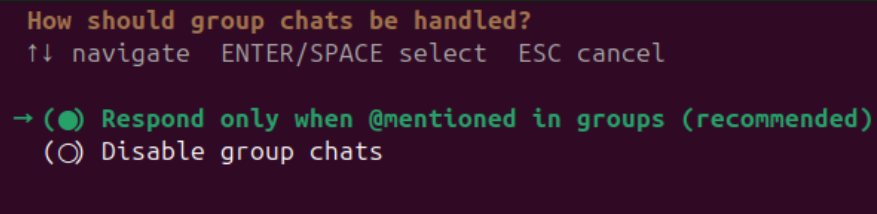
- 随后飞书会提示输入

  ```
  Home chat ID
  ```

  ，即默认消息群的 ID。这里我们暂时按回车键 (

  ```
  Enter
  ```

  ) 跳过，之后再在对应聊天窗口直接设置。

1. 11. 飞书设置完毕，向导会询问是否将消息网关设置为系统服务，确保在系统重启时可以自动运行。

- **终端显示**：

  ```
  Install the gateway as a system service?
  ```
- 按回车键 (

  ```
  Enter
  ```

  ) 直接确认。
- 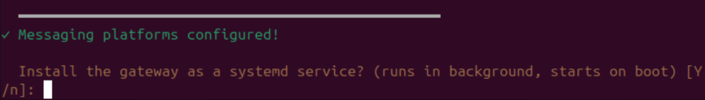

1. 12. 然后，下一项 

   ```
   Choose how the gateway should run in the background:
   ```

   选择第一个选项

   ```
   User service
   ```

   ，按回车键 (

   ```
   Enter
   ```

   ) 确认。然后再按一次回车键 (

   ```
   Enter
   ```

   ) 开启服务。
2. 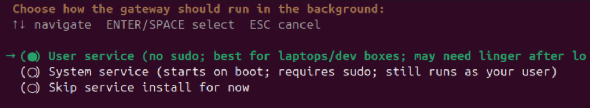

至此，飞书消息服务基本设置完成。让我们打开电脑或手机上的飞书，在搜索框里搜一下刚才新建的机器人名字，点开对话框试着随意给它发一条信息。


恭喜，你的“HERMES 爱马仕”智能助理已经可以像人一样和你在飞书上聊天了！

---

### 第三步：安装与配置飞书 CLI（可选）

**为什么需要飞书 CLI？**

刚才配置完成的飞书消息通道，可以理解为飞书 CLI 的简化版本，它解决的是基础的消息收发问题。但如果你希望 HERMES Agent 拥有**更高级的办公执行能力**，例如**创建和编辑飞书云文档、读写多维表格数据**等，就需要继续安装飞书 CLI。

**操作方法：**

1. 1. **让 AI 帮你安装**：这里我们尝试直接使用自然语言，让 HERMES 智能助手（后文统一简称为 

   ```
   HERMES
   ```

   ）代为安装。直接在刚才测试聊天的飞书对话框里，对它发送以下指令：

```
帮我安装飞书CLI: https://github.com/larksuite/cli#installation--quick-start
```

1. 2. **安装下载**：HERMES 收到指令后，会自动调用它的终端能力（Bash Tool）在后台完成下载和安装，并把安装成功的运行日志直接回复给你。这就是真正的 Agent 和普通聊天机器人最大的区别: 它能在你的电脑上实际执行任务，而不只是停留在“问答”层面。
2. 3. **完成安装**：安装完成后，HERMES 会提示需要创建飞书应用及授权。这里需要继续对 HERMES 说：

```
帮我将"lark-cli"加入环境变量
```

⚠️ **避坑警告**：飞书官方文档中，部分关于配置应用凭证的命令在智能助手的非交互环境下可能触发超时。虽然 HERMES 往往也能通过多轮尝试自行解决，但为了避免首次接触 HERMES 的读者被流程卡住，下面仍建议改用手动方式完成飞书 CLI 配置，这样更稳妥，也更容易一次成功。

1. 4. **手动配置飞书 CLI**：进入安装 HERMES 的 Ubuntu 电脑（后文统一称为 

   ```
   服务器
   ```

   ）桌面，按下快捷键 

   ```
   Ctrl + Alt + T
   ```

    打开终端窗口。输入命令 

   ```
   lark-cli config init --new
   ```

    并按回车。 又是熟悉的扫码创建机器人环节，按之前类似的步骤操作即可。
2. 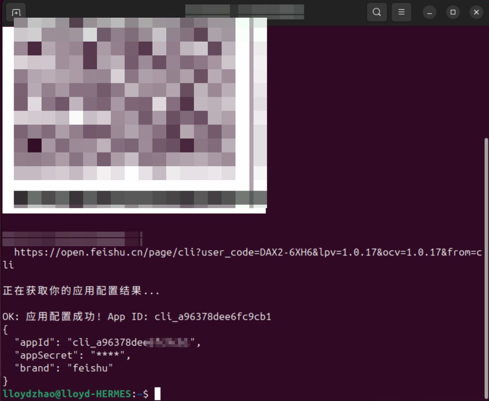
3. 5. 上一步完成后，继续在终端中输入：

   ```
   lark-cli auth login --recommend
   ```

   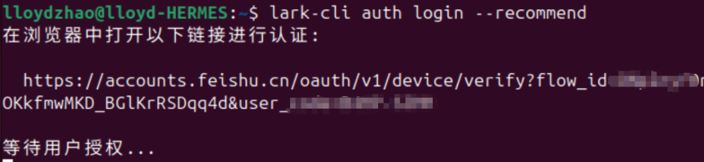
4. 6. 终端中会显示一个链接，按住 

   ```
   Ctrl
   ```

    键并点击该链接，打开浏览器登录飞书账号。随后给予刚创建的飞书 CLI 机器人授权（勾选复选框后，点击蓝色按钮），即可完成配置。
5. 
6. 7. 好了，让我们测试一下，在飞书聊天框中给 HERMES 小助手下达个任务：

   ```
   创建一篇飞书文档，比较 OPENCLAW 与 HERMES AGENT 的特点
   ```
7. 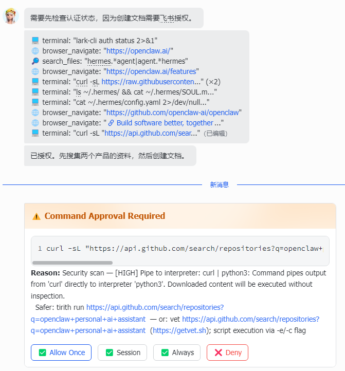
8. 开工后 HERMES 会实时更新它的命令执行状态。有时飞书聊天中会有类似图中下半部分的提示，这是 HERMES 遇到比较敏感或重要的指令，需要用户授权。你可以点击 

   ```
   Allow Once
   ```

   (授权本次) 或 

   ```
   Always
   ```

   (相同操作永久授权) 同意授权。
9. 8. HERMES 会根据题目自行搜索资料、研究整合，最终形成一篇飞书文档，并在飞书中把链接发给你，点开就可以查看。
11. 到这里，很多读者会第一次真正理解什么叫 AI 助手。它和手机里常见的“你问我答”式聊天机器人不一样，真正的 AI Agent 可以像人一样去收集信息、研究、整理，最后交付一份结构完整、内容成型的结果。**它开始具备“替你做事”的能力了。**
12. **当然，现在 HERMES 的能力还没有完全配置，搜索能力和研究深度也会有不尽如人意的地方。这就是我们后续文章要关注的内容 - 如何进一步补齐它的工具能力与执行能力，让这个助手真正从“能聊天”走向“能交付”。**

---

## 常见问题

**Q1：飞书机器人可以收到单聊消息，但无法回复群聊消息？**

- **【错误原因】**：群聊时，HERMES 只会对 

  ```
  @
  ```

   它的消息有反应，并在群里回复。
- **【解决办法】**：每次在群里需要助手的协助时，记得先 

  ```
  @
  ```

   它，再发送指令。

## 结语

至此，这一篇的核心目标已经完成：你已经把本地运行的 HERMES Agent 接入了飞书，并在需要时进一步配置了飞书 CLI。

恭喜，属于你的“数字牛马”已上线！HERMES 现在已经是一个可以在飞书中随时响应、逐步接管实际任务的个人 Agent。后续我们会继续把它的搜索、工具调用和执行能力一点点补齐，让它真正成为可用、可信、可持续扩展的 AI 助手。
