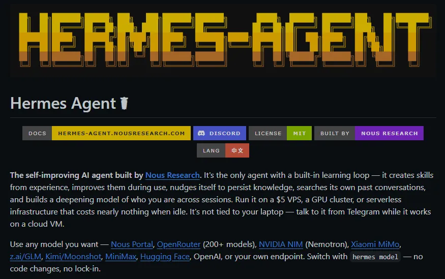
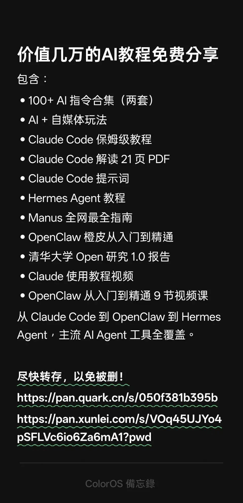

> 📎 来源: [布鲁斯AI](https://mp.weixin.qq.com/s?__biz=MjM5Mjg2OTk2MQ==&mid=2656901187&idx=1&sn=07812f43149b2ee090f52b37cbc6bcdf&chksm=bcf487aba6c4017187bc1f2aa59b959345ef610cdce281fbe7c9904f672f7b0d48d2fb60568f&mpshare=1&scene=1&srcid=0515VpMAwUxglzW68CPZGU97&sharer_shareinfo=98b2156c56efe4e67343ab437a28f099&sharer_shareinfo_first=98b2156c56efe4e67343ab437a28f099) | 时间: 2026-05-15 14:05

---



# 🔥 Hermes Agent 封神之路：2026 年 5 月必装的 10 个神级插件，让你的 AI 助手直接进化成超级员工！

大家好，我是 AI 工具探索者。最近 Hermes Agent v0.13.0"Tenacity" 版本的发布，直接把 AI Agent 的天花板又拉高了一大截。

作为一个深度使用 Hermes Agent 超过 3 个月的老用户，可以负责任地说：**没有插件的 Hermes，就像没有翅膀的老鹰**。它本身已经足够强大，但真正让它从 "好用" 变成 "离不开" 的，是社区贡献的这些神仙插件。

今天就从 80 + 个热门插件中，精挑细选出**10 个真正能改变你工作方式的神器**，每一个都经过我亲自测试，附安装命令和实战用法，看完直接复制粘贴就能用！

---

## 🚀 先科普一下：Hermes Agent 到底是什么？

Hermes Agent 是 Nous Research 推出的开源自进化 AI Agent 框架，目前 GitHub 星标已经突破 102k⭐。它最大的特点是：

- **真正的自主执行**：不只是聊天，能直接操作你的电脑、浏览器、文件系统
- **持久化记忆**：记住你所有的偏好和历史任务，越用越懂你
- **技能系统**：通过插件无限扩展能力
- **多平台支持**：可以接入微信、飞书、Discord、Slack 等 20 + 平台

简单来说，它不是一个聊天机器人，而是一个**能真正帮你干活的数字员工**。

---

## 🏆 2026 年 5 月 Hermes Agent 十大神级插件

### 1. Browser-Use ⭐推荐指数：9.9/10

**分类：浏览器自动化 | 热度：🔥🔥🔥🔥🔥**

这绝对是目前 Hermes 生态最火的插件，没有之一！它让 Hermes 真正拥有了 "手" 和 "眼睛"，可以像真人一样操作浏览器。

**能做什么：**

- 自动管理你的邮箱，筛选重要邮件并回复
- 帮你在电商平台比价、下单
- 自动填写各种表单、注册账号
- 爬取任何网站的数据，哪怕是动态加载的
- 帮你预约挂号、抢票、签到

**安装命令：**

```
hermes skills install official/browser-use
```

**实战示例：**

> "帮我检查一下今天的 Gmail，把所有工作相关的邮件整理成一个摘要，重要的标出来，垃圾邮件直接删除。"

> "帮我在京东和淘宝上搜索 ' 机械键盘 '，价格在 300-500 元之间，销量前 10 的产品，对比一下参数和评价，给我推荐 3 个最好的。"

**为什么必装：** 这是唯一一个能让你真正解放双手的插件。以前需要你自己点开网页一步步操作的事情，现在一句话就能搞定。

---

### 2. 飞书 MCP ⭐推荐指数：9.8/10

**分类：办公自动化 | 热度：🔥🔥🔥🔥🔥**

**国内职场人第一优先级必装！** 没有之一。通过 MCP (Model Context Protocol) 协议，Hermes 可以深度集成飞书的所有功能。

**能做什么：**

- 自动写飞书文档、表格、演示文稿
- 管理你的飞书日历，智能安排会议
- 处理飞书任务，自动分配和跟进
- 回复飞书消息，筛选重要信息
- 批量导出飞书文档为 Markdown 格式

**安装命令：**

```
hermes plugins enable feishuhermes config set feishu.app_id "你的APP ID"hermes config set feishu.app_secret "你的APP Secret"
```

**实战示例：**

> "帮我把昨天的会议录音转成文字，整理成会议纪要，然后发到飞书群里，并 @相关负责人。"

> "帮我查看一下本周的飞书日历，把所有会议整理成一个表格，标出会议时间、地点、参会人员和议题。"

**为什么必装：** 如果你每天 80% 的工作都在飞书上完成，这个插件能帮你节省至少一半的时间。它不是简单的消息转发，而是真正的深度集成。

---

### 3. GitHub MCP ⭐推荐指数：9.7/10

**分类：开发工具 | 热度：🔥🔥🔥🔥**

开发者必备神器！让 Hermes 成为你的专属代码助手，在你睡觉的时候替你管理 GitHub 仓库。

**能做什么：**

- 自动审查 Pull Request，指出代码问题
- 帮你创建和管理 Issue
- 自动合并符合条件的 PR
- 监控仓库的 Star、Fork 和 Issue 动态
- 生成 Release Notes 和更新日志

**安装命令：**

```
hermes plugins enable githubhermes config set github.token "你的GitHub Token"
```

**实战示例：**

> "帮我审查一下这个 PR #123，重点检查代码风格、安全性和性能问题，给出详细的修改建议。"

> "帮我整理一下本周所有关闭的 Issue 和合并的 PR，生成一个 v1.2.0 版本的 Release Notes。"

**为什么必装：** 代码审查是最耗时的工作之一。有了这个插件，Hermes 可以帮你完成 80% 的初步审查工作，你只需要做最后的决策。

---

### 4. Langfuse ⭐推荐指数：9.6/10

**分类：监控调试 | 热度：🔥🔥🔥🔥**

重度用户必装！解决了 "Agent 后台在干嘛我全靠猜" 的痛点。它能让你清晰地看到 Hermes 的每一步操作、消耗了多少 Token、哪一步出了问题。

**能做什么：**

- 实时监控 Token 消耗，按模型、按任务统计
- 追踪每一次工具调用和执行结果
- 记录完整的对话历史和上下文
- 分析 Agent 的性能和成功率
- 调试错误和异常情况

**安装命令：**

```
hermes plugins enable langfusehermes config set langfuse.public_key "你的Public Key"hermes config set langfuse.secret_key "你的Secret Key"
```

**为什么必装：** 当你开始用 Hermes 处理复杂任务时，你会发现调试是最大的问题。Langfuse 就像一个 X 光机，让你能看透 Agent 的内部运行机制。

---

### 5. ComfyUI ⭐推荐指数：9.5/10

**分类：多媒体 | 热度：🔥🔥🔥🔥**

v0.12.0 版本直接从可选技能升级为内置默认技能！AI 图像生成的最佳搭档，支持 ComfyUI 的所有功能和节点。

**能做什么：**

- 用自然语言生成任何风格的图像
- 自动管理 ComfyUI 模型和节点
- 批量生成图像并进行后处理
- 支持 ControlNet、Inpaint、Outpaint 等高级功能
- 硬件门控，显卡不够会自动提示

**安装命令：**

```
# 已经内置，直接启用即可hermes toolsets enable comfyui
```

**实战示例：**

> "帮我生成一张赛博朋克风格的城市夜景图，分辨率 2048x1080，要有霓虹灯、飞行汽车和高楼大厦。"

> "用 ControlNet 把这张线稿变成彩色的插画，风格参考宫崎骏的动画。"

**为什么必装：** 这是目前集成度最高、体验最好的 AI 图像生成插件。不需要切换应用，直接在 Hermes 里就能完成所有操作。

---

### 6. RTK-Hermes ⭐推荐指数：9.4/10

**分类：性能优化 | 热度：🔥🔥🔥🔥**

**省钱神器！** 官方测试最高能节省 99% 的 Token 消耗，最低也能省 90%。对于每天大量使用 Hermes 的用户来说，这能帮你省下一大笔钱。

**能做什么：**

- 自动过滤掉无用的日志和输出
- 把长文本压缩成结构化的短信息
- 智能缓存重复的请求和响应
- 优化提示词，减少不必要的 Token
- 支持多种场景的预设模板

**安装命令：**

```
hermes plugins install https://github.com/ogallotti/rtk-hermes
```

**为什么必装：** 大模型的 Token 费用其实不便宜。如果你每天用 Hermes 处理大量代码和日志，这个插件一个月能帮你省下几百甚至上千元。

---

### 7. Google Workspace ⭐推荐指数：9.3/10

**分类：办公自动化 | 热度：🔥🔥🔥**

如果你用的是 Google 全家桶，这个插件就是你的不二之选。支持 Gmail、Calendar、Drive、Sheets、Docs 等所有 Google 服务。

**能做什么：**

- 自动处理 Gmail 邮件，分类、回复、归档
- 管理 Google Calendar，智能安排日程
- 读写 Google Drive 上的文件
- 编辑 Google Sheets 表格，进行数据处理和分析
- 生成 Google Docs 文档和演示文稿

**安装命令：**

```
hermes skills install official/google-workspace
```

**为什么必装：** 和飞书 MCP 一样，这是 Google 生态用户的必备插件。它能让 Hermes 无缝融入你的工作流。

---

### 8. Obsidian/SiYuan ⭐推荐指数：9.2/10

**分类：知识管理 | 热度：🔥🔥🔥**

用 Hermes+Obsidian/SiYuan 打造你的第二大脑！让 AI 帮你整理、总结和关联你的知识库。

**能做什么：**

- 自动创建和编辑笔记
- 总结长文档和书籍
- 智能关联相关的笔记
- 生成思维导图和知识图谱
- 搜索和查询你的知识库

**安装命令：**

```
# Obsidianhermes skills install community/obsidian# 思源笔记hermes skills install community/siyuan-note
```

**实战示例：**

> "帮我把这篇 10000 字的文章总结成 300 字的摘要，然后保存到我的 Obsidian 知识库，标签是 ' 人工智能 '。"

> "帮我搜索一下我知识库中所有关于 'Hermes Agent' 的笔记，整理成一个大纲。"

**为什么必装：** 知识管理最耗时的就是整理和总结。有了这个插件，你只需要负责输入信息，Hermes 会帮你把它们变成结构化的知识。

---

### 9. Spotify ⭐推荐指数：9.1/10

**分类：生活娱乐 | 热度：🔥🔥🔥**

v0.12.0 新增的内置插件！让 Hermes 成为你的专属 DJ，边干活边让 AI 帮你管理音乐。

**能做什么：**

- 用自然语言控制播放、暂停、上一首、下一首
- 根据你的心情推荐音乐
- 创建和管理播放列表
- 搜索歌曲、专辑和艺术家
- 控制播放设备

**安装命令：**

```
# 已经内置，直接启用即可hermes toolsets enable spotify
```

**实战示例：**

> "帮我播放一些适合写代码的轻音乐，不要有歌词。"

> "创建一个名为 ' 周末放松 ' 的播放列表，加入一些爵士和蓝调音乐。"

**为什么必装：** 虽然是个小功能，但体验非常好。不需要切换到 Spotify 应用，直接在 Hermes 里用自然语言控制音乐，非常方便。

---

### 10. Multi-Agent Kanban ⭐推荐指数：9.0/10

**分类：团队协作 | 热度：🔥🔥🔥**

v0.13.0 最重磅的更新！持久化多代理协作看板系统，让多个 Hermes 工作代理像真实团队一样协作完成任务。

**能做什么：**

- 创建多个工作代理，每个代理有不同的专长
- 用看板管理任务，自动分配给合适的代理
- 任务回收机制：如果一个代理挂了，任务会自动被其他代理接手
- 幻觉门控：检测到 AI 胡编乱造时，会触发恢复流程
- 每任务重试上限：防止 AI 在一个任务上无限死循环

**使用方法：**

```
# 启用多代理看板hermes features enable multi-agent-kanban# 创建一个新看板/kanban create "我的项目"
```

**为什么必装：** 这是 AI Agent 未来的发展方向。以前你只能让一个 Hermes 帮你干活，现在你可以拥有一个完整的 AI 团队！

---

## 💡 插件安装与使用小贴士

1. **安装顺序：** 建议先安装基础插件（Langfuse、RTK-Hermes），再安装功能插件
2. **安全第一：** 只安装来自官方和可信来源的插件，不要随便给插件过高的权限
3. **按需安装：** 不要安装太多插件，会影响性能。只装你真正需要的
4. **及时更新：** Hermes 更新很快，插件也需要及时更新才能兼容
5. **备份配置：** 定期备份你的`~/.hermes`目录，防止配置丢失

---

## 🎯 写在最后

Hermes Agent 的插件生态正在以惊人的速度发展。今天推荐的这 10 个插件，只是冰山一角。但它们是目前最成熟、最实用、能真正提升你工作效率的选择。

我相信，在不久的将来，我们每个人都会有一个专属的 AI 助手，它会帮我们处理大部分重复性的工作，让我们有更多的时间去做真正有创造性的事情。

如果你也在用 Hermes Agent，或者有其他好用的插件推荐，欢迎在评论区留言交流！

**关注我，带你探索更多 AI 神器，让 AI 成为你最好的生产力工具！**



尽快转存，以免被删！

https://pan.quark.cn/s/050f381b395b

https://pan.xunlei.com/s/VOrwPKercKjS8cldc\_ol5cI0A1?pwd=724j#

[告别命令行！[爱马仕]Hermes Agent 全功能可视化界面来了，一条命令玩转自进化AI Agent](https://mp.weixin.qq.com/s?__biz=MjM5Mjg2OTk2MQ==&mid=2656901052&idx=1&sn=073617c423001a63c021f337e8cadae9&scene=21#wechat_redirect)
