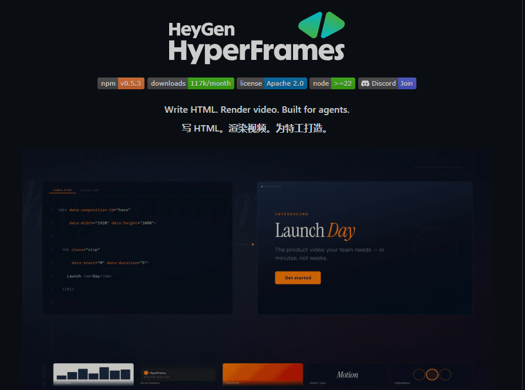
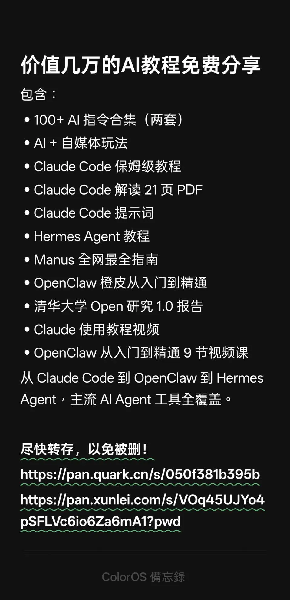

> 📎 来源: [布鲁斯AI](https://mp.weixin.qq.com/s?__biz=MjM5Mjg2OTk2MQ==&mid=2656901110&idx=1&sn=5a549ffcb272a60f1c75af01eb5eab80&chksm=bc8ca60a368e912150b49e8ce30bddb782b30599cef70e6fb26e37c64383ea46b4490a3eb9d9&mpshare=1&scene=1&srcid=0510WVA0q6KFaoyrWqkQJrqA&sharer_shareinfo=fbd881d5e5f0610c3a860eb5bc662c8a&sharer_shareinfo_first=fbd881d5e5f0610c3a860eb5bc662c8a) | 时间: 2026-05-10 15:06

---

🤖

不用装复杂的 AE，不用死磕剪映模板，不用忍受录屏软件的糊画质， 只用你写前端最熟悉的 HTML/CSS/JS， 就能做出电影级动态标题卡、带精准同步字幕的口播视频、音频卡点动效、产品宣传片， 甚至能把你的官网直接渲染成 4K 超清 MP4 视频？



HTML 直出视频：Hermes HyperFrames 全攻略


今天就给所有前端开发者、内容创作者、运营人，解锁这个降维打击的创作神器 ——Hermes Agent 生态核心创意技能 HyperFrames，全程只需要一行核心命令，就能开启你的 HTML 直出视频之旅。

---

### 🔹 先搞懂：HyperFrames 到底是个什么神仙工具？

先给小白做个极简科普，一句话讲透核心：HyperFrames 是一款以 HTML 为视频唯一可信源的视频渲染引擎，由 HeyGen 开发、Apache-2.0 开源，同时也是 NousResearch 开源 Hermes Agent 智能体框架的官方创意技能。

它的底层逻辑简单到离谱：把带时序控制属性、GSAP 动画时间线、CSS 样式的 HTML 文件，直接当成视频工程文件，通过引擎逐帧捕获页面内容，最终用 FFmpeg 编码输出确定性、无损、可复现的 MP4/WebM 视频。

和传统工具比，它的优势直接碾压：

|  |  |
| --- | --- |
| 传统创作痛点 | HyperFrames 解决方案 |
| AE 门槛高、表达式难学，前端人要重新学一套软件 | 直接用 HTML/CSS/JS/GSAP 技术栈，零额外学习成本 |
| 剪映模板受限，自定义程度低，批量制作麻烦 | 全代码化控制，改一行参数就能批量生成 100 条视频 |
| 录屏画质糊、帧率不稳，窗口大小一变动画全乱 | 逐帧确定性渲染，60 帧 4K 无损输出，任何环境效果完全一致 |
| 口播字幕对轴要熬半宿，音频卡点动效难做 | 内置 TTS 语音生成、自动字幕转录对齐、音频响应动效，一键搞定 |
| 网站转宣传视频只能录屏，细节全丢 | 原生支持 URL 网站转视频，完整还原页面动效与布局 |

而最王炸的是：它可以直接作为技能安装到 Hermes Agent 中，让你的 AI 智能体直接具备专业级视频创作能力—— 你只用说一句话，AI 就能自动帮你写代码、做动画、渲染出成品视频，全程不用碰一行代码。

---

### 🔹 核心命令详解：$ hermes skills install hyperframes 一键安装全流程optional-skills/creative/hyperframes/SKILL.md

这行看起来平平无奇的命令，就是你打开 HTML 视频创作世界的钥匙。下面给你拆解这行命令的完整逻辑，以及从环境准备到安装成功的保姆级步骤，小白也能一步到位。

#### 一、先搞定前置环境（安装前必看）

在执行安装命令前，你的设备需要提前装好这 3 个核心依赖，缺一不可：

1.

Node.js >= 22：HyperFrames 的核心运行环境，版本过低会直接安装失败

2.

FFmpeg：视频编码的核心工具，负责最终 MP4 文件的生成

3.

Hermes Agent 环境：这是 Hermes 的技能包，必须先装好 Hermes Agent 主程序才能安装技能

补充：Windows/Mac/Linux 全系统兼容，Mac 用户可以直接用 brew 安装 FFmpeg，Windows 用户建议用 choco 安装，避免环境变量配置问题。

#### 二、核心安装命令：一行搞定全配置

环境准备完成后，直接在终端执行这行命令：

```
> 正在加载Bash代码…
```

这行命令执行后，会自动帮你完成 6 件事，全程不用手动操作：

1.

从 Hermes 官方技能库拉取 HyperFrames 的完整代码与配置文件

2.

自动执行官方预置的setup.sh环境配置脚本

3.

校验你的 Node.js、FFmpeg 版本，缺失或版本不符时会直接输出修复指引

4.

全局安装hyperframes CLI 工具（自动匹配 >=0.4.2 的稳定版本）

5.

通过 Puppeteer 预缓存chrome-headless-shell，这是高质量逐帧渲染的核心依赖

6.

自动执行npx hyperframes doctor环境诊断，输出安装结果与问题提示

#### 三、安装成功校验：2 步确认没问题

1.

执行以下命令，查看已安装的 Hermes 技能，确认 hyperframes 在列表中：

```
> 正在加载Bash代码…
```

1.

执行环境诊断命令，确认所有依赖项都正常，无红色报错：

```
> 正在加载Bash代码…
```

如果出现报错，直接看终端输出的修复指引，也可以参考官方的troubleshooting.md文档，99% 的问题都是 Node.js 版本过低或 FFmpeg 未安装导致的。

---

### 🔹 5 分钟上手！安装完就能跑的第一个视频项目

安装完成后，不用急着啃复杂文档，跟着这个步骤，5 分钟就能做出你的第一个 HTML 渲染视频，新手零压力。

#### 步骤 1：初始化项目脚手架

终端执行以下命令，用官方内置的瑞士网格模板初始化一个视频项目，非交互式模式全程不用手动选配置：

```
> 正在加载Bash代码…
```

官方内置了 10 + 开箱即用的模板，包括空白模板、暖调胶片、产品宣传、动态排版、数据图表等，新手可以直接换模板名快速上手。

#### 步骤 2：修改你的视频内容

用编辑器打开项目里的index.html，找到标题文本，改成你想要的内容，比如 “我的第一个 HyperFrames 视频”，简单调整一下 CSS 里的颜色和字体，先搞定静态布局。

官方硬性规则：先做静态布局，再加动画！先把核心画面的 HTML+CSS 写好，再动 GSAP 动画，避免布局错乱。

#### 步骤 3：实时预览效果

执行以下命令，启动本地预览服务，浏览器会自动打开http://localhost:3002，支持实时热重载，改完代码保存就能看到效果：

```
> 正在加载Bash代码…
```

#### 步骤 4：渲染导出成品视频

预览没问题后，执行渲染命令，导出高清 MP4 视频：

```
> 正在加载Bash代码…
```

渲染完成后，你就能在项目文件夹里看到成品视频了 —— 没错，就这么简单，只用前端的知识，就做出了一条无损高清的动画视频。

---

### 🔹 封神级进阶玩法：这些功能直接吊打传统剪辑软件

如果你以为它只能做简单的标题卡，那就太小看它了。这些内置的硬核功能，直接覆盖了 90% 的视频创作场景，自媒体人、前端开发者、产品运营直接狂喜。

#### 1. 口播视频神器：TTS + 自动字幕同步

做口播视频最头疼的字幕对轴，HyperFrames 一键搞定：

•

一行命令生成 AI 语音，支持中英日韩等多语言，几十种音色可选：

```
> 正在加载Bash代码…
```

•

一行命令自动转录音频，生成单词级时间轴字幕，完美对齐语音：

```
> 正在加载Bash代码…
```

不用再手动拖字幕条，不用熬半宿对轴，10 分钟就能搞定一条口播科普视频。

#### 2. 音频响应动效：一键做卡点视频、音乐可视化

想做跟着音乐节拍动的卡点视频、频谱动效？不用写复杂的音频处理代码，HyperFrames 已经帮你做好了底层封装：

•

预提取音频的低音 / 中音 / 高音频段，逐帧采样响应

•

经典映射规则：低音控制画面缩放脉冲，高音控制发光效果，整体振幅控制画面透明度与位置

•

告别千篇一律的均衡器柱状图，完全自定义视觉效果，音乐一响，画面自动卡点

#### 3. 电影级转场：一行命令安装着色器特效

不用再找 AE 转场预设，HyperFrames 支持几十种专业级着色器转场，包括白光闪切、液态擦除、色差分裂、变形融合等电影级效果，一行命令就能安装：

```
> 正在加载Bash代码…
```

官方硬性规则：多场景视频必须用转场，禁止硬切跳剪，而且不要混用 CSS 转场和着色器转场，保证视频风格统一。

#### 4. 网站转视频：把官网直接变成宣传片

想给你的产品官网、个人博客做一条宣传视频？不用录屏，不用重新做动画，HyperFrames 原生支持 URL 转视频，7 步工作流直接搞定：捕获页面 → 生成视觉规范 → 写脚本 → 分镜设计 → 合成制作 → 渲染 → 交付完整还原网站的所有动效、布局、交互细节，渲染出来的画质比录屏好 10 倍。

#### 5. 与 Hermes Agent 无缝联动：一句话生成视频

这才是安装 Hermes 技能的终极意义 —— 你不用写一行代码，只用跟 Hermes Agent 说自然语言，它就能自动调用 HyperFrames 技能，帮你生成完整视频。

比如你直接跟 Hermes 说： “帮我用 HyperFrames 做一条 30 秒的竖屏抖音产品宣传视频，暗黑科技风，产品是一款前端开发工具，带口播和同步字幕，结尾加账号 ID@前端魔法师，背景音乐用节奏感强的科技 BGM”

然后 AI 就会自动帮你生成视觉规范文档、写 HTML 代码、配置 GSAP 动画、生成 TTS 语音与字幕、渲染出成品 MP4，全程你只需要动嘴。

---

### 🔹 小白必看！官方踩坑避坑指南

官方文档里明确标注了高频踩坑点，这些错误会直接导致渲染失败，新手一定要避开：

1.

绝对禁止用repeat: -1无限循环：会直接中断渲染引擎，必须用公式计算有限循环次数

2.

禁止手动调用video.play()/audio.play()：播放控制权完全归属框架，手动调用会导致时序错乱

3.

禁止用异步代码构建 GSAP 时间线：渲染引擎会同步读取时间线，async/await、setTimeout 会导致动画不生效

4.

禁止用
给正文强制换行：会导致渲染时双重换行，用max-width让文本自然换行

5.

不要用系统 Chrome 渲染：会导致渲染挂起超时，必须用chrome-headless-shell，安装命令会自动帮你装好

6.

非英语音频不要用.en转录模型：会自动把音频翻译成英语，而不是转录原语言字幕

---

### 🔹 谁最该冲这个工具？精准适配人群盘点

1.

前端开发者：用自己最熟悉的技术栈做视频，接私单、做技术科普、产品演示视频，降维打击，拓展收入边界

2.

自媒体内容创作者：快速做片头、口播视频、卡点视频，不用学复杂的 AE，不用熬通宵对字幕，效率直接翻倍

3.

产品 / 运营人：快速生成产品宣传视频、活动视频、官网宣传片，不用找设计，自己就能搞定，改文案就能批量生成

4.

AI Agent 开发者：给你的智能体加上专业级视频创作能力，搭建自动化视频创作工作流，做 AI 短视频账号、自动化内容生产完全没问题

5.

设计师 / 动态图形创作者：用 CSS+GSAP 做动效，确定性渲染输出，不用再担心动效在不同设备里效果不一致

---

### 最后想说

以前，前端开发者的边界是网页、是交互、是界面； 现在，HyperFrames 把前端的边界，拓展到了视频创作、内容生产、动态视觉的全新领域。

你不用再为了做一条视频，去学一套完全陌生的软件，不用再忍受录屏的糊画质，不用再为了字幕对轴熬到凌晨。只用你已经掌握的 HTML/CSS/JS，加上一行安装命令，就能打开一个全新的创作世界。



尽快转存，以免被删！

https://pan.quark.cn/s/050f381b395b

https://pan.xunlei.com/s/VOrwPKercKjS8cldc\_ol5cI0A1?pwd=724j#

[告别命令行！[爱马仕]Hermes Agent 全功能可视化界面来了，一条命令玩转自进化AI Agent](https://mp.weixin.qq.com/s?__biz=MjM5Mjg2OTk2MQ==&mid=2656901052&idx=1&sn=073617c423001a63c021f337e8cadae9&scene=21#wechat_redirect)
