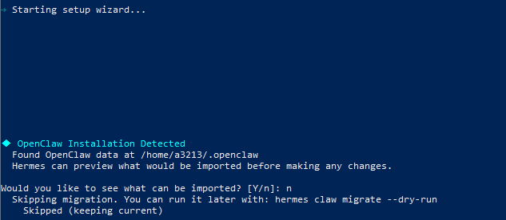
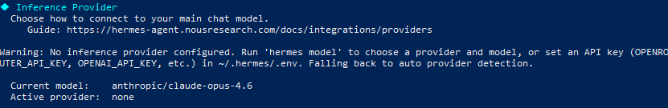
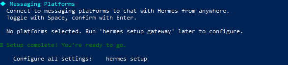
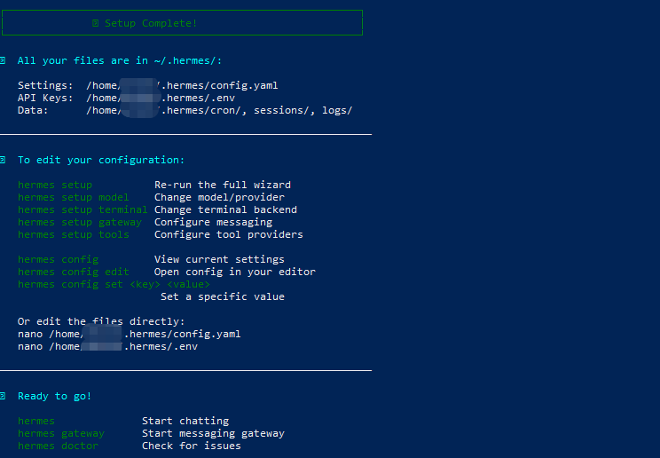
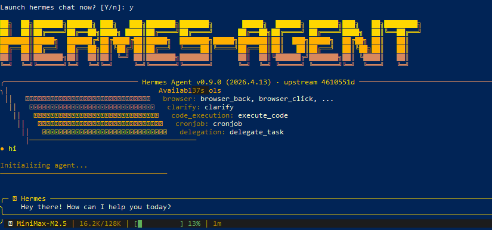
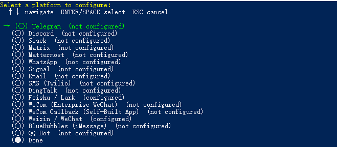
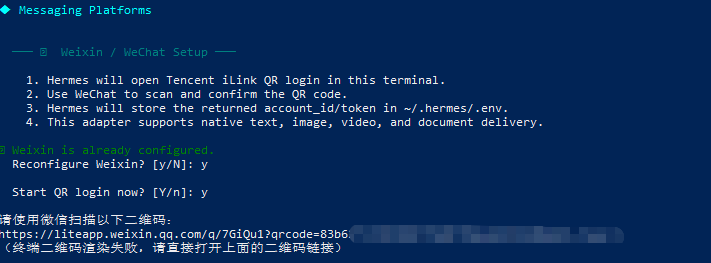
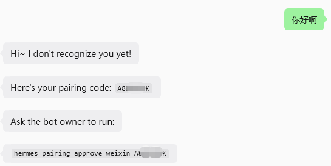
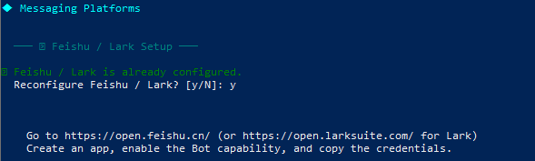
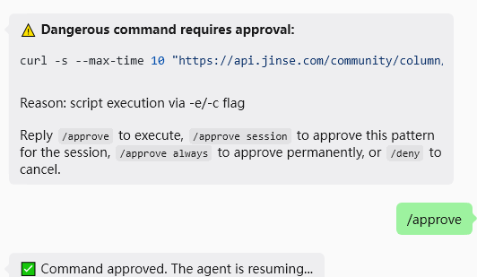

> 📎 来源: [共话AI](https://mp.weixin.qq.com/s?__biz=MzA4NTUzNTk2NA==&mid=2451737495&idx=1&sn=44375ef29383150347f4a29e9a7b4c2c&chksm=89580ecf9b354acb1e4ce79cddb3e503156086cafc76486464229ad77d3c4f83d60b0fe5af22&mpshare=1&scene=1&srcid=0420VOKdS5fkk21xXKCbF8zL&sharer_shareinfo=8c7489ff87e6e70593720056c0465298&sharer_shareinfo_first=8c7489ff87e6e70593720056c0465298) | 时间: 2026-04-22 00:24

---

▸前言

在openclaw爆火几个月后，Hermes也出来了，和很火的harness名字还比较接近，又是爱马仕的加持，GitHub star也是一路高升。

当然，Hermes的亮点主要还是在它是一个可以自我改进的agent。

相比openclaw，你需要告诉他把什么什么写到记忆，而Hermes则根据交互记录自动总结skill，进行自我进化，从而达到越用越好用的效果，让用户离不开它。

都这么火了，那就安装一个试试呗。

## ▸安装过程

### 一键安装

手里有一台Windows机器，于是在Windows安装。但是谨记：Windows原生不支持安装Hermes。不过可以使用wsl进行安装，wsl也就是一个Windows上的Linux子系统。wsl安装可以搜索下，这方面资料很多的。

类似Openclaw也有一键安装命令，好处就是不用管有哪些依赖要安装，通过一键安装脚本都会给自动安装好（uv、python、npm。。。）

```
curl -fsSL https://raw.githubusercontent.com/NousResearch/hermes-agent/main/scripts/install.sh | bash
```

但是，涉及到GitHub环境问题，以及后续uv、npm安装等网络问题，我最终是使用如下脚本安装的。其实就是使用了镜像地址。

```
export UV_INDEX_URL="https://pypi.tuna.tsinghua.edu.cn/simple" && export NPM_CONFIG_REGISTRY="https://registry.npmmirror.com" && curl -fsSL https://ghproxy.net/https://raw.githubusercontent.com/NousResearch/hermes-agent/main/scripts/install.sh | bash
```

注意：

1、安装过程中会多次需要用到sudo权限，需要输入wsl密码。

2、安装过程长时间不动卡住，可以Ctrl C停掉，可以重新执行如上脚本，识别到已经安装的部分，就不会重复安装

我安装的时候，在 Installing Node.js dependencies (browser tools)...这块卡了几次，Ctrl C停掉、重试，后来提示输入sudo密码，就跑通了。

虽然显示了Failed to install browsers，但是不影响整体安装过程。

### 模型配置

当出现Starting setup wizard...，就差不多了



首先会识别如果安装了openclaw，可以把openclaw配置迁移过来，网上有人说这个功能又bug，我就选择n了。

接下来就是配置模型了



不确定是哪个provider也可以选择custom，差不多也都是设置baseurl、model、apikey，不确定Context length上下文长度，也可以不填（则自动识别）



接下来是消息平台设置，也可以现在不设置，后面通过hermes gateway setup再去设置



当出现如上提示的时候，就安装好了。

通过上面提示信息，可以知道配置文件在哪存放的，以及主要的命令行操作。



通过命令行方式对话，agent回复了，说明初步成功了。

### gateway安装

接下来进行gateway的安装，后面就可以通过其他消息工具对话了

```
hermes gateway install
```

然后启动gateway

```
hermes gateway start
```

需要重启的话执行

```
hermes gateway restart
```

### 消息工具接入

这里主要接入了微信、飞书。执行如下命令开始消息平台的接入配置

```
hermes gateway setup
```



微信

选择weixei/wechat



如上，如果无法显示二维码，则直接复制网址浏览器打开，微信直接扫码即可。类似openclaw微信就多出来一个机器人了。

后面的选项按照推荐的来就行。

接下来，使用微信和机器人对话，会提示配对。wsl下执行配对批准命令后，即可正常对话。



飞书



在开始配置之前，我们先得去飞书开发者平台（https://open.feishu.cn）新建一个应用。这些操作和openclaw都是一样的。

添加机器人能力，批量导入权限

```
{"scopes":{"tenant":["aily:file:read","aily:file:write","application:application.app_message_stats.overview:readonly","application:application:self_manage","application:bot.menu:write","cardkit:card:write","contact:contact.base:readonly","contact:user.employee_id:readonly","corehr:file:download","docs:document.content:read","event:ip_list","im:chat","im:chat.access_event.bot_p2p_chat:read","im:chat.members:bot_access","im:message","im:message.group_at_msg:readonly","im:message.group_msg","im:message.p2p_msg:readonly","im:message:readonly","im:message:send_as_bot","im:resource","sheets:spreadsheet","wiki:wiki:readonly"],"user":["aily:file:read","aily:file:write","contact:contact.base:readonly","im:chat.access_event.bot_p2p_chat:read"]}}
```

接下来选择feishu/Lark，然后复制appid、appsecret

Connection mode选择websocket，其他按照默认推荐配置即可

最后Done，会自动重启gateway。

接下来回到飞书开发者后台，事件和回调，调用方式选择长连接，事件添加：接收消息，回调配置调用方式也选择长连接。

然后飞书里使用这个机器人就可以对话了，类似微信，第一次对话也需要进行配对批准。

Home chat ID (optional, for cron/notifications)，这个可选的，不影响飞书对话，后续也可以再配置。

飞书配置的参考文章：https://cloud.tencent.com/developer/article/2652796

## ▸初步使用感受

一开始我想的类似openclaw有webui界面，那样一开始用起来会比较方便，结果发现没这个东西。

再一个和openclaw不一样的地方就是，调用工具的时候，都得批准，确实安全性更好，当然根据实际情况，可以选择当前会话批准、或者总是批准。



再一个，感觉gateway稳定性要比openclaw好一些，也可能是一开始还是用的少。

试着让它收集最新AI资讯，整理为一个word，第一次没有word技能，给我返回了txt，第二次让他安装docx技能，然后可以直接返回word文档了。我是在微信对话的，之前都没注意到微信里发送文件也是这么顺滑。

更多的使用，还得多多磨合，看看是不是可以越用越好用。

突然又想到一点，目前各种本地、云，都是养虾的生态，这个就是先发优势了。

哪天网上也出现提供爱马仕服务，两个就可以同台竞技了，不过Hermes部署相对麻烦、没有webui是个缺点，但是可能真挡不住它的自我改进优势。但是，openclaw也可以通过自我改进技能实现类似效果。

AI的变化实在太快了，走着看呗，不过得一直走着~

---

**欢迎关注、交流！**

#Hermes agent #agent #openclaw
