> 📎 来源: [梦飞 AI](https://mp.weixin.qq.com/s?__biz=MzkyNjI3NjQ2MA==&mid=2247495249&idx=1&sn=b492b991173bb920b80595abd58dda3b&chksm=c38fa3de044b0f4bd6149032c3c80c09532d052291679bd202baae81e8b8b4b5aa3c56e703e6&mpshare=1&scene=1&srcid=0420pBLrjlbFWlR77MT6RDW3&sharer_shareinfo=13fec26e2d78e86a377f49212d62b516&sharer_shareinfo_first=13fec26e2d78e86a377f49212d62b516) | 时间: 2026-04-20 15:39

---


Hermes Agent 是当前最前沿的开源 AI 智能体框架之一，其最大亮点是具备 “自我进化”能力，相比OpenClaw，Hermes Agent 得到了更精细的优化。

而Hermes Agent没有对windows原生支持，但是又有不少小伙伴，常用的就是windows系统。所以非常需要一个能够在windows下体验Hermes Agent的部署方式。

经过两天的踩坑，终于跑出来两个能够在Windows中部署Hermes Agent的方式，以下是部署的两个教程。

**第一种：一键部署。**

**简单，直接，快速，不需要过多配置环境，拥有90%的功能，适合小白上手体验。**

**第二种：原生部署。**

**需要配置本地系统环境，由于不同的windows系统差异大，没有标准教程，如果按照下方第一步教程没有完成WSL，那么这一项可能需要你花半个小时来搞定。**

后续的流程是一样的，搞定WSL，按照以下步骤，你就能体验满血版的Hermes Agent，这个适合开发者来玩。

大家选择适合自己的方式即可。


#

# **第一种方式：一键部署**

### 步骤 1：准备环境（管理员权限）

1. 按 Win + X → 选择 “终端(管理员)”。


2. 执行以下命令

```
Set-ExecutionPolicy -ExecutionPolicy RemoteSigned -Scope CurrentUser
```

### 执行官方安装脚本

```
irm https://raw.githubusercontent.com/NousResearch/hermes-agent/main/scripts/install.ps1 | iex
```

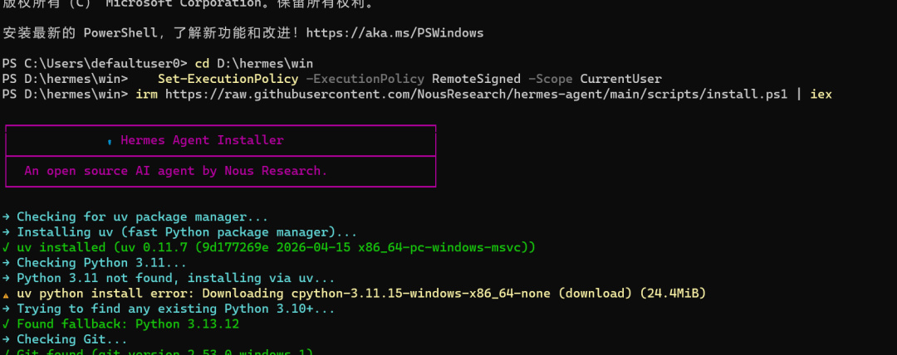

等待执行完成

### 步骤 3：配置模型（以 z.ai 为例）

安装完成后自动进入 hermes setup 向导：

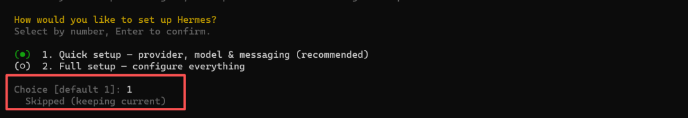

1. 输入1，回车。选择 Quick setup
2. 输入15，回车。选择了Z.AI

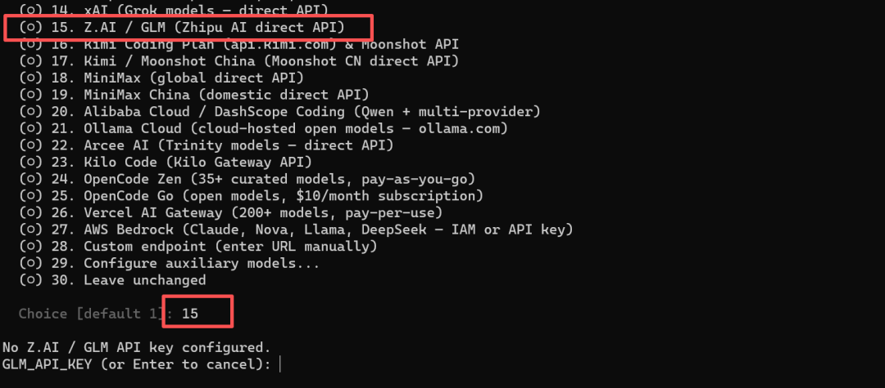

3. 粘贴 API Key

然后直接在下边，粘贴你的api key，直接回车即可。（粘贴是不会显示出来 你的key的，没有显示是正常的）

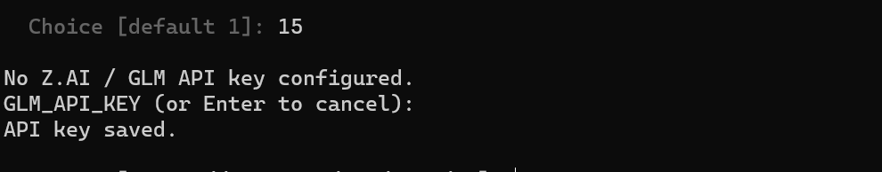

4. 下一步是配置base url，如果你买了coding plan，那么你就输入Coding Plan端点 ：https://open.bigmodel.cn/api/coding/paas/v4

 如果没有Coding Plan，那就是通用端点 ：

https://open.bigmodel.cn/api/paas/v4

5. 然后选择模型

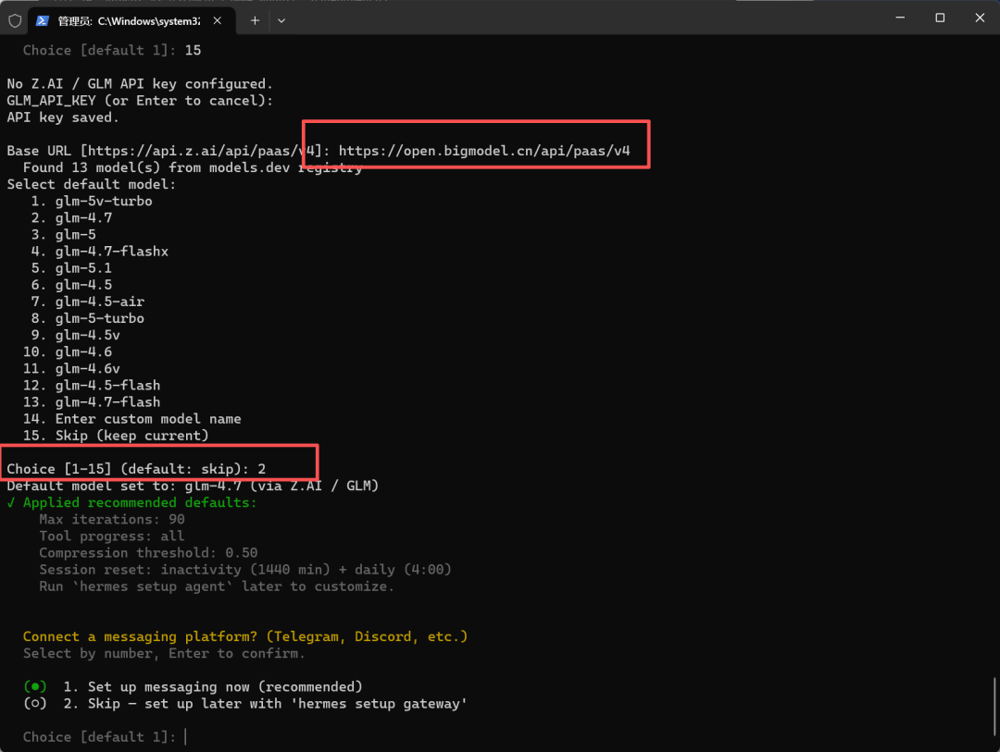

然后输入1，就是选择消息通道了。这里我们就先跳过了。

然后回引导是否开启，输入Y。

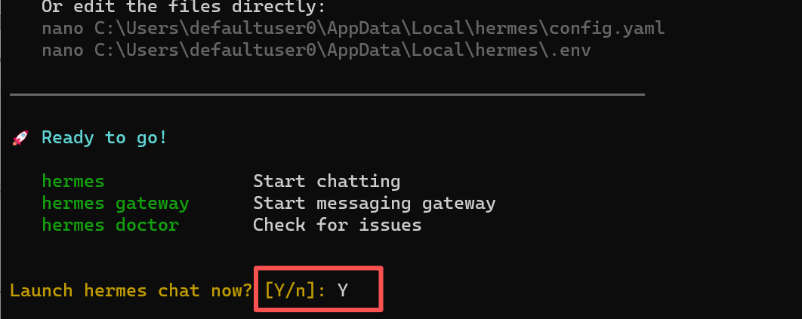

然后你就会看到启动成功的界面了：

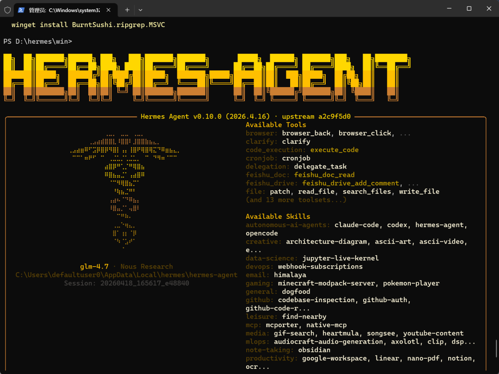

可以直接对话了：

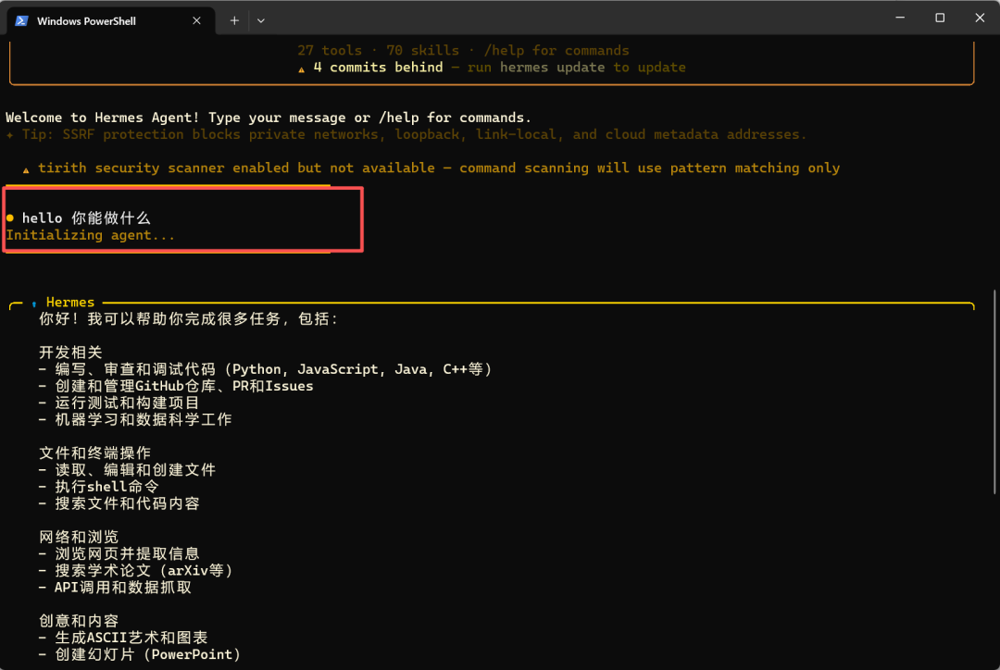

这里已经可以使用了，如果你想接入飞书等外部渠道，可以参考本文的 ：第二种方式的 3.2 设置消息平台。

# **第二种方式：WSL原生部署**

# **1、环境配置**

Hermes agent不支持windows原生配置，需要通过WSL2（windows linux子系统）安装运行

1. 按 Win + X → 选择 “终端(管理员)”。

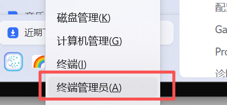

在终端中执行命令

```
wsl --install
```

执行后系统自动安装Ubuntu 22.04

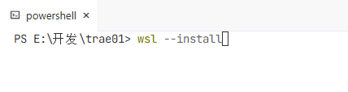

安装后重启电脑，输入wsl --version查看是否安装，输入wsl -l -v查看linux系统是否安装

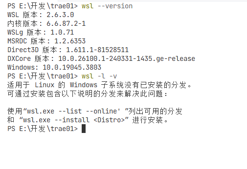

图中前者说明wsl系统已安装，后者说明Ubuntu系统安装失败

可以通过执行

```
wsl --list --online
```

查看可以安装的linux系统

然后执行

```
wsl --install Ubuntu-22.04
```

安装需要的系统

（如果网络连接不上，进入Ubuntu官网下载https://releases.ubuntu.com/jammy/， 找到wsl image，下载后直接双击安装即可）

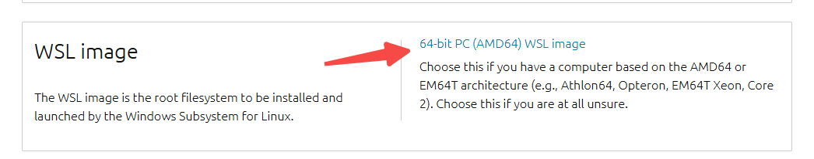

安装完成后根据提示输入账号和密码6666（密码自行设定）

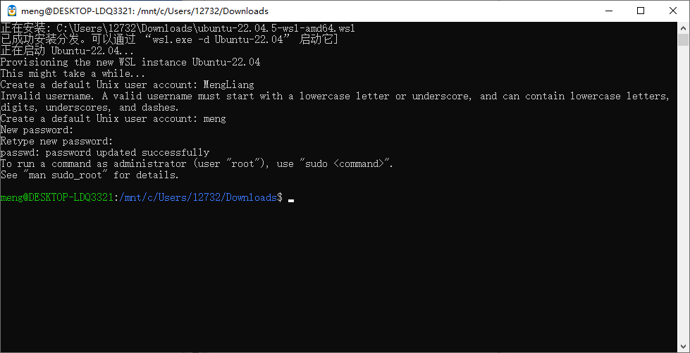

终端中再次输入wsl -l -v，出现如下提示说明系统安装完成

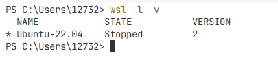

使用wsl命令进入Ubuntu系统，执行下列两行命令修改为清华镜像源，需要输入密码

```
sudo sed -i 's|http://.*archive.ubuntu.com|https://mirrors.tuna.tsinghua.edu.cn|g' /etc/apt/sources.list
```

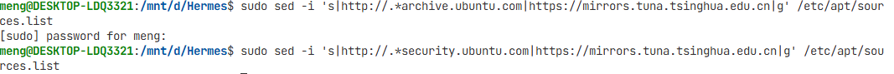

执行

```
sudo apt update && sudo apt install git -y
```

更新apt包并下载git（此处需要输入密码6666，先不使用代理）

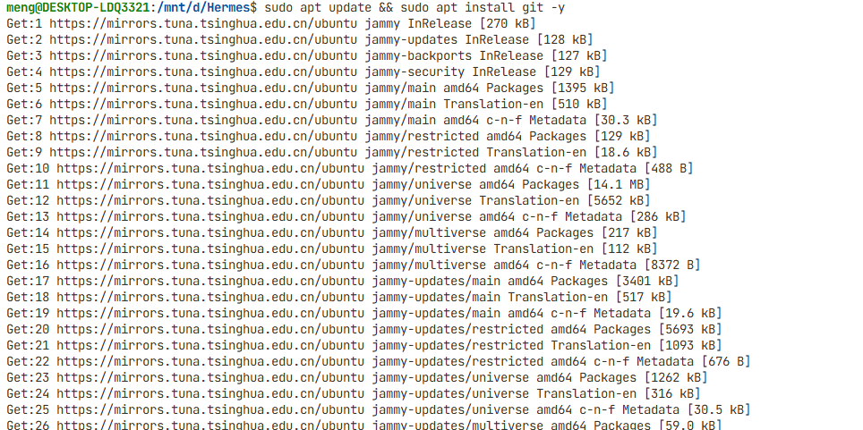

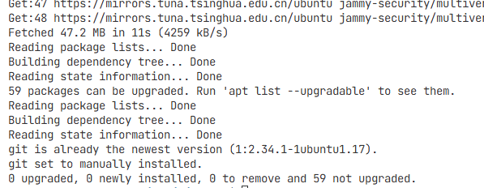

环境配置完成，开始配置Hermes agent

# **2、下载Hermes**

使用vpn+tun通道才能“较快”的安装，仅使用vpn或不使用vpn时，执行curl命令后很容易出现无任何反应的现象

如果对自身网络代理自信，可以直接执行

```
curl -fsSL https://raw.githubusercontent.com/NousResearch/hermes-agent/main/scripts/install.sh | bash
```

进行快速开始。如执行后卡死在某一步建议优先执行如下命令

## 1、使用国内镜像源克隆项目

输入

```
git --version
```

查看是否成功安装git，如果没有安装输入以下命令下载git

```
sudo apt install git -y
```

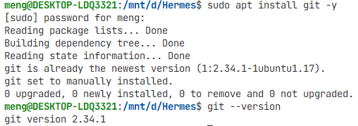

然后执行如下命令

```
git clone https://gitcode.com/GitHub_Trending/he/hermes-agent.git ~/.hermes/hermes-agent
```

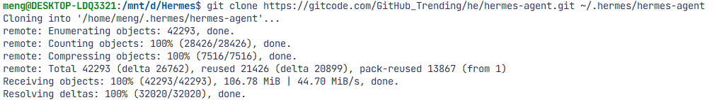

##

## 2、安装uv

### 2.1执行

```
sudo apt install python3-pip
```

### 安装pip

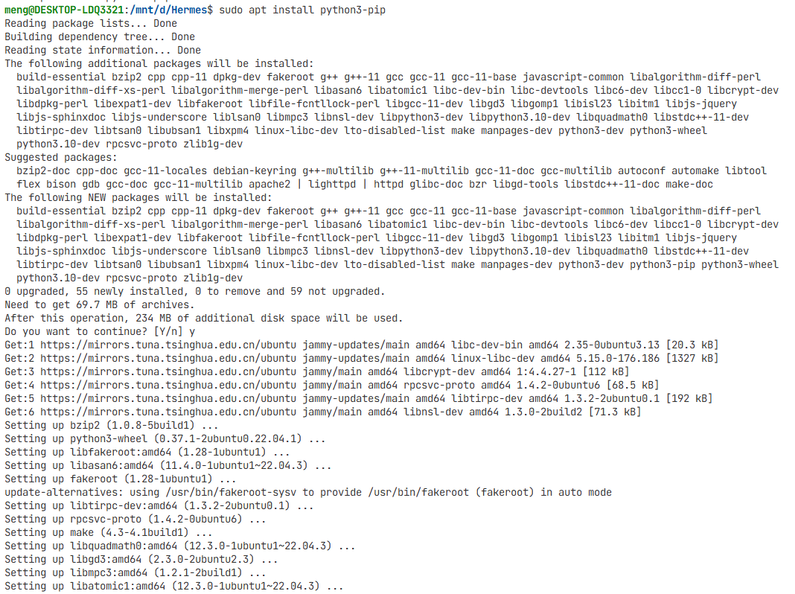

将pip的镜像源设为清华源

```
pip config set global.index-url https://mirrors.tuna.tsinghua.edu.cn/pypi/web/simple
```

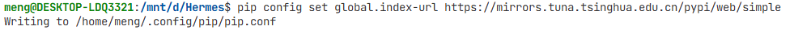

###

### 2.2使用pip安装uv

输入pip install uv 安装uv

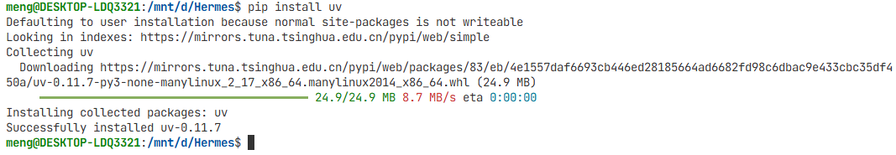

安装后重启wsl（按住ctrl+D退出wsl），然后输入uv查看是否安装，出现如图显示的画面说明安装成功

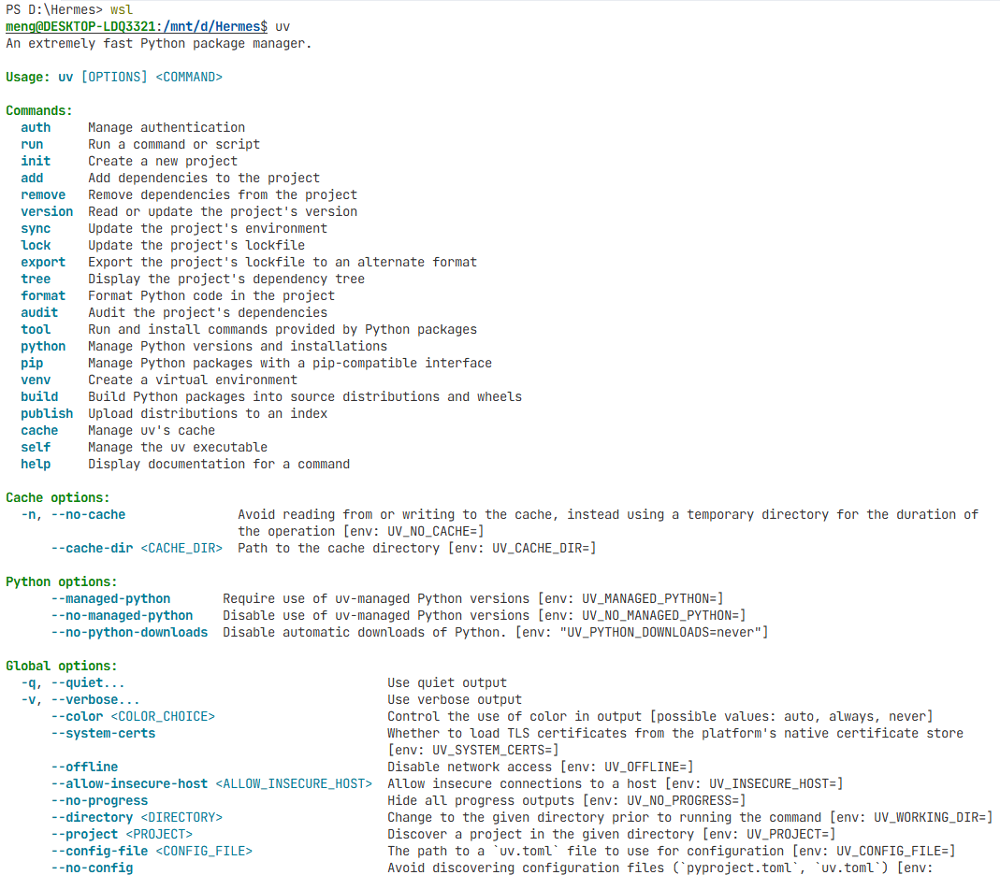

###

### 2.3、更改uv镜像源

```
export UV_INDEX_URL=https://pypi.tuna.tsinghua.edu.cn/simple/
```


##

## 3、安装新版NPM，设置镜像源

### 3.1、安装nvm，然后更新环境（需要代理）

```
curl -o- https://raw.githubusercontent.com/nvm-sh/nvm/v0.39.7/install.sh | bash
```

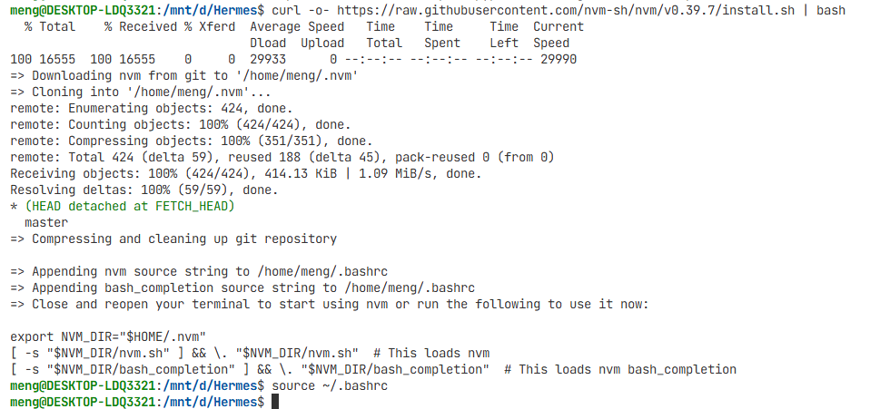

输入命令测试是否安装成功

```
nvm --version
```


### 3.2、安装nodejs和npm

```
nvm install 24
```

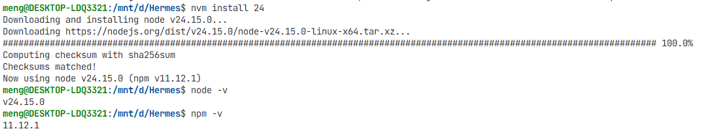

输入

```
npm config set registry https://registry.npmmirror.com/
```

切换到淘宝镜像

然后输入

```
npm config get registry
```

确认是否切换成功

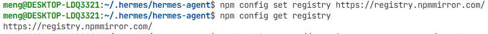

##

## 4、安装Chromium（需要代理）

输入npx playwright install chromium，箭头指的地方输入y

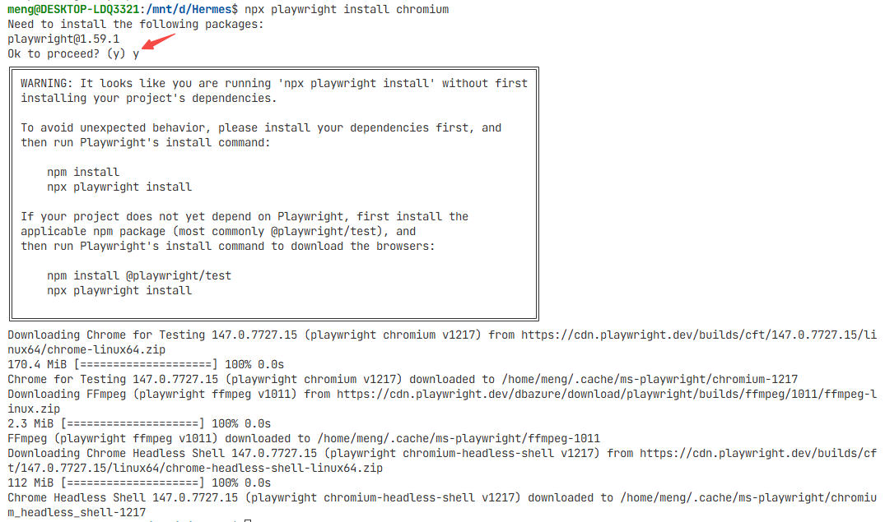

下载chromiun需要一定时间

## 5、安装hermes

全部完成后，执行

```
curl -fsSL https://raw.githubusercontent.com/NousResearch/hermes-agent/main/scripts/install.sh | bash
```

由于更换了清华源，使用代理执行安装时可能在开始与清华源的连接时较慢 ，在执行过程中可以随时使用ctrl+c退出然后切换代理再执行命令。

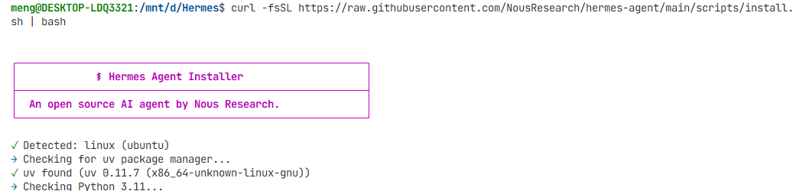

（出现上图标识表示安装开始）

安装过程中会提示输入[Y/n]，输入Y即可

有sudo需要输入密码的输入自己设置的ubuntu密码（6666）

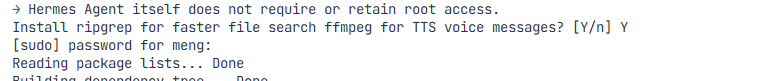

卡顿节点：

箭头所指的地方大概率会卡一段时间(下载速度慢），如果某一步卡了大概十分钟还没反应可以考虑网络工具过差下载过慢的原因

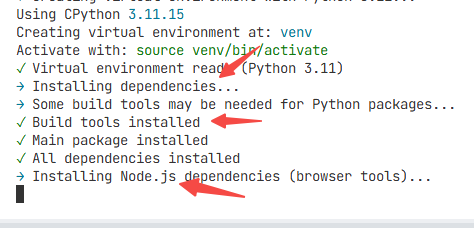

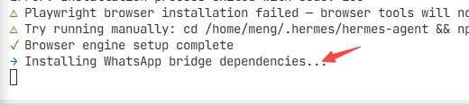

中途可能会因为网络问题导致加载缓慢

#

# 3、配置Hermes

下载完成后进入hermes基础配置

出现如下界面，使用方向键移动，enter/space确认，这次选择Quick setup

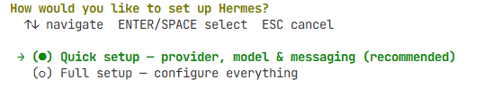

##

## 3.1设置模型

##

选择后进入下图所示界面，选择你使用的llm，如果是代理的大模型选择Custom endpoint(箭头所指选项），在第一个方法中是使用的智谱的模型进行的示例，这里我们用Custom endpoint（使用的是nvida提供的免费api）作为示例。

（也可以选中Cancel暂时不选择模型，之后可以通过hermes model再次进入该界面进行设置）

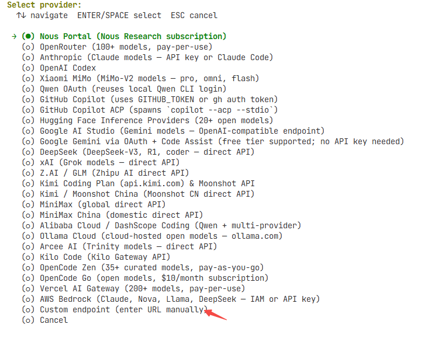

选择后需要输入代理商的API base URL与API key

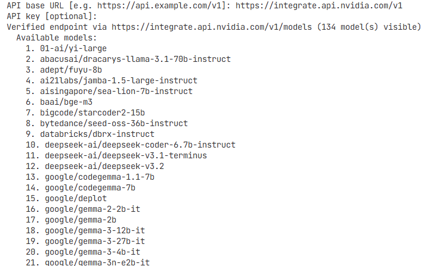

输入URL与API key后Hermes会给出提供的URL服务商中可能拥有的模型，选择自己使用的模型即可

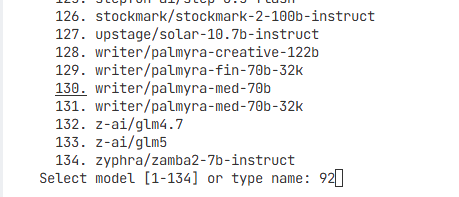

之后会出现上下文长度的设置，这里留空让hermes自动检测，直接enter


接着设置模型的名字，根据自己喜好设置


确认后完成模型设置

## 3.2设置消息平台

##

完成模型的设置后，hermes会询问是否连接消息平台

想做 聊天机器人 → 选第一个

只想 本地命令行用 AI，不想接平台 → 选第二个

这里选择第一个进行设置，以飞书为例进行设置，先使用空格键选中飞书，先按Enter确认，如果直接按Enter会退出设置。之后可以使用hermes setup gateway重新设置

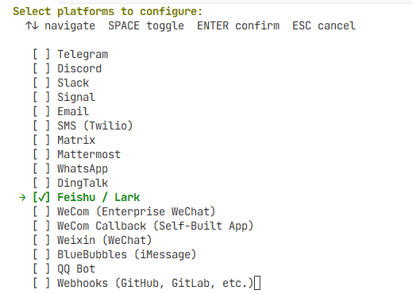

有两种连接方式，第一种是扫描二维码快速创建，第二种是输入已经在飞书平台上创建的应用ID和密码，这里选择第一种方式

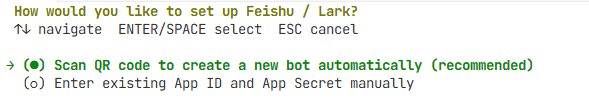

因为没有‘qrcode’工具，hermes给了一个飞书的链接，直接打开，创建飞书机器人

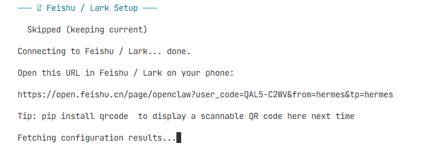

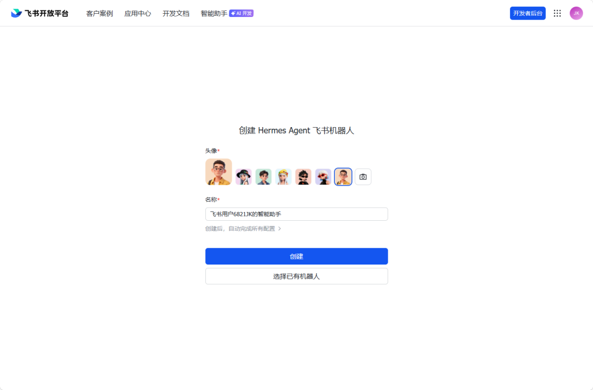

点击创建即可，然后点击打开机器人，会跳转到飞书的机器人聊天界面中

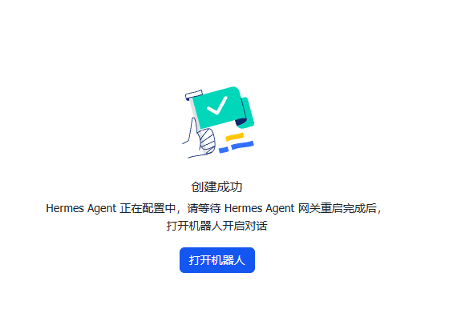

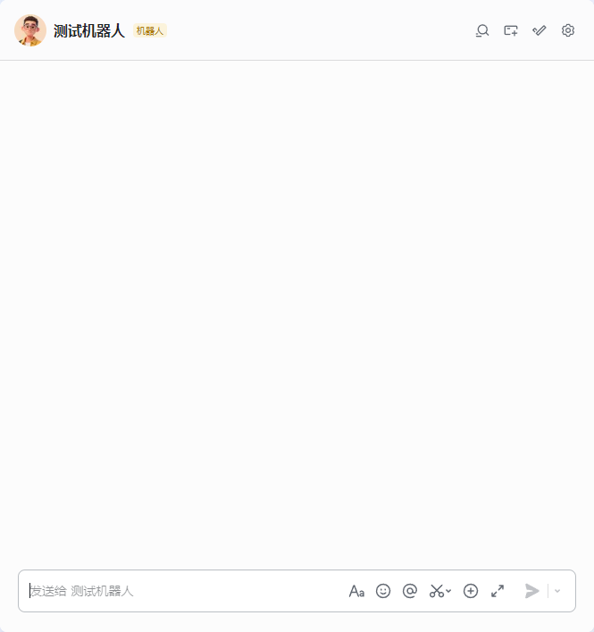

这里先返回到wsl中，继续其他设置。

首先需要设置的是消息回复权限验证 。

● 需要配对验证，向机器人发送消息后，机器人会返回一条配对码，管理员同意后才能进行聊天

● 允许所有人聊天

● 只允许指定用户ID聊天，即设置白名单

选择第一个选项

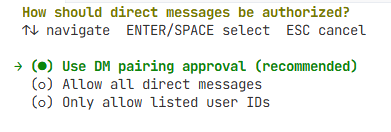

接着选择在群聊中的回复方式

● 被‘@’时回复

● 禁用群聊

选择第一个选项

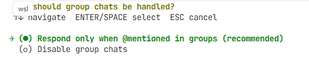

下一步是Home chat ID的设置，这个设置是用来设置机器人自动发通知、定时消息、报错提醒的目标，这里先空置，之后在需要机器人发送消息的用户账户上，向机器人发送/sethome即可自动设置。直接enter跳过

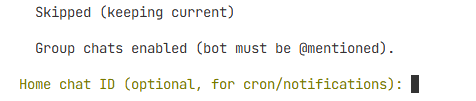

下一步设置是否把网关安装成系统服务（后台运行，开机自启）

输入Y确定

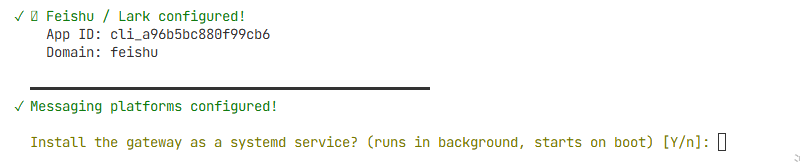

接着选择 网关在后台运行的方式

● 用户级服务（无需管理员权限；适合个人电脑 / 开发机）

● 系统级服务（开机自启；需要管理员密码）

● 暂时跳过服务安装，之后再手动设置

选择第一个

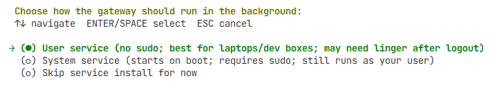

询问是否启动服务，输入Y

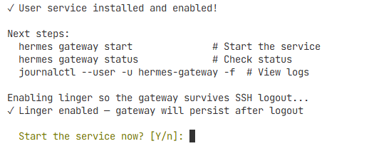

选择后设置完成退出，提示设置完成

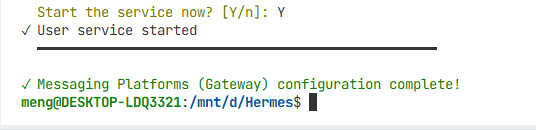

向机器人随意发送消息，会得到如下提示（如果没有回复尝试发送hermes pairing approve给机器人）

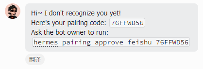

在终端中输入

```
hermes pairing approve feishu 76FFWD56
```

授权该用户权限

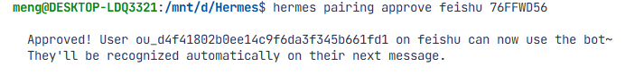

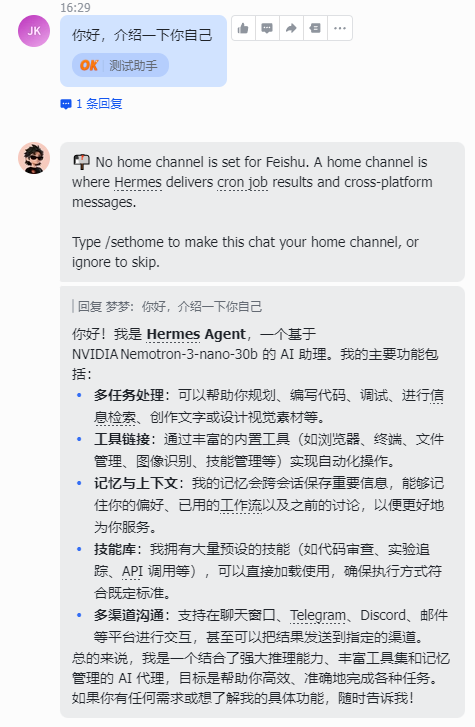

成功连接hermes agent与飞书平台。但是这里提示没有设置home channel，向它发送/sethome

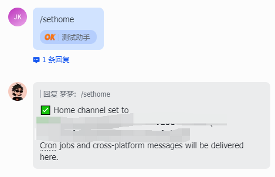

最下方有记录hermes当前使用的上下文长度

# Hermes命令参考：

此处引用：https://zhuanlan.zhihu.com/p/2025157177258583583

### 基础命令

|  |  |
| --- | --- |
| 命令 | 功能 |
| hermes | 启动交互式对话 |
| hermes chat | 启动对话 |
| hermes chat --continue | 恢复最近会话 |
| hermes chat -c "项目名" | 恢复指定会话 |
| hermes chat --model <模型> | 使用指定模型 |
| hermes model | 交互式切换模型 |

### 会话命令

|  |  |
| --- | --- |
| 命令 | 功能 |
| hermes sessions list | 列出会话列表 |
| hermes sessions export | 导出会话为JSON格式 |
| hermes sessions delete | 删除指定会话 |
| hermes sessions prune | 清理旧会话（90天） |
| hermes sessions stats | 查看会话存储统计信息 |
| hermes sessions rename | 修改绘画标题 |
| hermes session browse | 交互式浏览、搜索、恢复会话 |

### 配置命令

|  |  |
| --- | --- |
| 命令 | 功能 |
| hermes setup | 运行完整设置向导 |
| hermes config | 查看当前配置 |
| hermes config edit | 编辑配置文件 |
| hermes config set | 设置配置项 |
| hermes tools | 配置工具集 |

### Gateway 与消息平台

|  |  |
| --- | --- |
| 命令 | 功能 |
| hermes gateway setup | 配置消息平台网关 |
| hermes gateway start | 启动网关服务 |
| hermes gateway stop | 停止网关服务 |
| hermes gateway restart | 重启网关服务 |
| hermes channels test | 测试消息通道连接 |

### Profile 配置文件

|  |  |
| --- | --- |
| 命令 | 功能 |
| hermes profile list | 列出所有配置文件 |
| hermes profile create | 创建新配置文件 |
| hermes profile use | 切换配置文件 |
| hermes profile show | 显示当前配置文件 |
| hermes profile delete | 删除配置文件 |

### 诊断命令

|  |  |
| --- | --- |
| 命令 | 功能 |
| hermes doctor | 运行诊断检查 |
| hermes doctor --fix | 自动修复 |
| hermes --version | 查看版本 |
| hermes --help | 查看帮助 |

以上，我是梦飞，我们下次见~

|| 编写：李琛、张梦飞

往期推荐

[阿里“悟空”用起来太爽了，已经开始在钉钉里抢活干了](https://mp.weixin.qq.com/s?__biz=MzkyNjI3NjQ2MA==&mid=2247495143&idx=1&sn=2c33cd963c0a35f739ac9d32d1937f16&scene=21#wechat_redirect)

[继谷歌NotebookLM之后，AI知识库迎来了“中国版本答案”](https://mp.weixin.qq.com/s?__biz=MzkyNjI3NjQ2MA==&mid=2247495146&idx=1&sn=59bd92e21c8b15b99d6559f1dc10bc8e&scene=21#wechat_redirect)

[别再给 AI 打黑工了！从流水线普工变身短片大导演。](https://mp.weixin.qq.com/s?__biz=MzkyNjI3NjQ2MA==&mid=2247495037&idx=1&sn=fad22e7b3f5c3c0067588ee3daf16600&scene=21#wechat_redirect)

[实测DuMate：龙虾热度退潮，但大洗牌才刚刚开始](https://mp.weixin.qq.com/s?__biz=MzkyNjI3NjQ2MA==&mid=2247494918&idx=1&sn=35121c5d6bbe9784af58e1400c1d81c3&scene=21#wechat_redirect)

[终于测到一个不像玩具的AI Agent了](https://mp.weixin.qq.com/s?__biz=MzkyNjI3NjQ2MA==&mid=2247494747&idx=1&sn=ed37eae7c44cfce93edd8eebe0c97b87&scene=21#wechat_redirect)

[阿里终出手！实测JVS Claw：被全程可视化“龙虾”惊艳到了](https://mp.weixin.qq.com/s?__biz=MzkyNjI3NjQ2MA==&mid=2247494644&idx=1&sn=4385cac562eb4d3c8285936c8260161b&scene=21#wechat_redirect)
