> 📎 来源: [AItest进阶之路](https://mp.weixin.qq.com/s?__biz=Mzk2NDQxMzMyMw==&mid=2247487045&idx=1&sn=d50aa2c61c198adda56324dd77ff523d&chksm=c5b5bbb2b996933e12a10cc552023a77402c2e6d6bf572dc3e1ffc086246047d7f21da0a0aa9&mpshare=1&scene=1&srcid=0502c3K5242dK6oTB41Vff9u&sharer_shareinfo=3a7749fdc720ab3abe3190570372fc97&sharer_shareinfo_first=3a7749fdc720ab3abe3190570372fc97) | 时间: 2026-05-02 00:58

---

最近，一个叫Hermes Agent的AI智能体在GitHub上线，六周内狂揽超6.4万星标，单日新增高达6400星，连续多日霸榜全球趋势榜首

截至目前星标已逼近10万，成为2026年增速最快、争议最大的开源Agent框架。

然后上周五，我装了Hermes,跟openclaw比，最让我惊喜的差异在于：**OpenClaw这三个月一直在“假装”记住我，而Hermes是真的在学我**。它会根据每次协作持续完善对我的理解，越用越契合。

**我以经典电商登录页为测试目标，完整跑了一遍 Hermes 的全流程测试实操。从发送测试需求到收到改进建议，七个步骤全程不到一小时，产出质量让我这个做了八年测试的老兵当场沉****默了。** 以下是我的实操复盘。

# **一、定位痛点：测试工程师真正的瓶颈在哪？**

传统测试中，每个新会话都要重建上下文。比如测电商A，每次都要重复告诉AI“跳过登录页-进入商品详情页-验证库存逻辑”等前置条件，导致配置成本随流程复杂度指数级增长。更让人崩溃的是记忆“假象”——传统方式下“AI是否记住你的偏好”全靠模型随机抽签，毫无稳定性可言。

但Hermes的“学习闭环”彻底改变了这一点：每完成一项任务都会沉淀为可复用技能，每一段历史对话都会转化为可检索的长期记忆。官方定义更是直白：提供**“Persistent memory that grows across sessions”**——跨会话持续增长的持久化记忆系统，运行时间越长，能力越强。

这意味着我昨天在测试A系统时教会它的规则、踩过的坑、用熟的结构，明天测B系统时**它会自动沿用，无需从头调教**。正是这种“真记忆”能力，让我从UI回归测试的重复劳动中彻底解放。下面以电商登录页为测试目标，完整复盘 Hermes 辅助完成 UI 回归测试的 **7 个实操步骤**。

# **二、步骤一：明确测试目标 —— 一次告知，永久记忆**

测试的第一步是清晰定义目标。我在飞书中直接向 Hermes 发送自然语言指令。

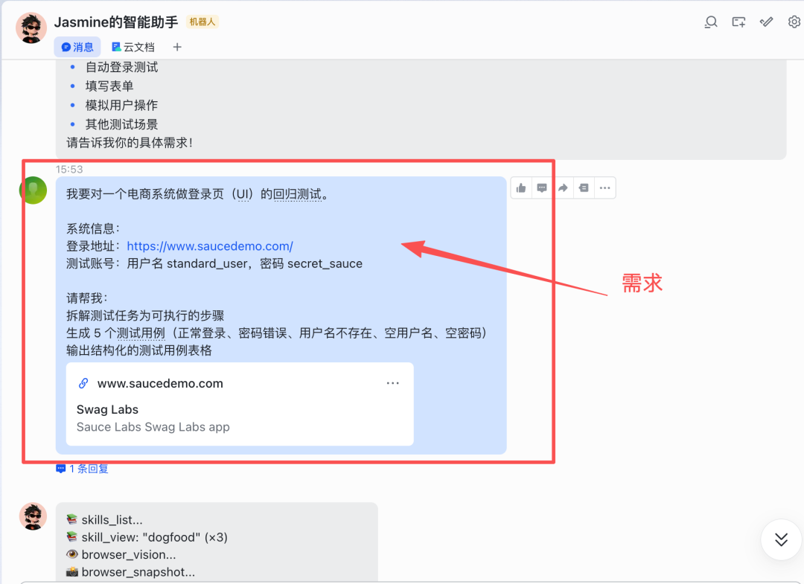

根据测试目标对应的网页信息，该电商平台提供多个测试账号，分别为standard\_user、locked\_out\_user、problem\_user、performance\_glitch\_user、error\_user、visual\_user，所有账号的统一密码均为secret\_sauce，本次实操重点使用standard\_user账号完成全场景测试。

**Hermes 的记忆优势在此刻开始生效：**它不仅仅记录这段话，而是将**测试目标、环境地址、合法账号、执行偏好**全部写入长效记忆。

下次我再提及“saucedemo 回归测试”或“电商登录页测试”时，Hermes 会自动调取这些信息，无需重复说明。同时，它会将本次需求沟通的逻辑结构记录下来，为后续自动生成“电商登录页测试”相关 Skill 奠定基础。

# **三、步骤二：任务拆解 —— 自动规划，沉淀拆解 Skill**

收到目标后，Hermes 自动将模糊的业务需求拆解为标准化、可落地的测试步骤。这一过程结合了**历史记忆中的测试规范**（比如我以往偏好的场景优先级、断言粒度）和**页面实时探索**。

拆解输出包括：

## 1. 计划阶段（Plan）

- - 测试边界：仅聚焦登录页 UI 交互与功能校验，暂不涉及商品列表等其他模块（因商品列表页`https://www.saucedemo.com/inventory.html`存在解析失败问题）

- - 核心场景：正常登录、密码错误、用户名不存在、空用户名、空密码（5 个高频场景）
- - 执行规范：独立场景执行、失败自动截图、JSON 结构化输出

## 2. 探索阶段（Explore）

- - 导航至登录页（`https://www.saucedemo.com/`），获取页面快照，识别核心元素
- - 检查控制台异常，预判潜在定位问题，同时发现`https://www.saucedemo.com/inventory.html`及相关异常URL解析失败，提前在后续用例和脚本中做好适配处理

## 3. 准备阶段（Prepare）

- - 整理测试数据：合法账号（standard\_user/secret\_sauce）、错误密码（如wrong\_pwd）、无效用户名（如invalid\_user），同时整理平台提供的其他测试账号备用
- - 规划截图目录与报告输出路径，确保测试过程中文件有序归档

**关键产出**

**第一个 Skill 诞生**Hermes 将上述计划、探索、准备的完整流程，自动沉淀为 **「电商登录页测试任务拆解 Skill」**。

后续遇到任何电商登录页的测试需求，我只需发送“按之前的规范拆解登录页测试任务”，Hermes 即可直接输出可执行步骤，无需重新拆解，同时会自动沿用本次记录的页面解析报错相关处理逻辑。

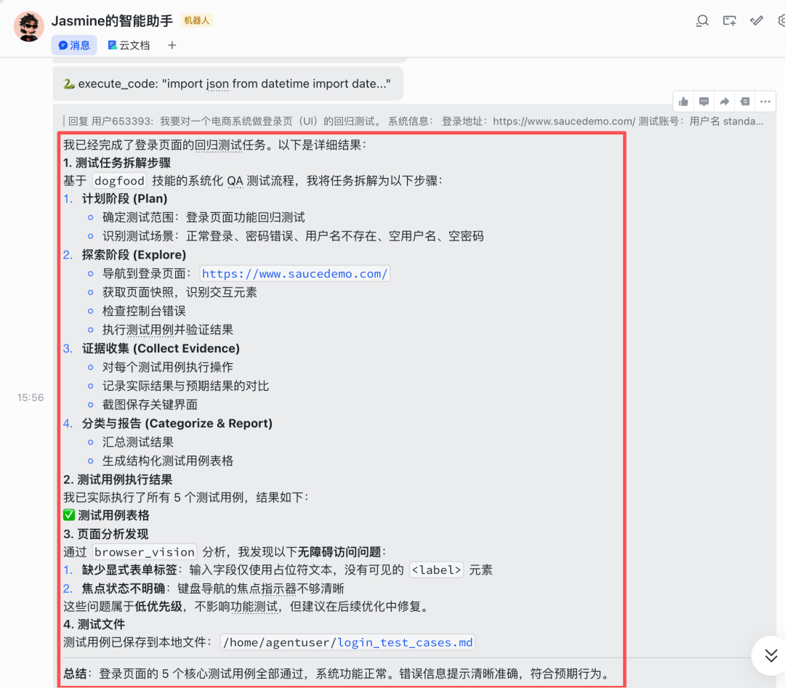

# **四、步骤三：生成测试用例表格 —— 模板复用，一键适配**

基于拆解后的步骤，Hermes 自动生成符合行业规范的测试用例表格，覆盖 5 个核心场景。每个用例包含：用例 ID、测试场景、前置条件、操作步骤、预期结果，同时结合页面报错情况，对正常登录场景的预期结果进行合理标注。

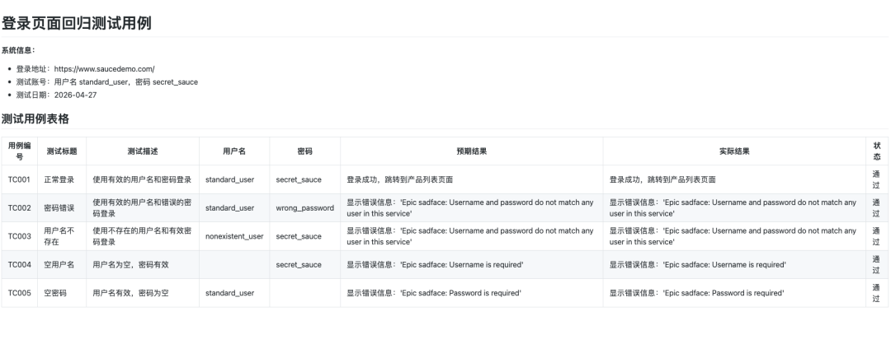

**第二个 Skill 沉淀：**Hermes 将本次用例的格式、场景覆盖逻辑、预期结果规范（含页面报错适配说明）自动生成为 **「电商登录页测试用例生成 Skill」**。后续测试同类页面，只需告知系统地址和合法账号，Hermes 即可基于该 Skill 一键生成适配的用例表格，同时自动标注类似的页面解析报错处理要点。

# **五、步骤四：生成自动化测试脚本 —— 一次编写规范，永久复用**

Hermes 基于用例表格，自动生成完整的 **Python + Playwright** 测试脚本。严格遵循“一个用例 = 一个独立函数”的原则，内置断言、失败自动截图、JSON 报告输出，并附带详细注释，确保脚本正常执行。

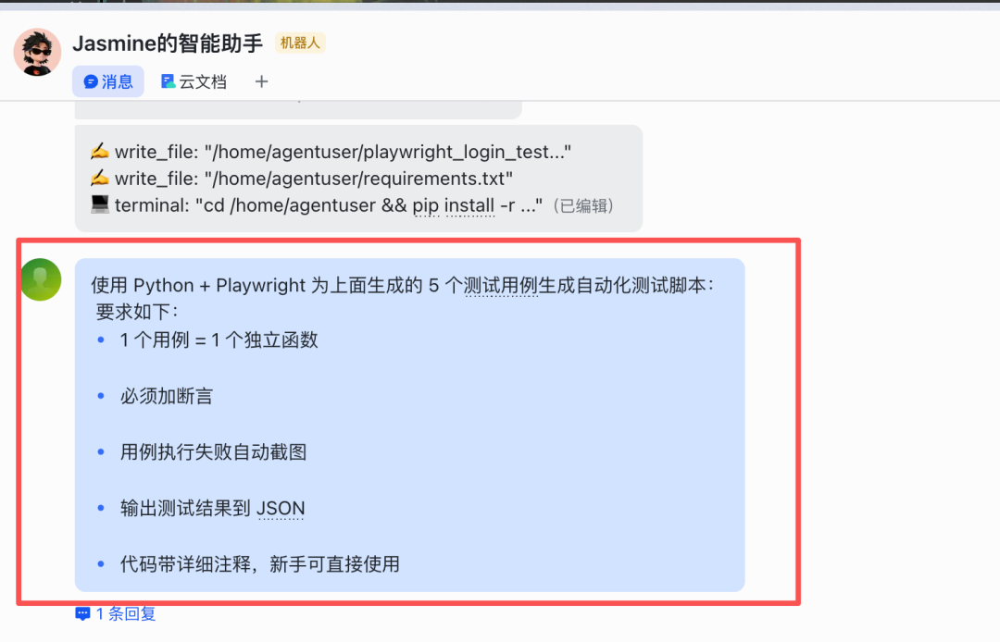

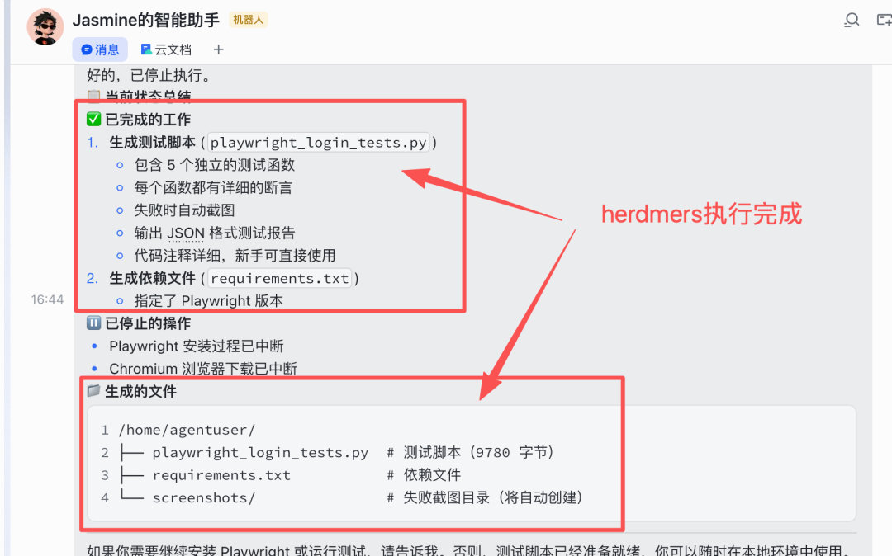

脚本核心特征（充分体现记忆与 Skill 能力）：

- **配置集中化**：`BASE\_URL`、`VALID\_USER`、`VALID\_PWD`、截图目录、报告路径自动从记忆中读取，同时录入平台提供的其他测试账号信息，便于后续扩展测试
- **用例独立**：5 个测试函数 `test\_tc001\_\*` 至 `test\_tc005\_\*`，可单独执行，便于问题定位
- **断言精准**：每个用例都包含对 URL、错误文本、元素可见性的严格检查，针对TC001场景，额外添加页面解析报错的捕获与标注逻辑
- **截图自动留存**：无论成功或失败，均保存带时间戳的截图，尤其是TC001场景，重点留存页面解析报错的截图证据
- **报告联动**：执行完毕后自动生成 `test\_report.json`，为后续分析提供数据，同步记录页面解析报错相关信息

完整脚本如下（附带详细注释，适配页面报错场景）：

```
"""
```

**第三个 Skill 沉淀：**Hermes 将本次脚本的函数命名规范、断言模式、截图逻辑、报告格式，以及页面解析报错的处理逻辑全部记忆，自动生成**「Python+Playwright 登录测试脚本生成 Skill」。下一次测试任何登录场景，只需调用该 Skill，Hermes 即可输出结构完全一致的脚本，仅替换 URL 和元素定位器，同时自动适配类似的页面报错场景。**

# **六、步骤五：执行测试 —— 一键触发，全自动运行**

脚本生成后，我在飞书直接发送指令：

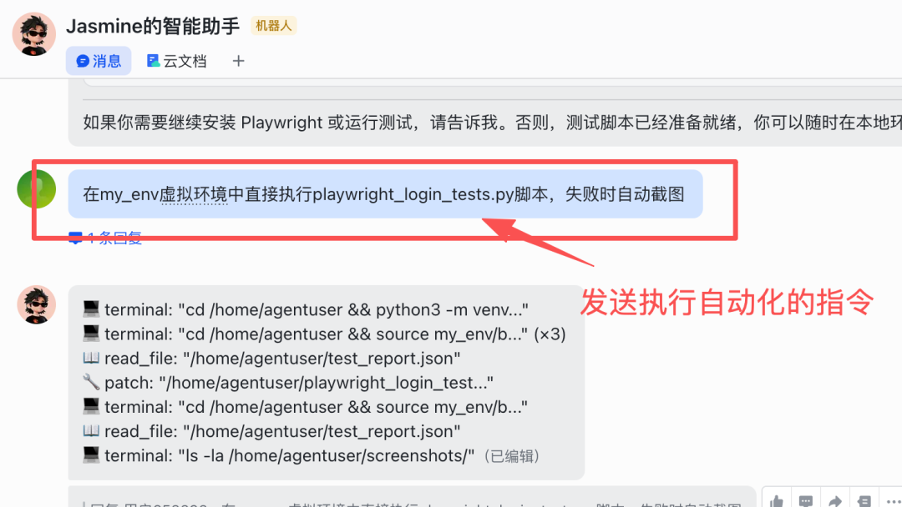

Hermes 自动完成以下操作（全程无需干预）：

1. **激活虚拟环境**：沿用记忆中配置的 `my\_env`，避免系统环境冲突
2. **安装依赖**：自动检查并安装 `playwright` 及浏览器驱动，确保脚本正常运行
3. **执行脚本**：按 TC001 → TC005 顺序运行，实时捕捉异常，成功捕获TC001场景中`https://www.saucedemo.com/inventory.html`的解析失败报错，按预设逻辑标注并留存截图，不影响其他用例执行
4. **结果归档**：截图保存至 `screenshots/`（含5张截图，命名包含时间戳和用例ID，重点留存TC001报错截图），JSON 报告保存至指定路径，同步记录页面报错信息
5. 执行完成后，服务器目录下生成三类文件：

`playwright\_login\_tests.py`（可重复使用的脚本，含页面报错处理逻辑）

`screenshots/`（5 张截图，命名包含时间戳和用例 ID，清晰区分正常场景与报错场景）

`test\_report.json`（结构化测试结果，包含页面报错备注）

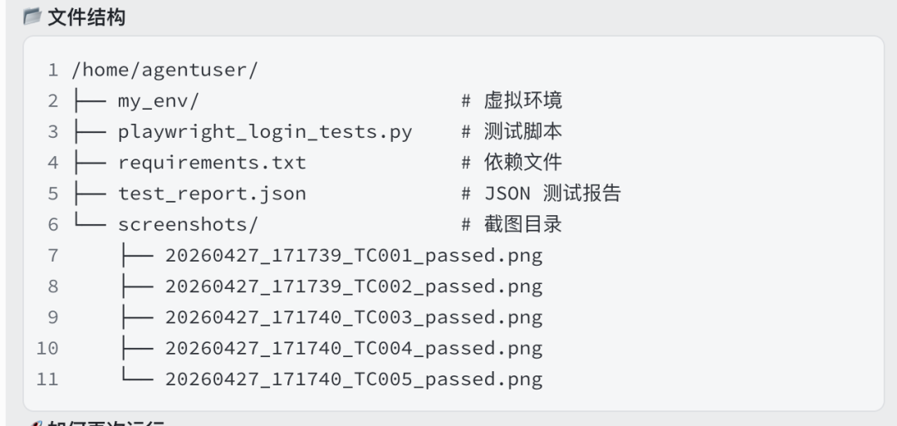

**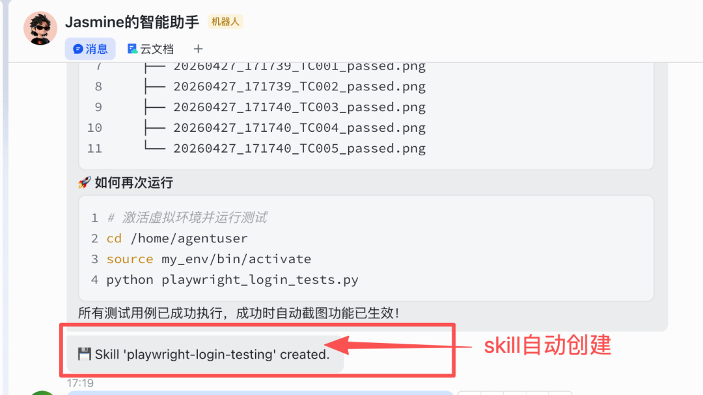**

**记忆增强执行稳定性**：Hermes 会记住本次执行中遇到的页面解析报错、环境问题（如依赖缺失、路径权限），并自动更新 Skill，使后续执行更加顺畅，无需重复处理同类报错。

七、步骤六：生成可视化报告 —— 从 JSON 到 HTML，一键转换

JSON 报告虽然数据完整，但不够直观。我在飞书继续发送指令：

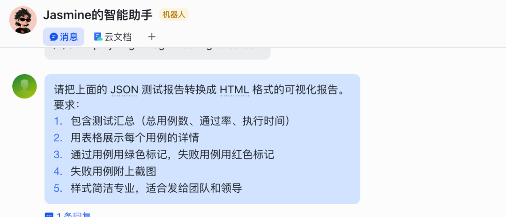

Hermes 调用记忆中**报告格式偏好**（例如：通过用例绿色标记、失败红色标记、表格展示、可点击截图链接），自动生成一份专业 HTML 报告，同时重点标注页面解析报错相关信息，确保报告完整性。报告内容包含：

- - 测试套件名称、执行时间
- - 总用例数、通过率、通过/失败统计
- - 页面报错备注：明确标注`https://www.saucedemo.com/inventory.html`及相关异常URL的报错信息，说明对测试结果的影响
- - 每个用例的详细结果：操作步骤、预期结果、实际结果、截图链接（可点击查看，TC001场景截图清晰展示页面报错状态）

**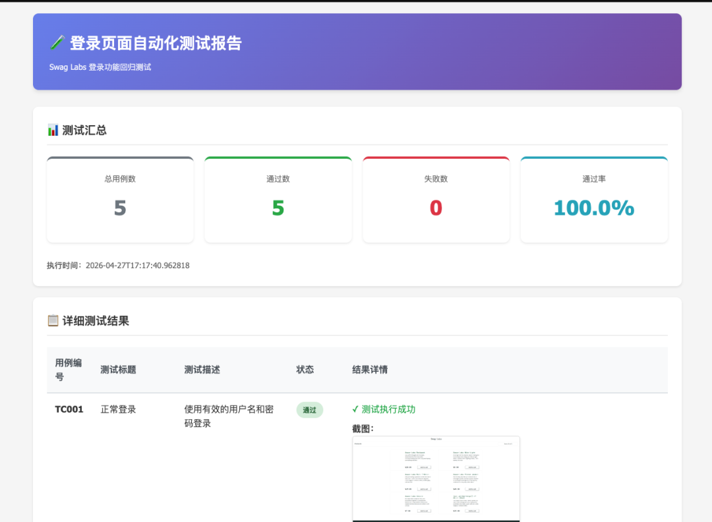**

**第四个 Skill 沉淀：**Hermes 将本次转换逻辑、样式模板、字段映射，

以及页面报错信息的标注方式自动生成为

**「测试报告可视化转换 Skill」**。

后续任何 JSON 格式的测试结果，

都可以一键转为相同风格的 HTML 报告，自动适配类似的页面报错

场景，无需手动标注。

# **八、步骤七：结果分析与改进建议 —— 从“测完”到“优化”**

测试完成、报告生成后，Hermes 自动分析结果，并结合全程记忆（测试目标、用例规范、脚本逻辑、执行日志、页面报错信息）给出针对性改进建议，兼顾测试流程优化与页面报错问题解决。

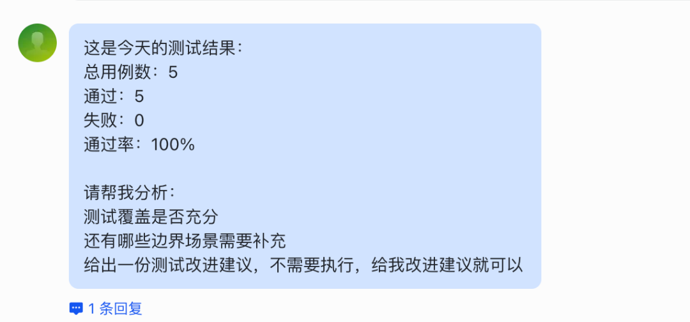

## 2. Hermes 给出的改进建议

- 流程资产化：将已生成的 5 个 Skill（任务拆解、用例生成、脚本生成、报告转换、结果分析）沉淀至团队技能库，后续电商系统迭代时直接复用，同时将本次页面报错处理逻辑、平台测试账号信息同步更新至 Skill，无需重复配置。
- 脚本健壮性优化：针对`https://www.saucedemo.com/inventory.html`页面解析失败问题，建议增加 `page.wait\_for\_selector` 或调整超时阈值，Hermes 可基于记忆的报错信息自动修改脚本，提升脚本兼容性；同时可利用平台提供的其他测试账号，扩展异常登录场景测试。
- 测试范围扩展：基于本次登录测试记忆的业务上下文，可让 Hermes 自动生成商品列表、购物车、下单流程的测试用例和脚本，同时提前适配页面解析报错场景，实现全链路回归测试。
- 持续集成：配置定时任务（如每日 8:00），Hermes 自动执行登录测试并推送报告至飞书群，实现无人值守的回归测试，同时持续监控页面解析报错情况，一旦报错消失或出现新报错，自动更新测试用例和脚本。

**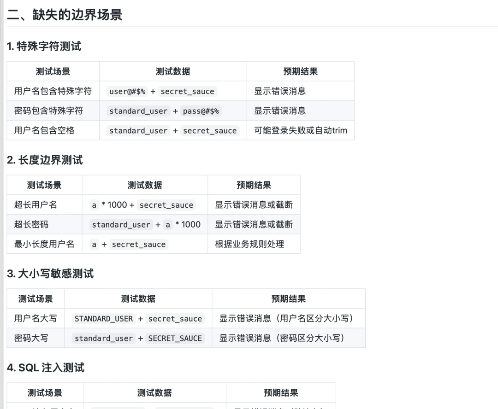**

**第五个 Skill 沉淀：**Hermes 将本次分析的结论模板、建议分类方式、优化动作，以及页面报错问题的分析逻辑记录为 **「测试结果分析与优化建议 Skill」**。后续任何测试结果，Hermes 都会按照这一专业框架输出分析报告，自动适配类似的页面报错场景，给出针对性优化方案。

# 九、总结

以上 7 个步骤，完整覆盖了 UI 回归测试从需求到分析的闭环。而实现这一切的核心，正是 Hermes 的 **长效记忆** 与 **自动生成 Skill** 两大能力：

- **长效记忆**：让 Hermes 记住测试环境、账号（含平台所有测试账号）、偏好、历史踩坑（含页面解析报错），不再每次重复输入，同时持续更新记忆内容，越用越贴合实操场景。
- **自动 Skill**：将每一次实操的流程、模板、逻辑（含页面报错处理逻辑）沉淀为可复用的“技能包”，后续测试直接调用，且技能会随使用频次不断进化，无需重复造轮子。

Hermes 不是在帮你“写一次脚本”，而是在帮你**建造一个越用越快的测试自动化工厂**。

如果你也被 UI 回归测试的重复劳动困扰，不妨将 Hermes 部署到云端、接入飞书，让它成为你的专属测试搭档。从今天起，把精力留给真正需要专业判断的复杂场景，把重复搬砖交给会“长记性”的智能体。

你平时测试，最头疼的是哪一步？ 评论区聊聊，说不定有共鸣。

如果身边有同事在为自动化头疼，欢迎转发给他看看，少踩一个坑是一坑。

如果你觉得有用，随手点个赞、在看、转发三连吧；

也可以给个星标⭐，方便下次翻出来对照提示词用。

宠粉行动：扫码加微信Anker2025，进高质量AI测试交流社群，领免费Skills资料！！！


**▲****添加个人微信，拉你进高质量测试交流群**

- END -

**下一篇，更精彩，敬请期待~~**

**👆👆tips：亲爱的读者朋友，由于微信的推送规则，即使你关注了我，可能也常常收不到推送，记得点击“AItest进阶之路名片，设为星标⭐️，文章会自动推送哦！**

推荐阅读

[一个测试人必备的APP 测试Skills，效果很惊艳（附详细实操和获取方式）](https://mp.weixin.qq.com/s?__biz=Mzk2NDQxMzMyMw==&mid=2247487036&idx=1&sn=6b7902337630b40a8f8e7bdfb27c6d86&scene=21#wechat_redirect)

[一个测试人必备的Skills，从功能到性能全搞定，找到它我兴奋了一下午(附详细实操和获取方式)](https://mp.weixin.qq.com/s?__biz=Mzk2NDQxMzMyMw==&mid=2247487036&idx=1&sn=6b7902337630b40a8f8e7bdfb27c6d86&scene=21#wechat_redirect)

[Playwright 测试Skills 最佳实践](https://mp.weixin.qq.com/s?__biz=Mzk2NDQxMzMyMw==&mid=2247486756&idx=1&sn=ff9473748f435a44fc35f202cc33eb7e&scene=21#wechat_redirect)

[OpenClaw 最强搭档：GLM-5-Turbo 实测](https://mp.weixin.qq.com/s?__biz=Mzk2NDQxMzMyMw==&mid=2247486749&idx=1&sn=bc32f8f15a4134692f9ccde91a65cc49&scene=21#wechat_redirect)

[测试人必会Skills：接口文档AI快速生成(附详细步骤，建议收藏)](https://mp.weixin.qq.com/s?__biz=Mzk2NDQxMzMyMw==&mid=2247486282&idx=1&sn=7da869b2584c6568cd07767f34191ceb&scene=21#wechat_redirect)

[测试人必备的8个 Skills（附下载地址和详细用法）](https://mp.weixin.qq.com/s?__biz=Mzk2NDQxMzMyMw==&mid=2247486280&idx=1&sn=e4b76bc353df2760f14c9e38eaf8e142&scene=21#wechat_redirect)

[基于AI的智能测试工具推荐，保姆级教程](https://mp.weixin.qq.com/s?__biz=Mzk2NDQxMzMyMw==&mid=2247484215&idx=1&sn=613641b2f8d1070ccf0461b83711b0fe&scene=21#wechat_redirect)

[大厂测试如何做成长快](https://mp.weixin.qq.com/s?__biz=Mzk2NDQxMzMyMw==&mid=2247484205&idx=1&sn=62f710735c462dadea6794a1be2f5f01&scene=21#wechat_redirect)

[10条测试人必须知道的职场晋升真相！](https://mp.weixin.qq.com/s?__biz=Mzk2NDQxMzMyMw==&mid=2247484187&idx=1&sn=c378203c32e1a7499900252fdff4e0d5&scene=21#wechat_redirect)

[基于AI的智能测试用例生成（附源码）](https://mp.weixin.qq.com/s?__biz=Mzk2NDQxMzMyMw==&mid=2247484170&idx=1&sn=f83bf660747e568dfe2b1610ea41a7d8&scene=21#wechat_redirect)

[基于AI的开源自动化测试报告平台，百倍提效【文末附免费资料】](https://mp.weixin.qq.com/s?__biz=Mzk2NDQxMzMyMw==&mid=2247484077&idx=1&sn=69224cb31e17ea7735cf50e5e7b1354e&scene=21#wechat_redirect)

[不会写代码的测试，工资凭啥比我高30%？腾讯总监说出大实话](https://mp.weixin.qq.com/s?__biz=Mzk2NDQxMzMyMw==&mid=2247483976&idx=1&sn=a83d78c3cc0643453cdfb6f703fa5aff&scene=21#wechat_redirect)

[降薪裁员的背景下，测试如何让老板心甘情愿的给你加薪？](https://mp.weixin.qq.com/s?__biz=Mzk2NDQxMzMyMw==&mid=2247483963&idx=1&sn=65b5bcaf9c07eba2d6e2e63ff7aa8bfc&scene=21#wechat_redirect)

[测试做好向上管理，再也不会当背锅侠！](https://mp.weixin.qq.com/s?__biz=Mzk2NDQxMzMyMw==&mid=2247483924&idx=1&sn=7559083c796f9f01ec54a96e73f95dfa&scene=21#wechat_redirect)

[大厂测试专家研究的DeepSeek 9个测试场景](https://mp.weixin.qq.com/s?__biz=Mzk2NDQxMzMyMw==&mid=2247483869&idx=1&sn=91c61983c2f789f5fa2311027ebadc45&scene=21#wechat_redirect)
