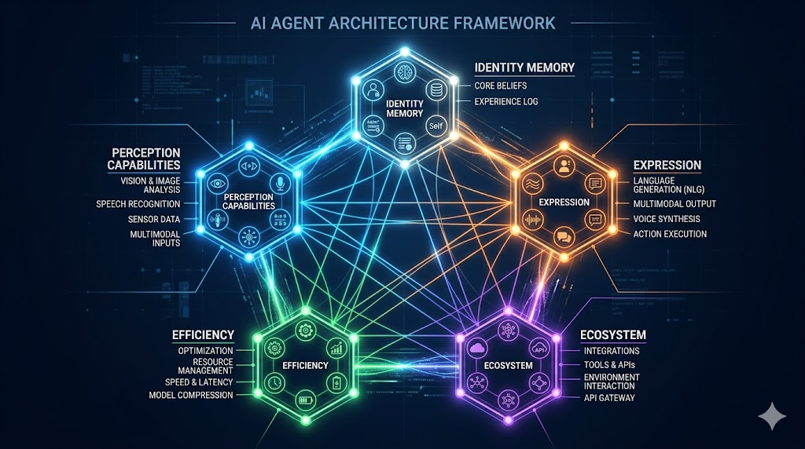
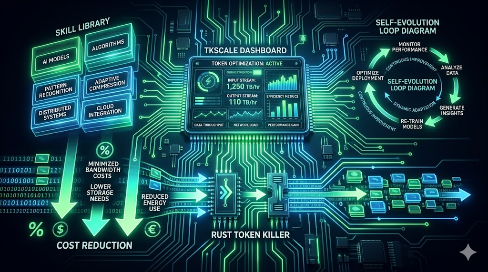

> 📎 来源: [编译硅基](https://mp.weixin.qq.com/s?__biz=MzUzMzM5MjkyOA==&mid=2247484310&idx=1&sn=8bf2ea072175b249c083a4c408e1dd28&chksm=fb351995cfda2beb393217b3ce74b77257f161e734d077947d347269ae3013e72634ad55aa01&mpshare=1&scene=1&srcid=0421cABVytzEyx2fm1gz2fWO&sharer_shareinfo=71998a58ecc4f2065de0d4c32bfefa53&sharer_shareinfo_first=71998a58ecc4f2065de0d4c32bfefa53) | 时间: 2026-04-21 09:19

---

[Hermes Agent v0.10有点不一样，汉化版WebUI更新墙裂推荐](https://mp.weixin.qq.com/s?__biz=MzUzMzM5MjkyOA==&mid=2247484228&idx=1&sn=1dff5ef03dc40ea89c2b32f5956c765b&scene=21#wechat_redirect)

[Hermes Desktop — 原生 macOS 上的 Hermes Agent 桌面伴侣](https://mp.weixin.qq.com/s?__biz=MzUzMzM5MjkyOA==&mid=2247484308&idx=1&sn=fb37f428f2af0c9e2d8ee4c221846299&scene=21#wechat_redirect)

[汉化Hermes Web UI：一个界面，管住所有AI聊天](https://mp.weixin.qq.com/s?__biz=MzUzMzM5MjkyOA==&mid=2247484164&idx=1&sn=0bdbbc33b25a8d00b0853a96ddfd3406&scene=21#wechat_redirect)

## 📖 精华

### 开篇

Hermes 发布后，迁移过来的人比我预期的少很多，这次不像之前 OpenClaw 小龙虾发布时那样——大家都在等，等更好的 Agent，等更好的模型。实际上操作起来你会发现，后面即使出现更好的 Agent，也是一通百通的。

为了治好大家的拖延症，我把这套实测的 Hermes 配置清单整理出来了。这套配置横跨多个领域，从底层逻辑到实战部署，告诉你每一个组件到底能帮你干什么。



### 目录总览

- 身份与记忆 — SOUL.md / 角色库 / 记忆后端
- 感知能力 — 内容抓取 / 网页搜索 / 浏览器自动化 / 文档处理
- 表达能力 — 语音 / 图片生成
- 效率与成本 — Token 监控 / 自我进化 / Skill 库
- 生态导航 — Hermes 资源入口

---

## 🔧 配置方案

### 一、身份与记忆

**1. 告诉它"你是谁"**

SOUL.md 是 Hermes 的人格文件，系统提示的第一个位置。但大多数人不知道怎么写？

我的做法：先从网上摘一个模板，再慢慢和 Hermes 对话，每次对话完都提醒 Hermes 对 SOUL.md 进行修改、迭代。

我用 **agency-agents-zh**，里面有 211 个中文角色模板，覆盖小红书运营、技术写作，研究助手等场景。

```
# 安装https://github.com/jnMetaCode/agency-agents-zh 安装这个存储库# 激活模式（以小红书写作模式为例子）激活小红书内容写作模式
```

**2. 记忆系统**

Hermes 内置的 MEMORY.md 只记"模型主动写下来的东西"。换成 **Hindsight** 之后，它会自动从每次对话中提取实体和关系。你周一提了一个项目截止日期，周五新会话里它自动记得，不需要重复。

```
# 安装https://github.com/vectorize-io/hindsight 帮我再服务器上部署 hindsight
```

**记忆层小结：SOUL.md 用 agency-agents-zh，记忆用 Hindsight 自建。**

### 二、感知能力

**内容抓取：双工具组合**

> Jina Reader：抓单页 —— URL 前面加 r.jina.ai/ 就出干净 Markdown
> Crawl4AI：深度抓取 —— 开源、本地运行、基于 Playwright，开源免费

**绕反爬：**

> Hermes 自带 Scrapling optional-skill，不需要再额外装
> 隐身浏览器推荐 CamoFox 和 Browser Use

**网页搜索：Tavily**

> 每月 1000 次免费，专为 AI agent 设计，返回带引用的结构化结果
> DuckDuckGo 做零成本兜底

```
# 安装 Tavily# 1. 去 tavily.com 注册，拿 API key（免费 1000 次/月）# 2. 写入 Hermes 环境变量echo 'TAVILY_API_KEY=你的key' >> ~/.hermes/.env
```

**文档处理：Pandoc + Marker**

Pandoc 处理各种格式互转，Marker 专门优化 PDF 转 Markdown 的效果。

**感知能力推荐组合：单页用 Jina Reader，批量用 Crawl4AI，搜索用 Tavily + DuckDuckGo，文档用 Pandoc + Marker。**

### 三、表达能力

**语音：Whisper + Edge TTS**

Whisper 本地识别（99 种语言，Telegram 语音自动转文字），Edge TTS 合成（微软免费），两者组合零成本。

**图片：Fal.ai / Midjourney / DALL-E 3**

```
# 安装 Black Forest Labs FLUX Skillhermes skills install black-forest-labs/skills# 配置 Fal.ai（有免费额度）
```

### 四、效率与成本

**Token 监控：**

> tokscale：

> ```
> tkscale --hermes
> ```

>  看全局消耗
> hermes-dashboard：按组件拆解 Token 分布

**减小 Token 开销：**

> RTK（Rust Token Killer）：能把终端命令的 Token 消耗压掉 80-90%

**自我进化：**

等系统稳定两周后再开。遗传算法自动优化 Prompt，但建议搭配验证 cron，防止把还没调好的配置"优化"乱了。

**Skill 扩展：**

wondelai/skills 一次装 380+ 跨平台 Skill，VoltAgent/awesome-agent-skills 另有 1000+ 可选。



### 五、生态导航

收藏一个入口就够了：**awesome-hermes-agent**——所有工具、Skill、插件、教程的汇总入口。

配套：

- 生态地图：hermes-ecosystem.vercel.app（80+ 工具可视化）
- 官方文档：hermes-agent.nousresearch.com/docs

---

## ✨ 润色改写《一文搞定！让 Hermes 真正好用的全套配置方案》

Hermes 发布后，迁移过来的人出乎意料地少。这次不像之前 OpenClaw 小龙虾发布时那样全网沸腾——大家都在等更好的 Agent，等更好的模型。实际上等你真正用起来就会发现，后面即使出现更好的 Agent，底层逻辑也是相通的。

为了让拖延症们不再拖延，我把这套实测配置清单整理出来了。覆盖身份设定、感知能力、表达能力、效率优化等多个维度，从"为什么"到"怎么做"，逐条拆解。

### 一，先给它一个身份

用 Hermes 的第一件事，不是直接开聊，而是先告诉它"你是谁"。

核心文件是 **SOUL.md**，相当于 Hermes 的人格设定器。问题在于——大多数人不知道这个文件该怎么写。

我的方法是：先找一个现成模板，然后通过对话逐步迭代。每次聊完都让 Hermes 自己更新这个文件，让它越来越懂你的风格和需求。

推荐使用 **agency-agents-zh**，内置 211 个中文角色模板，涵盖小红书运营、技术写作，研究助手等场景。211 个太多？用 GitHub 搜索功能，按领域、岗位、平台筛选，找到最接近你需求的，直接激活。

**让 AI 真正"记住"你：**

Hermes 内置的记忆只存"你让它写下来的内容"，而 **Hindsight** 能自动从对话中抽取实体和关系——你周一提了项目截止日期，周五它在新会话里自动记得，不需要重复说。

**记忆层小结：SOUL.md 用 agency-agents-zh，记忆用 Hindsight 自建。**

### 二、让它能"读懂一切"

Agent 不仅要能聊天，还要能读网页、处理文档、操作浏览器。

**内容抓取：双工具组合**

- **Jina Reader**：在任意 URL 前加 

  ```
  r.jina.ai/
  ```

  ，直接输出干净的 Markdown
- **Crawl4AI**：深度抓取，支持本地部署，基于 Playwright，可搭配本地模型做结构化提取，开源免费

**绕过反爬和验证**

Hermes 自带 Scrapling optional-skill，无需额外安装。隐身浏览器推荐 **CamoFox**（Browser Use 已内置）。

**搜索：Tavily + DuckDuckGo**

Tavily 每月 1000 次免费，专为 AI agent 设计，返回带引用的结构化结果；DuckDuckGo 作为零成本兜底方案。

**文档处理：Pandoc + Marker**

Pandoc 处理各种格式互转，Marker 专门优化 PDF 转 Markdown 的效果。

**推荐组合：单页用 Jina Reader，批量用 Crawl4AI，搜索用 Tavily + DuckDuckGo，文档用 Pandoc + Marker。**

### 三、让它能"说"和"画"

**语音：Whisper + Edge TTS**

Whisper 本地识别（99 种语言，Telegram 语音自动转文字），Edge TTS 合成（微软免费，音质不错），两者组合零成本。

**图片：Fal.ai / Midjourney / DALL-E 3**

### 四、花更少的钱，办更多的事

**Token 监控：**

```
tkscale --hermes
```

 一键查看全局消耗，**hermes-dashboard** 做深度分析，按组件拆解 Token 分布。

**压缩 Token 消耗：**

RTK（Rust Token Killer）可将终端命令的 Token 消耗压掉 80-90%。

**自我进化：**

等系统稳定两周后再开。遗传算法自动优化 Prompt，但建议搭配验证 cron，防止把还没调好的配置"优化"乱了。

**Skill 扩展：**

wondelai/skills 一次装 380+ 跨平台 Skill，VoltAgent/awesome-agent-skills 另有 1000+ 可选。

### 五、一个入口，搞定所有

https://github.com/0xNyk/awesome-hermes-agent——所有工具、Skill、插件、教程的汇总入口。

配套：

- 生态地图：hermes-ecosystem.vercel.app（80+ 工具可视化）
- 官方文档：hermes-agent.nousresearch.com/docs

---

*来源：@ResearchWang on X*
