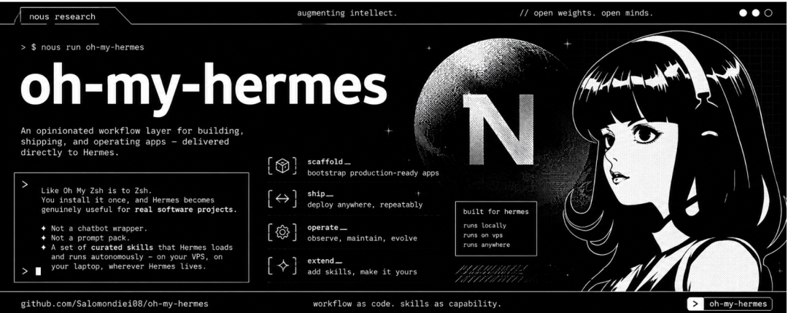

> 📎 来源: [鲲鹏Talk](https://mp.weixin.qq.com/s?__biz=MjM5NzM3NDcxMw==&mid=2247487148&idx=1&sn=3bc5f35df4a5c14d49d9d32f700580c8&chksm=a757f1a72abffc94e6ffdbdc9f661628c70914125418a827478fe302877061eb538fe623d12c&mpshare=1&scene=1&srcid=051326qXrxuZUzkpElph0BhV&sharer_shareinfo=b8d69c7a7d9ed33993257ea4ec21db64&sharer_shareinfo_first=b8d69c7a7d9ed33993257ea4ec21db64) | 时间: 2026-05-13 20:39

---

---

## 让 AI 从聊天机器人变成你的全栈开发运维搭档，Oh My Hermes 是为 Hermes Agent 打造的开箱即用技能层，覆盖从需求到部署的完整应用生命周期，专为独立开发者和 SaaS 创业者设计

> **一句话总结**：Oh My Hermes 不是又一个 prompt 包，而是让 Hermes Agent 从“会聊天”变成“会干活”的操作系统层。

你装过 Hermes Agent（H-Helm）吗？

curl 一键安装，bot 成功回复“你好”，然后……卡住了。你知道它很强大，但不知道怎么让它帮你写代码、管 GitHub、监控服务器。它像一台装好了引擎的跑车，但你手里没有方向盘。



这就是 Oh My Hermes 要解决的事。

它像 **Oh My Zsh 之于 Zsh**——不是重写底层，而是给你一套开箱即用的技能和工作流，让 Hermes 立刻变成能覆盖完整应用生命周期的开发运维搭档。

---

## 先搞清楚：Hermes 和“小龙虾”到底啥区别？

“小龙虾”是 OpenClaw 的昵称，很多人从它迁移到 Hermes，因为后者有个核心能力：**自成长**。

|  | 小龙虾（OpenClaw） | Hermes Agent |
| --- | --- | --- |
| 定位 | 听指挥的工具箱 | 会自己长大的助手 |
| 学习能力 | 固定技能集 | 内置学习循环，自动创建和优化 Skills |
| 运行方式 | 本地执行 | VPS/本地 24/7 常驻，多平台网关 |
| 核心优势 | 开箱即用 | 持久记忆、自我改进、越用越聪明 |

但 Hermes 的问题是：**它是框架，不是产品**。

装完你会聊天，但不知道怎么让它建 App、管项目、做运维。Oh My Hermes 就是来填这个坑的——**23+ 预置技能、5 大专职 Agent、完整的 CTO 自动化循环**。

---

## 核心价值：从“会聊”到“会干”

**20+ 预置技能**覆盖全生命周期：需求澄清 → 设计 → 编码 → 部署 → 监控 → 通知 → GitHub 操作。

**5 大专职 Agent 通过 Kanban 看板协同**：

- **CTO**：总指挥，监控全局，生成日报
- **PM**：梳理需求，写 tickets，排优先级
- **Dev**：写代码，创建 PR
- **Security**：扫描 secrets、OWASP、CVE 漏洞
- **QA/Ops**：代码 review、health check、部署、应急响应

看板状态自动流转：Backlog → In Progress → Review → Done，全部持久化在 Hermes 记忆中。

最狠的是**自主 CTO 循环**：配置完成后，每小时自动 triage GitHub issues、实现功能、PR 审查、安全检查——**只等你点个头，就能合并部署**。

> **真实场景**：你早上醒来，Hermes 已经在夜间完成了 3 个 bug 修复、1 个功能实现，PR 躺在 GitHub 里等你 approve。

---

## 安装：三条命令，从 0 到自动运维

**第一条：装 Hermes 本体**

```
curl -fsSL https://raw.githubusercontent.com/NousResearch/hermes-agent/main/scripts/install.sh | bashsource ~/.bashrchermes model      # 配置模型，推荐 OpenRouterhermes gateway setup && hermes gateway start   # 启动 Telegram/Discord 网关
```

**避坑提示**：

- 新手模型选便宜的（如 GPT-4o-mini），复杂编码再切 Claude
- Telegram 用 BotFather 创建 bot 拿 token
- 推荐 VPS（Ubuntu 22.04+，$5/月），本地用 WSL2 测试

**第二条：装 Oh My Hermes 增强包**

```
curl -fsSL https://raw.githubusercontent.com/salomondiei08/oh-my-hermes/main/install.sh | bash
```

23+ skills、workflows、agent 定义自动加载到 

```
~/.hermes/
```

。

**第三条：启动 CTO 循环（聊天式配置）**

给你的 bot 发一条消息：

```
set up the CTO loop
```

它会一步步问你：

- GitHub repo（owner/repo 格式）
- 创建 fine-grained token（它教你怎么做）
- 生产环境 URL（用于 health check）

**配置完，一切自动化。** 不需要再碰终端。

> **Docker 用户**：项目提供 docker-compose.yml，一行 

> ```
> docker-compose up
> ```

>  搞定。

---

## 实战：从 idea 到上线的完整链路

**你**：“用 Next.js + Supabase 做一个预订韩国烤肉的 SaaS。”

**Hermes 的完整响应链**：

1. 1. **需求澄清**：问 7 个结构化问题，生成 PRODUCT\_BRIEF.md
2. 2. **技术选型**：决定用 Hermes 原生、Claude Code（多文件）还是 Codex（单文件）
3. 3. **自动实现**：写代码、编辑文件、处理依赖
4. 4. **一键部署**：deploy-to-vercel、connect-supabase、setup-monitoring
5. 5. **上线检查**：health check、发送通知、生成 summary
6. 6. **持续运维**：auto-issue-triage、PR review、security scan、daily report

**全程你只需要**：说一句话 → 回答几个问题 → 审批关键节点。

---

## 谁该用？省下的时间值多少钱

| 角色 | 收益 |
| --- | --- |
| 独立开发者/创始人 | 从 80% 时间花在运维琐事，变成 Hermes 干 70-80%，你只审批 |
| 非技术 PM/设计师 | 用自然语言验证 idea，不用写一行代码 |
| 小团队 | 自动化 CI/CD + 监控，少招一个 junior dev |
| AI Agent 爱好者 | 看一个完整的工作流是怎么 orchestration 的 |

**成本**：VPS 几美元/月 + LLM 调用费。比雇人便宜一个数量级。

**但要注意**：

- 复杂架构仍需人类 oversight
- 初始配置 30-60 分钟熟悉
- Token 权限最小化，定期 review

---

## 进阶：不只是用，而是扩展

**自定义 Skill**：用 

```
create-skill
```

 这个元技能，快速生成新能力。

**多项目管理**：Hermes 支持 profiles，一个实例管多个项目。

**监控栈**：Uptime Kuma + Sentry + backup-hermes-data，完整可观测性。

**成本优化策略**：日常用便宜模型，编码切 Claude；缓存命中率高，重复任务几乎免费。

**与 Cursor/Claude 的配合**：Hermes 负责 orchestration（调度全局），Claude 负责深度 coding（复杂实现）。各干各的强项。

> **社区案例**：作者在 meetup 上现场 demo，用 Hermes 15 分钟搭了一个 samgyeopsal（韩国烤肉）预订 App，全程自动 GitHub + Supabase + Vercel。

---

## FAQ：你可能想问的

**Q：安装失败怎么办？**检查网络、权限，看 logs，或用 Docker 方式。

**Q：和小龙虾比，迁移值得吗？**如果你需要自我学习和完整工作流，值得。很多用户已经迁了。

**Q：必须买 Claude Code 吗？**不需要。Hermes 终端 backend 足够日常，复杂场景才需要 Claude。

**Q：数据安全吗？**本地/VPS 部署，token 细粒度控制，skills 内置 secret scan。

**Q：能换技术栈吗？**Skill 文档说明了替换 Vercel/Supabase 的方法，默认栈可换。

---

## 现在就开始

Oh My Hermes 让“自然语言驱动软件开发”从科幻变成现实。

你专注业务和创意，AI 负责执行闭环。

**三步行动**：

1. 1. 准备 VPS 或本地环境
2. 2. 按上文安装 Hermes + Oh My Hermes
3. 3. 给 bot 发“set up the CTO loop”

GitHub 星标项目，欢迎 fork、贡献、反馈。

你准备好让 AI 帮你全职开发运维了吗？评论区见。

---

**参考资源**

- Oh My Hermes：https://github.com/Salomondiei08/oh-my-hermes
- Hermes Agent：https://github.com/NousResearch/hermes-agent

*（基于最新项目文档与社区反馈整理，所有命令请以官方 repo 为准）*

关注关注回复“Hermes”，带你进养马群。
