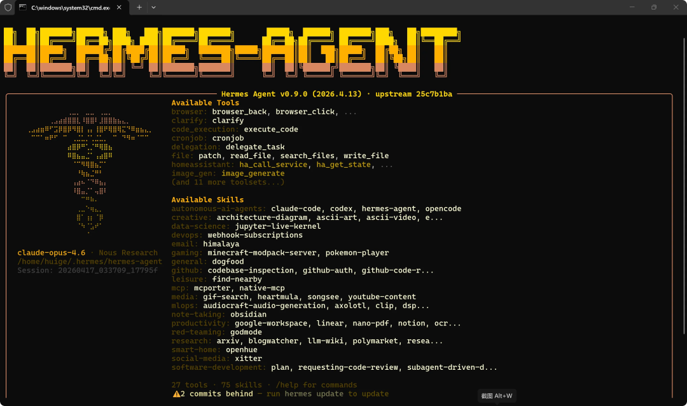
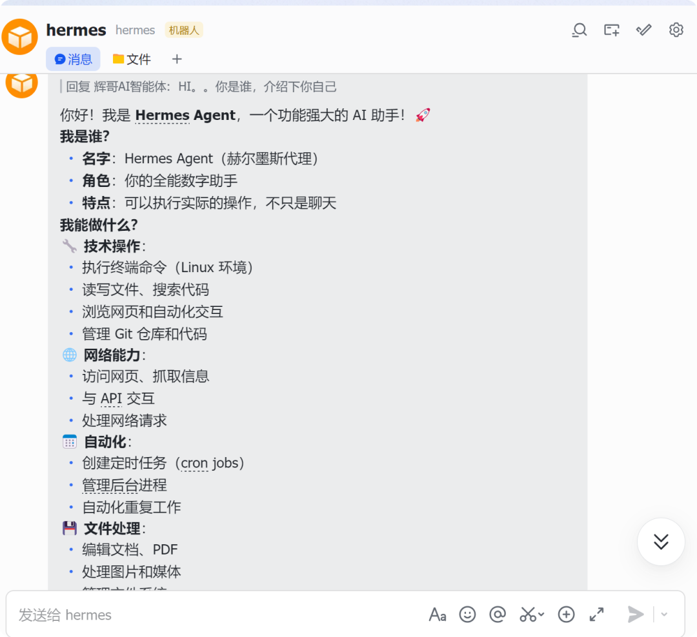
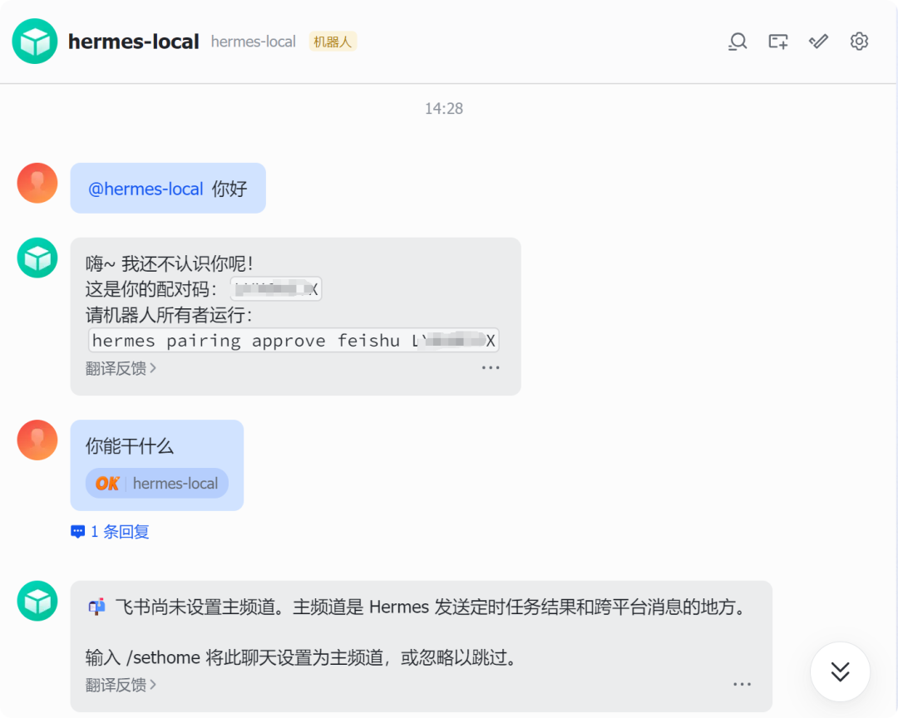
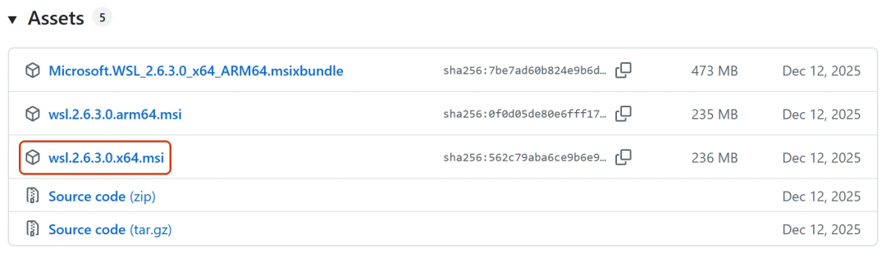
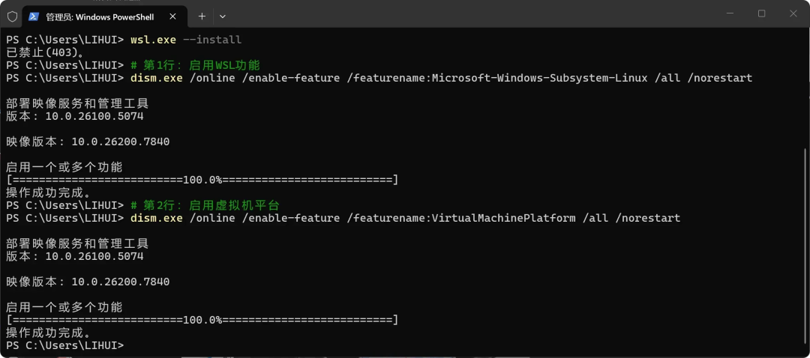

> 📎 来源: [辉哥玩AI](https://mp.weixin.qq.com/s?__biz=MzA3OTQyNzU0Mw==&mid=2455614737&idx=1&sn=44e523d6c0cf10676ffdb763ee1b316f&chksm=89289672671e5459e00b8c861e70487aa08358a77bb20472f95f4d4c0ed379e929734f30d558&mpshare=1&scene=1&srcid=0421cDODJQF5sdiSTlYwtN08&sharer_shareinfo=ff4c5ca989da7a797545b079e80768cb&sharer_shareinfo_first=ff4c5ca989da7a797545b079e80768cb) | 时间: 2026-04-21 21:09

---



# 万字长文保姆级：本地部署爱马仕Hermes

昨天发布了Hermes教程，有些朋友留言，没成功，写的太简单，今天来整理一份小白通用详细操作版本。

其实，我知道，很多小白朋友一看到代码就头大，甚至听到“Linux”这三个字就想打退堂鼓。

别担心，这篇教程就是专门为你量身打造的——全程不用你懂任何代码原理，只需跟着步骤复制、粘贴、按回车，就能轻松搞定！


我们要实现在你的Windows电脑上，安装一款能听懂你指令、还能自动帮你处理事务的AI助手Hermes，可以通过飞书APP，聊天、发指令。

话不多说，跟着我一步一步来，全程复制粘贴，三步就能完成安装！

提前说明：教程所有步骤均经过实测，适配绝大多数Windows电脑，新手也能零障碍上手。



# 第一步：给Windows装个“隐形Linux”

## 为什么一定要装Linux？

很多小白会疑惑：“我用Windows用得好好的，为啥非要装Linux才能用Hermes？”

答案很简单：Hermes这款AI助手，本身是基于Linux环境开发的，对Windows系统“不兼容”。

但大家完全不用慌——我们不需要重装系统，也不用搞复杂的双系统，更不用单独下载Linux镜像文件。

我们要用到的是Windows自带的WSL虚拟机，你可以这样理解它： 

👉 利用WSL软件在你的Windows电脑里“藏”一个完整的Ubuntu系统，不影响你正常使用Windows。

💡 由微软官方推出，能在Windows系统里直接运行Linux软件，既轻量又强大，全程不用你手动配置任何复杂参数。

## WSL及Ubuntu系统安装（两种方法，任选其一）

提示：两种方法最终效果一致，新手优先选方法1（一键安装），省时省力；

若方法1报错、网络不稳定，再切换到方法2（手动下载），两种方法可灵活切换，无需重复操作。

### 方法1：一键开启“魔法开关”（推荐小白，最省事）

操作步骤非常简单，全程鼠标点击+复制粘贴即可： 1.在电脑屏幕左下角，右键点击“开始菜单”（Windows图标）。

2.在弹出的菜单中，选择「Windows PowerShell（管理员）」——**一定要选“管理员”版本**，普通版本会报错，无法完成安装。

3.打开蓝色的PowerShell窗口后，完整复制下面这行命令（不要漏字、不要多空格），右键粘贴到窗口里，然后按回车键：

```
wsl --install
```

4.耐心等待进度条跑完（大概5-10分钟，取决于你的网速），期间不要关闭窗口。

进度完成后，系统会提示你“需要重启电脑”，点击确认重启即可。

补充：重启电脑是必要步骤，重启后会自动进入Ubuntu安装流程，无需手动再次打开PowerShell。

5.电脑重启后，系统会自动打开一个黑色的Ubuntu窗口（如果没有自动打开，就去开始菜单搜索“Ubuntu”，点击打开）。

6.第一次打开Ubuntu窗口，会让你设置账号和密码，按提示操作即可：

• Username（用户名）：随便起一个小写的英文名字，比如huige、xiaobai，输入后按回车。

• Password（密码）：输入你想设置的密码。

输入时屏幕不会显示任何字符，哪怕是星号也没有，这是正常的安全机制），输完直接按回车即可。

🎉 恭喜你！到这里，你的电脑已经变成“半个Linux系统”了，接下来就可以安装Hermes AI助手了！

安装Hermes AI助手（重点步骤）

所有操作都在刚才的黑色Ubuntu窗口里进行，继续复制粘贴命令即可，不用紧张。

✅ 如发现网速很慢，或者执行命令时卡住不动，直接用下面这个加速版命令（复制粘贴，按回车）：

```
curl -fsSL https://res1.hermesagent.org.cn/install.sh | bash
```

补充：该命令为镜像版安装脚本，适配国内网络，安装过程中会自动切换最优镜像，减少卡顿和超时问题。

8. 安装完成后，执行下面这句命令，让Hermes生效（复制粘贴，按回车）：

```
source ~/.bashrc
```

# 第二步：飞书安装与配置（实现随时随地聊天）

Hermes安装完成后，默认“住在”你的电脑里，我们需要通过飞书APP和它建立连接，这样不管你在手机上还是电脑上，都能随时和它聊天、发指令。

这一步分为两步操作：网页端“创建飞书应用”（造壳子）+ 终端端“建立连接”（连线），全程跟着来，很简单。

提示：飞书配置是实现“随时随地聊天”的关键，每一步都要仔细操作，尤其是权限开通和应用发布，缺一不可，否则会导致后续无法正常使用。

### 第一步：网页端“造壳子”（浏览器操作，全程鼠标点一点）

1.打开浏览器（Edge、Chrome），访问 👉 飞书开放平台找到官网）。

2.用你的飞书账号登录（没有就注册一个），登录后点击右上角的「开发者后台」。

3.点击页面中的「创建企业自建应用」名字随便起（如“Hermes助手”），点击确认创建。

4.添加机器人能力：左侧菜单栏找到「添加应用能力」，勾选「机器人」选项，点击「添加」。

5.左侧菜单栏找到「权限管理」，在搜索框中依次搜索以下权限，找到后点击“开通”（缺一不可）：

```
- im:message- im:message:send_as_bot- im:message:read- im:chat- contact:user.base:readonly
```

补充：权限开通后无需额外配置，直接下一步即可，若遗漏任意一个权限，后续飞书将无法接收或发送消息。

6. 左侧菜单栏「凭证与基础信息」获取“连接钥匙”复制保存「App ID」和「App Secret」。
7. 开启长连接（确保飞书能正常接收消息）左侧菜单栏找到「事件与回调」，勾选页面中的「使用长连接接收事件」。

然后点击「添加事件」，搜索并添加「im.message.receive\_v1」事件（勾选后点击确认）。

左侧菜单栏点击「创建版本」，版本号随便填，点击「发布」（发布后才能正常使用）。

### 第二步：终端端“连线”（回到黑色Ubuntu窗口，继续复制粘贴）

网页端的“壳子”已经做好了，回到刚才的Ubuntu黑色窗口，顺序执行命令，让Hermes和飞书建立连接：

1. 进入Hermes的安装目录，复制粘贴以下命令，按回车：

```
cd ~/.hermes/hermes-agent
```

2. 激活Hermes的运行环境（必须执行，否则会报错），复制粘贴以下命令，按回车：

```
source venv/bin/activate
```

3. 启动飞书连接配置向导，复制粘贴以下命令，按回车：

```
hermes gateway setup
```

## WSL配对选项详解（小白必看，千万别选错！）

执行上面的命令后，终端会弹出交互式配置向导，请严格按照以下顺序操作，否则会连接失败！

提示：配置过程中，上下方向键用于选择选项，空格键用于确认选中，回车键用于进入下一步，不要混淆操作。

1. 选择消息平台：用键盘的上下方向键，选中「Feishu / Lark」（飞书的英文名称），

**关键动作：必须先按空格键选中（看到中括号里出现星号 \* 才算选中），然后再按回车键确认**（直接按回车会跳过，导致配置失败）。

填入飞书凭证（刚才保存到记事本的内容）：

• App ID：粘贴你刚才从飞书后台复制的App ID字符串，粘贴后按回车。

• App Secret：粘贴你刚才复制的App Secret字符串，粘贴后按回车。

3. 配置连接模式（Domain）： 提示输入Domain时，输入「feishu」（大陆版飞书，选这个准没错）
4. 选择Connection mode（连接模式）： 用上下方向键选中「websocket」，按回车确认。

💡 重点解释：选websocket模式是最稳妥的，不需要你的电脑有公网IP。

5. 设置访问权限（Allowed user IDs）： 提示输入Allowed user IDs时，**建议直接留空，按回车即可**。

👉 留空说明：所有人（只要是你的飞书好友）都能找到你的机器人聊天。

选择鉴权模式（DM Policy / Pairing）:这里会问你是否开启“配对模式”，有两个选项，根据自己的需求选择：

选「pairing（配对模式）」:更安全！

第一次有人私聊你的机器人时，飞书会发送一串配对代码（比如VCSPY6KP）你必须回到终端输入这串代码授权，对方才能使用。

选「allow\_all（允许所有）」:更省事！任何人私聊你的机器人，都能直接聊天，不需要验证授权。

提示：新手建议选「allow\_all（允许所有）」，减少配对步骤，快速体验；

若担心机器人被陌生人使用，可选择「pairing（配对模式）」，安全性更高。

## 第三步：启动与配对（最后一步，马上就能用！）

配置完成后，我们启动网关，完成最后的配对，就能和Hermes聊天啦！

这一步是收尾关键，操作完成后，你就拥有专属AI助手了。

1. 启动网关：在黑色Ubuntu窗口中，输入以下命令，按回车：hermes gateway start

2. 私聊配对（关键一步，决定能否正常使用）：打开飞书，进入聊天界面，发消息（如“你好”）。

分两种情况操作（根据你刚才选择的鉴权模式）：

情况A（选了pairing配对模式）：

飞书机器人会回复你一串数字配对码（比如VCSPY6KP），立刻回到黑色Ubuntu窗口，复制下面的命令，把命令中的“VCSPY6KP”换成你收到的配对码，然后按回车：

```
hermes pairing approve feishu VCSPY6KP
```

情况B（选了allow\_all允许所有模式）： 飞书机器人会直接回复你“你好”，说明已经成功连接，可以直接聊天了！



3. 绑定主频道（必做步骤）：

收到机器人的回复，就在飞书聊天输入框中输入「/sethome」并发送，这样就完成了最终绑定。

提示：绑定主频道后，Hermes会默认将该聊天窗口作为主要交互渠道，后续发送指令、接收回复都将在该窗口进行，无需重复绑定。

# 懒人必备：创建“一键启动”图标（不用每次敲命令）

很多小白觉得，每次启动Hermes都要打开Ubuntu窗口、敲命令，太麻烦了。

别担心，我们可以做一个桌面图标，双击就能启动Hermes，全程不用敲任何命令！

操作步骤：

1. 回到Windows桌面，右键点击空白处，选择「新建」→「文本文档」。

2. 把新建的文本文档重命名为「启动Hermes.bat」——**注意：一定要把扩展名改成.bat，而不是.txt**。

3. 右键点击这个「启动Hermes.bat」文件，选择「编辑」，把下面的内容完整复制进去（不要漏行、不要改任何字符）：

```
@echo offchcp 65001 >nulecho ========================================echo    Huige Hermes AI Agent - WSL Consoleecho ========================================echo  ENTERING WSL (Keep Window Open)echo.wsl.exe -e bash -c "cd ~/.hermes/hermes-agent && source venv/bin/activate && hermes; while true; do sleep 3600; done"pause
```

4. 保存文件，关闭编辑窗口。以后只要双击这个「启动Hermes.bat」图标，Hermes就会自动启动，非常方便！

## 常用命令（收藏备用）

遇到问题或需要操作Hermes时，参考下面的命令，复制粘贴到Ubuntu窗口即可，不用死记硬背：

| 我想做什么 | 在黑色窗口输入的命令 |
| --- | --- |
| **我想做什么** | **在黑色窗口输入的命令** |
| 启动Hermes网关 | hermes gateway start |
| 后台运行（关窗口也在线） | hermes gateway --daemon |
| 查看Hermes是否在线 | hermes gateway status |
| 停止Hermes服务 | hermes gateway stop |
| 重新配置飞书连接 | hermes gateway setup |

## ⚠️ 新手避坑指南 (FAQ，常见问题解答)

1. 双击bat文件，窗口一闪而过，启动失败？

原因：WSL虚拟机没有安装成功，或者安装路径出错。 

解决：回到第一章，重新检查「wsl --install」命令是否成功执行，电脑是否重启，Ubuntu是否正常打开并设置了账号密码。

2. 关闭Ubuntu窗口后，飞书还能和Hermes聊天吗？ 不能（当前bat启动模式）。

解决：在Ubuntu窗口中输入「hermes gateway --daemon」，让Hermes后台运行，这样即使关闭窗口，飞书也能正常和它聊天。

3. 飞书发消息，Hermes没有任何反应？

① 检查是否执行过「hermes gateway start」命令，确保网关已经启动；

② 检查飞书开放平台的应用是否已经“发布”；

③ 检查所有需要开通的权限是否都已开通。

补充：若以上方法都无法解决，可截图报错信息，打开豆包发送截图，获取针对性解决方法，无需自己琢磨。

🎉 大功告成！现在你可以打开飞书，尽情调戏你的专属AI助手啦！

不管是查资料、写文案，还是帮你处理简单的事务，Hermes都能帮你搞定～

## 方法2：分别直接下载（适合网络不稳定或报错403的情况）

如果方法1的「wsl --install」命令执行失败、报错403，或网速慢，就手动下载安装WSL和Ubuntu，步骤同样简单，全程复制粘贴命令即可。



首先明确：WSL2 = 让Windows能直接运行Linux系统的工具（轻量虚拟机），我们需要先安装WSL2，再安装Ubuntu系统。

1. 下载WSL2安装包：访问WSL官方下载地址：

https://github.com/microsoft/WSL/releases进入页面后，找到比如wsl.2.6.1.0.x64.msi，下载保存。

2. 安装WSL2：以管理员身份打开PowerShell，复制粘贴下面的命令（注意：把命令中的路径换成你下载的WSL安装包路径），按回车：

```
msiexec /i "C:\Users\LIHUI\Desktop\wsl.2.6.1.0.x64.msi"
```

（比如你把安装包保存到了桌面，路径就是“C:\Users\你的用户名\Desktop\wsl.2.6.1.0.x64.msi”，替换成自己的用户名即可）

3. 设置WSL2为默认版本： 在PowerShell窗口中，复制粘贴以下命令，按回车： wsl --set-default-version 2

   
4. 安装Ubuntu 22.04系统（重点：安装到D盘，不占C盘空间）：

首先，我们要在D盘创建一个文件夹（必须先创建，否则安装会失败）：

① 在PowerShell窗口中，复制粘贴以下命令，按回车（创建D盘WSL2文件夹）：

```
mkdir D:\WSL2\Ubuntu
```

② 进入创建好的文件夹，复制粘贴以下命令，按回车：

```
cd D:\WSL2\Ubuntu
```

③ 下载Ubuntu 22.04安装包到D盘，复制粘贴以下命令，按回车：

```
Invoke-WebRequest -Uri https://aka.ms/wslubuntu2204 -OutFile Ubuntu.appx -UseBasicParsing
```

⚠️ 注意：如果这个命令下载失败（比如报错“系统内部异常，请稍后重试”），就手动下载Ubuntu 22.04安装包.

网上直接搜“Ubuntu 22.04 WSL版”即可），下载后放到D:\WSL2\Ubuntu文件夹中。

补充：该命令下载失败为常见问题，无需担心，手动下载安装包后，可继续后续步骤。

5. 解压并安装Ubuntu 22.04：

下载完成后，在PowerShell窗口中，依次复制粘贴以下3条命令，每条命令按回车后，等待执行完成： 

① 重命名安装包：Rename-Item Ubuntu.appx Ubuntu.zip 

② 解压安装包：Expand-Archive Ubuntu.zip 

③ 启动安装：.\ubuntu2204.exe

6. 配置Ubuntu账号密码：执行第3条命令后，会弹出黑色的Ubuntu窗口，让你输入账号和密码，和方法1一样：

• 用户名：随便起一个小写的英文名字（比如huige、xiaobai）

• 密码：输入你想设置的密码（输入时屏幕不显示任何字符，正常现象）

• 输密码时屏幕不显示任何东西（星号都没有），是正常的安全机制，输完直接按回车即可

完成以上步骤后，**Ubuntu系统就完全安装在D盘了，不会占用C盘空间**，非常适合C盘空间紧张的朋友！

## 补充：Hermes一键安装（不用GitHub、不用手动下载、不用解压）

如果前面的Ubuntu安装完成后，想快速安装Hermes，直接用下面的命令，全自动安装，不用手动干预任何步骤：

1. 在线安装Ubuntu+Hermes（如果还没安装Ubuntu，可以用这条命令）：wsl --install -d Ubuntu-22.04

2. 安装完毕后，Ubuntu窗口会出现类似提示（说明Ubuntu已经正常启动）：huige@HgAiAgent:/mnt/d/WSL2/Ubuntu$

## 加速版一键安装（适合网络不稳定）

如执行前面的Hermes安装命令时，出现卡顿、超时，用下面这个加速版命令（复制粘贴到Ubuntu窗口回车）：

```
curl -fsSL https://ghfast.top/https://raw.githubusercontent.com/NousResearch/hermes-agent/main/scripts/install.sh | bash
```

这条命令会自动安装Python、Node.js、所有依赖包，自动克隆Hermes源码、配置全局命令.

全程不用你手动干预，耐心等待即可（大概10-15分钟，取决于网速）。

补充：该命令为国内加速版，自动适配网络，若安装中卡顿，无需关闭窗口，耐心等待，切勿中途中断安装。

3. 安装完成后，重载环境（让Hermes生效），复制粘贴以下命令，按回车：

```
source ~/.bashrc
```

4. 首次配置Hermes（设置模型和API Key）： 复制粘贴以下命令，按回车，启动配置向导：

```
hermes setup
```

按提示选择你要使用的模型（比如OpenAI、DeepSeek等），也可以选择暂时关闭，后续进入界面再配置；

然后填入你的API Key（没有API Key的，先去对应模型官网申请），填写完成后，配置就完成了。

5. 启动Hermes（成功标志）： 复制粘贴以下命令，按回车，即可启动Hermes：

   ```
   hermes
   ```

⚠️ 温馨提示：如果出现报错，或不明白的地方，直接复制内容或截图给豆包，完全不用自己琢磨！

# 完美！核心已经安装成功了！

**Hermes主体已经装好、能跑、能用！** 后续只要启动Hermes，就能正常使用了。

## 再次启动Hermes（总结步骤）

如果关闭了Ubuntu窗口，想再次启动Hermes，按以下步骤操作：

1. 打开Ubuntu窗口（开始菜单搜索“Ubuntu”）。

2. 进入Hermes的安装目录，复制粘贴以下命令，按回车：cd ~/.hermes/hermes-agent

3. 激活运行环境，复制粘贴以下命令，按回车：source venv/bin/activate

4. 启动Hermes，复制粘贴以下命令，按回车：hermes。

提示：若已创建一键启动图标，可直接双击图标启动，无需执行以上步骤，更省时省力。

## 懒人进阶：双击图标启动（无需敲命令）

和方法1一样，我们可以创建一个bat文件，双击就能启动Hermes，步骤如下：

1. 回到Windows桌面，右键空白处→「新建」→「文本文档」。

2. 重命名为「Hermes.bat」（确保扩展名是.bat）。

3. 右键编辑，复制粘贴以下内容，保存关闭：

```
@echo offecho 🔹 正在启动 Hermes AI Agent ...echo 🔹 自动进入 WSL2 环境echo.wsl.exe -e bash -c "cd ~/.hermes/hermes-agent && source venv/bin/activate && hermes"pause
```

4. 后续双击这个bat文件，就能自动启动Hermes，不用再敲任何命令。

## 飞书配置补充（参考方法一，重点提醒）

如果需要配置飞书，让Hermes能通过飞书聊天，参考方法一的“飞书安装与配置”步骤。

**重点提醒：一定要在WSL窗口中配置飞书，不要进入Hermes窗口内配置**。

具体步骤（再次强调，避免出错）：

1. 回到Ubuntu黑色窗口（不要启动Hermes，保持命令行状态）。

2. 进入Hermes的安装目录，复制粘贴以下命令，按回车：

```
cd ~/.hermes/hermes-agent
```

3. 激活运行环境，复制粘贴以下命令，按回车： source venv/bin/activate
5. 启动飞书配置向导，复制粘贴以下命令，按回车：

```
hermes gateway setup
```

后续的配对步骤，和方法一完全一致，按照前面的指南操作即可。

# 实战总结

核心分为三大核心步骤，无需懂代码、无需复杂配置，复制粘贴即可完成：

1. 安装WSL虚拟机：两种方法任选，方法1一键安装（推荐新手），方法2手动下载（适配网络不稳定情况），最终实现Windows电脑运行Linux环境，为Hermes安装铺路。

2. 安装Hermes AI助手：通过国内加速版命令，自动完成依赖安装、环境配置，无需手动干预，安装完成后重载环境即可生效。

3. 飞书配置与配对：网页端创建飞书应用、开通权限，终端端建立连接，完成配对后，即可通过飞书随时随地与Hermes聊天、发指令。

提供一键启动图标方法，后续无需敲命令，双击即可启动Hermes；同时整理了常用命令和避坑指南，解决新手常见问题，确保安装过程零障碍。

最后提醒：安装过程中，若遇到卡顿、报错，不要慌张，可查看避坑指南，或截图报错信息咨询豆包；

所有步骤均经过实测，只要严格按照教程操作，就能成功部署属于自己的Hermes专属AI助手，解锁高效办公、便捷聊天新体验！

快去体验你的Hermes吧！

> 持续AI实战，所有内容均亲自测试，只分享能落地、可复制的做法。

> 关注辉哥，点赞，转发，留言：）

辉哥AI社群｜OPC实践者 · AI应用实战笔记

#Hermes部署 #Hermes教程 #小白AI部署 #WSL安装 #Ubuntu安装 #飞书AI助手 # #Hermes小白教程
