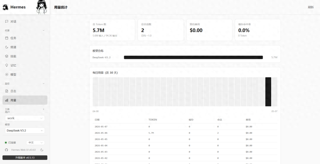
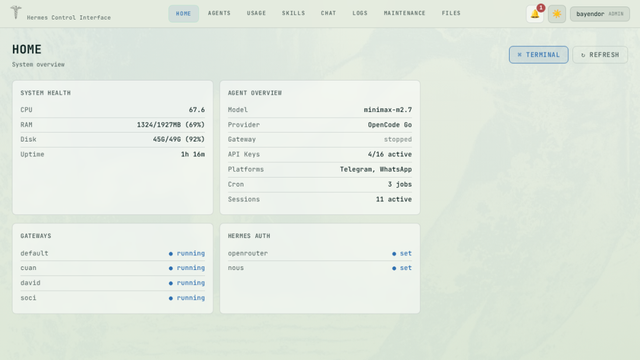
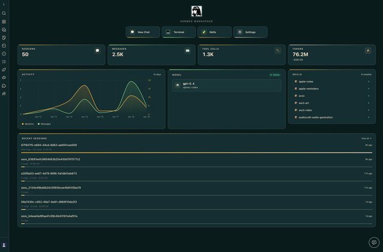

> 📎 来源: [PingAI 品智](https://mp.weixin.qq.com/s?__biz=MzU1NzgyMTI0Nw==&mid=2247492545&idx=1&sn=5d398b37573b0779b9b0cd23d6f77cf7&chksm=fdc1e6aa1ea34a52938275bb65a893901d2a4f9ae83c1dd496c9286fb119931811b3f6a7200a&mpshare=1&scene=1&srcid=0517xeOBwGxXOUojYf7DRMSU&sharer_shareinfo=c847fb44433091601bcd864551d69df9&sharer_shareinfo_first=c847fb44433091601bcd864551d69df9) | 时间: 2026-05-17 23:45

---

刚入坑 Hermes 的朋友估计都遇到过这事儿——装好 Agent、命令行跑得挺顺，结果一上手就懵了：会话多了根本找不着北、想加个渠道得在 yaml 里改来改去、想查 token 花了多少钱还得自己掰手指算。

好在社区给力。

现在冒出来三个 Web 管理界面，各有各的绝活。我花了一周时间全给装了一遍，跟你唠唠真实体验。

## 一、hermes-web-ui：运营同学的福音

**GitHub**: EKKOLearnAI/hermes-web-ui
**定位一句话**：告别命令行，所有常用操作点点按钮就搞定。



## 优点

装好之后浏览器打开 http://localhost:8648，填个 Token 就能开搞。界面做得还挺像样的，不是那种"凑合能用"的 Demo 水准。

主要功能分这么几块：

**聊天管理**：多会话随便开，随便切，还能导出，历史记录清清楚楚。再也不用在终端里翻滚动窗口了。

**渠道配置**：Telegram、Discord、Slack、WhatsApp、Matrix、飞书、企业微信、微信扫码——主流渠道基本全覆盖。配渠道再也不用改 yaml 了，界面上点点就行。

**消耗监控**：Token 花了多少、按模型分开看、按平台分开看，图表直接给你画好了。对于跑了好几个渠道的兄弟来说，这功能简直是财务救星。

**定时任务**：Cron 表达式不用记了，图形化配置，几点跑、跑什么、跑几遍，界面上一安排就齐活。

## 槽点

**不支持多用户**。谁登录进来都是同一套权限。自己用没问题，给团队用就抓瞎了。

**依赖安装偶尔会抽风**。Node.js 版本太新可能踩坑，建议老老实实用 LTS。

## 安装方式（最简单）

```
class="language-bash">npm install -g hermes-web-uihermes-web-ui start"color:#6a9955"># 打开 http://localhost:8648
```

**一句话总结**：适合不想折腾、只想快速上手的非技术同学。配置渠道、管理聊天，用这个挺省心。

## 二、hermes-control-interface：企业级配置党的选择

**GitHub**: xaspx/hermes-control-interface
**定位一句话**：三个里面唯一认真做了企业级安全管控和 RBAC 权限系统的。



## 优点

这是三个项目里最"重"的一个——但这个"重"是褒义。

核心模块：

**浏览器终端**：集成 xterm.js，在网页里直接开终端，操作体验跟本地 Terminal 基本没差。开发党最需要的就是这个。

**文件浏览器**：直接在界面上看、编辑、上传、下载 Hermes 的工作文件。再也不用开一个文件管理器来回折腾了。

**会话管理**：历史记录、Token 分析、按时间段筛、按模型拆成本——功能比 hermes-web-ui 还细致。

**RBAC 权限系统**：这是它跟另外两个最本质的区别。20 个权限划分成 3 个角色（Admin、Viewer、自定义），团队里不同人给不同权限——有人只能看日志，有人能改配置，有人能管用户。

**多 Agent 网关**：可以同时跑多个 Hermes Profile，每个 Profile 都是独立实例，界面上能一键切换、启停。

**安全加固**：CSRF 护了 21 个端点、XSS 全套防护、密码 bcrypt 哈希、登录失败限速（5次/15分钟/IP）。说实话，这安全规格，拿去跑生产环境我都放心。

## 槽点

**太重了。** 功能多意味着学习成本也高。想简单聊个天？菜单都能把你绕晕。

**安装相对麻烦。** 需要 Node.js + Express + WebSocket 整套环境，新手第一次装可能会踩一些坑。

**界面比较朴素。** 实用主义导向，没有 hermes-web-ui 那么有"互联网产品"的感觉。

## 安装方式

```
class="language-bash">git clone https://github.com/xaspx/hermes-control-interfacecd hermes-control-interfacenpm installnpm start"color:#6a9955"># 根据提示访问对应端口
```

**一句话总结**：公司用 Hermes 或者团队超过 3 个人，这个是唯一合理的选择。多用户、细权限、安全加固，要啥有啥。

## 三、Hermes Workspace：代码人的心头好

**GitHub**: outsourc-e/hermes-workspace
**定位一句话**：不是在"管"Hermes，而是给 Hermes 打造一个完整的原生工作空间。



## 优点

思路跟前两个完全不一样。前两个是在"管理"Hermes，这个是在"融入"Hermes 的工作流。

核心模块：

**聊天 + 终端平铺**：俩东西在同一个界面里。Agent 给你返回结果，如果要跑代码，旁边终端直接执行——不用切换窗口，不用复制粘贴。

**记忆系统**：直接看 Agent 的记忆存储。哪些记住了、哪些忘了、记忆块大小，全都列出来。调教 Agent 记忆系统的必备功能。

**技能管理**：Skill 是 Hermes 的核心能力之一。Workspace 做了一个技能浏览器，每个 Skill 的内容、配置、触发条件都能看到。

**MCP 支持**：重磅特性。MCP（Model Context Protocol）是 Hermes 最新引入的扩展协议，能接入更多外部工具和数据源。需要 Hermes 联动更多系统的，这个功能非常关键。

**Aurora 版本**：5月5号刚更新的 Aurora 版本，把 MCP 页面重新做了，还修了一堆 bug。开发活跃度相当可以。

## 槽点

**不擅长多渠道管理**。没有渠道配置、没有任务调度、没有消耗统计。它就专注一件事：给你最好的开发体验。

**不支持多用户**。单用户使用。

**一句话总结**：技术流天天和代码打交道的，选这个。跟 Hermes 工作流贴合最紧密，MCP 支持意味着更强的扩展性。

## 安装方式

```
class="language-bash">git clone https://github.com/outsourc-e/hermes-workspacecd hermes-workspace"color:#6a9955"># 按 README 说明安装依赖后启动
```

## 四、三个放一块儿比比

差异挺明显的：

|  | **hermes-web-ui** | **hermes-control-interface** | **Hermes Workspace** |
| --- | --- | --- | --- |
| 适合人群 | 运营、非技术 | 企业/团队 | 开发者 |
| 多用户 | ❌ | ✅ | ❌ |
| 渠道配置 | ✅ | ✅ | ❌ |
| 安全管控 | 一般 | 强 | 一般 |
| 开发体验 | 一般 | 不错 | 极佳 |
| 上手难度 | 低 | 高 | 中 |

|  | **hermes-web-ui** | **hermes-control-interface** | **Hermes Workspace** |
| --- | --- | --- | --- |
| **定位** | 全功能驾驶舱 | 自托管控制台 | 原生工作区 |
| **作者** | EKKOLearnAI | xaspx | outsourc-e |
| **安装方式** | npm install -g hermes-web-ui | Git clone + Node | Git clone |
| **端口** | 8648 | 自定义 | 自定义 |
| **认证** | Token 基础认证 | 密码 + RBAC 权限 | 基础认证 |
| **适合场景** | 多渠道运营管理 | 企业级多用户管控 | 开发者深度调试 |

## 五、叨叨两句

Hermes 框架有意思的地方在于——它不是那种"给你啥你就用啥"的货色，而是一个可以根据需求不断定制的生态。

三个项目代表三种思路：

- **hermes-web-ui** → 省心，点点按钮搞定
- **hermes-control-interface** → 管控，多人协作安全第一
- **Hermes Workspace** → 融合，开发者深度定制

**没有最好的，只有最合适的。**

如果你想找一群同样爱折腾、想让 AI 帮自己“开挂”的朋友，扫描下方二维码进群。**咱们群里不聊虚的，只聊怎么把 AI 玩得更溜。**

期待在群里遇见你。咱们一起，把内容创作变得更有趣，也更有意义！


