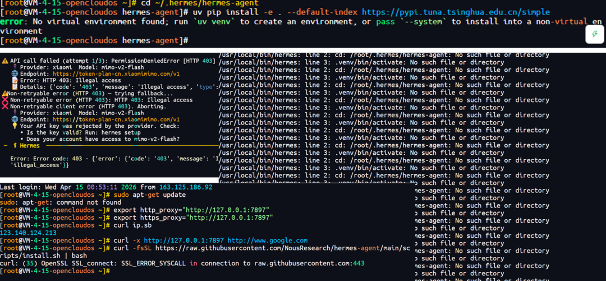
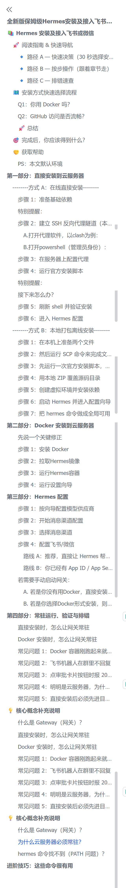
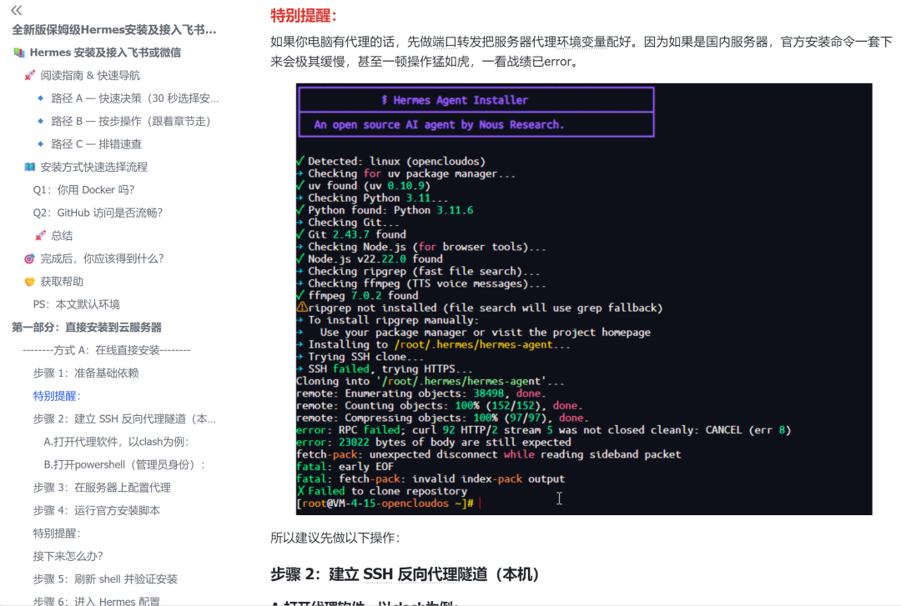
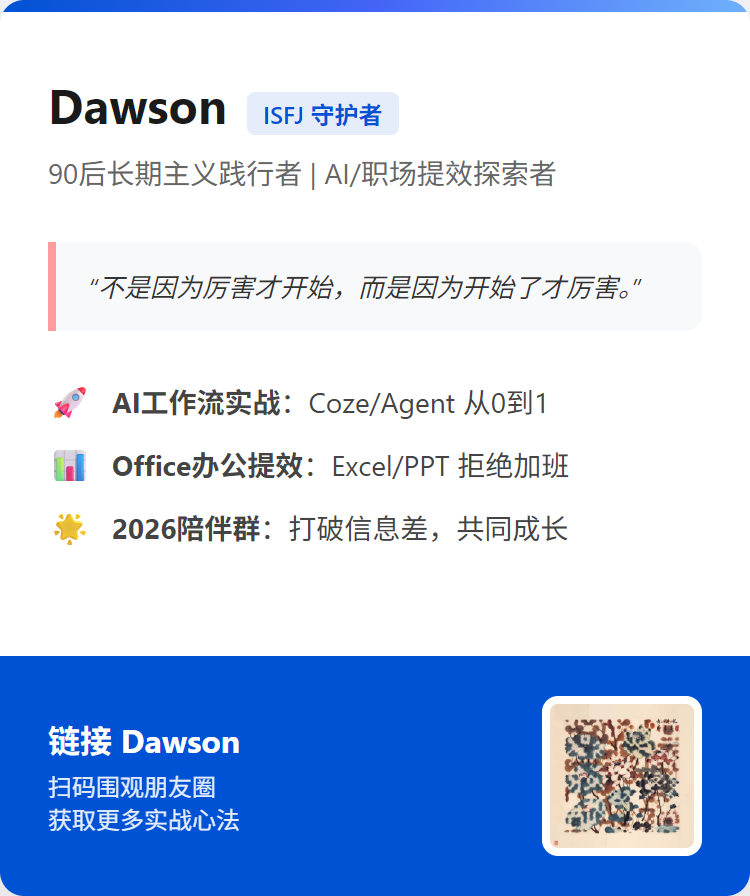

> 📎 来源: [Dawson聊AI提效](https://mp.weixin.qq.com/s?__biz=MzI0NDEwOTk5NA==&mid=2649279769&idx=1&sn=7f0695afda18bd72dbe205bd6fdc96ee&chksm=f021e7bc219d2a8df23297850245b6d4a1c4065fafd5923667bd0d6575fe1222ecaeccd2fb3b&mpshare=1&scene=1&srcid=0420ntANAeDxXZ3MMWsQyTWi&sharer_shareinfo=82e437c8d7cc31fd5c808050790521b1&sharer_shareinfo_first=82e437c8d7cc31fd5c808050790521b1) | 时间: 2026-04-20 15:37

---

Hermes 免费福利

为了这篇 Hermes 胚胎级教程，我花了两天，龙虾死了两次，重装了 10 次系统

不是分享一个工具名词，而是把一轮真实踩坑后整理出来的服务器安装 Hermes 保姆级教程，免费送给真正需要的人。

折腾两天龙虾死两次系统重装近 10 次

不是我夸张。

这两天，我基本就在干一件事：把 Hermes 装到服务器上，再接进飞书。

结果呢？

真实翻车现场

龙虾死了两次。

系统重装了近 10 次。

只为了把期间的截图完完整整地、详详细细地全都写出来。中间各种环境问题、代理问题、配置问题、服务不常驻、机器人不回复，轮着来。

各种报错截图

**这玩意儿最折磨人的地方，不是它装不上，而是它总会在你以为快成了的时候，再补你一刀，真的会让人抓狂。**

前排提醒

所以这篇不是来给你讲一堆空泛概念的。

我更想告诉你一件事：**我已经把自己踩过的坑、试出来的路、跑通的流程，整理成了一份服务器安装 Hermes 的保姆级教程。**

如果你最近也在折腾这件事，这份文档你大概率用得上。

P.S. 文末有领取方式，先别急着划走。

教程长图预览

01我为什么非要把这份教程写出来

因为我越来越发现，很多人不是不想学 AI，也不是不愿意折腾新工具。

大家真正卡住的点，是**一到服务器、一到环境配置、一到接入飞书这种实操环节，就很容易懵。**

网上当然也不是没有教程。

但很多教程有一个共同问题：**它默认你已经懂很多东西。**

那些教程默认你已经会……

它会默认你服务器去拉 Git 的项目时网络很顺畅，一步到位。

会默认你知道直装和 Docker 分别适合什么场景。

会默认你知道怎么给服务器接上代理。

会默认你知道 Docker 安装时有哪些坑和不同点。

那些所谓的保姆级教程，不过只是把命令一步步给你列出来完事儿。

可问题是，大多数普通用户根本不是这种起点。

尤其是想把 AI 接进飞书和微信的朋友，很多本来就是运营、项目、行政、培训、传统行业岗位出身。

你让他学会用工具，他愿意。

你让他一边学工具，一边补服务器、一边补环境、一边补排错，真的很容易当场劝退。

所以这份教程最有价值的地方，不是我会装 Hermes，而是我已经先替你把这些坑踩了一轮。

02真正难的，从来不是那几行命令

表面上看，Hermes 安装好像就是跟着命令一步步走。

但真上手之后你就会发现，折腾人的从来不是教程里那几行字，而是教程外面那一堆真实摩擦力。

你大概率会卡的地方

- 服务器环境到底要先准备到什么程度
- 用直装还是 Docker，哪条路更顺
- 依赖装上了，为什么命令还是找不到
- 本地代理明明能跑，为什么到了服务器就下载不了
- 服务看起来启动了，为什么一断开终端就没了
- 飞书机器人明明接上了，为什么群里还是不回复
- 配到一半突然报错，到底该先查权限、查订阅、查网关，还是查配置文件

这些东西，任何一个单拎出来都不算天塌。

但它们一旦排着队来，你就很容易开始怀疑人生，折腾几个小时都不见起效。

更要命的是，很多坑不是你不会，是**没人提前告诉你这里会卡。**

我自己这次就踩了不少这种坑。有的是看起来很小的细节，结果能把人卡半天。有的是你以为自己已经快通关了，结果后面还有一层网关配置等着你。还有的是明明项目没问题，问题出在环境、权限或者服务方式上。

这种时候，人最缺的不是更多教程。人最缺的是一份把坑写出来、把顺序讲明白、把排查路径标清楚的教程。

文档截图

03这份教程，到底帮你省掉了什么

我后来整理这份文档的时候，心里一直有个很明确的标准：**它不能只是一份命令清单。**

如果只是把命令抄一遍，那不叫教程，那叫复制。真正有用的教程，应该帮你省掉试错成本。

服务器安装 Hermes 的完整流程

直装和 Docker 这两条路分别怎么理解，怎么选更省心

环境配置时哪些地方最容易翻车

接入飞书时哪些设置是什么意思

服务要怎么常驻运行，不然关掉终端就白装了

遇到常见报错时，优先查什么，别一上来就乱改

你会发现，这里面最值钱的，不是某一条命令。而是**每一个容易让人抓狂的卡点，我都尽量给你提前标出来了。**

这份教程交付的不是信息，而是**你本来要自己付掉的学费，或者 N 多时间。**

04这份教程适合谁

如果你属于下面这几类人，建议直接领走

想把 Hermes 装到服务器上，但还没真正跑通过

想把 AI 接进飞书或微信，但卡在部署环节

技术基础一般，不想东拼西凑看零散教程

想找一份能直接照着做，同时又提醒你哪里容易翻车的资料

反过来说，如果你已经很熟服务器、很熟容器、很熟各种环境配置，那这份教程对你可能只是一个整理版参考。

但如果你是大多数普通用户，那它的价值会很直接。因为你不需要从零撞墙了。

05我为什么愿意把它免费放出来

很简单。

我自己就是从不会，到一点点试出来的。Office 这条路，我以前也是从小白一路踩坑走过来的。AI 工具这条路，我也不是一开始就会。

所以我很清楚，很多人真正需要的，不是别人站在高处告诉你这很简单。

真正值钱的是这种陪跑感

别慌，这里会卡。

这里别乱点。

这里先配好再往下走。

这里如果报这个错，先查这几项。

这种感觉，才是最值钱的。

所以这次我干脆把它整理成文档，免费给需要的人。

你拿走之后，至少不用像我一样，龙虾死两次，系统重装 10 次，再对着终端怀疑自己半天。

最后

如果你最近正想折腾 Hermes，这份文档先收好。

如果你身边也有朋友正在研究怎么把 AI 接进飞书和微信，也可以顺手转给他。毕竟很多坑，真的没必要每个人都重新踩一遍。

领取方式

关注公众号 

回复Hermes免费领取

如果你想进一步了解 2026 Dawson 年度陪伴群，也可以回复【陪伴群】。

我已经先替你踩过坑了。接下来，轮到你少走弯路了。

如果你不是只想领这一份 Hermes 教程，而是想以后在折腾 AI 工具、Office 办公、飞书接入、工作流搭建这些事的时候，始终有人一起陪跑、一起拆问题，那我也顺手推荐下我的2026 Dawson 年度陪伴群。

这个群我想做的，不是一个单纯转发资讯的群，也不是一个只会喊口号的打卡群。我更想把它做成一个长期陪跑型的工具成长场，不止2026、2027、2028……

如果你希望不是只偶尔领一份资料，而是持续有人陪你一起升级认知、玩转工具、跑赢时间，那这个群你应该会喜欢。

分享我筛过的信息差和真正值得用的新工具

开源我自己实战跑通过的工作流、Prompt 和配置思路

给大家做一些 AI 工具、Office 疑难和效率问题的答疑兜底

我是Dawson，我们下期见。

往期推荐：

[又来一个龙虾平替Hermes？但真正该看懂的不是这个名字](https://mp.weixin.qq.com/s?__biz=MzI0NDEwOTk5NA==&mid=2649279760&idx=1&sn=eab02f29689774dd3084ecc92036de07&scene=21#wechat_redirect)

[办公人必备的两个神级官方办公 Skill（附实测案例）](https://mp.weixin.qq.com/s?__biz=MzI0NDEwOTk5NA==&mid=2649279747&idx=1&sn=cd72599ae26535f36d2c596db399b23c&scene=21#wechat_redirect)

[我用谷歌的5个skill设计模式，把失控的AI调教成了特种兵](https://mp.weixin.qq.com/s?__biz=MzI0NDEwOTk5NA==&mid=2649279682&idx=1&sn=7aa7c445e160c984670c6a6cf7c0c293&scene=21#wechat_redirect)

[我让小龙虾自己给自己找工作，结果它给我推了这 6 个神器](https://mp.weixin.qq.com/s?__biz=MzI0NDEwOTk5NA==&mid=2649279665&idx=1&sn=3833a3b8d114e0257f88c701baaa96e8&scene=21#wechat_redirect)

[带着答案去面试，这种感觉真的太爽了](https://mp.weixin.qq.com/s?__biz=MzI0NDEwOTk5NA==&mid=2649279608&idx=1&sn=bcfc6004569a9e29e9e0cbb140fcdcb4&scene=21#wechat_redirect)

